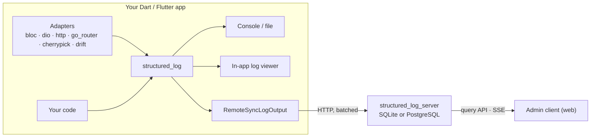

[](https://github.com/pese-git/structured_log/actions/workflows/ci.yml)
[](https://pub.dev/packages/structured_log)

*Читать на [русском](README.ru.md).*

# structured_log

**Structured logging for Dart and Flutter — from a line in your app's
console to a searchable, shared log store for your whole team.**

Inspired by [Python's structlog](https://www.structlog.org/). Documentation:
[structured-log.openidealab.com](https://structured-log.openidealab.com).

## Why

A log line like `"User 42 logged in from 127.0.0.1"` is easy to write and
hard to use: you can't filter it by user, count it by IP, or follow one
request through it without regular expressions. `structured_log` records
**events with data** instead — `user_login {user_id: 42, ip: 127.0.0.1}` —
so the same entry reads well in a terminal, parses as JSON, and can be
searched by any field.

The project covers the whole path such an entry travels:

1. **Write it** — a small, dependency-free core library for Dart and Flutter.
2. **Get it for free** — adapters that log what `bloc`, `dio`, `http`,
   `go_router` and `cherrypick` already do in your app, and the queries of
   a `drift` database.
3. **See it on the device** — a drop-in log viewer screen in Material,
   Fluent or Cupertino style.
4. **Collect it** — a self-hosted server that receives logs from every
   install of your app, stores them, and lets your team search and tail
   them live in a web admin.

Steps 1–3 work entirely inside your app, with no server at all. Step 4 is
optional, and adding it doesn't change a single logging call.

## Features

### Structured logging core

- **Events with context** — `log.info('user_login', context: {...})`;
  `bind()` attaches fields to a logger (immutably), `withCorrelation()`
  adds typed session/request/operation ids.
- **Processors** — enrich, transform or drop entries before output.
- **Secret redaction** — passwords, tokens and keys masked by field name,
  JWTs and card numbers by value.
- **Many outputs at once** — pretty JSON, JSON lines, logfmt, colored
  console, file, rotating file, async file, or your own function; each sink
  with its own level and category filter, switchable at runtime.
- **Safe by design** — a log call never throws, and an unencodable value
  (`DateTime`, an exception) costs one field, not the entry.
- **Everywhere Dart runs** — VM, Flutter, and the web; no runtime
  dependencies beyond `meta`.

### In-app log viewer for Flutter

- A ready-made screen or embeddable widget: live list, search, level and
  category filters, pause, clear, entry details with copy.
- Three design systems — **Material 3**, **Fluent UI** (WinUI-style) and
  **Cupertino** (iOS-style) — each adaptive: bottom sheet or pushed screen
  on phones, master-detail on tablets and desktop.
- A headless core (`LogBuffer`, `LogViewerController`) to build your own UI.

### Integrations

| Library | What gets logged | Category |
|---|---|---|
| `bloc` / `flutter_bloc` | creation, events, transitions, errors, closing of every bloc and cubit | `bloc` |
| `dio` | every request and its outcome, level by status code | `http` |
| `package:http` | the same, as a wrapping `http.Client`, without buffering bodies | `http` |
| `go_router` | navigation with route pattern, redirects, routing errors | `navigation` |
| `cherrypick` | DI scopes, modules, cycles, resolve errors — never an instance | `di` |
| `drift` | every query with its SQL, duration and rows, slow ones flagged, failures with their stack — argument values off | `db` |

HTTP and navigation adapters redact auth headers, cookies, and token-like
query parameters by default; bodies are off unless enabled, and masked by
field name when they are.

### Self-hosted log server and admin client

- **Shipping** — `RemoteSyncLogOutput` batches entries, retries with
  backoff, caps its buffer, and never blocks the code that logged.
- **Ingest, search, live tail** — a full-text and per-field query API, and
  a Server-Sent Events stream with catch-up after reconnects.
- **Multi-tenancy** — groups own projects; each project has its own secret
  keys, quotas and retention window.
- **Access control** — users, teams, and per-scope roles
  (`admin`/`owner`/`user`); JWT sessions with an `HttpOnly` refresh cookie
  in the browser; rate limiting on the auth endpoints; an audit log of who
  changed what.
- **Simple to run** — one Dart process with an embedded SQLite file by
  default, PostgreSQL when you need it; docker-compose and Kubernetes
  manifests included.
- **Web admin** — a Fluent UI app (English/Russian) for managing groups,
  projects, keys, users and teams, and for searching and live-tailing logs.

## How it fits together



Everything inside the box works on its own; the server side is added only
when you want logs collected centrally.

## Quick start

Add the core library:

```bash
dart pub add structured_log
```

Log events with data:

```dart
import 'package:structured_log/structured_log.dart';

void main() {
  final log = getLogger().bind({'service': 'checkout'});
  log.info('user_login', context: {'user_id': 42, 'ip': '127.0.0.1'});
}
```

Ship the same entries to your server — alongside the console, without
touching any logging call:

```dart
import 'package:structured_log/structured_log.dart';
import 'package:structured_log_remote_sync/structured_log_remote_sync.dart';

final output = RemoteSyncLogOutput(
  serverUrl: 'https://logs.example.com',
  projectSecretKey: 'slk_...',
);

StructlogConfiguration.configure(sinks: [
  LogSink(name: 'console', output: coloredConsoleOutput),
  LogSink(name: 'server', output: output, minLevel: LogLevel.info),
]);
```

Run the server and the admin client with docker-compose, then open
`http://localhost:8080`:

```bash
cd deploy && ./deploy.sh
```

Next steps: the [Embedding Guide](docs/guides/embedding-guide.md) for the
in-app viewer and adapters, the [Administrator Guide](docs/guides/admin-guide.md)
for running the server, the [User Guide](docs/guides/user-guide.md) for
the admin client.

## Packages

| Package | Purpose | |
|---|---|---|
| [`structured_log`](emb/structured_log/) | Core library | [](https://pub.dev/packages/structured_log) |
| [`structured_log_flutter`](emb/structured_log_flutter/) | Headless log-viewer core for Flutter | [](https://pub.dev/packages/structured_log_flutter) |
| [`structured_log_material`](emb/structured_log_material/) | Material 3 log viewer | [](https://pub.dev/packages/structured_log_material) |
| [`structured_log_fluent`](emb/structured_log_fluent/) | Fluent UI log viewer | [](https://pub.dev/packages/structured_log_fluent) |
| [`structured_log_cupertino`](emb/structured_log_cupertino/) | Cupertino log viewer | [](https://pub.dev/packages/structured_log_cupertino) |
| [`structured_log_remote_sync`](emb/structured_log_remote_sync/) | Ships logs to the server | [](https://pub.dev/packages/structured_log_remote_sync) |
| [`structured_log_bloc`](emb/structured_log_bloc/) | `bloc` / `flutter_bloc` observer | [](https://pub.dev/packages/structured_log_bloc) |
| [`structured_log_dio`](emb/structured_log_dio/) | `dio` interceptor | [](https://pub.dev/packages/structured_log_dio) |
| [`structured_log_http_client`](emb/structured_log_http_client/) | `package:http` client wrapper | [](https://pub.dev/packages/structured_log_http_client) |
| [`structured_log_go_router`](emb/structured_log_go_router/) | `go_router` navigation logging | [](https://pub.dev/packages/structured_log_go_router) |
| [`structured_log_cherrypick`](emb/structured_log_cherrypick/) | `cherrypick` DI observer | [](https://pub.dev/packages/structured_log_cherrypick) |
| [`structured_log_drift`](emb/structured_log_drift/) | `drift` query logging | not yet published |
| [`structured_log_server`](backend/structured_log_server/) | Self-hosted log server | service, not published |
| [`structured_log_admin_client`](frontend/structured_log_admin_client/) | Web admin for the server | app, not published |

The adapters are pre-releases. `structured_log_http` is the former name of
`structured_log_remote_sync` and is discontinued. The repository also holds
the admin client's component library
([`structured_log_admin_ui`](frontend/structured_log_admin_ui/)) and
end-to-end tests across the whole system ([`packages/e2e`](packages/e2e/)).

## Status

The libraries are published and in use. The server and the admin client
are working software — ingestion, search, live streaming, multi-tenancy,
access control and auditing are all there — but not feature-complete:
self-service registration, password recovery and email verification are
specified and not built yet. Progress is tracked in
[openspec/changes/add-structured-log-server/tasks.md](openspec/changes/add-structured-log-server/tasks.md).

## Documentation

- [structured-log.openidealab.com](https://structured-log.openidealab.com) —
  the documentation site, English and Russian.
- [docs/guides/](docs/guides/README.md) — task-oriented guides: embedding
  (no server), user, administrator/DevOps, developer, contributor.
- [docs/](docs/README.md) — how the server system is designed: API, auth
  and RBAC, storage, live streaming, operations.
- Each package's README — installation and full API reference.

## Contributing

This is a [Melos](https://melos.invertase.dev) + [FVM](https://fvm.app)
workspace. Packages are grouped by kind: `emb/` for libraries embedded in
apps, `backend/` for the server, `frontend/` for the admin client, and
`packages/` for the end-to-end tests.

```bash
dart run melos bootstrap
dart run melos run lint
dart run melos run test
```

Start with the [Contributor Guide](docs/guides/contributor-guide.md);
[AGENTS.md](AGENTS.md) is the full reference for commands, conventions,
versioning and CI. Design decisions and requirements live in
[openspec/](openspec/).

## License

MIT — see [LICENSE](LICENSE).
