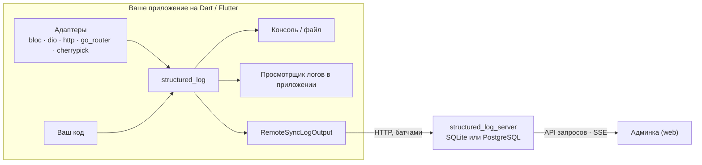

[](https://github.com/pese-git/structured_log/actions/workflows/ci.yml)
[](https://pub.dev/packages/structured_log)

*Read in [English](README.md).*

# structured_log

**Структурированное логирование для Dart и Flutter: от строки в консоли
приложения до общего хранилища логов, в котором ищет вся команда.**

Идея взята у Python-библиотеки [`structlog`](https://www.structlog.org/). Документация:
[structured-log.openidealab.com](https://structured-log.openidealab.com/ru/).

## Зачем

Строку вида `"User 42 logged in from 127.0.0.1"` легко написать и трудно
использовать: её не отфильтруешь по пользователю, не посчитаешь по IP и не
проследишь по ней один запрос без регулярных выражений. `structured_log`
записывает **события с данными** вида `user_login {user_id: 42, ip: 127.0.0.1}`.
Такую запись удобно читать в терминале, её можно разобрать как JSON и найти
по любому полю.

Проект сопровождает запись на всём её пути:

1. **Записать** — компактная библиотека-ядро для Dart и Flutter без
   сторонних зависимостей.
2. **Получить без лишнего кода** — адаптеры сами пишут в лог то, что в
   приложении уже делают `bloc`, `dio`, `http`, `go_router` и `cherrypick`.
3. **Посмотреть на устройстве** — готовый экран просмотра логов в стиле
   Material, Fluent или Cupertino.
4. **Собрать** — self-hosted сервер принимает логи со всех установок
   приложения и хранит их, а команда ищет по ним и следит за новыми
   записями в реальном времени в веб-админке.

Шаги 1–3 выполняются целиком внутри приложения, сервер для них не нужен.
Шаг 4 необязателен, и подключение сервера не требует менять ни одного
вызова лога.

## Возможности

### Ядро структурированного логирования

- **События с контекстом** — `log.info('user_login', context: {...})`;
  `bind()` возвращает новый логгер с привязанными полями, не меняя исходный,
  а `withCorrelation()` добавляет типизированные id сессии, запроса, операции.
- **Процессоры** — обогащают, преобразуют или отбрасывают записи до вывода.
- **Маскирование секретов** — пароли, токены и ключи скрываются по имени
  поля, JWT и номера карт — по самому значению.
- **Несколько выходов одновременно** — pretty JSON, JSON lines, logfmt,
  цветная консоль, файл, ротируемый файл, асинхронный файл или своя функция;
  у каждого выхода свой фильтр по уровню и категории, и его можно включать и
  выключать прямо во время работы.
- **Логирование не роняет приложение** — вызов лога никогда не выбрасывает
  исключений, а значение, которое нельзя закодировать в JSON (`DateTime`,
  исключение), теряется одним полем, а не всей записью.
- **Везде, где работает Dart** — VM, Flutter и web; runtime-зависимостей,
  кроме `meta`, нет.

### Просмотр логов внутри Flutter-приложения

- Готовый экран или встраиваемый виджет: список, который обновляется по
  мере появления записей, поиск, фильтры по уровню и категории, пауза,
  очистка, подробности записи с копированием.
- Три дизайн-системы — **Material 3**, **Fluent UI** (в стиле WinUI) и
  **Cupertino** (в стиле iOS). Все три подстраиваются под размер экрана:
  на телефоне подробности открываются в bottom sheet или на отдельном
  экране, на планшете и десктопе — рядом со списком (master-detail).
- Headless-ядро (`LogBuffer`, `LogViewerController`) для собственного UI.

### Интеграции

| Библиотека | Что пишется в лог | Категория |
|---|---|---|
| `bloc` / `flutter_bloc` | создание, события, переходы, ошибки, закрытие каждого блока и кубита | `bloc` |
| `dio` | каждый запрос и его итог, уровень по статусу ответа | `http` |
| `package:http` | то же самое через обёртку над `http.Client`; тела не буферизуются | `http` |
| `go_router` | навигация с шаблоном маршрута, перенаправления, ошибки маршрутизации | `navigation` |
| `cherrypick` | скоупы DI, модули, циклы, ошибки разрешения; сами экземпляры в лог не попадают | `di` |

HTTP- и навигационные адаптеры по умолчанию маскируют заголовки
авторизации, cookie и query-параметры с токенами. Тела запросов пишутся
только по явному разрешению и тогда маскируются по именам полей.

### Self-hosted сервер логов и админка

- **Доставка** — `RemoteSyncLogOutput` собирает записи в батчи, при сбое
  повторяет отправку с нарастающей задержкой (backoff), держит буфер
  ограниченного размера и никогда не задерживает код, который пишет в лог.
- **Приём, поиск, живая лента** — API запросов с полнотекстовым поиском и
  фильтрами по полям, а также поток Server-Sent Events, который после
  переподключения досылает пропущенное.
- **Мультитенантность** — проекты объединяются в группы; у каждого проекта
  свои секретные ключи, квоты и срок хранения.
- **Управление доступом** — пользователи, команды и роли
  (`admin`/`owner`/`user`), выдаваемые на всю систему, группу или проект;
  JWT-сессии с refresh-cookie `HttpOnly` в браузере; ограничение частоты
  запросов к эндпоинтам аутентификации; журнал аудита «кто что изменил».
- **Простой запуск** — по умолчанию это один процесс Dart и файл SQLite,
  при необходимости — PostgreSQL; docker-compose и манифесты Kubernetes
  входят в комплект.
- **Веб-админка** — приложение на Fluent UI (английский/русский) для
  управления группами, проектами, ключами, пользователями и командами, а
  также для поиска по логам и живой ленты.

## Как это устроено



Всё, что внутри рамки, работает само по себе. Серверная часть нужна, только
когда логи надо собирать в одном месте.

## Быстрый старт

Добавьте ядро:

```bash
dart pub add structured_log
```

Пишите события с данными:

```dart
import 'package:structured_log/structured_log.dart';

void main() {
  final log = getLogger().bind({'service': 'checkout'});
  log.info('user_login', context: {'user_id': 42, 'ip': '127.0.0.1'});
}
```

Отправляйте те же записи на свой сервер — вместе с консолью, не трогая ни
одного вызова лога:

```dart
import 'package:structured_log/structured_log.dart';
import 'package:structured_log_remote_sync/structured_log_remote_sync.dart';

final output = RemoteSyncLogOutput(
  serverUrl: 'https://logs.example.com',
  projectSecretKey: 'slk_...',
);

StructlogConfiguration.configure(sinks: [
  LogSink(name: 'console', output: coloredConsoleOutput),
  LogSink(name: 'server', output: output, minLevel: LogLevel.info),
]);
```

Поднимите сервер и админку через docker-compose и откройте
`http://localhost:8080`:

```bash
cd deploy && ./deploy.sh
```

Дальше: [руководство по встраиванию](docs/guides/embedding-guide.ru.md) —
просмотрщик и адаптеры, [руководство администратора](docs/guides/admin-guide.ru.md) —
эксплуатация сервера, [руководство пользователя](docs/guides/user-guide.ru.md) —
работа в админке.

## Пакеты

| Пакет | Назначение | |
|---|---|---|
| [`structured_log`](emb/structured_log/) | Ядро | [](https://pub.dev/packages/structured_log) |
| [`structured_log_flutter`](emb/structured_log_flutter/) | Headless-ядро просмотрщика для Flutter | [](https://pub.dev/packages/structured_log_flutter) |
| [`structured_log_material`](emb/structured_log_material/) | Просмотрщик на Material 3 | [](https://pub.dev/packages/structured_log_material) |
| [`structured_log_fluent`](emb/structured_log_fluent/) | Просмотрщик на Fluent UI | [](https://pub.dev/packages/structured_log_fluent) |
| [`structured_log_cupertino`](emb/structured_log_cupertino/) | Просмотрщик на Cupertino | [](https://pub.dev/packages/structured_log_cupertino) |
| [`structured_log_remote_sync`](emb/structured_log_remote_sync/) | Отправка логов на сервер | [](https://pub.dev/packages/structured_log_remote_sync) |
| [`structured_log_bloc`](emb/structured_log_bloc/) | Наблюдатель `bloc` / `flutter_bloc` | [](https://pub.dev/packages/structured_log_bloc) |
| [`structured_log_dio`](emb/structured_log_dio/) | Перехватчик `dio` | [](https://pub.dev/packages/structured_log_dio) |
| [`structured_log_http_client`](emb/structured_log_http_client/) | Обёртка клиента `package:http` | [](https://pub.dev/packages/structured_log_http_client) |
| [`structured_log_go_router`](emb/structured_log_go_router/) | Логирование навигации `go_router` | [](https://pub.dev/packages/structured_log_go_router) |
| [`structured_log_cherrypick`](emb/structured_log_cherrypick/) | Наблюдатель DI `cherrypick` | [](https://pub.dev/packages/structured_log_cherrypick) |
| [`structured_log_server`](backend/structured_log_server/) | Self-hosted сервер логов | сервис, не публикуется |
| [`structured_log_admin_client`](frontend/structured_log_admin_client/) | Веб-админка сервера | приложение, не публикуется |

Адаптеры пока выходят пре-релизами. `structured_log_http` — прежнее название
`structured_log_remote_sync`; этот пакет больше не развивается. Ещё в репозитории лежат
библиотека компонентов админки
([`structured_log_admin_ui`](frontend/structured_log_admin_ui/)) и сквозные
тесты через всю систему ([`packages/e2e`](packages/e2e/)).

## Состояние

Библиотеки опубликованы и используются. Сервер и админка уже работают:
приём, поиск, живая лента, мультитенантность, управление доступом и аудит
реализованы. Работа над ними не закончена: самостоятельная регистрация,
восстановление пароля и подтверждение email описаны в спецификации, но
пока не сделаны. Ход работ — в [openspec/changes/add-structured-log-server/tasks.md](openspec/changes/add-structured-log-server/tasks.md).

## Документация

- [structured-log.openidealab.com](https://structured-log.openidealab.com/ru/) —
  сайт документации на русском и английском.
- [docs/guides/](docs/guides/README.ru.md) — практические руководства: по
  встраиванию (без сервера), для пользователя, администратора/DevOps,
  разработчика и контрибьютора.
- [docs/](docs/README.ru.md) — устройство серверной системы: API,
  аутентификация и RBAC, хранилище, живая лента, эксплуатация.
- README каждого пакета — установка и полный справочник API.

## Участие в разработке

Репозиторий — workspace на [Melos](https://melos.invertase.dev) +
[FVM](https://fvm.app). Пакеты разложены по назначению: `emb/` — библиотеки
для встраивания в приложения, `backend/` — сервер, `frontend/` — админка,
`packages/` — сквозные тесты.

```bash
dart run melos bootstrap
dart run melos run lint
dart run melos run test
```

Начните с [руководства контрибьютора](docs/guides/contributor-guide.ru.md);
полный справочник по командам, соглашениям, версионированию и CI — в
[AGENTS.md](AGENTS.md). Проектные решения и требования — в
[openspec/](openspec/).

## Лицензия

MIT — см. [LICENSE](LICENSE).
