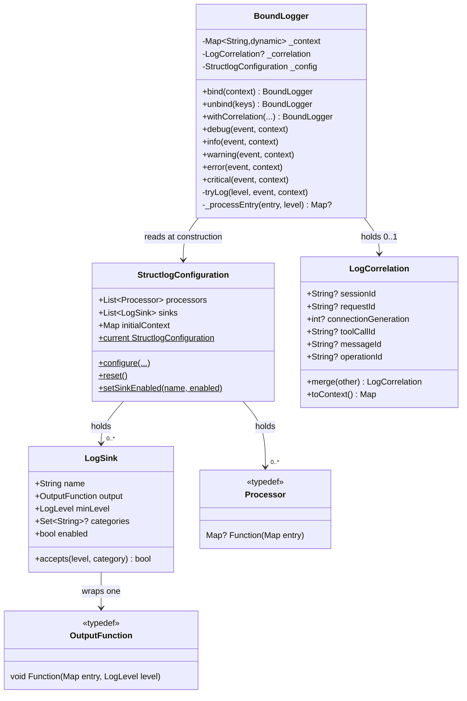
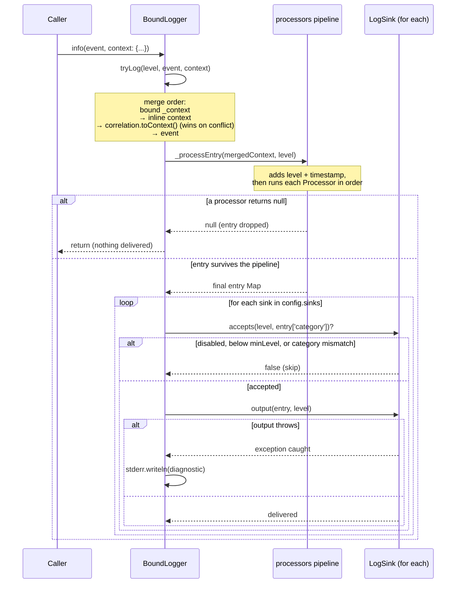
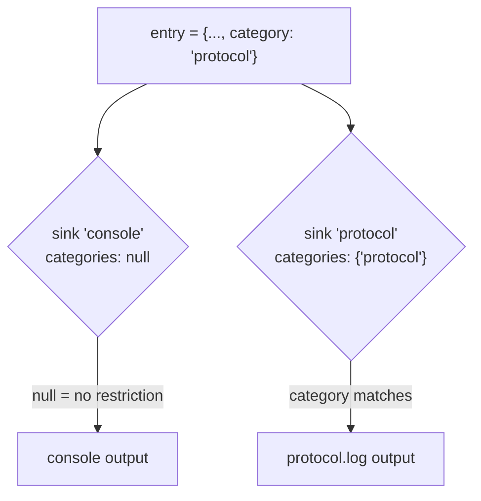
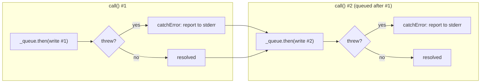

# Architecture

*Читать на [русском](ARCHITECTURE.ru.md).*

This document describes the internal design of `structured_log` for
contributors extending or maintaining the package. For usage as a
consumer, see [README.md](../README.md) (or [README.ru.md](../README.ru.md)).

## Design goals

- **No wrapper ceremony.** A `BoundLogger` is a thin, immutable value —
  `bind()`/`unbind()`/`withCorrelation()` all return a new instance rather
  than mutating state, so passing a logger around a call chain is safe.
- **One global configuration, many local loggers.** `StructlogConfiguration`
  is a process-wide singleton; individual `BoundLogger` instances only carry
  the context/correlation data specific to their scope.
- **Everything in the pipeline is a plain function.** Processors
  (`Map<String, dynamic>? Function(Map<String, dynamic>)`) and outputs
  (`void Function(Map<String, dynamic>, LogLevel)`) are typedef'd function
  types, not classes to subclass — custom behavior is just a closure. The
  async outputs (see [Async outputs](#async-outputs)) are the one exception:
  they're callable classes, because they need to carry state (a completion
  future) beyond the function itself.
- **Additive evolution.** Correlation, multi-sink routing, and the async
  outputs were all added without changing any existing method signature
  (see [CHANGELOG.md](../CHANGELOG.md)).

## Components

| File | Responsibility |
|------|----------------|
| [lib/src/logger.dart](../lib/src/logger.dart) | `LogLevel`, `BoundLogger` — binds context/correlation, runs the processor pipeline, delivers to sinks |
| [lib/src/configuration.dart](../lib/src/configuration.dart) | `StructlogConfiguration` — global processors/sinks/initialContext, `configure()`/`reset()`/`setSinkEnabled()` |
| [lib/src/correlation.dart](../lib/src/correlation.dart) | `LogCorrelation` — typed, mergeable correlation fields |
| [lib/src/sink.dart](../lib/src/sink.dart) | `LogSink` — one output destination with level/category filtering and a runtime enable switch |
| [lib/src/processors.dart](../lib/src/processors.dart) | `Processor` typedef + built-ins (`dropNullValues`, `addTimestamp`, `addLogLevel`, `jsonRenderer`, `logfmtRenderer`) |
| [lib/src/formatters.dart](../lib/src/formatters.dart) | `OutputFunction` typedef + built-in outputs (console, colored console, file, rotating file) |
| [lib/src/async_file_output.dart](../lib/src/async_file_output.dart) | `AsyncFileOutput`, `AsyncRotatingFileOutput` — non-blocking counterparts of the sync file outputs |

### Component relationships

`getLogger()` reads `StructlogConfiguration.current` **once**, at the moment
it's called, and stores that reference in the new `BoundLogger`. A logger
obtained before a later `configure()` call keeps seeing the *old*
configuration object unless that call reuses the same `sinks`/`processors`
list — see [Runtime toggling and the config snapshot](#runtime-toggling-and-the-config-snapshot).

## Log call lifecycle

Calling e.g. `log.info('event', context: {...})` walks through
`tryLog()` → `_processEntry()` → per-sink delivery:

Key invariants from this flow:

- **Typed correlation wins.** Correlation fields are merged *after* the
  inline `context` map, so a same-named key from `context:` never shadows a
  bound correlation field.
- **A processor returning `null` drops the entry entirely** — no sink sees
  it, and no diagnostic is printed (this is the standard filtering
  mechanism, e.g. for level-based suppression written as a custom
  processor).
- **Sink failures are isolated.** Each `sink.output()` call is wrapped in
  its own `try/catch`; one broken sink (e.g. an unwritable file path) never
  stops delivery to the others and never throws out of `tryLog()`.

## Multi-sink routing

`category` is not a first-class parameter on any logging method — it's
just a conventional context key (`'category'`), set via `bind()` or inline
`context:` like any other value. `LogSink.categories` matches against it:

`categories: null` (the default) means "no restriction" — the sink accepts
every category. A sink with a non-null `categories` set rejects entries
that have no `category` key or a non-matching one.

### Runtime toggling and the config snapshot

`LogSink.enabled` is a mutable field (not `final`) specifically so
`StructlogConfiguration.setSinkEnabled(name, enabled: ...)` can flip it in
place on the *existing* `LogSink` object — no new `StructlogConfiguration`
or `BoundLogger` needs to be created for the toggle to take effect.

This only works because `configure()` reuses the same `sinks` list (and
thus the same `LogSink` instances) when the caller doesn't pass a new
`sinks:` argument — see the `nextSinks` fallback in
[configuration.dart](../lib/src/configuration.dart). If a later `configure(sinks: [...])`
call *replaces* the list wholesale, any `BoundLogger` still holding the old
`StructlogConfiguration` instance keeps delivering to the old sinks — this
mirrors the pre-existing behavior of `processors`/`initialContext`
(loggers capture a `StructlogConfiguration` reference at creation time, not
a live pointer to `StructlogConfiguration.current`).

## Async outputs

`fileOutput`/`rotatingFileOutput` use `File.writeAsStringSync`, which
blocks whichever isolate calls the logger — fine for occasional logging,
but a real cost if an app logs heavily from its UI/main isolate.
`AsyncFileOutput`/`AsyncRotatingFileOutput`
([lib/src/async_file_output.dart](../lib/src/async_file_output.dart)) use
the non-blocking `dart:io` File API instead, but `OutputFunction` is a
synchronous `void Function(...)` — there's no `Future` for a caller to
await inline. That constraint drives the whole implementation:

- Each `call()` enqueues its write onto a single chained `Future`
  (`_queue = _queue.then((_) => _write(...))`) instead of firing writes
  independently — otherwise two overlapping async `writeAsString(mode:
  FileMode.append)` calls to the same file could interleave or lose data.
- **Every step in the chain catches its own error** with `.catchError(...)`,
  not just once at the end. This is the detail that's easy to get wrong:
  `Future.then` without a matching `onError` *skips its callback and
  forwards the error* to whatever comes next. Without a per-step
  `catchError`, one failing write would silently cancel every write queued
  after it — the queue would look "stuck" with no exception ever visible
  to the caller.
- `flushed` exposes the tail of the chain so callers (tests, or shutdown
  code) can `await` "everything enqueued so far has completed" without the
  logging call sites themselves needing to be `async`.

Regardless of whether write #1 succeeds or fails, the chain always reaches
a *resolved* state before write #2 runs — that's what the `catchError` on
every step buys you. `AsyncRotatingFileOutput`'s size check + rotation +
write are all inside the same `_write()` step, so they're serialized
against themselves the same way; no separate locking is needed.

Being classes rather than closures is why they're the one exception to
"everything in the pipeline is a plain function" (see
[Design goals](#design-goals)) — `flushed` needs somewhere to live. Both
still satisfy the `OutputFunction` typedef structurally via Dart's
callable-class `call()` method, so they drop into `configure(output: ...)`
or a `LogSink` exactly like any other output, with no changes needed
anywhere else in the pipeline.

## Extension points

Everything pluggable is a plain function or a `LogSink`, so no interface to
implement:

- **Custom processor** — `Map<String, dynamic>? Function(Map<String, dynamic>)`.
  Return `null` to drop the entry; otherwise return the (possibly mutated)
  map. Order matters — processors run sequentially, each seeing the
  previous one's output.
- **Custom output** — `void Function(Map<String, dynamic>, LogLevel)`. Used
  directly via `configure(output: ...)` or wrapped in a `LogSink` for
  filtered/multi-destination delivery.
- **Custom sink** — construct a `LogSink` with any `OutputFunction`,
  `minLevel`, and `categories`; no subclassing needed.

## Testing approach

[test/structlog_test.dart](../test/structlog_test.dart) covers each
component in isolation, favoring a custom `OutputFunction`/`LogSink`
closure that appends to a local `List`/variable rather than asserting on
stdout or the filesystem — this keeps assertions on the exact
`Map<String, dynamic>` produced by the pipeline.

[test/integration_test.dart](../test/integration_test.dart) instead
exercises the package as a whole system: correlation + bound context +
processors + multi-sink routing combined the way a real consumer would use
them, real files on a real filesystem (via `Directory.systemTemp`, deleted
in `tearDown`), a mixed sync+async multi-sink configuration, full rotation
history reconstructed across a rotating output's numbered backups, and
`coloredConsoleOutput`'s actual printed format captured by overriding
`print` through a `Zone` — driven through a real `BoundLogger` call rather
than invoked directly.

Tests in both files that call `StructlogConfiguration.configure()` always
`tearDown(StructlogConfiguration.reset)` to avoid bleeding global state
into other tests.
