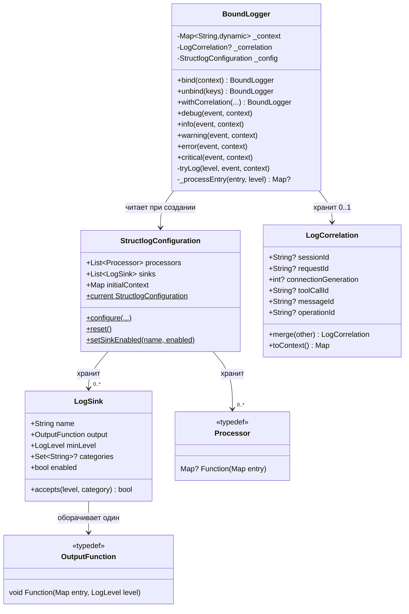
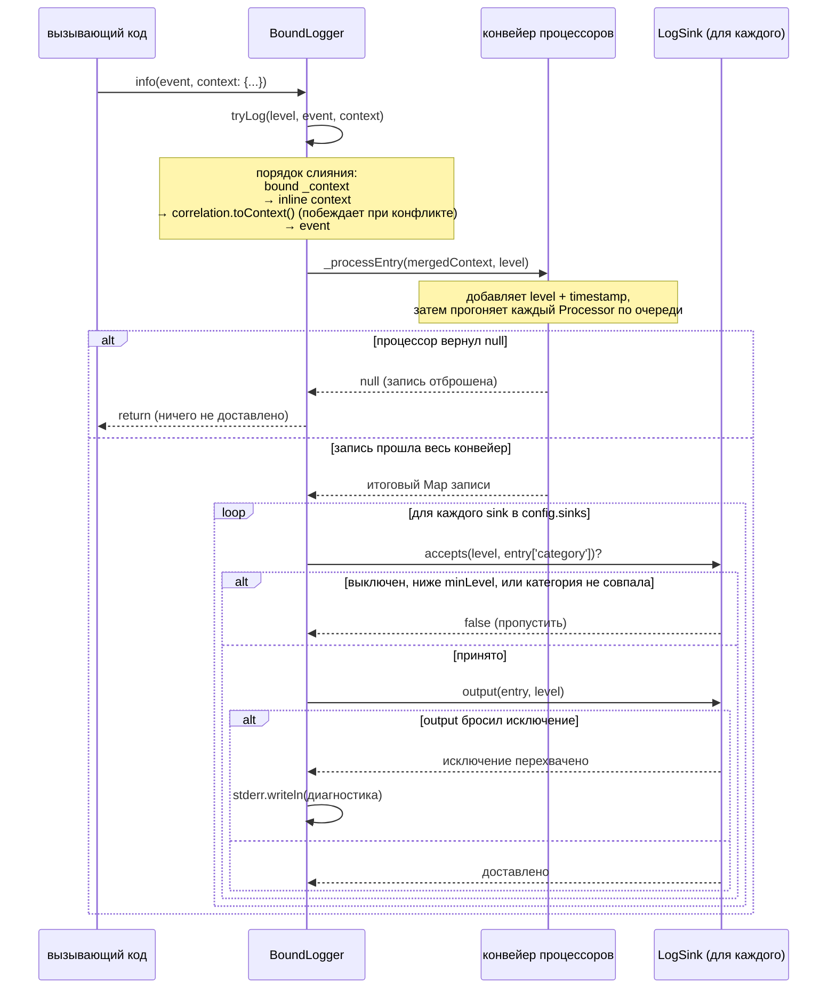
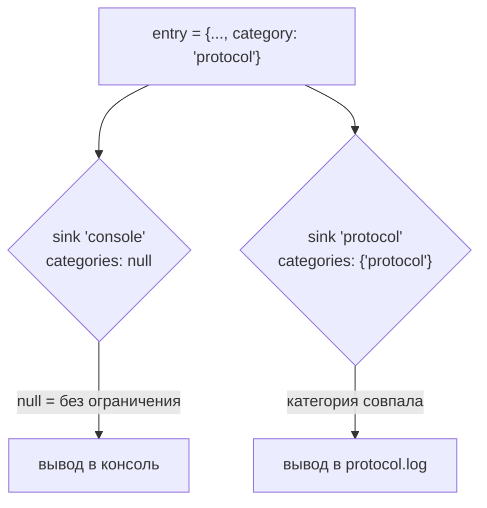

# Архитектура

*Read this in [English](ARCHITECTURE.md).*

Этот документ описывает внутреннее устройство `structured_log` для тех, кто
дорабатывает или поддерживает пакет. Для использования пакета как
потребителя см. [README.md](../README.md) (или [README.ru.md](../README.ru.md)).

## Принципы проектирования

- **Без обёрточного церемониала.** `BoundLogger` — тонкое, иммутабельное
  значение: `bind()`/`unbind()`/`withCorrelation()` всегда возвращают новый
  экземпляр, а не мутируют состояние, поэтому логгер безопасно передавать
  дальше по цепочке вызовов.
- **Одна глобальная конфигурация, много локальных логгеров.**
  `StructlogConfiguration` — синглтон на весь процесс; отдельные экземпляры
  `BoundLogger` несут только те context/correlation-данные, что относятся к
  их собственному scope.
- **Всё в конвейере — обычная функция.** Процессоры
  (`Map<String, dynamic>? Function(Map<String, dynamic>)`) и выводы
  (`void Function(Map<String, dynamic>, LogLevel)`) — это типы-функции
  (typedef), а не классы для наследования — кастомное поведение — это
  просто замыкание.
- **Аддитивная эволюция.** Correlation и multi-sink маршрутизация были
  добавлены без изменения сигнатур существующих методов (см.
  [CHANGELOG.md](../CHANGELOG.md)).

## Компоненты

| Файл | Ответственность |
|------|----------------|
| [lib/src/logger.dart](../lib/src/logger.dart) | `LogLevel`, `BoundLogger` — привязывает context/correlation, прогоняет конвейер процессоров, доставляет в sinks |
| [lib/src/configuration.dart](../lib/src/configuration.dart) | `StructlogConfiguration` — глобальные processors/sinks/initialContext, `configure()`/`reset()`/`setSinkEnabled()` |
| [lib/src/correlation.dart](../lib/src/correlation.dart) | `LogCorrelation` — типизированные, объединяемые correlation-поля |
| [lib/src/sink.dart](../lib/src/sink.dart) | `LogSink` — один output-destination с фильтрацией по уровню/категории и переключателем в рантайме |
| [lib/src/processors.dart](../lib/src/processors.dart) | typedef `Processor` + встроенные (`dropNullValues`, `addTimestamp`, `addLogLevel`, `jsonRenderer`, `logfmtRenderer`) |
| [lib/src/formatters.dart](../lib/src/formatters.dart) | typedef `OutputFunction` + встроенные выводы (консоль, цветная консоль, файл, ротируемый файл) |

### Связи компонентов

`getLogger()` читает `StructlogConfiguration.current` **один раз**, в момент
вызова, и сохраняет эту ссылку в новом `BoundLogger`. Логгер, полученный до
более позднего вызова `configure()`, продолжает видеть *старый* объект
конфигурации — если только этот вызов не переиспользует тот же список
`sinks`/`processors` — см. [Переключение в рантайме и снапшот конфигурации](#переключение-в-рантайме-и-снапшот-конфигурации).

## Жизненный цикл вызова лога

Вызов, например, `log.info('event', context: {...})` проходит через
`tryLog()` → `_processEntry()` → доставку по sinks:

Ключевые инварианты этого потока:

- **Типизированный correlation побеждает.** Correlation-поля примешиваются
  *после* инлайн-`context`, поэтому одноимённый ключ из `context:` никогда
  не перекрывает привязанное correlation-поле.
- **Процессор, вернувший `null`, полностью отбрасывает запись** — её не
  видит ни один sink, и диагностика не печатается (это стандартный
  механизм фильтрации, например, для подавления по уровню через кастомный
  процессор).
- **Сбои sink изолированы.** Каждый вызов `sink.output()` обёрнут в
  собственный `try/catch`; один сломанный sink (например, недоступный путь
  к файлу) никогда не останавливает доставку в остальные и никогда не
  пробрасывает исключение из `tryLog()`.

## Multi-sink маршрутизация

`category` не является полноценным параметром ни одного метода логирования
— это просто договорной ключ контекста (`'category'`), задаваемый через
`bind()` или инлайн `context:`, как любое другое значение. `LogSink.categories`
сопоставляется с ним:

`categories: null` (по умолчанию) означает «без ограничения» — sink
принимает любую категорию. Sink с непустым `categories` отклоняет записи,
у которых нет ключа `category` или он не совпадает.

### Переключение в рантайме и снапшот конфигурации

`LogSink.enabled` — изменяемое поле (не `final`) специально для того, чтобы
`StructlogConfiguration.setSinkEnabled(name, enabled: ...)` могло
переключить его прямо на *существующем* объекте `LogSink` — для этого не
нужно создавать новый `StructlogConfiguration` или `BoundLogger`.

Это работает только потому, что `configure()` переиспользует тот же список
`sinks` (а значит, те же экземпляры `LogSink`), если вызывающий код не
передал новый аргумент `sinks:` — см. фолбэк `nextSinks` в
[configuration.dart](../lib/src/configuration.dart). Если более поздний вызов
`configure(sinks: [...])` *полностью заменяет* список, любой `BoundLogger`,
всё ещё держащий старый экземпляр `StructlogConfiguration`, продолжает
доставлять в старые sinks — это то же поведение, что уже было у
`processors`/`initialContext` (логгеры захватывают ссылку на
`StructlogConfiguration` в момент создания, а не живой указатель на
`StructlogConfiguration.current`).

## Точки расширения

Всё, что подключается извне, — обычная функция или `LogSink`, никакого
интерфейса реализовывать не нужно:

- **Кастомный процессор** — `Map<String, dynamic>? Function(Map<String, dynamic>)`.
  Верните `null`, чтобы отбросить запись; иначе верните (возможно,
  изменённый) map. Порядок важен — процессоры выполняются последовательно,
  каждый видит результат предыдущего.
- **Кастомный output** — `void Function(Map<String, dynamic>, LogLevel)`.
  Используется напрямую через `configure(output: ...)` либо оборачивается
  в `LogSink` для фильтрованной/multi-destination доставки.
- **Кастомный sink** — постройте `LogSink` с любым `OutputFunction`,
  `minLevel` и `categories`; наследование не требуется.

## Подход к тестированию

[test/structlog_test.dart](../test/structlog_test.dart) предпочитает
захватывать записи через кастомное замыкание `OutputFunction`/`LogSink`,
добавляющее их в локальный `List`/переменную, а не проверять stdout или
файловую систему — это позволяет делать assert прямо на итоговом
`Map<String, dynamic>`, который выдал конвейер. Тесты, вызывающие
`StructlogConfiguration.configure()`, всегда делают
`tearDown(StructlogConfiguration.reset)`, чтобы не протаскивать глобальное
состояние в другие тесты.
