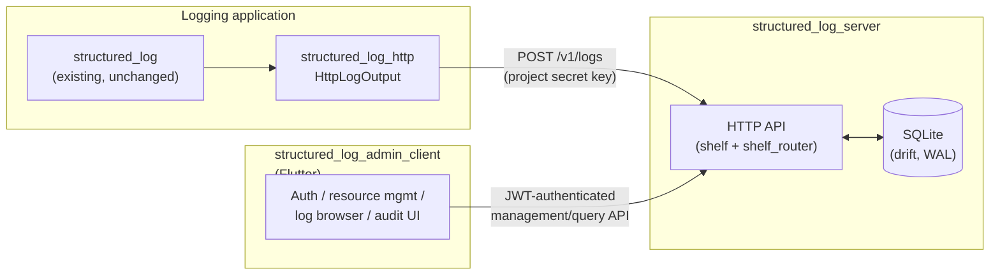
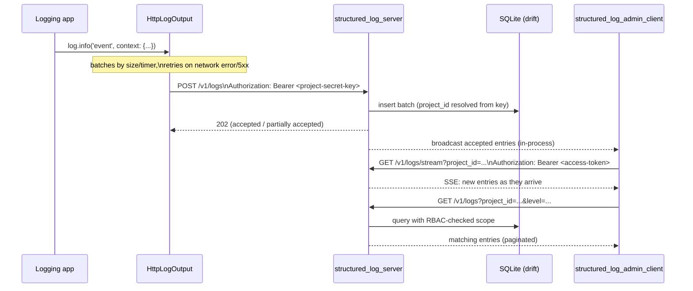

# Architecture overview

*Читать на [русском](README.ru.md).*

This document introduces the three packages proposed by
[add-structured-log-server](../../openspec/changes/add-structured-log-server/),
how they relate to each other, and the principles that recur throughout
their design. For the reasoning behind any specific decision, see
[design.md](../../openspec/changes/add-structured-log-server/design.md)
— this document cites decision numbers (`decision N`) so you can jump
straight to the relevant paragraph there.

## Components

- **`structured_log_server`** (`backend/`) — the service. A self-hosted
  Dart HTTP process that accepts log batches, stores them, and serves
  query/management/live-stream APIs. See
  [data-model.md](data-model.md), [auth.md](auth.md),
  [rbac-and-lifecycle.md](rbac-and-lifecycle.md),
  [live-streaming.md](live-streaming.md), and
  [quotas-and-audit.md](quotas-and-audit.md) for its sub-areas.
- **`structured_log_http`** (`emb/`) — a thin client package. Its only
  dependency is `structured_log` (decision 5); it adds `HttpLogOutput`,
  an `OutputFunction` that batches and ships log entries to the server
  over `POST /v1/logs`, authenticated by a project's secret key. Any
  application already using `structured_log` opts in by plugging this
  output into a `LogSink` — nothing else about `structured_log` changes.
- **`structured_log_admin_client`** (`frontend/`) — a standalone Flutter
  app that is the human-facing UI over the *entire* server contract:
  authentication, resource management (users/groups/teams/projects/keys/
  roles), the live-tailing log browser, and the audit log. See
  [admin-client.md](admin-client.md).

None of the three share Dart code with each other beyond `structured_log`
itself — `structured_log_server` and `structured_log_admin_client`
communicate only over the documented HTTP/JSON contract (decision 19),
and `structured_log_http` only knows the wire format of `POST /v1/logs`,
not the server's internals.

## Why a server at all

Before this change, `structured_log` could only write to local
destinations (console, file, rotating file). There was no way to collect
logs from multiple running instances of an application — or from
multiple applications — into one place to search and filter centrally.
`structured_log_server` fills that gap as a self-hosted alternative to
a SaaS log platform or a heavyweight stack like ELK, in the same Dart
ecosystem as the rest of the workspace. See `proposal.md`'s `## Why` for
the full framing.

## Request flow, end to end

## Principles that recur across the design

These aren't specific to one capability — they show up repeatedly in
`design.md` and are worth internalizing before reading the topic docs.

- **No magic, no codegen beyond one deliberate exception.** The
  workspace has a standing "no magic" principle (`add-structured-log-flutter/design.md`,
  decision 4); `shelf`/`shelf_router` over `dart_frog` follows it
  (decision 1). `drift` (and therefore `build_runner`) is the *one*
  sanctioned exception, scoped to `structured_log_server`'s storage
  layer alone, adopted by explicit user direction (decision 2) — not a
  precedent for codegen elsewhere in the workspace.
- **Single isolate, no premature scaling.** One `NativeDatabase`
  `QueryExecutor` in one isolate (decision 4) underpins everything: it's
  why the live-stream broadcast can be an in-process `StreamController`
  instead of an external pub/sub (decision 29), and why cross-isolate
  scaling is an explicit non-goal rather than a half-built feature.
- **Explicit scope, never implicit aggregation.** Every query
  (`GET /v1/logs`, `GET /v1/logs/stream`, management endpoints) requires
  an explicit `project_id` or `group_id` (decision 8) — the server never
  silently unions "everything the caller can see." The same instinct
  shows up in `role_assignments`: rights are resolved from an explicit,
  auditable table, never inferred.
- **Immediate revocation is a first-class requirement, not a nice-to-have.**
  Blocking a user, deleting an account, or changing a role must take
  effect *now*, not "whenever the access token happens to expire." This
  is what `token_version` (decision 10) exists for, and it's why the
  live-stream endpoint re-validates it on every heartbeat instead of
  trusting the token for the connection's whole lifetime (decision 29) —
  a long-lived connection is exactly the place this guarantee could
  otherwise quietly leak.
- **Reversible vs. irreversible actions are different operations, not
  flags on the same one.** Blocking (`is_active`, reversible via
  `unblock`) and deletion (`deleted_at`, permanent) share the same
  underlying revocation mechanics but are deliberately separate
  endpoints with separate authorization stories (decisions 25, 27) —
  see [rbac-and-lifecycle.md](rbac-and-lifecycle.md).
- **Interfaces at the boundary, not speculative abstraction elsewhere.**
  `IdentityProvider` (decision 17) and `EmailSender` (decision 24) exist
  because a concrete second implementation (Keycloak, a transactional
  email API) is a named, plausible future need. Nothing else in the
  design is abstracted "just in case" — see, for example, decision 21's
  explicit rejection of a shared `LogViewerController` data-source
  abstraction before a second consumer exists.

## Where each package lives

The workspace is being restructured into `emb/` (embeddable libraries),
`backend/`, `frontend/`, and `packages/` (reserved, currently empty) —
see decision 23. As of this writing that restructuring, and the three
packages themselves, exist only as the OpenSpec change; none of the
paths above are on disk yet. `tasks.md` section 1 covers the `git mv`
and scaffolding.
