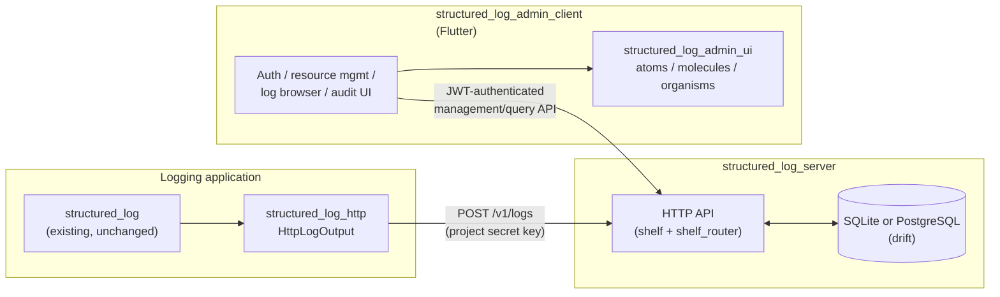
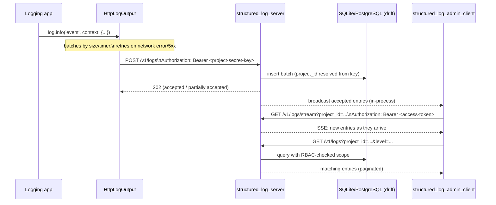
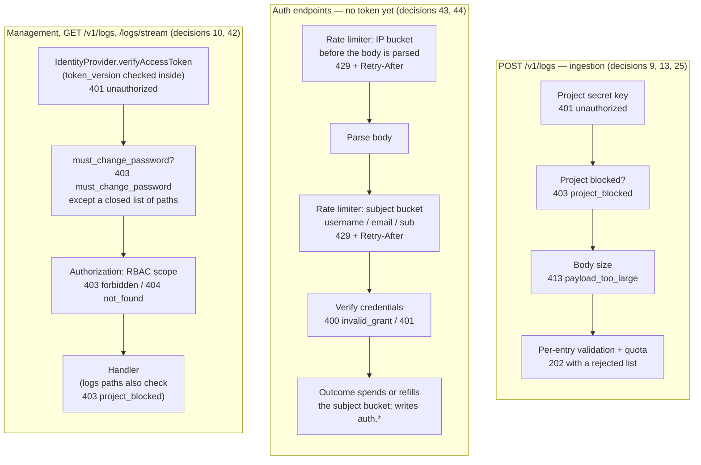

# Architecture overview

*Читать на [русском](README.ru.md).*

This document introduces the four packages proposed by
[add-structured-log-server](../../openspec/changes/add-structured-log-server/),
how they relate to each other, and the principles that recur throughout
their design. For the reasoning behind any specific decision, see
[design.md](../../openspec/changes/add-structured-log-server/design.md)
— this document cites decision numbers (`decision N`) so you can jump
straight to the relevant paragraph there.

`structured_log_server` and its companion packages make up a self-hosted
log-collection service: applications send structured log entries to a
server over HTTP, and administrators search, filter, and live-tail them
through a companion Flutter admin client. The rest of this page names
the packages involved and how they talk to each other.

## Why a server at all

Before this change, `structured_log` could only write to local
destinations (console, file, rotating file). There was no way to collect
logs from multiple running instances of an application — or from
multiple applications — into one place to search and filter centrally.
`structured_log_server` fills that gap as a self-hosted alternative to
a SaaS log platform or a heavyweight stack like ELK, in the same Dart
ecosystem as the rest of the workspace. See `proposal.md`'s `## Why` for
the full framing (the case for building this instead of adopting a SaaS
platform or ELK).

## Components

- **`structured_log_server`** (`backend/`) — the service. A self-hosted
  Dart HTTP process that accepts log batches, stores them, and serves
  query/management/live-stream APIs. See
  [data-model.md](data-model.md), [auth.md](auth.md),
  [rbac-and-lifecycle.md](rbac-and-lifecycle.md),
  [live-streaming.md](live-streaming.md), and
  [quotas-and-audit.md](quotas-and-audit.md) for its sub-areas.
- **`structured_log_http`** (`emb/`) — a thin client package. Its only
  dependency is `structured_log` (decision 5); it adds `HttpLogOutput`,
  an `OutputFunction` that batches and ships log entries to the server
  over `POST /v1/logs`, authenticated by a project's secret key. Any
  application already using `structured_log` opts in by plugging this
  output into a `LogSink` — nothing else about `structured_log` changes.
- **`structured_log_admin_client`** (`frontend/`) — a standalone Flutter
  app that is the human-facing UI over the *entire* server contract:
  authentication, resource management (users/groups/teams/projects/keys/
  roles), the live-tailing log browser, and the audit log. See
  [admin-client.md](admin-client.md).
- **`structured_log_admin_ui`** (`frontend/`) — a component library for
  `structured_log_admin_client`'s presentation-only widgets, structured
  by Atomic Design (atoms/molecules/organisms). `structured_log_admin_client`
  depends on it, never the reverse — it has no knowledge of `Bloc`s,
  repositories, or the HTTP contract at all. See
  [admin-client.md](admin-client.md#the-component-library-structured_log_admin_ui).

None of the four share Dart code with each other beyond `structured_log`
itself, except `structured_log_admin_client` → `structured_log_admin_ui`
(one-way) — `structured_log_server` and `structured_log_admin_client`
communicate only over the documented HTTP/JSON contract (decision 19),
and `structured_log_http` only knows the wire format of `POST /v1/logs`,
not the server's internals.

## Request flow, end to end

## The middleware chain

A middleware chain is the ordered sequence of checks — auth,
rate-limiting, CORS — a request passes through before reaching the code
that actually handles it. Three kinds of request reach the server, and
each passes through a different chain. What rejects a request, and in
what order, is a deliberate design decision rather than an accident of
wiring.

One stage wraps all three and isn't part of any of them: when
`--cors-allowed-origins` names the request's `Origin`, a matching
`OPTIONS` preflight is answered immediately, ahead of every chain above
— ingestion included — and every other response, success or error, gets
`Access-Control-Allow-Origin`/`Vary` added on the way out
([http-api.md](../api/http-api.md#cross-origin-requests-cors-log-server-api)).
Off by default, and a no-op for any `Origin` not on the list, which is
why the three chains above can be read as if it didn't exist.

Three things about this order are load-bearing:

- **The limiter runs before grant processing, not inside it.** A request
  stopped by the rate limiter never reaches the OAuth2 handler — which is
  exactly why its `429` uses the general JSON envelope even on the token
  endpoint, the one place that otherwise answers in RFC 6749's shape
  ([errors.md](../api/errors.md#429-is-the-one-non-rfc-answer-the-token-endpoint-gives)).
- **`must_change_password` sits between authentication and
  authorization.** It isn't an RBAC rule — it applies regardless of role
  — and it must not depend on roles being resolved first. Placing it here
  also means one cheap point-lookup next to the `token_version` check the
  auth step already performs ([auth.md](auth.md#patch-v1usersid-and-the-mandatory-temporary-password)).
- **Ingestion shares none of it.** `POST /v1/logs` authenticates with a
  project secret key, not a JWT, and is governed by quotas rather than by
  the limiter — request frequency there is normal application traffic,
  not credential guessing
  ([quotas-and-audit.md](quotas-and-audit.md)).
- **CORS is checked first, ahead even of the ingestion chain's own
  secret-key check.** A preflight carries no credential of any kind —
  answering it before authentication or rate limiting is not a special
  case for ingestion, it's the same rule the other two chains follow too
  ([http-api.md](../api/http-api.md#cross-origin-requests-cors-log-server-api)).

Every step above is configurable only at startup, never at runtime — see
[configuration.md](../operations/configuration.md).

## Principles that recur across the design

These aren't specific to one capability — they show up repeatedly in
`design.md` and are worth internalizing before reading the topic docs.

- **No magic, no codegen — with a deliberately widened exception for the
  two new packages.** The workspace has a standing "no magic" principle
  (`add-structured-log-flutter/design.md`, decision 4); `shelf`/`shelf_router`
  over `dart_frog` follows it (decision 1). `drift` (and therefore
  `build_runner`) was the first sanctioned exception, scoped to
  `structured_log_server`'s storage layer, adopted by explicit user
  direction (decision 2), and decisions 34/37 extend that same
  exception — still by explicit user direction, still scoped to these
  two new packages — to `freezed`/`json_serializable` in both
  `structured_log_server` and `structured_log_admin_client`, and to
  `retrofit_generator` in the client alone. None of this is a precedent
  for the rest of the workspace, which stays codegen-free:
  `structured_log`, `structured_log_flutter`, `structured_log_material`,
  `structured_log_fluent`, `structured_log_cupertino`, and
  `structured_log_http`. See [technology-stack.md](technology-stack.md)
  for the full stack.
- **One process, no premature scaling — but not one connection anymore.**
  Everything still runs in a single process, and cross-isolate *request
  handling* is still an explicit non-goal rather than a half-built
  feature. What did change: reads used to share the one write connection
  and queued behind whatever batch ingestion was committing; a pool of
  extra reader isolates (`--db-read-pool-size`) now serves them beside
  the single writer, which WAL allows without extra synchronization
  ([technology-stack.md](technology-stack.md)). This is orthogonal to
  why the live-stream broadcast can stay an in-process `StreamController`
  instead of an external pub/sub (decision 29): every accepted insert
  still passes through the one writer, in the one process, whatever
  reads beside it.
- **Explicit scope, never implicit aggregation.** Every query
  (`GET /v1/logs`, `GET /v1/logs/stream`, management endpoints) requires
  an explicit `project_id` or `group_id` (decision 8) — the server never
  silently unions "everything the caller can see." The same instinct
  shows up in `role_assignments`: rights are resolved from an explicit,
  auditable table, never inferred.
- **Immediate revocation is a first-class requirement, not a nice-to-have.**
  Blocking a user, deleting an account, or changing a role must take
  effect *now*, not "whenever the access token happens to expire." This
  is what `token_version` (decision 10) exists for, and it's why the
  live-stream endpoint re-validates it on every heartbeat instead of
  trusting the token for the connection's whole lifetime (decision 29) —
  a long-lived connection is exactly the place this guarantee could
  otherwise quietly leak.
- **Reversible vs. irreversible actions are different operations, not
  flags on the same one.** Blocking (`is_active`, reversible via
  `unblock`) and deletion (`deleted_at`, permanent) share the same
  underlying revocation mechanics but are deliberately separate
  endpoints with separate authorization stories (decisions 25, 27) —
  see [rbac-and-lifecycle.md](rbac-and-lifecycle.md).
- **Interfaces at the boundary, not speculative abstraction elsewhere.**
  `IdentityProvider` (decision 17) and `EmailSender` (decision 24) exist
  because a concrete second implementation (Keycloak, a transactional
  email API) is a named, plausible future need. Nothing else in the
  design is abstracted "just in case" — see, for example, decision 21's
  explicit rejection of a shared `LogViewerController` data-source
  abstraction before a second consumer exists.
- **Organized by feature, not by technical file type.** Both new
  packages' code is grouped first by domain feature (`auth`, `users`,
  `projects`, `logs`, ...), not by a workspace-wide `routes/`/`services/`/
  `models/` split (decision 32) — see [technology-stack.md](technology-stack.md#architecture-pattern)
  for the layering inside each feature (simpler layers on the server,
  full Clean Architecture on the client, since only the client has a
  presentation layer to separate from domain logic).
- **Expected failures are typed, not thrown.** `fpdart`'s `Either`
  return type is used specifically for outcomes a caller must handle as
  part of the contract — validation errors, RBAC denials, quota limits,
  `invalid_grant` — not as a blanket replacement for exceptions, which
  still signal genuine bugs (decision 33).
- **Presentation widgets are compiler-isolated from business logic, not
  just conventionally separated.** `structured_log_admin_ui` (decision
  39) can't import `Bloc`s or repository code even by mistake — the
  boundary is a separate package with a one-way dependency, not a
  `lib/shared/widgets/` folder that nothing technically stops from
  reaching into app state.

## Where each package lives

The workspace is organized into `emb/` (embeddable libraries),
`backend/`, `frontend/` (two packages — `structured_log_admin_ui` and
`structured_log_admin_client`), and `packages/` (anything that doesn't
fit the three categories above — currently `structured_log_e2e`,
end-to-end tests across the whole system) — see decision 23 (why the
workspace was split into these categories in the first place).
`structured_log_admin_ui` sits in `frontend/`, not `emb/`, despite being
a "library" in form: `emb/` is specifically for libraries embeddable in
*any* third-party application, whereas this one is a component set
specific to `structured_log_admin_client`'s own look and domain
vocabulary (decision 39). All four packages this document describes are
implemented and on disk — see [AGENTS.md](../../AGENTS.md) for what
each one ships today and what, if anything, is still outstanding.
