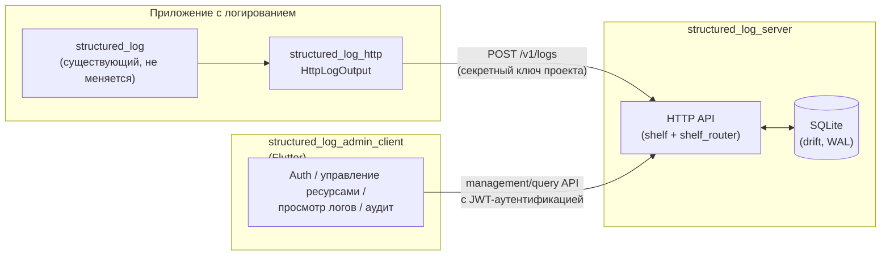
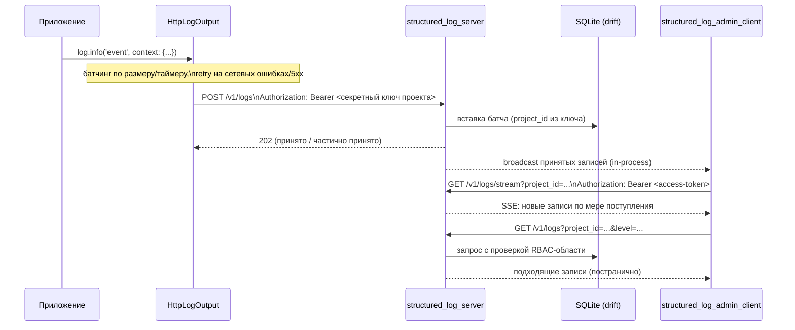

# Обзор архитектуры

*Read in [English](README.md).*

Этот документ представляет три пакета, спроектированных в
[add-structured-log-server](../../openspec/changes/add-structured-log-server/),
то, как они соотносятся друг с другом, и принципы, повторяющиеся во всём
их дизайне. Обоснование конкретного решения — в
[design.md](../../openspec/changes/add-structured-log-server/design.md)
— этот документ ссылается на номера decision (`decision N`), чтобы можно
было сразу перейти к нужному абзацу там.

## Компоненты

- **`structured_log_server`** (`backend/`) — сервис. Self-hosted Dart
  HTTP-процесс, принимающий батчи логов, сохраняющий их и отдающий
  query/management/live-stream API. Разбивка по темам —
  [data-model.md](data-model.md), [auth.md](auth.md),
  [rbac-and-lifecycle.md](rbac-and-lifecycle.md),
  [live-streaming.md](live-streaming.md) и
  [quotas-and-audit.md](quotas-and-audit.md).
- **`structured_log_http`** (`emb/`) — тонкий клиентский пакет. Его
  единственная зависимость — `structured_log` (decision 5); добавляет
  `HttpLogOutput` — `OutputFunction`, батчирующий и отправляющий записи
  лога на сервер через `POST /v1/logs`, аутентифицируясь секретным
  ключом проекта. Любое приложение, уже использующее `structured_log`,
  подключает этот output в `LogSink` — больше ничего в `structured_log`
  не меняется.
- **`structured_log_admin_client`** (`frontend/`) — самостоятельное
  Flutter-приложение, человеко-ориентированный UI над *всем* контрактом
  сервера: аутентификация, управление ресурсами
  (пользователи/группы/команды/проекты/ключи/роли), просмотрщик логов с
  живой доставкой и аудит-лог. См. [admin-client.md](admin-client.md).

Ни один из трёх пакетов не делит Dart-код с другими, кроме самого
`structured_log` — `structured_log_server` и `structured_log_admin_client`
общаются только по задокументированному HTTP/JSON-контракту (decision
19), а `structured_log_http` знает только wire-формат `POST /v1/logs`, не
внутренности сервера.

## Зачем вообще сервер

До этой доработки `structured_log` умел писать только в локальные
назначения (консоль, файл, ротация файла). Не было способа собрать логи
с нескольких запущенных инстансов приложения — или нескольких
приложений — в одном месте для централизованного поиска и фильтрации.
`structured_log_server` закрывает этот пробел как self-hosted
альтернатива SaaS-платформе логов или тяжёлому стеку вроде ELK, в той же
экосистеме Dart, что и остальной воркспейс. Полное обоснование — в
разделе `## Why` `proposal.md`.

## Поток запроса целиком

## Принципы, повторяющиеся во всём дизайне

Они не специфичны для одной capability — встречаются раз за разом в
`design.md`, и их стоит держать в голове перед чтением тематических
документов.

- **Никакой магии, никакого codegen в четырёх исходных встраиваемых
  библиотеках; осознанно расширенное исключение для двух новых
  пакетов.** У воркспейса уже есть устоявшийся принцип «никакой магии»
  (`add-structured-log-flutter/design.md`, decision 4); выбор
  `shelf`/`shelf_router` вместо `dart_frog` следует ему (decision 1).
  `drift` (и, следовательно, `build_runner`) был первым санкционированным
  исключением, ограниченным storage-слоем `structured_log_server`,
  принятым по прямому указанию пользователя (decision 2). Decisions
  34/37 расширяют то же исключение — по-прежнему по прямому указанию
  пользователя, по-прежнему ограниченное этими двумя новыми пакетами —
  на `freezed`/`json_serializable` в обоих (`structured_log_server` и
  `structured_log_admin_client`), и на `retrofit_generator` — только в
  клиенте. `structured_log`, `structured_log_flutter`,
  `structured_log_material`, `structured_log_fluent` и
  `structured_log_http` остаются без codegen — ничто из этого не
  прецедент для них. Полный стек —
  [technology-stack.md](technology-stack.ru.md).
- **Один isolate, никакого преждевременного масштабирования.** Один
  `QueryExecutor` `NativeDatabase` в одном isolate (decision 4) лежит в
  основе многого: именно поэтому broadcast живого потока может быть
  in-process `StreamController`, а не внешним pub/sub (decision 29), и
  именно поэтому кросс-isolate масштабирование — явный non-goal, а не
  недоделанная функция.
- **Явная область видимости, никогда неявное объединение.** Каждый
  запрос (`GET /v1/logs`, `GET /v1/logs/stream`, management-эндпоинты)
  требует явный `project_id` или `group_id` (decision 8) — сервер
  никогда молча не объединяет «всё, что видно вызывающему». Тот же
  инстинкт — в `role_assignments`: права резолвятся из явной,
  аудируемой таблицы, никогда не выводятся косвенно.
- **Немедленный отзыв — требование первого класса, а не приятный
  бонус.** Блокировка пользователя, удаление аккаунта или смена роли
  должны действовать *сейчас*, а не «когда истечёт access-токен». Именно
  для этого существует `token_version` (decision 10), и именно поэтому
  эндпоинт живого потока ревалидирует его на каждом heartbeat, а не
  доверяет токену на весь срок жизни соединения (decision 29) — долгоживущее
  соединение — как раз то место, где эта гарантия иначе могла бы
  незаметно протечь.
- **Обратимые и необратимые действия — разные операции, а не флаг на
  одной и той же.** Блокировка (`is_active`, обратима через `unblock`) и
  удаление (`deleted_at`, необратимо) переиспользуют один и тот же
  механизм отзыва прав, но намеренно остаются разными эндпоинтами с
  разной авторизацией (decisions 25, 27) — см.
  [rbac-and-lifecycle.md](rbac-and-lifecycle.md).
- **Интерфейсы — на границе, а не спекулятивная абстракция везде.**
  `IdentityProvider` (decision 17) и `EmailSender` (decision 24)
  существуют, потому что конкретная вторая реализация (Keycloak,
  транзакционный email API) — названная, правдоподобная будущая
  потребность. Больше ничего в дизайне не абстрагировано «на всякий
  случай» — см., например, явный отказ decision 21 от общей абстракции
  источника данных `LogViewerController` до появления второго
  потребителя.
- **Организация по фиче, не по техническому типу файла.** Код обоих
  новых пакетов группируется в первую очередь по предметной фиче
  (`auth`, `users`, `projects`, `logs`, ...), не по сквозному на весь
  воркспейс разделению `routes/`/`services/`/`models/` (decision 32) —
  слои внутри каждой фичи (более простые на сервере, полный Clean
  Architecture в клиенте, потому что только у клиента есть
  presentation-слой, который стоит отделять от доменной логики) — см.
  [technology-stack.md](technology-stack.ru.md#паттерн-архитектуры).
- **Ожидаемые исходы типизированы, а не выбрасываются.** Возвращаемый
  тип `Either` из `fpdart` используется именно для исходов, которые
  вызывающий обязан обработать как часть контракта — ошибки валидации,
  отказы RBAC, лимиты квоты, `invalid_grant` — не как повсеместная
  замена исключений, которые по-прежнему сигнализируют о настоящих
  багах (decision 33).

## Где живёт каждый пакет

Воркспейс реструктурируется в `emb/` (встраиваемые библиотеки),
`backend/`, `frontend/` и `packages/` (зарезервировано, сейчас пусто) —
см. decision 23. На момент написания эта реструктуризация, как и сами
три пакета, существуют только как OpenSpec change; ни один из путей выше
ещё не создан на диске. Раздел 1 `tasks.md` покрывает `git mv` и
скаффолдинг.
