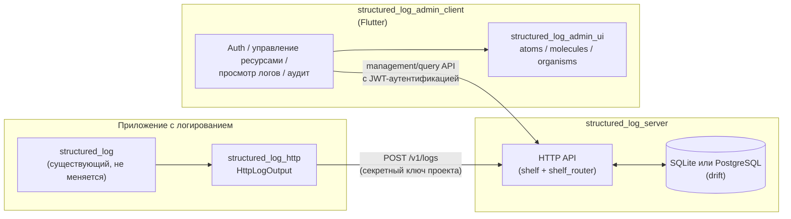
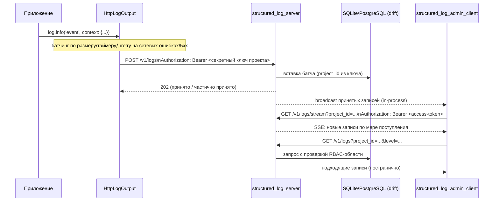
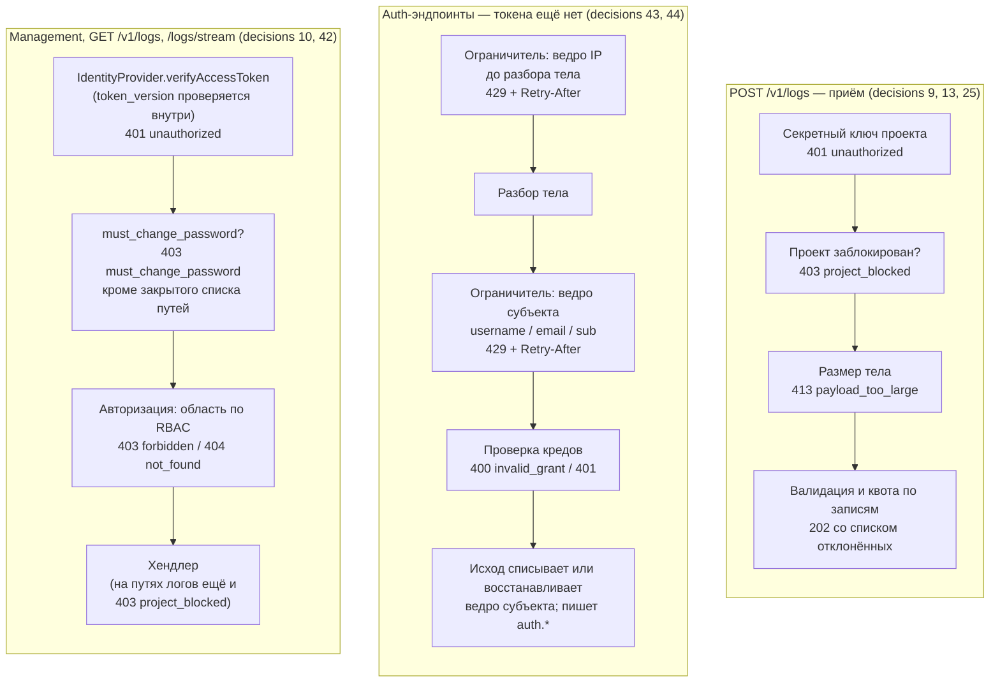

# Обзор архитектуры

*Read in [English](README.md).*

Этот документ представляет четыре пакета, спроектированных в
[add-structured-log-server](../../openspec/changes/add-structured-log-server/),
то, как они соотносятся друг с другом, и принципы, повторяющиеся во всём
их дизайне. Обоснование конкретного решения — в
[design.md](../../openspec/changes/add-structured-log-server/design.md)
— этот документ ссылается на номера decision (`decision N`), чтобы можно
было сразу перейти к нужному абзацу там.

## Компоненты

- **`structured_log_server`** (`backend/`) — сервис. Self-hosted Dart
  HTTP-процесс, принимающий батчи логов, сохраняющий их и отдающий
  query/management/live-stream API. Разбивка по темам —
  [data-model.md](data-model.md), [auth.md](auth.md),
  [rbac-and-lifecycle.md](rbac-and-lifecycle.md),
  [live-streaming.md](live-streaming.md) и
  [quotas-and-audit.md](quotas-and-audit.md).
- **`structured_log_http`** (`emb/`) — тонкий клиентский пакет. Его
  единственная зависимость — `structured_log` (decision 5); добавляет
  `HttpLogOutput` — `OutputFunction`, батчирующий и отправляющий записи
  лога на сервер через `POST /v1/logs`, аутентифицируясь секретным
  ключом проекта. Любое приложение, уже использующее `structured_log`,
  подключает этот output в `LogSink` — больше ничего в `structured_log`
  не меняется.
- **`structured_log_admin_client`** (`frontend/`) — самостоятельное
  Flutter-приложение, человеко-ориентированный UI над *всем* контрактом
  сервера: аутентификация, управление ресурсами
  (пользователи/группы/команды/проекты/ключи/роли), просмотрщик логов с
  живой доставкой и аудит-лог. См. [admin-client.md](admin-client.md).
- **`structured_log_admin_ui`** (`frontend/`) — компонентная библиотека
  presentation-виджетов `structured_log_admin_client`, структурированная
  по Atomic Design (atoms/molecules/organisms).
  `structured_log_admin_client` зависит от неё, никогда наоборот — она
  вообще не знает ни о `Bloc`-ах, ни о репозиториях, ни о HTTP-контракте.
  См. [admin-client.md](admin-client.ru.md#библиотека-компонентов-structured_log_admin_ui).

Ни один из четырёх пакетов не делит Dart-код с другими, кроме самого
`structured_log`, за исключением `structured_log_admin_client` →
`structured_log_admin_ui` (односторонне) — `structured_log_server` и
`structured_log_admin_client` общаются только по задокументированному
HTTP/JSON-контракту (decision 19), а `structured_log_http` знает только
wire-формат `POST /v1/logs`, не внутренности сервера.

## Зачем вообще сервер

До этой доработки `structured_log` умел писать только в локальные
назначения (консоль, файл, ротация файла). Не было способа собрать логи
с нескольких запущенных инстансов приложения — или нескольких
приложений — в одном месте для централизованного поиска и фильтрации.
`structured_log_server` закрывает этот пробел как self-hosted
альтернатива SaaS-платформе логов или тяжёлому стеку вроде ELK, в той же
экосистеме Dart, что и остальной воркспейс. Полное обоснование — в
разделе `## Why` `proposal.md`.

## Поток запроса целиком

## Цепочка middleware

До сервера доходят три вида запросов, и каждый проходит свою цепочку.
Что именно отклоняет запрос и в каком порядке — осознанное решение
дизайна, а не следствие того, как сложилась проводка. Один этап
оборачивает все три и не входит ни в одну из них: когда
`--cors-allowed-origins` называет `Origin` запроса, совпавший
preflight-`OPTIONS` отвечается сразу, раньше любой цепочки ниже —
включая приём логов, — а к любому другому ответу, успешному или с
ошибкой, на выходе добавляются `Access-Control-Allow-Origin`/`Vary`
([http-api.md](../api/http-api.ru.md#межоригинные-запросы-cors-log-server-api)).
Выключено по умолчанию и не действует ни на что для `Origin`, не
попавшего в список, — поэтому три цепочки ниже можно читать так, будто
его не существует:

Три свойства этого порядка несущие:

- **Ограничитель срабатывает до обработки гранта, а не внутри неё.**
  Запрос, остановленный ограничителем, до OAuth2-хендлера не доходит —
  именно поэтому его `429` приходит в общем JSON-конверте даже на
  token-эндпоинте, единственном месте, которое в остальном отвечает
  формой RFC 6749
  ([errors.md](../api/errors.ru.md#429--единственный-ответ-token-эндпоинта-не-в-rfc-форме)).
- **`must_change_password` стоит между аутентификацией и авторизацией.**
  Это не правило RBAC — оно действует независимо от роли — и оно не
  должно зависеть от того, разрешены ли уже роли. Такое место означает
  ещё и один дешёвый point-lookup рядом с проверкой `token_version`,
  которую шаг аутентификации выполняет и так
  ([auth.md](auth.ru.md#patch-v1usersid-и-обязательный-временный-пароль)).
- **Приём логов не разделяет ничего из этого.** `POST /v1/logs`
  аутентифицируется секретным ключом проекта, а не JWT, и регулируется
  квотами, а не ограничителем: частота запросов там — нормальный трафик
  приложения, а не подбор кредов
  ([quotas-and-audit.md](quotas-and-audit.ru.md)).
- **CORS проверяется первым, раньше даже собственной проверки
  секретного ключа в цепочке приёма.** Preflight не несёт вообще
  никаких кредов — отвечать на него раньше аутентификации или
  ограничения частоты не особый случай для приёма, это то же правило,
  которому следуют и две другие цепочки
  ([http-api.md](../api/http-api.ru.md#межоригинные-запросы-cors-log-server-api)).

Каждый шаг выше настраивается только при старте и никогда в рантайме —
см. [configuration.md](../operations/configuration.ru.md).

## Принципы, повторяющиеся во всём дизайне

Они не специфичны для одной capability — встречаются раз за разом в
`design.md`, и их стоит держать в голове перед чтением тематических
документов.

- **Никакой магии, никакого codegen в четырёх исходных встраиваемых
  библиотеках; осознанно расширенное исключение для двух новых
  пакетов.** У воркспейса уже есть устоявшийся принцип «никакой магии»
  (`add-structured-log-flutter/design.md`, decision 4); выбор
  `shelf`/`shelf_router` вместо `dart_frog` следует ему (decision 1).
  `drift` (и, следовательно, `build_runner`) был первым санкционированным
  исключением, ограниченным storage-слоем `structured_log_server`,
  принятым по прямому указанию пользователя (decision 2). Decisions
  34/37 расширяют то же исключение — по-прежнему по прямому указанию
  пользователя, по-прежнему ограниченное этими двумя новыми пакетами —
  на `freezed`/`json_serializable` в обоих (`structured_log_server` и
  `structured_log_admin_client`), и на `retrofit_generator` — только в
  клиенте. `structured_log`, `structured_log_flutter`,
  `structured_log_material`, `structured_log_fluent`,
  `structured_log_cupertino` и `structured_log_http` остаются без
  codegen — ничто из этого не
  прецедент для них. Полный стек —
  [technology-stack.md](technology-stack.ru.md).
- **Один процесс, никакого преждевременного масштабирования — но больше не одно соединение.**
  Всё по-прежнему работает в одном процессе, и кросс-isolate *обработка запросов* —
  по-прежнему явный non-goal, а не недоделанная функция. Что изменилось: чтения
  раньше делили одно соединение с записью и стояли в очереди за тем, что в этот
  момент коммитил приём пачками; теперь пул дополнительных isolate-читателей
  (`--db-read-pool-size`) обслуживает их рядом с единственным писателем, что WAL
  позволяет без дополнительной синхронизации ([technology-stack.md](technology-stack.ru.md)).
  Это не пересекается с тем, почему broadcast живого потока может оставаться
  in-process `StreamController`, а не внешним pub/sub (decision 29): каждая
  принятая вставка по-прежнему проходит через единственного писателя, в одном
  процессе, что бы ни читалось рядом.
- **Явная область видимости, никогда неявное объединение.** Каждый
  запрос (`GET /v1/logs`, `GET /v1/logs/stream`, management-эндпоинты)
  требует явный `project_id` или `group_id` (decision 8) — сервер
  никогда молча не объединяет «всё, что видно вызывающему». Тот же
  инстинкт — в `role_assignments`: права резолвятся из явной,
  аудируемой таблицы, никогда не выводятся косвенно.
- **Немедленный отзыв — требование первого класса, а не приятный
  бонус.** Блокировка пользователя, удаление аккаунта или смена роли
  должны действовать *сейчас*, а не «когда истечёт access-токен». Именно
  для этого существует `token_version` (decision 10), и именно поэтому
  эндпоинт живого потока ревалидирует его на каждом heartbeat, а не
  доверяет токену на весь срок жизни соединения (decision 29) — долгоживущее
  соединение — как раз то место, где эта гарантия иначе могла бы
  незаметно протечь.
- **Обратимые и необратимые действия — разные операции, а не флаг на
  одной и той же.** Блокировка (`is_active`, обратима через `unblock`) и
  удаление (`deleted_at`, необратимо) переиспользуют один и тот же
  механизм отзыва прав, но намеренно остаются разными эндпоинтами с
  разной авторизацией (decisions 25, 27) — см.
  [rbac-and-lifecycle.md](rbac-and-lifecycle.md).
- **Интерфейсы — на границе, а не спекулятивная абстракция везде.**
  `IdentityProvider` (decision 17) и `EmailSender` (decision 24)
  существуют, потому что конкретная вторая реализация (Keycloak,
  транзакционный email API) — названная, правдоподобная будущая
  потребность. Больше ничего в дизайне не абстрагировано «на всякий
  случай» — см., например, явный отказ decision 21 от общей абстракции
  источника данных `LogViewerController` до появления второго
  потребителя.
- **Организация по фиче, не по техническому типу файла.** Код обоих
  новых пакетов группируется в первую очередь по предметной фиче
  (`auth`, `users`, `projects`, `logs`, ...), не по сквозному на весь
  воркспейс разделению `routes/`/`services/`/`models/` (decision 32) —
  слои внутри каждой фичи (более простые на сервере, полный Clean
  Architecture в клиенте, потому что только у клиента есть
  presentation-слой, который стоит отделять от доменной логики) — см.
  [technology-stack.md](technology-stack.ru.md#паттерн-архитектуры).
- **Ожидаемые исходы типизированы, а не выбрасываются.** Возвращаемый
  тип `Either` из `fpdart` используется именно для исходов, которые
  вызывающий обязан обработать как часть контракта — ошибки валидации,
  отказы RBAC, лимиты квоты, `invalid_grant` — не как повсеместная
  замена исключений, которые по-прежнему сигнализируют о настоящих
  багах (decision 33).
- **Presentation-виджеты изолированы от бизнес-логики компилятором, не
  только соглашением.** `structured_log_admin_ui` (decision 39) не может
  импортировать `Bloc`-ы или код репозиториев даже по ошибке — граница
  проходит отдельным пакетом с односторонней зависимостью, а не
  директорией `lib/shared/widgets/`, которую технически ничто не
  мешает дотянуться до состояния приложения.

## Где живёт каждый пакет

Воркспейс организован в `emb/` (встраиваемые библиотеки), `backend/`,
`frontend/` (два пакета — `structured_log_admin_ui` и
`structured_log_admin_client`) и `packages/` (то, что не подпадает ни
под одну из трёх категорий выше — сейчас `structured_log_e2e`,
сквозные тесты по всей системе) — см. decision 23.
`structured_log_admin_ui` живёт в `frontend/`, не в `emb/`, хотя формой
и является «библиотекой»: `emb/` — конкретно для библиотек,
встраиваемых в *любое* стороннее приложение, тогда как эта — набор
компонентов конкретно под внешний вид и предметный словарь
`structured_log_admin_client` (decision 39). Все четыре пакета, о
которых этот документ рассказывает, реализованы и лежат на диске — что
именно поставлено и что, если осталось, ещё нет — см.
[AGENTS.md](../../AGENTS.md).
