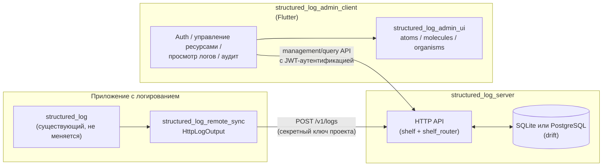
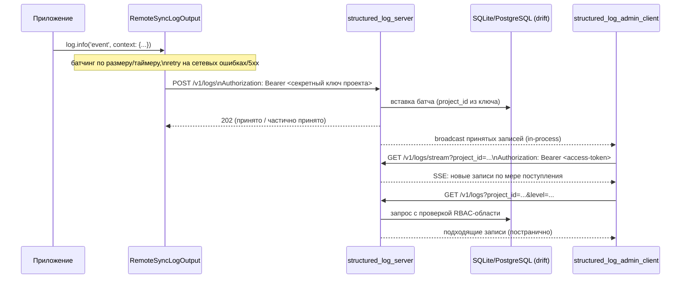
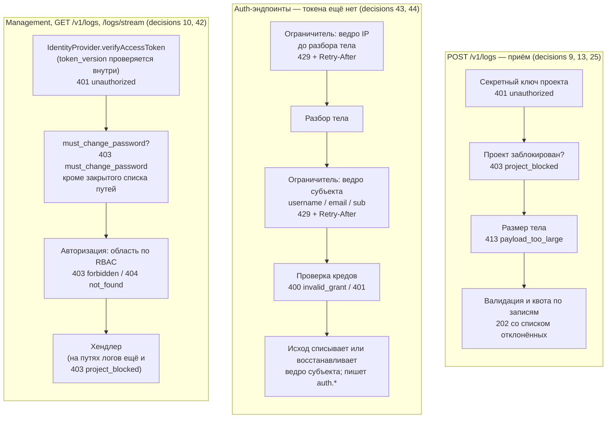

# Обзор архитектуры

*Read in [English](README.md).*

Здесь описаны четыре пакета, спроектированные в
[add-structured-log-server](../../openspec/changes/add-structured-log-server/),
то, как они соотносятся друг с другом, и принципы, которые повторяются во
всём их дизайне. Обоснование конкретного решения — в
[design.md](../../openspec/changes/add-structured-log-server/design.md)
— этот документ ссылается на номера decision (`decision N`), чтобы по
ним можно было сразу найти нужный абзац.

`structured_log_server` и его пакеты-компаньоны вместе образуют
self-hosted сервис сбора логов: приложения отправляют структурированные
записи лога на сервер по HTTP, а администраторы ищут, фильтруют и следят
за ними в реальном времени через отдельный Flutter-клиент. Ниже
перечислено, какие пакеты в этом участвуют и как они взаимодействуют
между собой.

## Зачем вообще сервер

До этой доработки `structured_log` умел писать только в локальные
назначения (консоль, файл, ротация файла). Собрать в одном месте логи
нескольких запущенных инстансов приложения — или нескольких
приложений, — чтобы искать и фильтровать их централизованно, было
нельзя. `structured_log_server` восполняет этот пробел: это self-hosted
альтернатива SaaS-платформе логов или тяжёлому стеку вроде ELK, в той же
экосистеме Dart, что и остальной воркспейс. Полное обоснование — в
разделе `## Why` `proposal.md` (там же — почему это решение, а не
готовая SaaS-платформа или ELK).

## Компоненты

```mermaid
flowchart LR
    subgraph App["Приложение с логированием"]
        SL["structured_log\n(существующий, не меняется)"]
        HTTP["structured_log_remote_sync\nHttpLogOutput"]
        SL --> HTTP
    end

    subgraph Server["structured_log_server"]
        API["HTTP API\n(shelf + shelf_router)"]
        DB[("SQLite или PostgreSQL\n(drift)")]
        API <--> DB
    end

    subgraph Admin["structured_log_admin_client\n(Flutter)"]
        UI["Auth / управление ресурсами /\nпросмотр логов / аудит"]
        KIT["structured_log_admin_ui\natoms / molecules / organisms"]
        UI --> KIT
    end

    HTTP -- "POST /v1/logs\n(секретный ключ проекта)" --> API
    UI -- "management/query API\nс JWT-аутентификацией" --> API
```

- **`structured_log_server`** (`backend/`) — сервис. Self-hosted
  HTTP-процесс на Dart: принимает батчи логов, сохраняет их и отдаёт API
  запросов, управления и живого потока (query/management/live-stream).
  Разбивка по темам — [data-model.md](data-model.md), [auth.md](auth.md),
  [rbac-and-lifecycle.md](rbac-and-lifecycle.md),
  [live-streaming.md](live-streaming.md) и
  [quotas-and-audit.md](quotas-and-audit.md).
- **`structured_log_remote_sync`** (`emb/`) — тонкий клиентский пакет. Он
  зависит только от `structured_log` (decision 5) и добавляет
  `RemoteSyncLogOutput` — `OutputFunction`, которая собирает записи лога в
  батчи и отправляет их на сервер через `POST /v1/logs`, предъявляя
  секретный ключ проекта. Приложению, которое уже пишет логи через
  `structured_log`, достаточно подключить этот output в `LogSink` — больше
  в `structured_log` ничего не меняется.
- **`structured_log_admin_client`** (`frontend/`) — самостоятельное
  Flutter-приложение, интерфейс для людей поверх *всего* контракта
  сервера: аутентификация, управление ресурсами
  (пользователи/группы/команды/проекты/ключи/роли), просмотр логов с
  живой лентой и аудит-лог. См. [admin-client.md](admin-client.md).
- **`structured_log_admin_ui`** (`frontend/`) — библиотека
  presentation-виджетов для `structured_log_admin_client`, разложенная
  по Atomic Design (atoms/molecules/organisms).
  `structured_log_admin_client` зависит от неё, но не наоборот: она
  вообще не знает ни о `Bloc`-ах, ни о репозиториях, ни о HTTP-контракте.
  См. [admin-client.md](admin-client.ru.md#библиотека-компонентов-structured_log_admin_ui).

Общего Dart-кода у четырёх пакетов нет, кроме самого `structured_log`
и односторонней связи `structured_log_admin_client` →
`structured_log_admin_ui`: `structured_log_server` и
`structured_log_admin_client` общаются только по задокументированному
HTTP/JSON-контракту (decision 19), а `structured_log_remote_sync` знает только
wire-формат `POST /v1/logs`, не внутренности сервера.

## Поток запроса целиком

```mermaid
sequenceDiagram
    participant App as Приложение
    participant HTTP as RemoteSyncLogOutput
    participant Srv as structured_log_server
    participant DB as SQLite/PostgreSQL (drift)
    participant Admin as structured_log_admin_client

    App->>HTTP: log.info('event', context: {...})
    Note over HTTP: батчинг по размеру/таймеру,\nretry на сетевых ошибках/5xx
    HTTP->>Srv: POST /v1/logs\nAuthorization: Bearer <секретный ключ проекта>
    Srv->>DB: вставка батча (project_id из ключа)
    Srv-->>HTTP: 202 (принято / частично принято)
    Srv-->>Admin: broadcast принятых записей (in-process)

    Admin->>Srv: GET /v1/logs/stream?project_id=...\nAuthorization: Bearer <access-token>
    Srv-->>Admin: SSE: новые записи по мере поступления

    Admin->>Srv: GET /v1/logs?project_id=...&level=...
    Srv->>DB: запрос с проверкой RBAC-области
    Srv-->>Admin: подходящие записи (постранично)
```

## Цепочка middleware

Цепочка middleware — это упорядоченная последовательность проверок
(аутентификация, ограничение частоты, CORS), через которую проходит
запрос, прежде чем добраться до кода, который его обрабатывает. До
сервера доходят три вида запросов, и каждый проходит свою цепочку. Что
именно отклоняет запрос и в каком порядке — осознанное решение дизайна,
а не случайный итог того, как сложилась проводка.

```mermaid
flowchart TB
    subgraph Ingest["POST /v1/logs — приём (decisions 9, 13, 25)"]
        direction TB
        I1["Секретный ключ проекта\n401 unauthorized"] --> I2["Проект заблокирован?\n403 project_blocked"]
        I2 --> I3["Размер тела\n413 payload_too_large"]
        I3 --> I4["Валидация и квота по записям\n202 со списком отклонённых"]
    end

    subgraph AuthEp["Auth-эндпоинты — токена ещё нет (decisions 43, 44)"]
        direction TB
        A1["Ограничитель: ведро IP\nдо разбора тела\n429 + Retry-After"] --> A2["Разбор тела"]
        A2 --> A3["Ограничитель: ведро субъекта\nusername / email / sub\n429 + Retry-After"]
        A3 --> A4["Проверка кредов\n400 invalid_grant / 401"]
        A4 --> A5["Исход списывает или восстанавливает\nведро субъекта; пишет auth.*"]
    end

    subgraph Jwt["Management, GET /v1/logs, /logs/stream (decisions 10, 42)"]
        direction TB
        J1["IdentityProvider.verifyAccessToken\n(token_version проверяется внутри)\n401 unauthorized"] --> J2["must_change_password?\n403 must_change_password\nкроме закрытого списка путей"]
        J2 --> J3["Авторизация: область по RBAC\n403 forbidden / 404 not_found"]
        J3 --> J4["Хендлер\n(на путях логов ещё и\n403 project_blocked)"]
    end
```

Один этап оборачивает все три и не входит ни в одну из них: когда
`Origin` запроса есть в `--cors-allowed-origins`, на такой
preflight-`OPTIONS` сервер отвечает сразу, раньше любой цепочки выше —
включая приём логов, — а к любому другому ответу, успешному или с
ошибкой, на выходе добавляются `Access-Control-Allow-Origin`/`Vary`
([http-api.md](../api/http-api.ru.md#кросс-доменные-запросы-cors-log-server-api)).
По умолчанию этап выключен, а для `Origin`, которого нет в списке, он
ни на что не влияет, — поэтому три цепочки выше можно читать так, будто
его не существует.

В этом порядке принципиальны четыре вещи:

- **Ограничитель срабатывает до обработки гранта, а не внутри неё.**
  Запрос, остановленный ограничителем, до OAuth2-хендлера не доходит —
  именно поэтому его `429` приходит в общем JSON-конверте даже на
  token-эндпоинте, единственном месте, которое в остальном отвечает
  формой RFC 6749
  ([errors.md](../api/errors.ru.md#429--единственный-ответ-token-эндпоинта-не-в-rfc-форме)).
- **`must_change_password` стоит между аутентификацией и авторизацией.**
  Это не правило RBAC: оно действует независимо от роли и не должно
  зависеть от того, разрешены ли уже роли. К тому же на этом месте
  проверка обходится одним дешёвым point-lookup рядом с проверкой
  `token_version`, которую шаг аутентификации выполняет и так
  ([auth.md](auth.ru.md#patch-v1usersid-и-обязательный-временный-пароль)).
- **Приём логов ничего из этого не касается.** `POST /v1/logs`
  аутентифицируется секретным ключом проекта, а не JWT, и регулируется
  квотами, а не ограничителем: частота запросов там — нормальный трафик
  приложения, а не подбор кредов
  ([quotas-and-audit.md](quotas-and-audit.ru.md)).
- **CORS проверяется первым, раньше даже собственной проверки
  секретного ключа в цепочке приёма.** Preflight не несёт вообще
  никаких кредов, поэтому ответ на него раньше аутентификации и
  ограничения частоты — не особый случай приёма, а то же правило, что и
  в двух других цепочках
  ([http-api.md](../api/http-api.ru.md#кросс-доменные-запросы-cors-log-server-api)).

Каждый шаг выше настраивается только при запуске, а во время работы —
никогда; см. [configuration.md](../operations/configuration.ru.md).

## Принципы, повторяющиеся во всём дизайне

Они относятся не к одной capability, а встречаются в `design.md` снова
и снова, и их стоит усвоить до чтения тематических документов.

- **Никакой магии, никакого codegen — с осознанно расширенным
  исключением для двух новых пакетов.** У воркспейса уже есть
  устоявшийся принцип «никакой магии» (`add-structured-log-flutter/design.md`,
  decision 4); выбор `shelf`/`shelf_router` вместо `dart_frog` следует
  ему (decision 1). Первым разрешённым исключением стал `drift` (а
  значит, и `build_runner`): его приняли по прямому указанию пользователя
  и ограничили storage-слоем `structured_log_server` (decision 2).
  Decisions 34/37 расширяют то же исключение — снова по прямому указанию
  пользователя и снова только для этих двух новых пакетов — на
  `freezed`/`json_serializable` в обоих (`structured_log_server` и
  `structured_log_admin_client`) и на `retrofit_generator` только в
  клиенте. Прецедентом для остального воркспейса всё это не служит — он
  остаётся без codegen:
  `structured_log`, `structured_log_flutter`, `structured_log_material`,
  `structured_log_fluent`, `structured_log_cupertino` и
  `structured_log_remote_sync`. Полный стек —
  [technology-stack.md](technology-stack.ru.md).
- **Один процесс, никакого преждевременного масштабирования — но больше не одно соединение.**
  Всё по-прежнему работает в одном процессе, и кросс-isolate *обработка запросов* —
  по-прежнему явный non-goal, а не недоделанная функция. Изменилось другое: раньше
  чтения делили с записью одно соединение и ждали в очереди, пока приём
  закоммитит очередную пачку; теперь их обслуживает пул дополнительных
  isolate-читателей (`--db-read-pool-size`) параллельно с единственным
  писателем — WAL допускает это без дополнительной синхронизации
  ([technology-stack.md](technology-stack.ru.md)). На то, почему broadcast
  живого потока может оставаться in-process `StreamController`, а не внешним
  pub/sub (decision 29), это никак не влияет: каждая принятая вставка
  по-прежнему проходит через единственного писателя в одном процессе, что бы
  ни читалось параллельно.
- **Только явная область видимости, никакого неявного объединения.** Каждый
  запрос (`GET /v1/logs`, `GET /v1/logs/stream`, management-эндпоинты)
  требует явный `project_id` или `group_id` (decision 8) — сервер
  никогда молча не объединяет «всё, что видно вызывающему». Тот же
  подход — в `role_assignments`: права берутся из явной таблицы,
  доступной для аудита, и никогда не выводятся косвенно.
- **Немедленный отзыв — полноценное требование, а не приятный
  бонус.** Блокировка пользователя, удаление аккаунта или смена роли
  должны действовать *сейчас*, а не «когда истечёт access-токен». Именно
  для этого существует `token_version` (decision 10), и именно поэтому
  эндпоинт живого потока ревалидирует его на каждом heartbeat, а не
  доверяет токену на весь срок жизни соединения (decision 29) : долгоживущее
  соединение — как раз то место, где без этого гарантия могла бы
  незаметно перестать действовать.
- **Обратимые и необратимые действия — разные операции, а не флаг на
  одной и той же.** Блокировка (`is_active`, обратима через `unblock`) и
  удаление (`deleted_at`, необратимо) переиспользуют один и тот же
  механизм отзыва прав, но намеренно остаются разными эндпоинтами с
  разной авторизацией (decisions 25, 27) — см.
  [rbac-and-lifecycle.md](rbac-and-lifecycle.md).
- **Интерфейсы — только на границах, а не абстракции «впрок» повсюду.**
  `IdentityProvider` (decision 17) и `EmailSender` (decision 24)
  существуют потому, что у каждого есть конкретная вторая реализация
  (Keycloak, транзакционный email API) — названная и правдоподобная
  будущая потребность. Больше ничего в дизайне не абстрагировано «на всякий
  случай» — см., например, явный отказ decision 21 от общей абстракции
  источника данных `LogViewerController` до появления второго
  потребителя.
- **Организация по фиче, не по техническому типу файла.** Код обоих
  новых пакетов группируется в первую очередь по предметной фиче
  (`auth`, `users`, `projects`, `logs`, ...), не по сквозному на весь
  воркспейс разделению `routes/`/`services/`/`models/` (decision 32), а
  слои выделяются уже внутри каждой фичи (на сервере попроще, в клиенте —
  полная Clean Architecture, потому что только у клиента есть
  presentation-слой, который стоит отделять от доменной логики); см.
  [technology-stack.md](technology-stack.ru.md#паттерн-архитектуры).
- **Ожидаемые исходы типизированы, а не выбрасываются.** Возвращаемый
  тип `Either` из `fpdart` используется именно для исходов, которые
  вызывающий обязан обработать как часть контракта — ошибки валидации,
  отказы RBAC, лимиты квоты, `invalid_grant`, — а не как повсеместная
  замена исключениям, которые по-прежнему сигнализируют о настоящих
  багах (decision 33).
- **Presentation-виджеты отделены от бизнес-логики компилятором, а не
  только соглашением.** `structured_log_admin_ui` (decision 39) не может
  импортировать `Bloc`-ы или код репозиториев даже по ошибке — граница
  проходит отдельным пакетом с односторонней зависимостью, а не
  директорией `lib/shared/widgets/`, которой технически ничто не
  мешает дотянуться до состояния приложения.

## Где лежит каждый пакет

Воркспейс организован в `emb/` (встраиваемые библиотеки), `backend/`,
`frontend/` (два пакета — `structured_log_admin_ui` и
`structured_log_admin_client`) и `packages/` (то, что не подпадает ни
под одну из трёх категорий выше — сейчас `structured_log_e2e`,
сквозные тесты по всей системе) — см. decision 23 (почему воркспейс
вообще разбили на эти категории).
`structured_log_admin_ui` живёт в `frontend/`, не в `emb/`, хотя по форме
это «библиотека»: `emb/` — конкретно для библиотек,
встраиваемых в *любое* стороннее приложение, тогда как эта — набор
компонентов конкретно под внешний вид и предметный словарь
`structured_log_admin_client` (decision 39). Все четыре пакета, о
которых рассказывает этот документ, уже реализованы; что именно в каждом
из них есть сегодня и что ещё осталось сделать (если осталось), — см.
[AGENTS.md](../../AGENTS.md).
