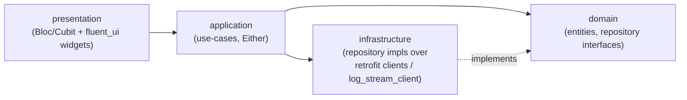
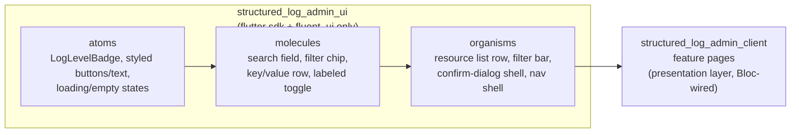
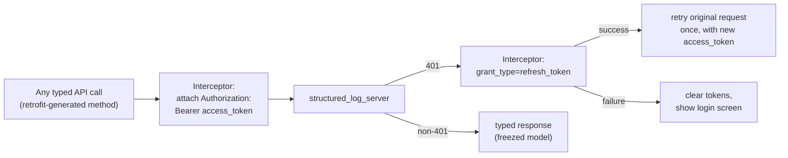
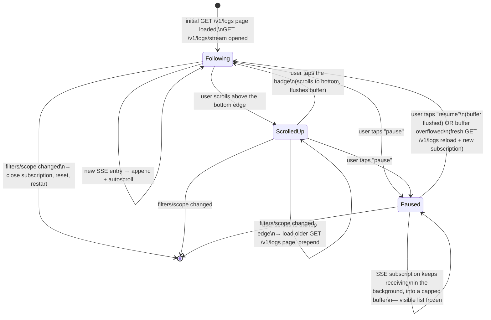

# structured_log_admin_client architecture

*Читать на [русском](admin-client.ru.md).*

Covers the Flutter app's own internal design — not the server API it
talks to (see the other documents in this directory for that). Normative
requirements:
[specs/admin-client-auth/spec.md](../../openspec/changes/add-structured-log-server/specs/admin-client-auth/spec.md),
[specs/admin-client-resource-management/spec.md](../../openspec/changes/add-structured-log-server/specs/admin-client-resource-management/spec.md),
[specs/admin-client-log-browser/spec.md](../../openspec/changes/add-structured-log-server/specs/admin-client-log-browser/spec.md),
[specs/admin-client-audit-log/spec.md](../../openspec/changes/add-structured-log-server/specs/admin-client-audit-log/spec.md).

## One app, not core + skin

The workspace's three existing viewer packages
(`structured_log_flutter`/`material`/`fluent`) split into a headless
core (`LogViewerController`/`LogBuffer`) plus design-system-specific
skins, because there was more than one skin to justify the split. That
pattern doesn't fit here (decision 18): the entire point of this app is
being *the* UI over `structured_log_server`'s specific HTTP contract —
authentication, RBAC, quotas — concepts that don't exist in the headless
log-viewing core at all, and there's no second backend contract to
abstract for. So `structured_log_admin_client` is one app, not
core+skin, until (if ever) a second UI kit for this same client is
needed. The concrete UI toolkit is `fluent_ui`, not Material 3 —
decision 38 revises that specific choice from an earlier revision of
decision 18; the "one app, no split" reasoning above is unrelated to
which toolkit and stands unchanged. This does **not** mean reusing
`structured_log_fluent`'s widgets — decision 21 (different data source,
below) still applies; the shared design system is a visual coincidence
between two packages, not shared code. Screens are pre-designed
externally (Claude Design) — implementation follows those mockups where
they exist; the pixel-level layout itself is outside this document's
(and OpenSpec's) scope.

It also shares **no Dart code** with `structured_log_server` — only the
documented HTTP/JSON contract (decision 19). A shared request/response
types package was considered and rejected: it would add a package to
buy type safety for one client, when contract drift is already caught by
integration tests that exercise the client's networking logic against a
real running server.

## Code organization: feature-first, Clean Architecture per feature

Code is grouped first by domain feature (`auth`, `users`, `projects`,
`teams`, `log_browser`, `audit`, ...), not by technical file type across
the whole package (decision 32) — see
[technology-stack.md](technology-stack.md#architecture-pattern) for the
full picture, including why the client gets the full four-layer split
(it has a real presentation layer, unlike the server) while
`structured_log_server` gets a simpler one.

- **`domain`** — entities and repository *interfaces*, no Flutter or
  `dio` imports; this is what makes `application`-layer logic testable
  without spinning up widgets or a real server.
- **`application`** — use-cases orchestrating one or more repositories,
  returning `Either<Failure, T>` (`fpdart`, decision 33) rather than
  throwing for expected outcomes (a rejected login, a `409
  sole_group_owner`, a dropped connection).
- **`infrastructure`** — concrete repository implementations, mostly
  thin wrappers over generated `retrofit` clients (decision 37) that map
  HTTP responses/`DioException`s onto domain `Failure`s.
- **`presentation`** — one `Bloc`/`Cubit` per feature (decision 36),
  consuming use-cases (wired in via `cherrypick`, decision 35) and
  exposing `freezed`-union states (decision 34) that the `fluent_ui`
  widgets render.

`cherrypick` (the same author's own DI library — already the namesake
for this workspace's `emb/` layout convention, `AGENTS.md`) registers
the shared singletons (`ApiClient`, token storage) and each feature's
`infrastructure`/`application` bindings, so no `Bloc` or widget
constructs an `infrastructure` dependency directly.

## The component library: `structured_log_admin_ui`

`presentation` in the diagram above doesn't build every widget from
scratch — it composes pre-built, presentation-only widgets from a
**separate package**, `structured_log_admin_ui` (decision 39), by
direct user requirement.

- **Why a separate package, not a `lib/shared/widgets/` folder inside
  `structured_log_admin_client` itself:** a folder is a convention —
  nothing stops a "dumb" widget file from importing a `Bloc` or a
  repository by accident, or over time as a screen gets copy-pasted from.
  A separate package makes that a compile error instead: `structured_log_admin_ui`
  depends on **only** `flutter` sdk and `fluent_ui` — not `fpdart`,
  `freezed`, `cherrypick`, `flutter_bloc`, `dio`, or `retrofit`, and it
  cannot import anything from `structured_log_admin_client` (the
  dependency points one way only).
- **Three tiers, not the classic five.** Atomic Design (Brad Frost) also
  has `templates` and `pages`, but those assemble organisms into a real
  screen with real data — which is, by definition, tied to a specific
  feature's business logic. That's exactly what this package must not
  contain, so `templates`/`pages` stay where the data and the `Bloc` are:
  each feature's own `presentation` layer inside `structured_log_admin_client`.
  Only `atoms`/`molecules`/`organisms` live in `structured_log_admin_ui`,
  and every one of them takes only primitive/enum parameters and
  callbacks (`onTap`, `onChanged`, ...) — never a domain model or a
  `Bloc` state directly. Purely presentational local state (hover,
  focus, expanded/collapsed) is fine via a plain `StatefulWidget`/
  `ValueNotifier` — not `flutter_bloc`.
- **Duplicated, not shared, log-level colors.** A `LogLevelBadge` atom
  owns its own small level→color mapping rather than importing
  `structured_log_material`'s or `structured_log_fluent`'s — decision 21
  already rules out sharing code with the viewer packages (different
  data source), and this follows the same precedent already set between
  `structured_log_material` and `structured_log_fluent` themselves,
  which deliberately duplicate that same palette between each other.
- **`example/` is a component gallery** — every atom/molecule/organism
  rendered on one screen, the same pattern as
  `structured_log_material_example`/`structured_log_fluent_example`.
  Doubles as a quick way to check the implementation against the
  external Claude Design mockups (decision 38).
- **Isn't this "abstracting before a second consumer"** (the principle
  behind decisions 18/21 elsewhere in this system)? No — that principle
  is about premature generalization for a hypothetical *second*
  consumer/backend/UI kit. Here the motivation is different and not
  speculative: separating presentation widgets from business logic
  *inside the same single app*, by direct user requirement.
  `structured_log_admin_ui`'s one and only consumer was, and remains,
  `structured_log_admin_client`.

## HTTP layer: `dio` + `retrofit`, not `package:http`

`dio`'s `Interceptor`/`InterceptorsWrapper` gives the
attach-token/catch-401/refresh/retry-once chain as a built-in primitive
(decision 19) — `package:http` doesn't have interceptor chaining and
would need the same logic hand-rolled on top of it for no real benefit.
`retrofit` sits on top of that same `dio` instance: one `@RestApi()`
interface per group of endpoints (`AuthApi`, `UsersApi`, `ProjectsApi`,
...), generated implementations that call through the interceptor chain
above, request/response bodies as `freezed`+`json_serializable` models
(decision 37). The one deliberate exception is `GET /v1/logs/stream`
(see [live-streaming.md](live-streaming.md)) — a long-lived streamed
body with hand-parsed SSE frames doesn't fit retrofit's one-call/
one-typed-response model, so `log_stream_client.dart` calls the same
`dio` instance directly with `ResponseType.stream`, reusing the same
interceptors.

The zero-dependency principle that governs `structured_log` itself
doesn't extend to this app — it's a terminal application, not a library
something else depends on transitively.

## Token storage: `flutter_secure_storage`, not `shared_preferences`

Access and refresh tokens are secrets — the refresh token especially,
since it's long-lived and directly reissues a session. `flutter_secure_storage`
wraps Keychain/Keystore/Credential Manager instead of storing plaintext
(decision 20). One-time-shown project secret keys (created through this
same client) never touch persistent storage at all — they exist only in
memory for the duration of the "here's your key, copy it now" dialog.

## The log browser: a chat-style feed over remote data

This is the one screen that intentionally does **not** reuse
`LogViewerController` (decision 21) — that controller filters an
already-in-memory `List` from a local `LogBuffer`, synchronously, with
no pagination and no network calls. The admin client's log data is
remote, server-filtered, and paginated — different enough that adapting
`LogViewerController` to both sources was rejected as complicating a
stable, already-published API for one new consumer. The state machine
below is implemented as `LogFeedBloc` (`flutter_bloc`, decision 36) —
the concrete mechanism behind decision 21's "own small state layer,"
with each state below a `freezed`-union case (decision 34).

Two independent mechanisms, easy to conflate but deliberately separate
(decision 30):

- **Scroll position** governs auto-follow implicitly — scrolling up to
  read history doesn't get yanked back down by new arrivals; a badge
  ("N new events") appears instead, and tapping it returns to the live
  edge.
- **An explicit pause/resume control**, independent of scroll position —
  modeled directly on `LogViewerController.paused`
  (`structured_log_flutter`): pausing freezes the *visible* list while
  the underlying subscription keeps receiving in the background, exactly
  like `LogBuffer.capture()` keeps capturing regardless of the
  controller's `paused` flag. The one addition beyond that precedent:
  the buffered-during-pause events are capped, and an overflow triggers
  a fresh page reload + a new subscription rather than showing a
  partially-reconstructed feed.

See [live-streaming.md](live-streaming.md) for what the SSE side of this
connection guarantees (catch-up via `since_id`, re-validation, and what
a terminal event means for the client).

## Resource management UI: hide, don't just reject

Every action a role can't perform is hidden or disabled in the UI rather
than shown-and-rejected — this is consistent everywhere (block/unblock,
delete, role grants, quota edits), but the server is always the actual
source of truth: a hidden action bypassed some other way still gets
rejected server-side (e.g. `cannot_delete_primary_admin` on a bypassed
delete of the primary administrator, or `sole_group_owner` shown as an
explained conflict rather than a generic error). See
[rbac-and-lifecycle.md](rbac-and-lifecycle.md) for what each of these
guards actually protects.
