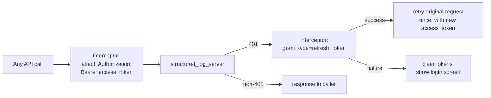
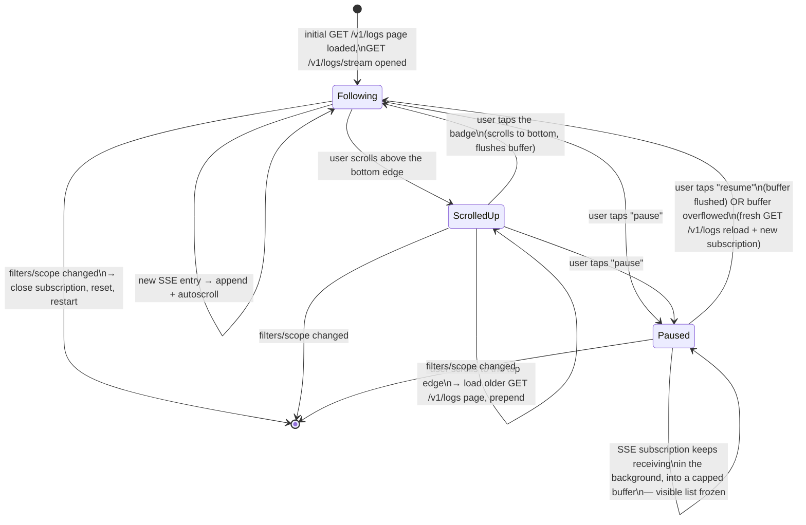

# structured_log_admin_client architecture

*Читать на [русском](admin-client.ru.md).*

Covers the Flutter app's own internal design — not the server API it
talks to (see the other documents in this directory for that). Normative
requirements:
[specs/admin-client-auth/spec.md](../../openspec/changes/add-structured-log-server/specs/admin-client-auth/spec.md),
[specs/admin-client-resource-management/spec.md](../../openspec/changes/add-structured-log-server/specs/admin-client-resource-management/spec.md),
[specs/admin-client-log-browser/spec.md](../../openspec/changes/add-structured-log-server/specs/admin-client-log-browser/spec.md),
[specs/admin-client-audit-log/spec.md](../../openspec/changes/add-structured-log-server/specs/admin-client-audit-log/spec.md).

## One app, not core + skin

The workspace's three existing viewer packages
(`structured_log_flutter`/`material`/`fluent`) split into a headless
core (`LogViewerController`/`LogBuffer`) plus design-system-specific
skins, because there was more than one skin to justify the split. That
pattern doesn't fit here (decision 18): the entire point of this app is
being *the* UI over `structured_log_server`'s specific HTTP contract —
authentication, RBAC, quotas — concepts that don't exist in the headless
log-viewing core at all, and there's no second backend contract to
abstract for. So `structured_log_admin_client` is one Material 3 app,
not core+skin, until (if ever) a second UI kit for this same client is
needed.

It also shares **no Dart code** with `structured_log_server` — only the
documented HTTP/JSON contract (decision 19). A shared request/response
types package was considered and rejected: it would add a package to
buy type safety for one client, when contract drift is already caught by
integration tests that exercise the client's networking logic against a
real running server.

## HTTP layer: `dio`, not `http`

`dio`'s `Interceptor`/`InterceptorsWrapper` gives this
attach-token/catch-401/refresh/retry-once chain as a built-in primitive
(decision 19) — `package:http` doesn't have interceptor chaining and
would need the same logic hand-rolled on top of it for no real benefit.
The zero-dependency principle that governs `structured_log` itself
doesn't extend to this app — it's a terminal application, not a library
something else depends on transitively.

## Token storage: `flutter_secure_storage`, not `shared_preferences`

Access and refresh tokens are secrets — the refresh token especially,
since it's long-lived and directly reissues a session. `flutter_secure_storage`
wraps Keychain/Keystore/Credential Manager instead of storing plaintext
(decision 20). One-time-shown project secret keys (created through this
same client) never touch persistent storage at all — they exist only in
memory for the duration of the "here's your key, copy it now" dialog.

## The log browser: a chat-style feed over remote data

This is the one screen that intentionally does **not** reuse
`LogViewerController` (decision 21) — that controller filters an
already-in-memory `List` from a local `LogBuffer`, synchronously, with
no pagination and no network calls. The admin client's log data is
remote, server-filtered, and paginated — different enough that adapting
`LogViewerController` to both sources was rejected as complicating a
stable, already-published API for one new consumer. The controller
described below is a separate, small state layer, unique to this
client.

Two independent mechanisms, easy to conflate but deliberately separate
(decision 30):

- **Scroll position** governs auto-follow implicitly — scrolling up to
  read history doesn't get yanked back down by new arrivals; a badge
  ("N new events") appears instead, and tapping it returns to the live
  edge.
- **An explicit pause/resume control**, independent of scroll position —
  modeled directly on `LogViewerController.paused`
  (`structured_log_flutter`): pausing freezes the *visible* list while
  the underlying subscription keeps receiving in the background, exactly
  like `LogBuffer.capture()` keeps capturing regardless of the
  controller's `paused` flag. The one addition beyond that precedent:
  the buffered-during-pause events are capped, and an overflow triggers
  a fresh page reload + a new subscription rather than showing a
  partially-reconstructed feed.

See [live-streaming.md](live-streaming.md) for what the SSE side of this
connection guarantees (catch-up via `since_id`, re-validation, and what
a terminal event means for the client).

## Resource management UI: hide, don't just reject

Every action a role can't perform is hidden or disabled in the UI rather
than shown-and-rejected — this is consistent everywhere (block/unblock,
delete, role grants, quota edits), but the server is always the actual
source of truth: a hidden action bypassed some other way still gets
rejected server-side (e.g. `cannot_delete_primary_admin` on a bypassed
delete of the primary administrator, or `sole_group_owner` shown as an
explained conflict rather than a generic error). See
[rbac-and-lifecycle.md](rbac-and-lifecycle.md) for what each of these
guards actually protects.
