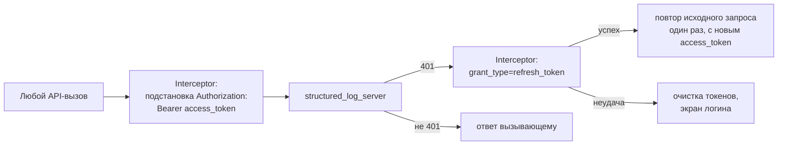
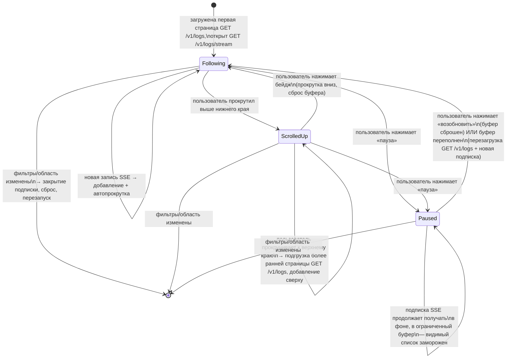

# Архитектура structured_log_admin_client

*Read in [English](admin-client.md).*

Охватывает собственный внутренний дизайн Flutter-приложения — не API
сервера, с которым оно говорит (об этом — остальные документы в этом
каталоге). Нормативные требования:
[specs/admin-client-auth/spec.md](../../openspec/changes/add-structured-log-server/specs/admin-client-auth/spec.md),
[specs/admin-client-resource-management/spec.md](../../openspec/changes/add-structured-log-server/specs/admin-client-resource-management/spec.md),
[specs/admin-client-log-browser/spec.md](../../openspec/changes/add-structured-log-server/specs/admin-client-log-browser/spec.md),
[specs/admin-client-audit-log/spec.md](../../openspec/changes/add-structured-log-server/specs/admin-client-audit-log/spec.md).

## Одно приложение, не core + скин

Три существующих в воркспейсе viewer-пакета
(`structured_log_flutter`/`material`/`fluent`) разделены на headless
core (`LogViewerController`/`LogBuffer`) + скины под конкретную
дизайн-систему, потому что скинов больше одного, что и оправдывает
разделение. Этот паттерн сюда не подходит (decision 18): весь смысл
этого приложения — быть *тем самым* UI над конкретным HTTP-контрактом
`structured_log_server` — аутентификацией, RBAC, квотами — понятиями,
которых вовсе не существует в headless-ядре просмотра логов, и нет
второго backend-контракта, под который стоило бы абстрагироваться.
Поэтому `structured_log_admin_client` — одно Material 3 приложение, не
core+скин, пока (если вообще когда-либо) не понадобится второй UI-кит
для этого же клиента.

Оно также не делит **никакого Dart-кода** с `structured_log_server` —
только задокументированный HTTP/JSON-контракт (decision 19). Общий пакет
типов запроса/ответа рассматривался и был отклонён: добавил бы пакет
ради типобезопасности одного клиента, тогда как рассинхрон контракта уже
ловится интеграционными тестами, гоняющими сетевую логику клиента против
реального запущенного сервера.

## HTTP-слой: `dio`, не `http`

`Interceptor`/`InterceptorsWrapper` `dio` даёт эту цепочку
подстановка-токена/перехват-401/refresh/повтор-один-раз как штатный
примитив (decision 19) — у `package:http` нет цепочки interceptor'ов, и
ту же логику пришлось бы писать вручную поверх него без реальной выгоды.
Принцип нулевых зависимостей, которым руководствуется сам
`structured_log`, на это приложение не распространяется — это конечное
приложение, не библиотека, от которой транзитивно зависит что-то ещё.

## Хранение токенов: `flutter_secure_storage`, не `shared_preferences`

Access- и refresh-токены — секреты, особенно refresh-токен, поскольку он
долгоживущий и напрямую переоформляет сессию. `flutter_secure_storage`
оборачивает Keychain/Keystore/Credential Manager вместо хранения
plaintext (decision 20). Одноразово показываемые секретные ключи
проектов (создаваемые через этот же клиент) вообще не попадают в
постоянное хранилище — существуют только в памяти на время диалога
«вот ваш ключ, скопируйте сейчас».

## Просмотрщик логов: лента в стиле чата поверх удалённых данных

Это единственный экран, намеренно **не** переиспользующий
`LogViewerController` (decision 21) — тот контроллер фильтрует уже
находящийся в памяти `List` из локального `LogBuffer`, синхронно, без
пагинации и без сетевых вызовов. Данные логов admin-клиента —
удалённые, фильтруются сервером и постранично подгружаются — достаточно
иначе, чтобы подгонка `LogViewerController` под оба источника была
отклонена как усложнение стабильного, уже опубликованного API ради
одного нового потребителя. Контроллер, описанный ниже, — отдельный,
небольшой слой состояния, уникальный для этого клиента.

Два независимых механизма, легко смешать, но намеренно раздельны
(decision 30):

- **Позиция прокрутки** неявно управляет автослежением — прокрутка вверх
  для чтения истории не выталкивается обратно вниз новыми поступлениями;
  вместо этого появляется бейдж («N новых событий»), и нажатие на него
  возвращает к живому краю.
- **Явное действие «пауза»/«возобновить»**, независимое от позиции
  прокрутки — смоделировано прямо по образцу
  `LogViewerController.paused` (`structured_log_flutter`): пауза
  замораживает *видимый* список, пока подписка продолжает получать в
  фоне, точно как `LogBuffer.capture()` продолжает захват независимо от
  флага `paused` контроллера. Единственное дополнение сверх этого
  прецедента: события, буферизуемые во время паузы, ограничены по
  размеру, и переполнение приводит к перезагрузке страницы + новой
  подписке, а не к показу частично восстановленной ленты.

Что именно гарантирует SSE-сторона этого соединения (catch-up через
`since_id`, ревалидация, что означает терминальное событие для клиента)
— см. [live-streaming.md](live-streaming.ru.md).

## UI управления ресурсами: скрывать, а не только отклонять

Любое действие, недоступное текущей роли, в UI скрыто или неактивно, а
не показано-и-отклонено — это последовательно везде (блокировка,
удаление, выдача ролей, редактирование квот), но реальный источник
истины — всегда сервер: скрытое действие, вызванное в обход UI, всё
равно отклоняется на сервере (например, `cannot_delete_primary_admin`
на обойдённом удалении основного администратора, или `sole_group_owner`,
показанный как объяснённый конфликт, а не обобщённая ошибка). Что именно
защищает каждая из этих проверок — см.
[rbac-and-lifecycle.md](rbac-and-lifecycle.ru.md).
