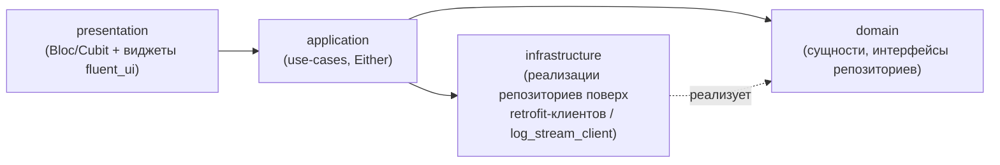
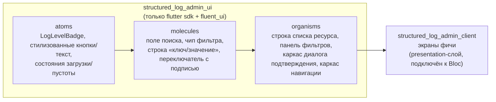
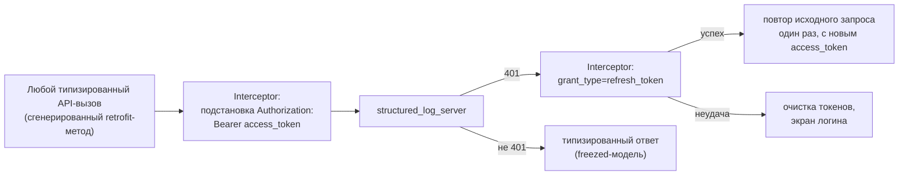
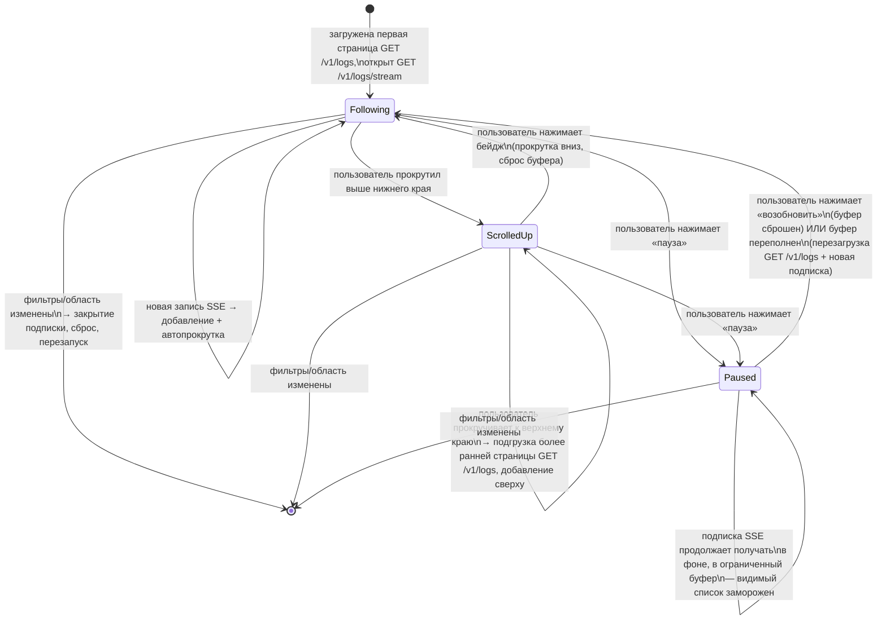

# Архитектура structured_log_admin_client

*Read in [English](admin-client.md).*

Охватывает собственный внутренний дизайн Flutter-приложения — не API
сервера, с которым оно говорит (об этом — остальные документы в этом
каталоге). Нормативные требования:
[specs/admin-client-auth/spec.md](../../openspec/changes/add-structured-log-server/specs/admin-client-auth/spec.md),
[specs/admin-client-resource-management/spec.md](../../openspec/changes/add-structured-log-server/specs/admin-client-resource-management/spec.md),
[specs/admin-client-log-browser/spec.md](../../openspec/changes/add-structured-log-server/specs/admin-client-log-browser/spec.md),
[specs/admin-client-audit-log/spec.md](../../openspec/changes/add-structured-log-server/specs/admin-client-audit-log/spec.md).

## Одно приложение, не core + скин

Воркспейс шире, чем этот клиент, и отдельно от него поставляет три
пакета виджетов для *просмотра* логов во Flutter-приложениях
(`structured_log_flutter`/`material`/`fluent`, к этому admin-клиенту
отношения не имеющих). Они разделены на headless core
(`LogViewerController`/`LogBuffer`) + скины под конкретную
дизайн-систему, потому что скинов больше одного, что и оправдывает
разделение. Этот паттерн сюда не подходит (decision 18): весь смысл
этого приложения — быть *тем самым* UI над конкретным HTTP-контрактом
`structured_log_server` — аутентификацией, RBAC, квотами — понятиями,
которых вовсе не существует в headless-ядре просмотра логов, и нет
второго backend-контракта, под который стоило бы абстрагироваться.
Поэтому `structured_log_admin_client` — одно приложение, не core+скин,
пока (если вообще когда-либо) не понадобится второй UI-кит для этого же
клиента. Конкретный UI-тулкит — `fluent_ui`, не Material 3 — decision
38 пересматривает именно этот выбор из более ранней ревизии decision
18; обоснование «одно приложение, без разделения» выше от выбора кита
не зависит и остаётся неизменным. Это **не** означает переиспользование
виджетов `structured_log_fluent` — decision 21 (другой источник данных,
ниже) по-прежнему применяется; общая дизайн-система — визуальное
совпадение между двумя пакетами, не общий код. Экраны уже отрисованы
отдельно (Claude Design) — реализация следует этим макетам там, где они
существуют; сама пиксельная раскладка — вне рамок этого документа (и
OpenSpec).

Оно также не делит **никакого Dart-кода** с `structured_log_server` —
только задокументированный HTTP/JSON-контракт (decision 19). Общий пакет
типов запроса/ответа рассматривался и был отклонён: добавил бы пакет
ради типобезопасности одного клиента, тогда как рассинхрон контракта уже
ловится интеграционными тестами, гоняющими сетевую логику клиента против
реального запущенного сервера.

## Организация кода: feature-first, Clean Architecture на фичу

Код группируется в первую очередь по предметной фиче (`auth`, `users`,
`projects`, `teams`, `log_browser`, `audit`, ...), не по техническому
типу файла на весь пакет (decision 32) — полную картину, включая почему
у клиента полное четырёхслойное деление (у него есть настоящий
presentation-слой, в отличие от сервера), а у `structured_log_server` —
более простое, см.
[technology-stack.md](technology-stack.ru.md#паттерн-архитектуры).

- **`domain`** — сущности и *интерфейсы* репозиториев, без импортов
  Flutter или `dio`; именно это делает логику `application`-слоя
  тестируемой без поднятия виджетов или реального сервера.
- **`application`** — use-cases, оркеструющие один или несколько
  репозиториев, возвращающие `Either<Failure, T>` (`fpdart`, decision
  33), а не выбрасывающие для ожидаемых исходов (отклонённый логин, 409
  `sole_group_owner`, оборванное соединение).
- **`infrastructure`** — конкретные реализации репозиториев, в основном
  тонкие обёртки над сгенерированными `retrofit`-клиентами (decision
  37), мапящие HTTP-ответы/`DioException` в доменные `Failure`.
- **`presentation`** — один `Bloc`/`Cubit` на фичу (decision 36),
  потребляющий use-cases (подключённые через `cherrypick`, decision 35)
  и отдающий `freezed`-объединённые состояния (decision 34), которые
  рендерят виджеты `fluent_ui`.

`cherrypick` (собственная DI-библиотека того же автора — уже давшая
название конвенции раскладки `emb/` этого воркспейса, `AGENTS.md`)
регистрирует общие singleton-зависимости (`ApiClient`, хранилище
токенов) и `infrastructure`/`application`-обвязку каждой фичи, так что
ни один `Bloc` или виджет не создаёт `infrastructure`-зависимость
напрямую.

## Библиотека компонентов: `structured_log_admin_ui`

`presentation` на диаграмме выше не собирает каждый виджет с нуля — он
компонует заранее готовые, чисто презентационные виджеты из
**отдельного пакета**, `structured_log_admin_ui` (decision 39), по
прямому требованию пользователя.

- **Почему отдельный пакет, а не папка `lib/shared/widgets/` внутри
  самого `structured_log_admin_client`:** папка — это соглашение,
  ничто не мешает «глупому» файлу виджета случайно импортировать
  `Bloc` или репозиторий — сразу или со временем, когда экран
  копипастят из другого. Отдельный пакет превращает это в ошибку
  компиляции: `structured_log_admin_ui` зависит **только** от `flutter`
  sdk и `fluent_ui` — не от `fpdart`, `freezed`, `cherrypick`,
  `flutter_bloc`, `dio` или `retrofit`, и не может импортировать ничего
  из `structured_log_admin_client` (зависимость направлена только в
  одну сторону).
- **Три уровня, не классические пять.** Atomic Design (Brad Frost) также
  включает `templates` и `pages`, но они собирают organisms в реальный
  экран с реальными данными — то есть по определению завязаны на
  бизнес-логику конкретной фичи. Именно этого в этом пакете быть не
  должно, поэтому `templates`/`pages` остаются там, где данные и
  `Bloc`: в собственном `presentation`-слое каждой фичи внутри
  `structured_log_admin_client`. Только `atoms`/`molecules`/`organisms`
  живут в `structured_log_admin_ui`, и каждый из них принимает только
  примитивные/enum-параметры и колбэки (`onTap`, `onChanged`, ...) —
  никогда доменную модель или состояние `Bloc` напрямую. Чисто
  презентационное локальное состояние (hover, фокус,
  раскрыт/свёрнут) — нормально через обычный
  `StatefulWidget`/`ValueNotifier` — не через `flutter_bloc`.
- **Дублированные, не общие цвета уровня лога.** Атом `LogLevelBadge`
  владеет собственным маленьким мэппингом уровень→цвет, не импортирует
  его из `structured_log_material` или `structured_log_fluent` —
  decision 21 уже исключает деление кода с viewer-пакетами (другой
  источник данных), и это следует тому же прецеденту, что уже
  установлен между самими `structured_log_material` и
  `structured_log_fluent`, намеренно дублирующими одну и ту же палитру
  между собой.
- **`example/` — галерея компонентов** — каждый atom/molecule/organism,
  отрендеренный на одном экране, тот же паттерн, что
  `structured_log_material_example`/`structured_log_fluent_example`.
  Заодно — быстрый способ сверить реализацию с внешними макетами Claude
  Design (decision 38).
- **Не «абстракция раньше второго потребителя»** (принцип, стоящий за
  decisions 18/21 в других местах этой системы)? Нет — тот принцип про
  преждевременное обобщение ради гипотетического *второго*
  потребителя/backend'а/UI-кита. Здесь мотивация другая и не
  гипотетическая: разделение presentation-виджетов и бизнес-логики
  *внутри одного и того же* приложения, по прямому требованию
  пользователя. Единственный потребитель `structured_log_admin_ui` как
  был, так и остаётся `structured_log_admin_client`.

## HTTP-слой: `dio` + `retrofit`, не `package:http`

`Interceptor`/`InterceptorsWrapper` `dio` даёт цепочку
подстановка-токена/перехват-401/refresh/повтор-один-раз как штатный
примитив (decision 19) — у `package:http` нет цепочки interceptor'ов, и
ту же логику пришлось бы писать вручную поверх него без реальной выгоды.
`retrofit` работает поверх того же инстанса `dio`: один интерфейс
`@RestApi()` на группу эндпоинтов (`AuthApi`, `UsersApi`,
`ProjectsApi`, ...), сгенерированные реализации, вызывающие ту же
цепочку interceptor'ов, тела запроса/ответа — модели `freezed`+`json_serializable`
(decision 37). Единственное осознанное исключение — `GET
/v1/logs/stream` (см. [live-streaming.md](live-streaming.ru.md)) —
долгоживущее потоковое тело с собственным разбором SSE-кадров не
укладывается в модель retrofit «один вызов → один типизированный
ответ», так что `log_stream_client.dart` вызывает тот же инстанс `dio`
напрямую с `ResponseType.stream`, переиспользуя те же interceptor'ы.

Принцип нулевых зависимостей, которым руководствуется сам
`structured_log`, на это приложение не распространяется — это конечное
приложение, не библиотека, от которой транзитивно зависит что-то ещё.

## Хранение токенов: `flutter_secure_storage`, не `shared_preferences`

Access- и refresh-токены — секреты, особенно refresh-токен, поскольку он
долгоживущий и напрямую переоформляет сессию. `flutter_secure_storage`
оборачивает Keychain/Keystore/Credential Manager вместо хранения
plaintext (decision 20). Одноразово показываемые секретные ключи
проектов (создаваемые через этот же клиент) вообще не попадают в
постоянное хранилище — существуют только в памяти на время диалога
«вот ваш ключ, скопируйте сейчас».

## Просмотрщик логов: лента в стиле чата поверх удалённых данных

Это единственный экран, намеренно **не** переиспользующий
`LogViewerController` (decision 21) — тот контроллер фильтрует уже
находящийся в памяти `List` из локального `LogBuffer`, синхронно, без
пагинации и без сетевых вызовов. Данные логов admin-клиента —
удалённые, фильтруются сервером и постранично подгружаются — достаточно
иначе, чтобы подгонка `LogViewerController` под оба источника была
отклонена как усложнение стабильного, уже опубликованного API ради
одного нового потребителя. Автомат состояний ниже реализован как
`LogFeedBloc` (`flutter_bloc`, decision 36) — конкретный механизм за
«собственным маленьким слоем состояния» decision 21, каждое состояние
ниже — вариант `freezed`-объединения (decision 34).

Два независимых механизма, легко смешать, но намеренно раздельны
(decision 30):

- **Позиция прокрутки** неявно управляет автослежением — прокрутка вверх
  для чтения истории не выталкивается обратно вниз новыми поступлениями;
  вместо этого появляется бейдж («N новых событий»), и нажатие на него
  возвращает к живому краю.
- **Явное действие «пауза»/«возобновить»**, независимое от позиции
  прокрутки — смоделировано прямо по образцу
  `LogViewerController.paused` (`structured_log_flutter`): пауза
  замораживает *видимый* список, пока подписка продолжает получать в
  фоне, точно как `LogBuffer.capture()` продолжает захват независимо от
  флага `paused` контроллера. Единственное дополнение сверх этого
  прецедента: события, буферизуемые во время паузы, ограничены по
  размеру, и переполнение приводит к перезагрузке страницы + новой
  подписке, а не к показу частично восстановленной ленты.

Что именно гарантирует SSE-сторона этого соединения (catch-up через
`since_id`, ревалидация, что означает терминальное событие для клиента)
— см. [live-streaming.md](live-streaming.ru.md).

## UI управления ресурсами: скрывать, а не только отклонять

Любое действие, недоступное текущей роли, в UI скрыто или неактивно, а
не показано-и-отклонено — это последовательно везде (блокировка,
удаление, выдача ролей, редактирование квот), но реальный источник
истины — всегда сервер: скрытое действие, вызванное в обход UI, всё
равно отклоняется на сервере (например, `cannot_delete_primary_admin`
на обойдённом удалении основного администратора, или `sole_group_owner`,
показанный как объяснённый конфликт, а не обобщённая ошибка). Что именно
защищает каждая из этих проверок — см.
[rbac-and-lifecycle.md](rbac-and-lifecycle.ru.md).
