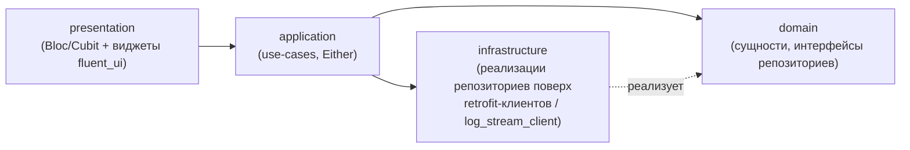
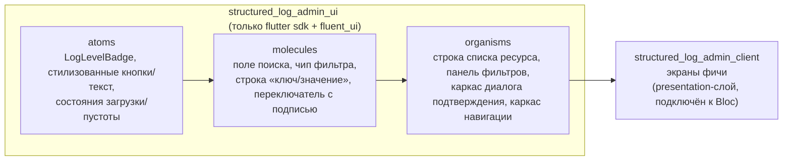
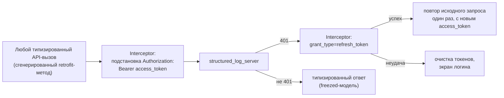
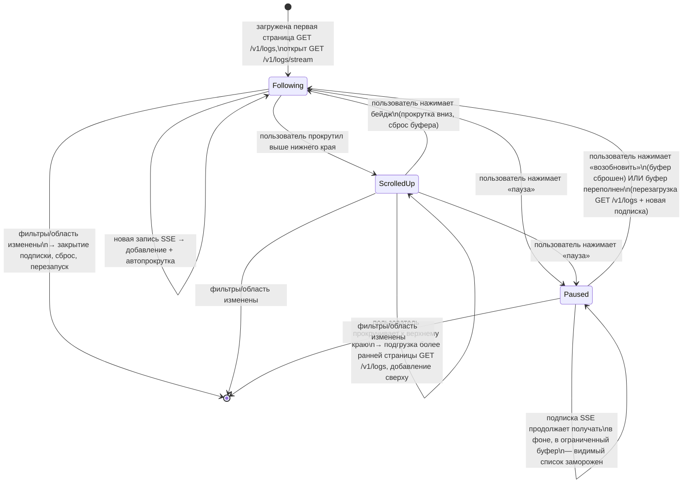

# Архитектура structured_log_admin_client

*Read in [English](admin-client.md).*

Здесь описан внутренний дизайн самого Flutter-приложения, а не API
сервера, с которым оно работает (об этом — остальные документы в этом
каталоге). Нормативные требования:
[specs/admin-client-auth/spec.md](../../openspec/changes/add-structured-log-server/specs/admin-client-auth/spec.md),
[specs/admin-client-resource-management/spec.md](../../openspec/changes/add-structured-log-server/specs/admin-client-resource-management/spec.md),
[specs/admin-client-log-browser/spec.md](../../openspec/changes/add-structured-log-server/specs/admin-client-log-browser/spec.md),
[specs/admin-client-audit-log/spec.md](../../openspec/changes/add-structured-log-server/specs/admin-client-audit-log/spec.md).

## Одно приложение, а не ядро со скином

Воркспейс не ограничивается этим клиентом: отдельно от него в нём есть
ещё три пакета виджетов для *просмотра* логов во Flutter-приложениях
(`structured_log_flutter`/`material`/`fluent` — к этому admin-клиенту
отношения не имеют). Они разделены на headless-ядро
(`LogViewerController`/`LogBuffer`) и скины под конкретную
дизайн-систему — разделение оправдано тем, что скинов там больше
одного. Этот паттерн сюда не подходит (decision 18): весь смысл
этого приложения в том, чтобы быть интерфейсом *именно* к HTTP-контракту
`structured_log_server` — к аутентификации, RBAC, квотам, то есть к
понятиям, которых в headless-ядре просмотра логов нет вовсе, — а
второго backend-контракта, ради которого стоило бы вводить абстракцию,
не существует. Поэтому `structured_log_admin_client` — одно приложение,
а не ядро со скином, и останется им, пока (и если) для этого клиента не
понадобится второй UI-кит. Конкретный UI-тулкит — `fluent_ui`, а не
Material 3: именно этот выбор из более ранней ревизии decision 18
пересматривает decision 38; обоснование «одно приложение, без
разделения» от выбора кита не зависит и остаётся в силе. Это **не**
значит, что переиспользуются виджеты `structured_log_fluent`: decision 21
(другой источник данных, см. ниже) по-прежнему действует, а общая
дизайн-система — лишь визуальное совпадение двух пакетов, а не общий
код. Экраны уже отрисованы отдельно (Claude Design), и реализация
следует этим макетам там, где они есть; пиксельная раскладка в этот
документ (и в OpenSpec) не входит.

У него также нет **никакого общего Dart-кода** с `structured_log_server` —
только задокументированный HTTP/JSON-контракт (decision 19). Общий пакет
типов запроса/ответа рассматривали и отклонили: он добавил бы пакет
ради типобезопасности одного клиента, а рассинхрон контракта и так
ловят интеграционные тесты, которые гоняют сетевую логику клиента
против настоящего запущенного сервера.

## Организация кода: feature-first, Clean Architecture на фичу

Код группируется в первую очередь по предметной фиче (`auth`, `users`,
`projects`, `teams`, `log_browser`, `audit`, ...), а не по техническому
типу файла на уровне всего пакета (decision 32). Полную картину — в том
числе почему у клиента полное четырёхслойное деление (у него, в отличие
от сервера, есть настоящий presentation-слой), а у
`structured_log_server` — более простое, — см.
[technology-stack.md](technology-stack.ru.md#паттерн-архитектуры).

```mermaid
flowchart LR
    P["presentation\n(Bloc/Cubit + виджеты fluent_ui)"] --> A["application\n(use-cases, Either<Failure, T>)"]
    A --> D["domain\n(сущности, интерфейсы репозиториев)"]
    A --> I["infrastructure\n(реализации репозиториев поверх\nretrofit-клиентов / log_stream_client)"]
    I -.реализует.-> D
```

- **`domain`** — сущности и *интерфейсы* репозиториев, без импортов
  Flutter или `dio`; именно поэтому логику `application`-слоя можно
  тестировать без сборки виджетов или запуска реального сервера.
- **`application`** — use-cases: они координируют один или несколько
  репозиториев и на ожидаемых исходах (отклонённый логин, 409
  `sole_group_owner`, оборванное соединение) возвращают
  `Either<Failure, T>` (`fpdart`, decision 33), а не выбрасывают исключения.
- **`infrastructure`** — конкретные реализации репозиториев, в основном
  тонкие обёртки над сгенерированными `retrofit`-клиентами (decision
  37), которые превращают HTTP-ответы и `DioException` в доменные `Failure`.
- **`presentation`** — по одному `Bloc`/`Cubit` на фичу (decision 36):
  он вызывает use-cases (подключённые через `cherrypick`, decision 35) и
  выдаёт состояния — `freezed`-объединения (decision 34), которые
  отрисовывают виджеты `fluent_ui`.

`cherrypick` (собственная DI-библиотека того же автора — уже давшая
название конвенции раскладки `emb/` этого воркспейса, `AGENTS.md`)
регистрирует общие singleton-зависимости (`ApiClient`, хранилище
токенов) и `infrastructure`/`application`-обвязку каждой фичи, так что
ни один `Bloc` или виджет не создаёт `infrastructure`-зависимость
напрямую.

## Библиотека компонентов: `structured_log_admin_ui`

`presentation` на диаграмме выше не собирает каждый виджет с нуля, а
складывает экраны из готовых, чисто презентационных виджетов из
**отдельного пакета**, `structured_log_admin_ui` (decision 39), по
прямому требованию пользователя.

```mermaid
flowchart LR
    subgraph Kit["structured_log_admin_ui\n(только flutter sdk + fluent_ui)"]
        AT["atoms\nLogLevelBadge, стилизованные кнопки/текст,\nсостояния загрузки/пустоты"]
        MO["molecules\nполе поиска, чип фильтра,\nстрока «ключ/значение», переключатель с подписью"]
        OR["organisms\nстрока списка ресурса, панель фильтров,\nкаркас диалога подтверждения, каркас навигации"]
        AT --> MO --> OR
    end
    OR --> PG["structured_log_admin_client\nэкраны фичи\n(presentation-слой, подключён к Bloc)"]
```

- **Почему отдельный пакет, а не папка `lib/shared/widgets/` внутри
  самого `structured_log_admin_client`:** папка — это лишь соглашение,
  и ничто не мешает файлу простого («глупого») виджета случайно
  импортировать `Bloc` или репозиторий — сразу или со временем, когда экран
  скопируют из другого. Отдельный пакет превращает это в ошибку
  компиляции: `structured_log_admin_ui` зависит **только** от `flutter`
  sdk и `fluent_ui` — не от `fpdart`, `freezed`, `cherrypick`,
  `flutter_bloc`, `dio` или `retrofit`, и не может импортировать ничего
  из `structured_log_admin_client` (зависимость направлена только в
  одну сторону).
- **Три уровня, а не классические пять.** Atomic Design (Brad Frost) также
  включает `templates` и `pages`, но они собирают organisms в реальный
  экран с реальными данными — то есть по определению завязаны на
  бизнес-логику конкретной фичи. Ровно этого в пакете быть не должно,
  поэтому `templates`/`pages` остаются там, где данные и
  `Bloc`: в собственном `presentation`-слое каждой фичи внутри
  `structured_log_admin_client`. Только `atoms`/`molecules`/`organisms`
  живут в `structured_log_admin_ui`, и каждый из них принимает только
  примитивные/enum-параметры и колбэки (`onTap`, `onChanged`, ...) —
  никогда доменную модель или состояние `Bloc` напрямую. Чисто
  презентационное локальное состояние (hover, фокус,
  раскрыт/свёрнут) вполне можно держать в обычном
  `StatefulWidget`/`ValueNotifier`, а не в `flutter_bloc`.
- **Цвета уровней лога продублированы, а не вынесены в общий код.** Атом
  `LogLevelBadge` держит собственное небольшое соответствие «уровень →
  цвет» и не импортирует его из `structured_log_material` или
  `structured_log_fluent`: decision 21 уже исключает общий код с
  viewer-пакетами (другой источник данных), а кроме того, так уже
  поступили сами `structured_log_material` и `structured_log_fluent`,
  намеренно продублировав одну и ту же палитру.
- **`example/` — галерея компонентов**: все atoms/molecules/organisms
  на одном экране, по тому же образцу, что
  `structured_log_material_example`/`structured_log_fluent_example`.
  Заодно — быстрый способ сверить реализацию с внешними макетами Claude
  Design (decision 38).
- **Разве это не «абстракция раньше второго потребителя»** (принцип,
  стоящий за decisions 18/21 в других местах этой системы)? Нет: тот принцип — о
  преждевременном обобщении ради гипотетического *второго*
  потребителя/backend'а/UI-кита. Здесь мотивация другая и не
  гипотетическая: разделение presentation-виджетов и бизнес-логики
  *внутри одного и того же* приложения, по прямому требованию
  пользователя. Единственный потребитель `structured_log_admin_ui` как
  был, так и остаётся `structured_log_admin_client`.

## HTTP-слой: `dio` + `retrofit`, не `package:http`

```mermaid
flowchart LR
    Req["Любой типизированный API-вызов\n(сгенерированный retrofit-метод)"] --> I1["Interceptor:\nподстановка Authorization:\nBearer access_token"]
    I1 --> Srv["structured_log_server"]
    Srv -->|401| I2["Interceptor:\ngrant_type=refresh_token"]
    I2 -->|успех| Retry["повтор исходного запроса\nодин раз, с новым access_token"]
    I2 -->|неудача| Logout["очистка токенов,\nэкран логина"]
    Srv -->|не 401| Resp["типизированный ответ\n(freezed-модель)"]
```

В `dio` цепочка «подставить токен → перехватить 401 → обновить токен →
повторить один раз» собирается штатными `Interceptor`/`InterceptorsWrapper`
(decision 19); у `package:http` цепочки interceptor'ов нет, и ту же
логику пришлось бы писать поверх него вручную без всякой выгоды.
`retrofit` работает поверх того же инстанса `dio`: один интерфейс
`@RestApi()` на группу эндпоинтов (`AuthApi`, `UsersApi`,
`ProjectsApi`, ...); реализации генерируются и проходят через ту же
цепочку interceptor'ов, а тела запроса/ответа — модели
`freezed`+`json_serializable` (decision 37). Единственное осознанное
исключение — `GET /v1/logs/stream` (см.
[live-streaming.md](live-streaming.ru.md)): долгоживущее потоковое тело с собственным разбором SSE-кадров не
укладывается в модель retrofit «один вызов → один типизированный
ответ», так что `log_stream_client.dart` вызывает тот же инстанс `dio`
напрямую с `ResponseType.stream`, переиспользуя те же interceptor'ы.

Принцип нулевых зависимостей, которым руководствуется сам
`structured_log`, на это приложение не распространяется — это
приложение верхнего уровня, а не библиотека, от которой транзитивно
зависит что-то ещё.

## Хранение токенов: `flutter_secure_storage`, не `shared_preferences`

Access- и refresh-токены — секреты, особенно refresh-токен, поскольку он
долгоживущий и сам по себе выдаёт новую сессию. `flutter_secure_storage`
хранит их через Keychain/Keystore/Credential Manager, а не в открытом
виде (decision 20). Секретные ключи проектов, которые показываются один
раз (их создают через этот же клиент), в постоянное хранилище не
попадают вовсе: они существуют только в памяти, пока открыт диалог «вот
ваш ключ, скопируйте сейчас».

## Просмотрщик логов: лента в стиле чата поверх удалённых данных

Это единственный экран, который намеренно **не** переиспользует
`LogViewerController` (decision 21): тот контроллер синхронно фильтрует
`List`, уже лежащий в памяти локального `LogBuffer`, без пагинации и
сетевых вызовов. Логи admin-клиента лежат на сервере, сервер же их
фильтрует, а клиент подгружает постранично — уже этого достаточно,
чтобы не подгонять `LogViewerController` под оба источника: это
усложнило бы стабильный, уже опубликованный API ради одного нового
потребителя. Автомат состояний ниже реализован как `LogFeedBloc`
(`flutter_bloc`, decision 36) — это и есть конкретный механизм
«собственного маленького слоя состояния» из decision 21; каждое
состояние — вариант `freezed`-объединения (decision 34).

```mermaid
stateDiagram-v2
    [*] --> Following: загружена первая страница GET /v1/logs,\nоткрыт GET /v1/logs/stream

    Following --> Following: новая запись SSE → добавление + автопрокрутка
    Following --> ScrolledUp: пользователь прокрутил выше нижнего края

    ScrolledUp --> ScrolledUp: новая запись SSE → буферизуется,\nпоказан бейдж «N новых», без принудительной прокрутки
    ScrolledUp --> Following: пользователь нажимает бейдж\n(прокрутка вниз, сброс буфера)
    ScrolledUp --> ScrolledUp: пользователь прокручивает к верхнему краю\n→ подгрузка более ранней страницы GET /v1/logs, добавление сверху

    Following --> Paused: пользователь нажимает «пауза»
    ScrolledUp --> Paused: пользователь нажимает «пауза»
    Paused --> Paused: подписка SSE продолжает получать\nв фоне, в ограниченный буфер\n— видимый список заморожен
    Paused --> Following: пользователь нажимает «возобновить»\n(буфер сброшен) ИЛИ буфер переполнен\n(перезагрузка GET /v1/logs + новая подписка)

    Following --> [*]: фильтры/область изменены\n→ закрытие подписки, сброс, перезапуск
    ScrolledUp --> [*]: фильтры/область изменены
    Paused --> [*]: фильтры/область изменены
```

Два независимых механизма, которые легко спутать, намеренно разделены
(decision 30):

- **Позиция прокрутки** неявно управляет автослежением: если
  читатель прокрутил ленту вверх, к истории, новые записи не утаскивают
  его обратно вниз; вместо этого появляется бейдж («N новых событий»), и нажатие на него
  возвращает к живому краю.
- **Явное действие «пауза»/«возобновить»**, независимое от позиции
  прокрутки, — сделано прямо по образцу
  `LogViewerController.paused` (`structured_log_flutter`): пауза
  замораживает *видимый* список, а подписка тем временем продолжает
  получать записи в фоне — точно так же, как `LogBuffer.capture()`
  продолжает захват независимо от флага `paused` контроллера. Сверх
  этого прецедента добавлено одно: буфер событий на время паузы ограничен
  по размеру, и при переполнении страница перезагружается, а подписка
  открывается заново, — частично восстановленная лента не показывается.

Что именно гарантирует SSE-сторона этого соединения (catch-up через
`since_id`, ревалидация, что означает терминальное событие для клиента)
— см. [live-streaming.md](live-streaming.ru.md).

## UI управления ресурсами: скрывать, а не только отклонять

Любое действие, недоступное текущей роли, в UI скрыто или неактивно, а
не показывается лишь затем, чтобы получить отказ. Так сделано везде
(блокировка, удаление, выдача ролей, редактирование квот), но решает
всегда сервер: скрытое действие, вызванное в обход UI, он всё равно
отклонит (например,
`cannot_delete_primary_admin` при удалении основного администратора
в обход UI, или `sole_group_owner`, который показывается как
конфликт с объяснением, а не как общая ошибка). Что именно
защищает каждая из этих проверок — см.
[rbac-and-lifecycle.md](rbac-and-lifecycle.ru.md).
