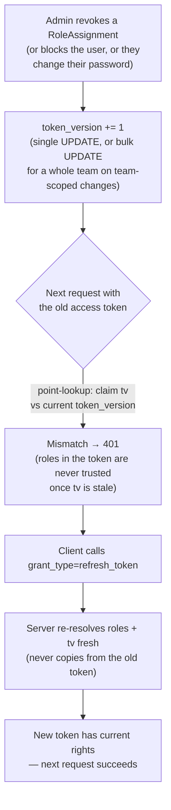
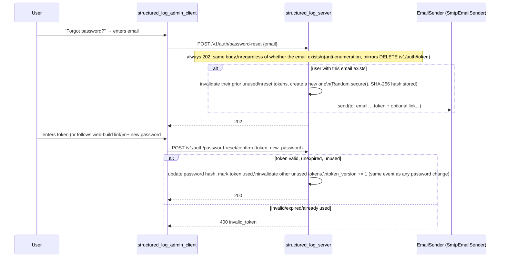
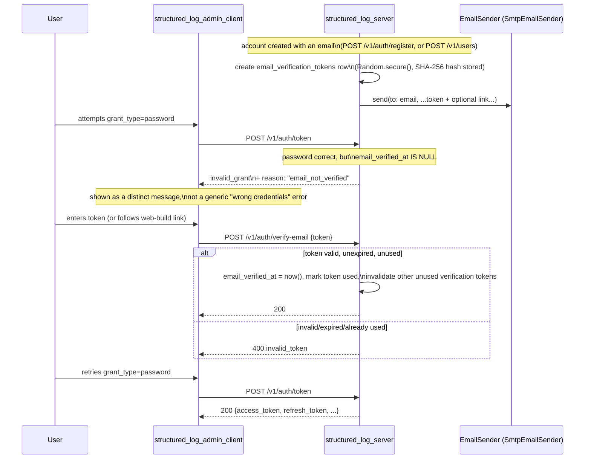
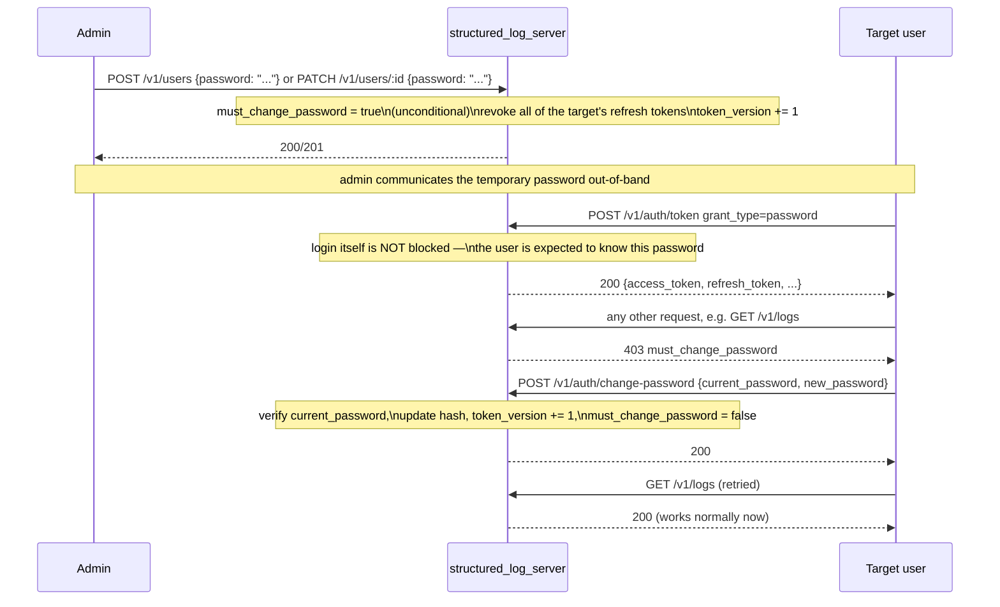

# Authentication

*Читать на [русском](auth.ru.md).*

Covers `log-server-auth` and `log-server-password-reset`. For the
normative requirements, see
[specs/log-server-auth/spec.md](../../openspec/changes/add-structured-log-server/specs/log-server-auth/spec.md)
and
[specs/log-server-password-reset/spec.md](../../openspec/changes/add-structured-log-server/specs/log-server-password-reset/spec.md).

## Two separate authentication paths

The server has two unrelated things to authenticate, with different
threat models, and deliberately different mechanisms (decision 9 vs.
10):

| | Log ingestion | Everything else (management/query/live-stream) |
|---|---|---|
| Credential | Project secret key | Access-token (JWT) |
| Who holds it | An application, not a person | A person, via `structured_log_admin_client` |
| Header | `Authorization: Bearer <project-secret-key>` | `Authorization: Bearer <access-token>` |
| Identifies | A `project_id` directly | A `User`, with claims resolved through RBAC |
| Hashing at rest | SHA-256 (decision 11) | n/a (bcrypt is for the *password*, below) |

A project secret key resolves straight to a `project_id` — an
application sending logs never needs a user account at all.

## The token contract: OAuth2/OIDC-shaped, Keycloak as the reference

By direct user requirement (decision 10), the management/query
authentication contract mirrors Keycloak's
`/protocol/openid-connect/token` shape closely enough that an
off-the-shelf OAuth2 client could talk to it, even though there is no
real Keycloak behind it — only `structured_log_server`'s own users and
RBAC. This is a deliberate, narrow exception: the *protocol shape* is
standard, nothing else about Keycloak is reproduced (see
[technology-stack.md](technology-stack.md) for what's explicitly **not**
implemented, e.g. `.well-known/openid-configuration`, token introspection).

```mermaid
sequenceDiagram
    participant Client as structured_log_admin_client
    participant Srv as structured_log_server

    Client->>Srv: POST /v1/auth/token\ngrant_type=password&username=...&password=...
    Note over Srv: verify password, resolve\neffective roles (RBAC), read token_version
    Srv-->>Client: 200 {access_token, refresh_token,\nexpires_in, token_type: "Bearer"}

    Note over Client: access_token is short-lived (minutes)

    Client->>Srv: any request with\nAuthorization: Bearer <access_token>
    Srv->>Srv: verify JWT signature/exp,\ncompare claim tv to current token_version
    alt tv mismatch
        Srv-->>Client: 401
        Client->>Srv: POST /v1/auth/token\ngrant_type=refresh_token&refresh_token=...
        Note over Srv: also checks is_active;\nrotates: revokes old, issues new pair,\nre-resolves roles/tv fresh
        Srv-->>Client: 200 new {access_token, refresh_token, ...}
        Client->>Srv: retry original request
    else tv matches
        Srv-->>Client: 200 (roles read straight from claims,\nno DB join needed)
    end

    Client->>Srv: DELETE /v1/auth/token\nrefresh_token=...
    Note over Srv: RFC 7009 §2.2 — always 200,\nvalid or not, to avoid enumeration
    Srv-->>Client: 200 (empty body)
```

Key properties, each traced to a decision:

- **One endpoint, dispatched by `grant_type`** (`password` or
  `refresh_token`), form-encoded per RFC 6749 — not a JSON body, and not
  separate paths for "login" vs. "refresh" (decision 10).
- **Revocation is `DELETE /v1/auth/token`**, not a `/logout` path — the
  token is a resource, revocation is its deletion (RFC 7009). It always
  answers `200` with an empty body, valid token or not, so the response
  can't be used to probe whether someone else's token is still live.
- **Roles are a snapshot in the JWT claims** (`roles: [{role, scope_type,
  scope_id}]`), not resolved from the database on every request. This is
  the throughput win over the earlier design revision (full DB
  resolution every request) — but it creates a staleness problem that
  `token_version` exists to solve, below.
- **Error shape on this one endpoint only** follows RFC 6749 §5.2
  (`{"error": "invalid_grant", "error_description": "..."}`) rather than
  the rest of the API's JSON error envelope — an intentional, narrow
  inconsistency, documented so it doesn't read as an oversight.

## `token_version`: how a snapshot in a JWT stays revocable

If roles are baked into the token at issuance, what stops a token from
carrying stale (over-privileged) rights until it expires on its own? The
answer is a single integer counter on `User` (decision 10):



The point-lookup (`SELECT token_version FROM users WHERE id = sub`,
indexed PK) is cheap enough to do on *every* authenticated request,
which is what makes this cheaper than the alternative it replaced (join
`role_assignments`↔`team_members`↔`teams` on every request) while still
giving the same "next request sees current rights" guarantee. Events
that bump it: role grant/revoke on the user directly or on a team they
belong to (bulk `UPDATE` for the whole team in the latter case),
deactivation (block/delete), and password change.

This same mechanism is why the live-streaming endpoint needs its own
periodic re-check — see
[live-streaming.md](live-streaming.md#re-validating-a-long-lived-connection):
a long-lived SSE connection is the one place a stale token could
otherwise keep working past its revocation, since there's no "next
request" to catch it.

## `IdentityProvider`: the seam for swapping in Keycloak later

Everything above is one implementation — `LocalIdentityProvider` —
behind a public interface (decision 17):

```dart
abstract class IdentityProvider {
  Future<VerifiedIdentity?> verifyAccessToken(String bearerToken);
}
class VerifiedIdentity {
  final String subject;
  final String? username;
  final List<EffectiveRole>? roles; // null = resolve from role_assignments
}
```

`roles == null` is the extension point for a provider that only
identifies people (rights still come from this server's own
`role_assignments`); `roles != null` is the extension point for a
provider that supplies its own rights (e.g. via Keycloak group/role
mappers). The `token_version` check above is entirely internal to
`LocalIdentityProvider` — it's not part of the interface, and a future
external provider's own revocation model (e.g. short Keycloak token TTLs)
is its own concern, not something this change guarantees for it. **No
Keycloak adapter is implemented in this change** — only the seam.

## Self-service password recovery

A separate pre-auth flow, not an extension of `/v1/auth/token` (decision
24) — `email` is not a login identifier (that stays `username`), only a
recovery contact, mandatory on self-registration and optional when an
admin creates the account.



`EmailSender` is an interface for the same reason as `IdentityProvider`:
an operator might swap `SmtpEmailSender` for a transactional email API
without touching the reset flow itself.

## Email verification: mandatory before login, not optional

By direct, explicit user requirement (decision 40): any account with an
`email` set — whether through self-registration (where it's mandatory)
or an admin setting one via `POST /v1/users` (where it's optional) —
must verify that address before `grant_type=password` will issue it
tokens. Accounts with no `email` at all (including the bootstrap
`create-admin` account, which never collects one) are simply exempt —
there's nothing to verify.



A few choices worth calling out:

- **One uniform rule, not two paths to track.** The gate is simply "is
  `email` set and unverified" — it doesn't matter whether the account
  was self-registered or admin-created. The alternative (gate only
  self-registered accounts) was rejected specifically because it would
  need a way to remember *how* an account was created just to answer
  one question, where "is `email` set" already answers it directly. The
  practical cost: an admin who sets an `email` at creation time and
  hands out credentials immediately should tell that person to check
  their inbox first — a small, accepted trade-off (see `design.md`'s
  Risks).
- **`grant_type=refresh_token` isn't re-checked.** A refresh token can
  only exist for an account that already passed the `grant_type=password`
  gate once — there's no path to a refresh token for a still-unverified
  account, so re-checking on every refresh would be redundant. Contrast
  this with `is_active` (decision 25), which genuinely can change *after*
  tokens were issued and so *is* re-checked on refresh.
- **The `reason` field is a deliberate, additive extension to the RFC
  6749 error envelope.** RFC 6749 doesn't define this case, and its
  closed `error` set (`invalid_grant`/`invalid_request`/
  `unsupported_grant_type`) has no better fit than reusing `invalid_grant`
  — but a generic `invalid_grant` alone would make "wrong password" and
  "right password, unverified email" indistinguishable to a client. The
  extra `reason` field rides on top of the standard envelope; any
  conformant OAuth2 client ignores fields it doesn't recognize, so this
  doesn't break the compatibility decision 10 introduced RFC-shaped
  errors for in the first place — `structured_log_admin_client` is just
  the one client that reads it.
- **Verification links are `POST`-driven, never a bare `GET`.**
  Confirming by simply clicking a link (`GET`) is tempting — it needs no
  screen at all — but `GET` is supposed to be side-effect-free, and an
  email scanner or link-preview bot following the link would silently
  burn the token before the real recipient ever sees it. Instead, the
  web build's page reads `?token=...` from the URL and issues the
  `POST` itself — the same pattern already used for password-reset
  links (decision 24), not a new one.
- **No separate email-sending interface.** Verification reuses
  `EmailSender` and its `SmtpEmailSender` reference implementation
  as-is — this flow needed a new token table
  (`email_verification_tokens`, structurally identical to
  `password_reset_tokens`) and two new endpoints, not a new way to send
  mail.

## `PATCH /v1/users/:id` and the mandatory temporary password

By direct user requirement (decisions 41/42): admins can edit an
existing user's `email`/`display_name`/`password` — closing a gap
where an admin could create, block, or delete an account but never
correct it. `username`/`is_active`/`deleted_at`/`is_primary_admin`/roles
stay out of reach of this endpoint on purpose — each already has its
own, more narrowly authorized path, and decision 25 already rejected
folding differently-authorized fields into one generic `PATCH` once
before.

Whenever an admin sets a password — at creation (`POST /v1/users`) or
later (`PATCH /v1/users/:id`) — it's unconditionally temporary. There's
no flag to turn this off:



A few choices worth calling out:

- **Login succeeds; everything else doesn't.** This is the opposite
  gate shape from [email verification](#email-verification-mandatory-before-login-not-optional),
  which blocks token issuance itself. Here the user is *expected* to
  know the temporary password (the admin told them out-of-band), so
  refusing to issue a token at all would leave no API path to comply
  with the requirement in the first place. Instead, a small middleware
  step — sitting right after auth, before authorization — blocks every
  JWT-authenticated request except an explicit allowlist:
  `POST /v1/auth/change-password` (obviously — without it the flag
  could never be cleared), `DELETE /v1/users/me` (someone who'd rather
  delete the account than deal with it shouldn't be trapped — this
  endpoint already requires the current password, which doubles as
  proof they know the temporary one), and the session-maintenance pair
  `POST /v1/auth/token` (`grant_type=refresh_token`) / `DELETE /v1/auth/token`.
- **Refresh tokens are explicitly revoked, not just `token_version`-bumped.**
  A `token_version` bump alone only invalidates the *current* access
  token — the still-valid refresh token would happily mint a new one,
  and the user could keep working under the password they already knew,
  never noticing (or needing) the reset. Revoking refresh tokens (the
  same call already used for blocking, decision 25) forces a fresh
  `grant_type=password` login with the *new* password — which only
  succeeds if they actually received it.
- **`POST /v1/auth/change-password` is a general capability, not a
  forced-flow-only one.** It works identically whether
  `must_change_password` is set or not — this happens to close a
  separate, previously-identified gap (there was no way to change your
  own password while already logged in; only the unauthenticated
  password-reset flow existed, and that needs an `email`).
- **Changing `email` through `PATCH` resets verification.** A new
  address hasn't proven anyone owns it yet — even if the old one was
  verified — so `email_verified_at` resets to `null` and a fresh
  verification email goes out through the same shared function
  `POST /v1/auth/register` already uses.
- **No extra work for the live-stream heartbeat.** If an admin resets
  someone's password while their `GET /v1/logs/stream` connection is
  open, the `token_version` bump this already triggers is exactly what
  the heartbeat's existing re-validation ([live-streaming.md](live-streaming.md#re-validating-a-long-lived-connection))
  already watches for — the stream closes on its own, no new code
  needed specifically for this case.

## Password vs. secret-key hashing: two algorithms for two threats

Decision 11 deliberately does **not** use the same hash for both:

- **User passwords** — `bcrypt`. Low-entropy, human-chosen secrets need
  a slow, adaptive algorithm resistant to offline dictionary attacks.
- **Project secret keys and refresh/reset tokens** — SHA-256 of a
  `Random.secure()`-generated value. These are high-entropy and never
  memorized by a human, so dictionary resistance is irrelevant — a slow
  hash here would just be overhead on every `POST /v1/logs` call (a
  high-frequency path, unlike login).

Both secret types are shown to the caller exactly once, at creation.
