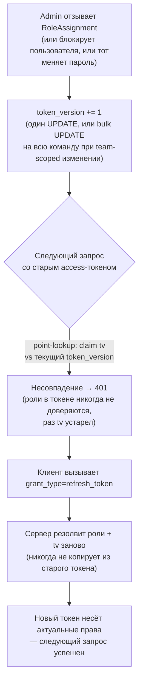
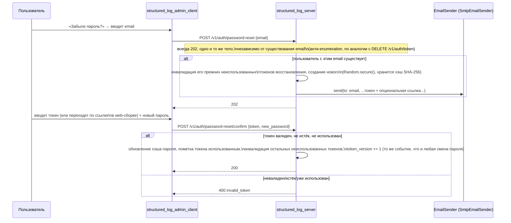
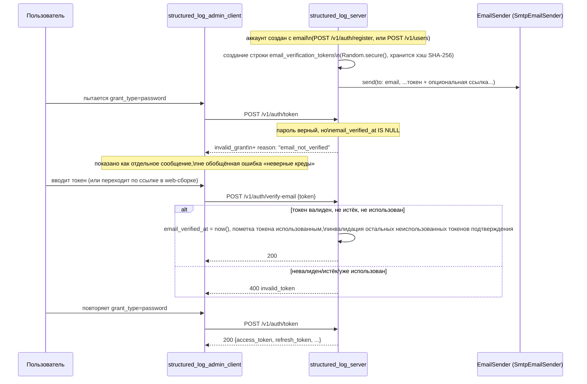
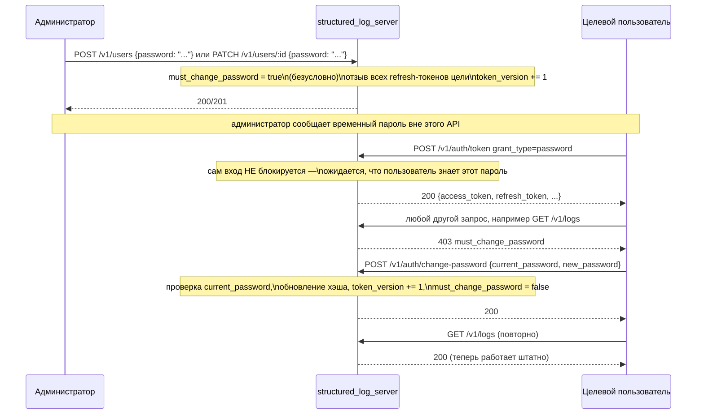
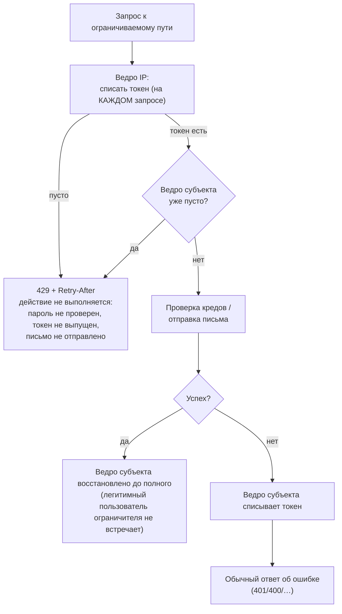

# Аутентификация

*Read in [English](auth.md).*

Охватывает `log-server-auth` и `log-server-password-reset`. Нормативные
требования — в
[specs/log-server-auth/spec.md](../../openspec/changes/add-structured-log-server/specs/log-server-auth/spec.md)
и
[specs/log-server-password-reset/spec.md](../../openspec/changes/add-structured-log-server/specs/log-server-password-reset/spec.md).

## Два независимых пути аутентификации

У сервера есть две не связанные друг с другом вещи для аутентификации, с
разными моделями угроз и намеренно разными механизмами (decision 9 vs.
10):

| | Приём логов | Всё остальное (management/query/live-stream) |
|---|---|---|
| Credential | Секретный ключ проекта | Access-токен (JWT) |
| Кто им владеет | Приложение, не человек | Человек, через `structured_log_admin_client` |
| Заголовок | `Authorization: Bearer <секретный ключ проекта>` | `Authorization: Bearer <access-token>` |
| Идентифицирует | `project_id` напрямую | `User`, с claims, резолвленными через RBAC |
| Хэширование в хранилище | SHA-256 (decision 11) | н/д (bcrypt — для *пароля*, ниже) |

Секретный ключ проекта резолвится напрямую в `project_id` — приложению,
отправляющему логи, вообще не нужна учётная запись пользователя.

## Контракт токенов: в форме OAuth2/OIDC, Keycloak как эталон

По прямому требованию пользователя (decision 10) контракт
аутентификации management/query достаточно близко зеркалит форму
Keycloak `/protocol/openid-connect/token`, чтобы с ним мог работать
готовый OAuth2-клиент, хотя за ним нет настоящего Keycloak — только
собственные пользователи и RBAC `structured_log_server`. Это осознанное,
узкое исключение: стандартна именно *форма протокола*, больше ничего от
Keycloak не воспроизводится (что именно **не** реализовано — например,
`.well-known/openid-configuration`, token introspection — см.
[technology-stack.md](technology-stack.ru.md)).

```mermaid
sequenceDiagram
    participant Client as structured_log_admin_client
    participant Srv as structured_log_server

    Client->>Srv: POST /v1/auth/token\ngrant_type=password&username=...&password=...
    Note over Srv: проверка пароля, резолвинг\nэффективных ролей (RBAC), чтение token_version
    Srv-->>Client: 200 {access_token, refresh_token,\nexpires_in, token_type: "Bearer"}

    Note over Client: access_token короткоживущий (минуты)

    Client->>Srv: любой запрос с\nAuthorization: Bearer <access_token>
    Srv->>Srv: проверка подписи/exp JWT,\nсравнение claim tv с текущим token_version
    alt tv не совпадает
        Srv-->>Client: 401
        Client->>Srv: POST /v1/auth/token\ngrant_type=refresh_token&refresh_token=...
        Note over Srv: также проверяет is_active;\nротация: отзыв старого, выдача новой пары,\nроли/tv резолвятся заново
        Srv-->>Client: 200 новая {access_token, refresh_token, ...}
        Client->>Srv: повтор исходного запроса
    else tv совпадает
        Srv-->>Client: 200 (роли читаются прямо из claims,\nбез джойна к БД)
    end

    Client->>Srv: DELETE /v1/auth/token\nrefresh_token=...
    Note over Srv: RFC 7009 §2.2 — всегда 200,\nвалиден токен или нет, против enumeration
    Srv-->>Client: 200 (пустое тело)
```

Ключевые свойства, каждое привязано к decision:

- **Один эндпоинт, диспетчеризация по `grant_type`** (`password` или
  `refresh_token`), form-encoded по RFC 6749 — не JSON-тело и не
  отдельные пути для «логина» и «refresh» (decision 10).
- **Отзыв — это `DELETE /v1/auth/token`**, не путь `/logout` — токен
  является ресурсом, отзыв — его удаление (RFC 7009). Всегда отвечает
  `200` с пустым телом, валиден токен или нет, чтобы ответ нельзя было
  использовать для проверки, жив ли ещё чужой токен.
- **Роли — снапшот в claims JWT** (`roles: [{role, scope_type,
  scope_id}]`), не резолвятся из БД на каждый запрос. Это выигрыш в
  throughput относительно более ранней ревизии дизайна (полный резолвинг
  из БД на каждый запрос) — но создаёт проблему устаревания, для решения
  которой существует `token_version`, ниже.
- **Формат ошибок именно на этом эндпоинте** следует RFC 6749 §5.2
  (`{"error": "invalid_grant", "error_description": "..."}"`), а не
  общему JSON-конверту ошибок остального API — осознанное, узкое
  несоответствие, задокументированное, чтобы не читалось как недосмотр.

## `token_version`: как снапшот в JWT остаётся отзываемым

Если роли зашиты в токен при выдаче, что мешает токену нести устаревшие
(избыточные) права до собственного истечения? Ответ — один целочисленный
счётчик на `User` (decision 10):



Point-lookup (`SELECT token_version FROM users WHERE id = sub`,
индексированный PK) достаточно дёшев, чтобы делать его на *каждом*
аутентифицированном запросе — именно это делает подход дешевле
альтернативы, которую он заменил (джойн `role_assignments`↔`team_members`↔`teams`
на каждый запрос), сохраняя ту же гарантию «следующий запрос видит
актуальные права». События, инкрементирующие счётчик: выдача/отзыв роли
напрямую пользователю или команде, в которой он состоит (в последнем
случае — bulk `UPDATE` на всю команду), деактивация (блокировка/удаление)
и смена пароля.

Этот же механизм — причина, по которой эндпоинту живой доставки нужна
собственная периодическая перепроверка — см.
[live-streaming.md](live-streaming.ru.md#ревалидация-долгоживущего-соединения):
долгоживущее SSE-соединение — как раз то место, где устаревший токен
иначе мог бы продолжать работать после отзыва, потому что там нет
«следующего запроса», который бы это поймал.

## `IdentityProvider`: шов для будущей подмены на Keycloak

Всё выше — одна реализация, `LocalIdentityProvider`, — за публичным
интерфейсом (decision 17):

```dart
abstract class IdentityProvider {
  Future<VerifiedIdentity?> verifyAccessToken(String bearerToken);
}
class VerifiedIdentity {
  final String subject;
  final String? username;
  final List<EffectiveRole>? roles; // null = резолвить из role_assignments
}
```

`roles == null` — точка расширения для провайдера, который только
идентифицирует людей (права всё равно берутся из собственных
`role_assignments` этого сервера); `roles != null` — точка расширения
для провайдера, поставляющего собственные права (например, через
role/group mappers Keycloak). Проверка `token_version` выше — полностью
внутренняя деталь `LocalIdentityProvider` — не часть интерфейса, и
собственная модель отзыва будущего внешнего провайдера (например,
короткий TTL токенов Keycloak) — его забота, а не то, что гарантирует
эта доработка для него. **Адаптер под Keycloak в этой доработке не
реализуется** — только шов.

## Самостоятельное восстановление пароля

Отдельный pre-auth flow, не расширение `/v1/auth/token` (decision 24) —
`email` не идентификатор для входа (им остаётся `username`), только
контакт для восстановления, обязателен при самостоятельной регистрации и
опционален при создании пользователя администратором.



`EmailSender` — интерфейс по той же причине, что `IdentityProvider`:
оператор может подставить вместо `SmtpEmailSender` транзакционный email
API, не трогая сам flow восстановления.

## Подтверждение email: обязательно перед входом, не опционально

По прямому, явному требованию пользователя (decision 40): любая
учётная запись с заданным `email` — через самостоятельную регистрацию
(где он обязателен) или через администратора, указавшего его в `POST
/v1/users` (где он опционален) — обязана подтвердить этот адрес,
прежде чем `grant_type=password` начнёт выдавать ей токены. Аккаунты
вовсе без `email` просто исключены из правила — подтверждать нечего.
Это покрывает оба пути bootstrap (decision 49): и запись, созданную
`create-admin`, и ту, что сервер создаёт сам при первом старте на пустой
базе ([rbac-and-lifecycle.md](rbac-and-lifecycle.ru.md#bootstrap-два-пути-к-первому-администратору))
— адрес не запрашивает ни один из них, и именно это не даёт самому
первому входу зависеть от настроенного SMTP. Плата названа, а не
спрятана: пока администратор не задаст этой записи email, восстановление
пароля ей тоже недоступно.



Несколько решений стоит проговорить отдельно:

- **Одно единообразное правило, не два отдельных пути для отслеживания.**
  Проверка — просто «задан ли `email` и не подтверждён» — неважно,
  зарегистрирован аккаунт самостоятельно или создан администратором.
  Альтернатива (проверять только самостоятельно зарегистрированные
  аккаунты) отклонена именно потому, что потребовала бы способа
  запоминать *как* создан аккаунт ради ответа на один-единственный
  вопрос, тогда как «задан ли `email`» уже отвечает на него напрямую.
  Практическая цена: администратор, задавший `email` при создании и
  сразу выдавший учётные данные, должен предупредить человека проверить
  почту — небольшой, принятый компромисс (см. Risks в `design.md`).
- **`grant_type=refresh_token` не перепроверяется.** Refresh-токен может
  существовать только для аккаунта, уже прошедшего проверку
  `grant_type=password` один раз — пути к refresh-токену для всё ещё
  неподтверждённого аккаунта не существует, так что перепроверка на
  каждом refresh была бы избыточной. Сравните с `is_active` (decision
  25), которое действительно может измениться *после* выдачи токенов и
  поэтому *перепроверяется* на refresh.
- **Поле `reason` — осознанное, аддитивное расширение конверта ошибки
  RFC 6749.** RFC 6749 не определяет этот случай, а его закрытый набор
  `error` (`invalid_grant`/`invalid_request`/`unsupported_grant_type`)
  не подходит лучше, чем переиспользование `invalid_grant` — но один
  обобщённый `invalid_grant` сделал бы «неверный пароль» и «верный
  пароль, неподтверждённый email» неразличимыми для клиента.
  Дополнительное поле `reason` едет поверх стандартного конверта; любой
  конформный OAuth2-клиент игнорирует незнакомые поля, так что это не
  ломает совместимость, ради которой decision 10 вообще ввела
  RFC-форму ошибок — `structured_log_admin_client` просто единственный
  клиент, который его читает.
- **Ссылки подтверждения — только через `POST`, никогда голый `GET`.**
  Подтверждение простым переходом по ссылке (`GET`) соблазнительно — не
  нужен вообще никакой экран — но `GET` по семантике не должен иметь
  побочных эффектов, а почтовый сканер или link-preview бот, перешедший
  по ссылке, молча сжёг бы токен раньше, чем его увидит настоящий
  получатель. Вместо этого web-сборка сама читает `?token=...` из URL и
  сама отправляет `POST` — тот же паттерн, что уже используется для
  ссылок восстановления пароля (decision 24), не новый.
- **Без отдельного интерфейса отправки почты.** Подтверждение
  переиспользует `EmailSender` и его референс-реализацию
  `SmtpEmailSender` как есть — этому flow понадобилась новая таблица
  токенов (`email_verification_tokens`, структурно идентична
  `password_reset_tokens`) и два новых эндпоинта, не новый способ
  отправки почты.

## `PATCH /v1/users/:id` и обязательный временный пароль

По прямому требованию пользователя (decisions 41/42): администраторы
могут редактировать `email`/`display_name`/`password` существующего
пользователя — закрывает пробел, где admin мог создать, заблокировать
или удалить аккаунт, но никогда не поправить его. `username`/`is_active`/`deleted_at`/`is_primary_admin`/роли
намеренно недоступны этому эндпоинту — у каждого уже есть свой, более
узко авторизованный путь, а decision 25 уже однажды отклонял сведение
разноавторизованных полей в один универсальный `PATCH`.

Каждый раз, когда пароль задаёт администратор — при создании (`POST
/v1/users`) или позже (`PATCH /v1/users/:id`) — он безусловно временный.
Отключить это нельзя:



Несколько решений стоит проговорить отдельно:

- **Вход успешен; всё остальное — нет.** Это обратная по форме
  проверка тому, что делает [подтверждение email](#подтверждение-email-обязательно-перед-входом-не-опционально),
  блокирующее сам выпуск токена. Здесь от пользователя *ожидается*
  знание временного пароля (администратор сообщил его вне API), так
  что отказ в выдаче токена вообще не оставил бы API-пути выполнить
  само требование. Вместо этого небольшой middleware-шаг — сразу после
  аутентификации, до авторизации — блокирует любой JWT-аутентифицированный
  запрос, кроме явного списка исключений: `POST /v1/auth/change-password`
  (очевидно — без него флаг никогда не снять), `DELETE /v1/users/me`
  (того, кто предпочтёт удалить аккаунт, а не разбираться с этим, не
  стоит запирать — этот эндпоинт и так требует текущий пароль, что
  заодно доказывает знание временного), и пара поддержания сессии
  `POST /v1/auth/token` (`grant_type=refresh_token`) / `DELETE /v1/auth/token`.
- **Refresh-токены отзываются явно, не только инкрементом `token_version`.**
  Один только инкремент `token_version` инвалидирует лишь *текущий*
  access-токен — ещё действительный refresh-токен охотно выпустил бы
  новый, и пользователь продолжил бы работать под уже известным ему
  паролем, даже не заметив (и не нуждаясь в) сброс. Отзыв refresh-токенов
  (тот же вызов, что уже используется для блокировки, decision 25)
  заставляет пройти заново `grant_type=password` с *новым* паролем —
  что срабатывает, только если он его действительно получил.
- **`POST /v1/auth/change-password` — общая возможность, не только для
  принудительного сценария.** Работает одинаково, установлен
  `must_change_password` или нет — это заодно закрывает отдельный,
  ранее обнаруженный пробел (не было способа сменить собственный
  пароль, уже будучи залогиненным — существовал только
  неаутентифицированный flow восстановления, а он требует `email`).
- **Смена `email` через `PATCH` сбрасывает подтверждение.** Новый адрес
  ещё не доказал, что им кто-то владеет — даже если старый уже был
  подтверждён — так что `email_verified_at` сбрасывается в `null`, и
  новое письмо подтверждения уходит через ту же общую функцию, что уже
  использует `POST /v1/auth/register`.
- **Никакой дополнительной работы для heartbeat живого потока.** Если
  администратор сбрасывает чей-то пароль, пока у того открыто
  соединение `GET /v1/logs/stream`, инкремент `token_version`, который
  это уже вызывает — ровно то, что уже отслеживает существующая
  ревалидация heartbeat
  ([live-streaming.md](live-streaming.ru.md#ревалидация-долгоживущего-соединения))
  — поток закрывается сам, без нового кода специально под этот случай.

## Ограничение частоты: throttling без блокировки

Шесть неаутентифицированных auth-эндпоинтов плюс два принимающих пароль
(`POST /v1/auth/change-password`, `DELETE /v1/users/me`) объединяет
свойство, которого нет ни у одного другого пути этого API: один запрос
дёшев для вызывающего и дорог для всех остальных — он либо угадывает
пароль, либо угадывает одноразовый токен, либо отправляет письмо за счёт
сервера. Decision 43 ограничивает частоту именно у них — и сознательно
**не делает ничего сверх этого**.

**Блокировки учётной записи нет.** Ни счётчика неудач на `User`, ни
колонки `locked_until`, ни административного `unlock`. Этот вариант
взвешивался и был отклонён: `username` в этой системе не секрет
(`POST /v1/auth/register` отвечает `409 username_taken`, то есть имена
перечислимы by design), а значит блокировка дала бы кому угодно
возможность намеренно заморозить чужой аккаунт, оставив жертву ждать
администратора. Throttling так использовать нельзя: он замедляет
злоумышленника ровно настолько же, насколько легитимного пользователя с
тем же ключом, и сам себя отменяет со временем.



- **Два ключа, пропустить должны оба.** Ведро *IP* списывает токен на
  каждом запросе — именно это не даёт одному хосту распылять попытки по
  множеству `username`. Ведро *субъекта* (ключ — `username`, отправленный
  `email` или идентификатор самого вызывающего, в зависимости от
  эндпоинта) списывает токен только на **неудачной** попытке, а успех
  восстанавливает его полностью. Пользователь, который просто часто
  логинится, ограничителя не встречает вовсе; подбирающий пароль
  упирается в него с первых же попыток.
- **Ключ субъекта — отправленная строка**, а не найденная запись. Ключ по
  найденному пользователю сделал бы сам ограничитель оракулом
  существования: несуществующие адреса не ограничивались бы и отвечали
  быстрее — ровно та утечка, ради предотвращения которой
  `password-reset`/`verify-email/resend` отвечают одинаковым `202`.
  Плата — число создаваемых ключей контролирует тот, кто шлёт запросы,
  поэтому размер карты вёдер ограничен сверху, с LRU-вытеснением и
  периодической чисткой полных вёдер.
- **Token bucket, а не fixed window.** Fixed window (N в календарную
  минуту) допускает всплеск в 2N на границе окон; token bucket задаёт
  устойчивую скорость (пополнение) и допустимый всплеск (ёмкость) двумя
  независимыми числами. Пополнение считается лениво, при обращении — без
  таймера на каждый ключ.
- **Состояние живёт только в памяти.** Сервер by design однопоточный
  (decision 4), согласовывать счётчики не с чем, а рестарт просто
  обнуляет их. Это принятая слабость, а не недосмотр: тот, кто может
  перезапустить процесс, уже имеет доступ уровня оператора.
- **`X-Forwarded-For` игнорируется, пока доверие не настроено.**
  `trustedProxyHops` по умолчанию `0` (берётся адрес сокета). Без этого
  различения ограничитель либо бесполезен (все за прокси разделяют один
  адрес), либо тривиально обходится (подделанный заголовок от прямого
  клиента).
- **Всё целиком отключается** (`rateLimitEnabled`) — для разработки, для
  тестов, которым иначе пришлось бы считать попытки, и для развёртываний
  за собственным шлюзом оператора.

Чего ограничитель не покрывает — так же сознательно: `POST /v1/logs`
регулируется квотами проекта ([quotas-and-audit.md](quotas-and-audit.ru.md))
и высокоэнтропийным секретным ключом, а management-эндпоинты — RBAC; ни
там, ни там частота запросов не даёт злоумышленнику ничего, чего не даёт
сам факт доступа.

Throttling также не останавливает терпеливого, широко распределённого
злоумышленника, укладывающегося во все лимиты. Именно поэтому decision 44
дополняет его аудитом: `auth.login_failed` и `auth.throttled` позволяют
администратору *увидеть* такую атаку, даже когда ограничитель её не
останавливает
([quotas-and-audit.md](quotas-and-audit.ru.md#аудит-лог-log-server-audit)).

## Хэширование пароля vs. секретного ключа: два алгоритма для двух угроз

Decision 11 намеренно **не** использует один и тот же хэш для обоих:

- **Пароли пользователей** — `bcrypt`. Низкоэнтропийные, выбираемые
  человеком секреты нуждаются в медленном, адаптивном алгоритме,
  устойчивом к офлайн-перебору по словарю.
- **Секретные ключи проектов и refresh/reset-токены** — SHA-256 от
  значения, сгенерированного `Random.secure()`. Они высокоэнтропийны и
  никогда не запоминаются человеком, так что устойчивость к словарному
  перебору не важна — медленный хэш здесь был бы просто накладными
  расходами на каждый вызов `POST /v1/logs` (высокочастотный путь, в
  отличие от логина).

Оба типа секретов показываются вызывающему ровно один раз, в момент
создания.
