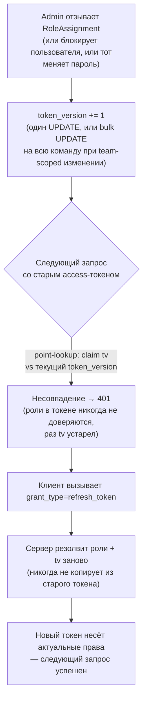
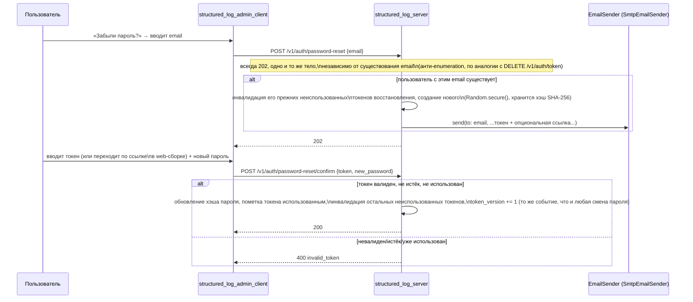
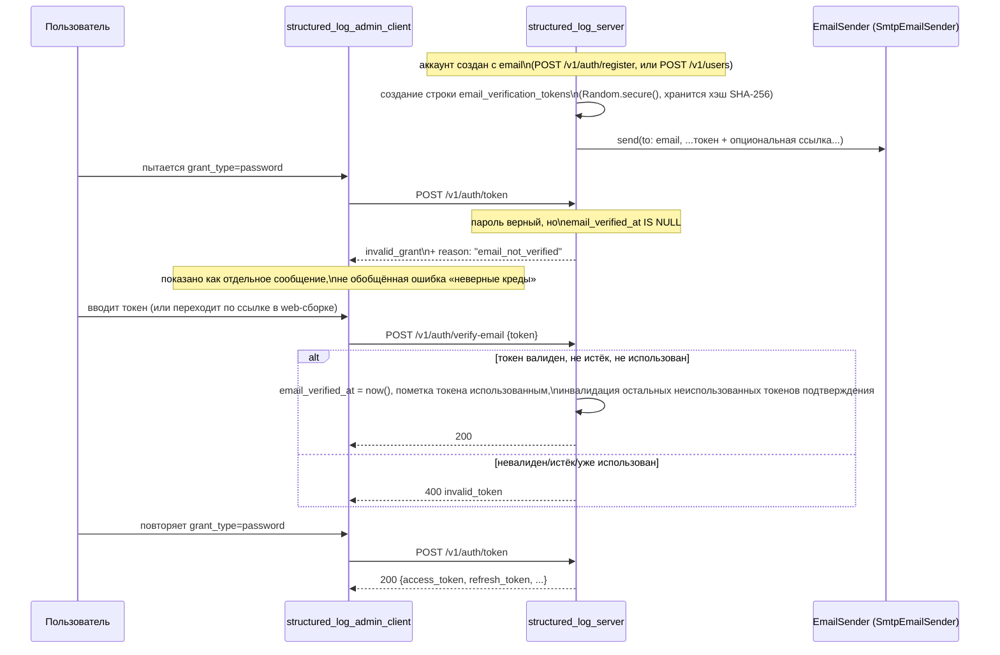

# Аутентификация

*Read in [English](auth.md).*

Охватывает `log-server-auth` и `log-server-password-reset`. Нормативные
требования — в
[specs/log-server-auth/spec.md](../../openspec/changes/add-structured-log-server/specs/log-server-auth/spec.md)
и
[specs/log-server-password-reset/spec.md](../../openspec/changes/add-structured-log-server/specs/log-server-password-reset/spec.md).

## Два независимых пути аутентификации

У сервера есть две не связанные друг с другом вещи для аутентификации, с
разными моделями угроз и намеренно разными механизмами (decision 9 vs.
10):

| | Приём логов | Всё остальное (management/query/live-stream) |
|---|---|---|
| Credential | Секретный ключ проекта | Access-токен (JWT) |
| Кто им владеет | Приложение, не человек | Человек, через `structured_log_admin_client` |
| Заголовок | `Authorization: Bearer <секретный ключ проекта>` | `Authorization: Bearer <access-token>` |
| Идентифицирует | `project_id` напрямую | `User`, с claims, резолвленными через RBAC |
| Хэширование в хранилище | SHA-256 (decision 11) | н/д (bcrypt — для *пароля*, ниже) |

Секретный ключ проекта резолвится напрямую в `project_id` — приложению,
отправляющему логи, вообще не нужна учётная запись пользователя.

## Контракт токенов: в форме OAuth2/OIDC, Keycloak как эталон

По прямому требованию пользователя (decision 10) контракт
аутентификации management/query достаточно близко зеркалит форму
Keycloak `/protocol/openid-connect/token`, чтобы с ним мог работать
готовый OAuth2-клиент, хотя за ним нет настоящего Keycloak — только
собственные пользователи и RBAC `structured_log_server`. Это осознанное,
узкое исключение: стандартна именно *форма протокола*, больше ничего от
Keycloak не воспроизводится (что именно **не** реализовано — например,
`.well-known/openid-configuration`, token introspection — см.
[technology-stack.md](technology-stack.ru.md)).

```mermaid
sequenceDiagram
    participant Client as structured_log_admin_client
    participant Srv as structured_log_server

    Client->>Srv: POST /v1/auth/token\ngrant_type=password&username=...&password=...
    Note over Srv: проверка пароля, резолвинг\nэффективных ролей (RBAC), чтение token_version
    Srv-->>Client: 200 {access_token, refresh_token,\nexpires_in, token_type: "Bearer"}

    Note over Client: access_token короткоживущий (минуты)

    Client->>Srv: любой запрос с\nAuthorization: Bearer <access_token>
    Srv->>Srv: проверка подписи/exp JWT,\nсравнение claim tv с текущим token_version
    alt tv не совпадает
        Srv-->>Client: 401
        Client->>Srv: POST /v1/auth/token\ngrant_type=refresh_token&refresh_token=...
        Note over Srv: также проверяет is_active;\nротация: отзыв старого, выдача новой пары,\nроли/tv резолвятся заново
        Srv-->>Client: 200 новая {access_token, refresh_token, ...}
        Client->>Srv: повтор исходного запроса
    else tv совпадает
        Srv-->>Client: 200 (роли читаются прямо из claims,\nбез джойна к БД)
    end

    Client->>Srv: DELETE /v1/auth/token\nrefresh_token=...
    Note over Srv: RFC 7009 §2.2 — всегда 200,\nвалиден токен или нет, против enumeration
    Srv-->>Client: 200 (пустое тело)
```

Ключевые свойства, каждое привязано к decision:

- **Один эндпоинт, диспетчеризация по `grant_type`** (`password` или
  `refresh_token`), form-encoded по RFC 6749 — не JSON-тело и не
  отдельные пути для «логина» и «refresh» (decision 10).
- **Отзыв — это `DELETE /v1/auth/token`**, не путь `/logout` — токен
  является ресурсом, отзыв — его удаление (RFC 7009). Всегда отвечает
  `200` с пустым телом, валиден токен или нет, чтобы ответ нельзя было
  использовать для проверки, жив ли ещё чужой токен.
- **Роли — снапшот в claims JWT** (`roles: [{role, scope_type,
  scope_id}]`), не резолвятся из БД на каждый запрос. Это выигрыш в
  throughput относительно более ранней ревизии дизайна (полный резолвинг
  из БД на каждый запрос) — но создаёт проблему устаревания, для решения
  которой существует `token_version`, ниже.
- **Формат ошибок именно на этом эндпоинте** следует RFC 6749 §5.2
  (`{"error": "invalid_grant", "error_description": "..."}"`), а не
  общему JSON-конверту ошибок остального API — осознанное, узкое
  несоответствие, задокументированное, чтобы не читалось как недосмотр.

## `token_version`: как снапшот в JWT остаётся отзываемым

Если роли зашиты в токен при выдаче, что мешает токену нести устаревшие
(избыточные) права до собственного истечения? Ответ — один целочисленный
счётчик на `User` (decision 10):



Point-lookup (`SELECT token_version FROM users WHERE id = sub`,
индексированный PK) достаточно дёшев, чтобы делать его на *каждом*
аутентифицированном запросе — именно это делает подход дешевле
альтернативы, которую он заменил (джойн `role_assignments`↔`team_members`↔`teams`
на каждый запрос), сохраняя ту же гарантию «следующий запрос видит
актуальные права». События, инкрементирующие счётчик: выдача/отзыв роли
напрямую пользователю или команде, в которой он состоит (в последнем
случае — bulk `UPDATE` на всю команду), деактивация (блокировка/удаление)
и смена пароля.

Этот же механизм — причина, по которой эндпоинту живой доставки нужна
собственная периодическая перепроверка — см.
[live-streaming.md](live-streaming.ru.md#ревалидация-долгоживущего-соединения):
долгоживущее SSE-соединение — как раз то место, где устаревший токен
иначе мог бы продолжать работать после отзыва, потому что там нет
«следующего запроса», который бы это поймал.

## `IdentityProvider`: шов для будущей подмены на Keycloak

Всё выше — одна реализация, `LocalIdentityProvider`, — за публичным
интерфейсом (decision 17):

```dart
abstract class IdentityProvider {
  Future<VerifiedIdentity?> verifyAccessToken(String bearerToken);
}
class VerifiedIdentity {
  final String subject;
  final String? username;
  final List<EffectiveRole>? roles; // null = резолвить из role_assignments
}
```

`roles == null` — точка расширения для провайдера, который только
идентифицирует людей (права всё равно берутся из собственных
`role_assignments` этого сервера); `roles != null` — точка расширения
для провайдера, поставляющего собственные права (например, через
role/group mappers Keycloak). Проверка `token_version` выше — полностью
внутренняя деталь `LocalIdentityProvider` — не часть интерфейса, и
собственная модель отзыва будущего внешнего провайдера (например,
короткий TTL токенов Keycloak) — его забота, а не то, что гарантирует
эта доработка для него. **Адаптер под Keycloak в этой доработке не
реализуется** — только шов.

## Самостоятельное восстановление пароля

Отдельный pre-auth flow, не расширение `/v1/auth/token` (decision 24) —
`email` не идентификатор для входа (им остаётся `username`), только
контакт для восстановления, обязателен при самостоятельной регистрации и
опционален при создании пользователя администратором.



`EmailSender` — интерфейс по той же причине, что `IdentityProvider`:
оператор может подставить вместо `SmtpEmailSender` транзакционный email
API, не трогая сам flow восстановления.

## Подтверждение email: обязательно перед входом, не опционально

По прямому, явному требованию пользователя (decision 40): любая
учётная запись с заданным `email` — через самостоятельную регистрацию
(где он обязателен) или через администратора, указавшего его в `POST
/v1/users` (где он опционален) — обязана подтвердить этот адрес,
прежде чем `grant_type=password` начнёт выдавать ей токены. Аккаунты
вовсе без `email` (включая bootstrap-аккаунт `create-admin`, который
его никогда не запрашивает) просто исключены из правила — подтверждать
нечего.



Несколько решений стоит проговорить отдельно:

- **Одно единообразное правило, не два отдельных пути для отслеживания.**
  Проверка — просто «задан ли `email` и не подтверждён» — неважно,
  зарегистрирован аккаунт самостоятельно или создан администратором.
  Альтернатива (проверять только самостоятельно зарегистрированные
  аккаунты) отклонена именно потому, что потребовала бы способа
  запоминать *как* создан аккаунт ради ответа на один-единственный
  вопрос, тогда как «задан ли `email`» уже отвечает на него напрямую.
  Практическая цена: администратор, задавший `email` при создании и
  сразу выдавший учётные данные, должен предупредить человека проверить
  почту — небольшой, принятый компромисс (см. Risks в `design.md`).
- **`grant_type=refresh_token` не перепроверяется.** Refresh-токен может
  существовать только для аккаунта, уже прошедшего проверку
  `grant_type=password` один раз — пути к refresh-токену для всё ещё
  неподтверждённого аккаунта не существует, так что перепроверка на
  каждом refresh была бы избыточной. Сравните с `is_active` (decision
  25), которое действительно может измениться *после* выдачи токенов и
  поэтому *перепроверяется* на refresh.
- **Поле `reason` — осознанное, аддитивное расширение конверта ошибки
  RFC 6749.** RFC 6749 не определяет этот случай, а его закрытый набор
  `error` (`invalid_grant`/`invalid_request`/`unsupported_grant_type`)
  не подходит лучше, чем переиспользование `invalid_grant` — но один
  обобщённый `invalid_grant` сделал бы «неверный пароль» и «верный
  пароль, неподтверждённый email» неразличимыми для клиента.
  Дополнительное поле `reason` едет поверх стандартного конверта; любой
  конформный OAuth2-клиент игнорирует незнакомые поля, так что это не
  ломает совместимость, ради которой decision 10 вообще ввела
  RFC-форму ошибок — `structured_log_admin_client` просто единственный
  клиент, который его читает.
- **Ссылки подтверждения — только через `POST`, никогда голый `GET`.**
  Подтверждение простым переходом по ссылке (`GET`) соблазнительно — не
  нужен вообще никакой экран — но `GET` по семантике не должен иметь
  побочных эффектов, а почтовый сканер или link-preview бот, перешедший
  по ссылке, молча сжёг бы токен раньше, чем его увидит настоящий
  получатель. Вместо этого web-сборка сама читает `?token=...` из URL и
  сама отправляет `POST` — тот же паттерн, что уже используется для
  ссылок восстановления пароля (decision 24), не новый.
- **Без отдельного интерфейса отправки почты.** Подтверждение
  переиспользует `EmailSender` и его референс-реализацию
  `SmtpEmailSender` как есть — этому flow понадобилась новая таблица
  токенов (`email_verification_tokens`, структурно идентична
  `password_reset_tokens`) и два новых эндпоинта, не новый способ
  отправки почты.

## Хэширование пароля vs. секретного ключа: два алгоритма для двух угроз

Decision 11 намеренно **не** использует один и тот же хэш для обоих:

- **Пароли пользователей** — `bcrypt`. Низкоэнтропийные, выбираемые
  человеком секреты нуждаются в медленном, адаптивном алгоритме,
  устойчивом к офлайн-перебору по словарю.
- **Секретные ключи проектов и refresh/reset-токены** — SHA-256 от
  значения, сгенерированного `Random.secure()`. Они высокоэнтропийны и
  никогда не запоминаются человеком, так что устойчивость к словарному
  перебору не важна — медленный хэш здесь был бы просто накладными
  расходами на каждый вызов `POST /v1/logs` (высокочастотный путь, в
  отличие от логина).

Оба типа секретов показываются вызывающему ровно один раз, в момент
создания.
