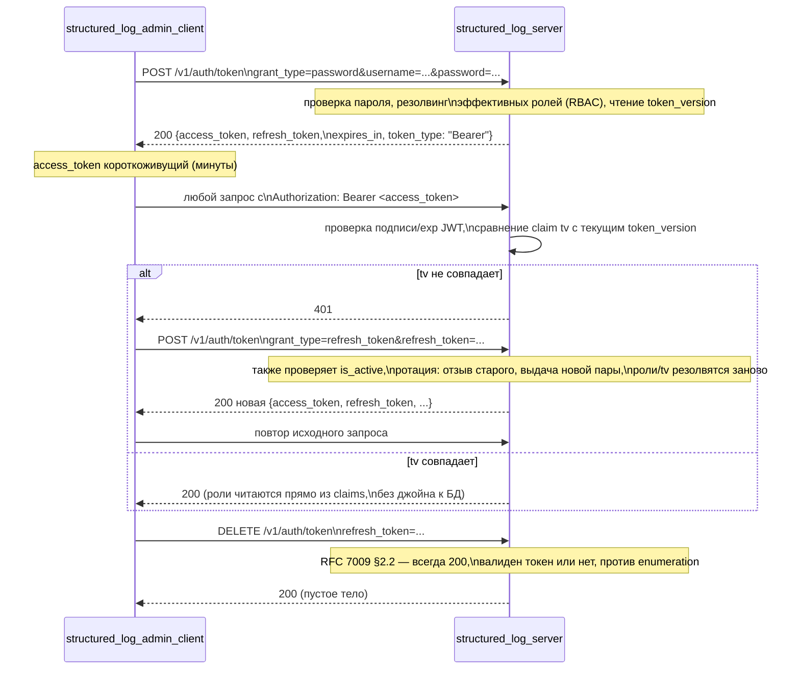
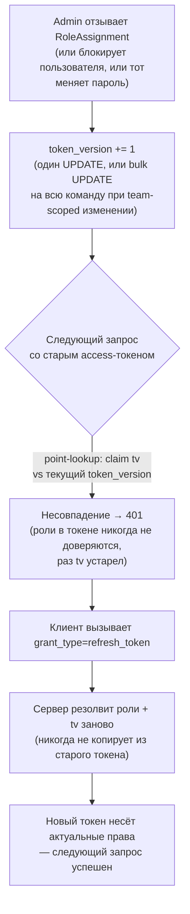
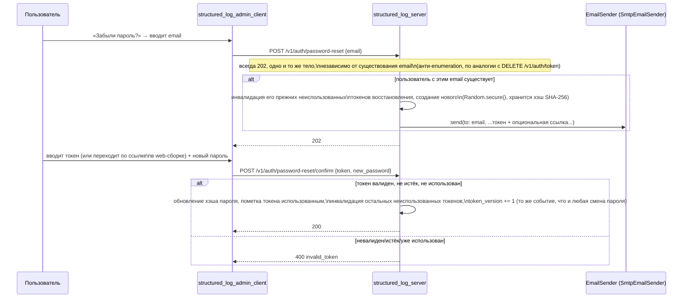
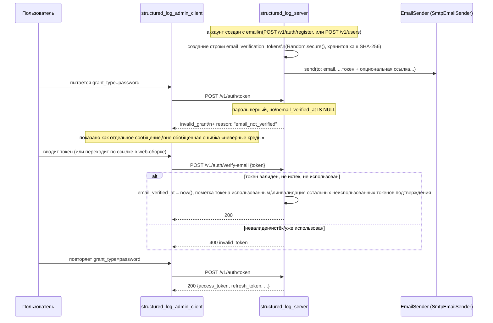
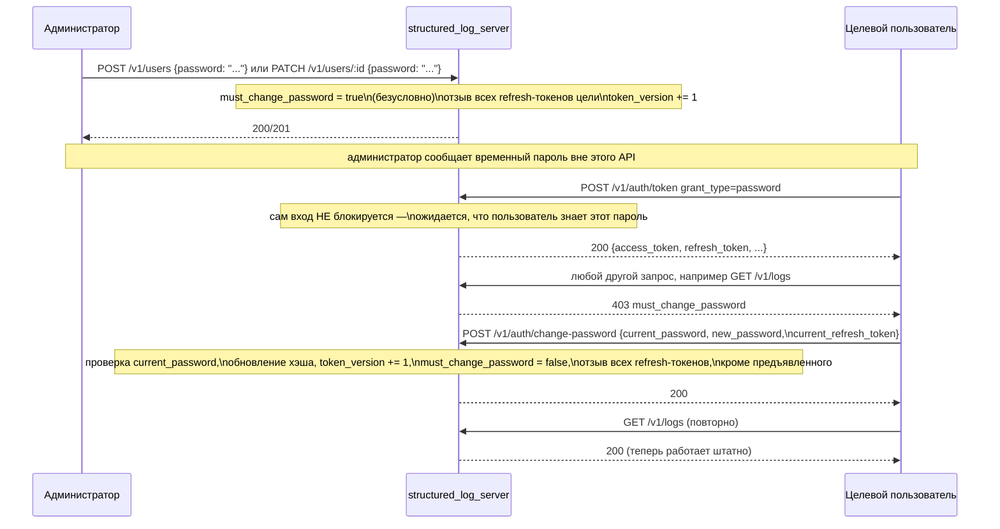
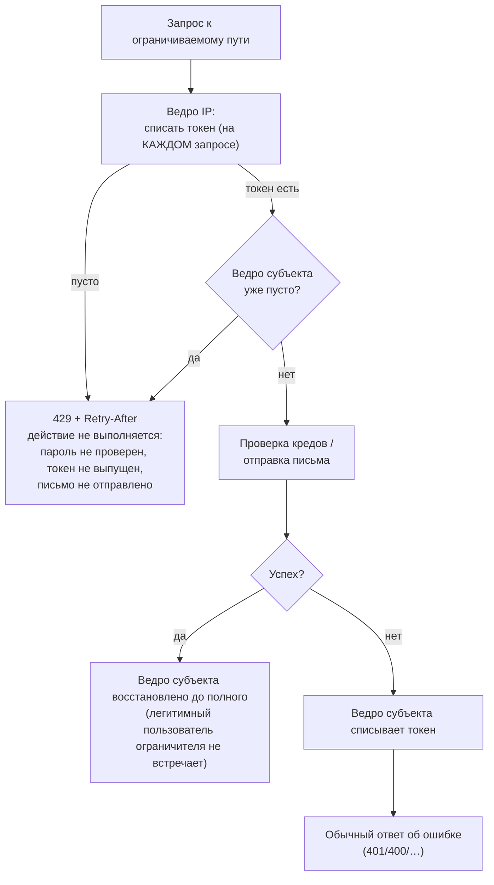

# Аутентификация

*Read in [English](auth.md).*

Здесь описаны `log-server-auth` и `log-server-password-reset`. Нормативные
требования — в
[specs/log-server-auth/spec.md](../../openspec/changes/add-structured-log-server/specs/log-server-auth/spec.md)
и
[specs/log-server-password-reset/spec.md](../../openspec/changes/add-structured-log-server/specs/log-server-password-reset/spec.md).

## Два независимых пути аутентификации

Серверу приходится аутентифицировать две не связанные между собой вещи:
приём логов (от приложений) и всё остальное (люди, работающие через
admin-клиент). Аутентифицируются они по-разному — из-за разных моделей
угроз и намеренно разных механизмов (decision 9 и 10). RBAC —
role-based access control, ролевое управление доступом, подробно
разобрано в [rbac-and-lifecycle.md](rbac-and-lifecycle.ru.md) —
определяет, что аутентифицированный человек может делать дальше.

| | Приём логов | Всё остальное (management/query/live-stream) |
|---|---|---|
| Креденшел | Секретный ключ проекта | Access-токен (JWT) |
| Кто им владеет | Приложение, не человек | Человек, через `structured_log_admin_client` |
| Заголовок | `Authorization: Bearer slk_<секретный ключ проекта>` | `Authorization: Bearer <access-token>` |
| Идентифицирует | `project_id` напрямую | `User`, с claims, резолвленными через RBAC |
| Хэширование в хранилище | SHA-256 (decision 11) | н/д (bcrypt — для *пароля*, ниже) |

Секретный ключ проекта резолвится напрямую в `project_id` — приложению,
отправляющему логи, вообще не нужна учётная запись пользователя.

### Одна точка входа, два креденшела

Различаются только креденшелы — заголовок один и тот же, и читает его
ровно одно место: `principalMiddleware`, единственный
аутентифицирующий слой в общем `Pipeline`
(change `unify-server-auth`). Он резолвит предъявленное значение в
`Principal` — `UserPrincipal`, `ProjectPrincipal` или
`AnonymousPrincipal` — и **всегда** передаёт запрос дальше, никогда не
отвечая сам.

Отвергать в middleware нельзя: часть эндпоинтов публична изначально
(`GET /healthz`, `POST`/`DELETE /v1/auth/token`, регистрация, сброс
пароля, верификация email), так что отвергающий middleware немедленно
завёл бы внутри себя список путей — то есть протащил бы знание о
роутинге в auth-слой. Вместо этого требование объявляет сам хендлер,
первой же строкой:

- `request.requireUser()` → `VerifiedIdentity`, иначе 401;
- `request.requireProject()` → `project_id`, иначе 401.

Отсюда следует поведение, на которое опирается и `log-server-auth`:
секретный ключ проекта, предъявленный management-эндпоинту, и
access-токен, предъявленный `POST /v1/logs`, дают 401 — ровно так же,
как отсутствующий креденшел. По той же причине `GET` и `POST` на
`/v1/logs` могут делить один путь при разных схемах: схему выбирает не
маршрут, а хендлер.

Различить креденшелы в общем заголовке позволяет префикс `slk_`,
который несёт каждый секретный ключ проекта. JWT — это base64url от
JSON-объекта и всегда начинается с `eyJ`, так что коллизия невозможна
в принципе; значение с префиксом ищется по хэшу в
`project_secret_keys` и никогда не попадает в проверку подписи, а
значение без префикса — наоборот. Попутный, незапланированный плюс:
утёкший ключ узнаётся на глаз и secret-scanning'ом, как `ghp_`/`sk-`/
`AKIA`.

Гейт принудительной смены пароля встроен туда же — в
`requireUser()`, который по умолчанию отвечает 403
`must_change_password` для учётной записи с временным паролем.
Эндпоинты из списка исключений (`POST /v1/auth/change-password` и,
позже, `DELETE /v1/users/me`) объявляют это явно:
`requireUser(allowTemporaryPassword: true)` — то есть исключение
записано в самом хендлере-исключении, а не списком путей в
чужом файле.

Цена такой раскладки в том, что по маршрутам больше не видно, что
чем защищено. Взамен есть механическая проверка:
`test/http/route_auth_matrix_test.dart` перечисляет все маршруты
`buildHandler` с требуемым принципалом и для каждого непубличного
проверяет 401 без креденшела и с креденшелом чужого типа; маршрут,
добавленный мимо таблицы, роняет тест.

## Контракт токенов: в форме OAuth2/OIDC, Keycloak как эталон

По прямому требованию пользователя (decision 10) контракт
аутентификации management/query достаточно близко повторяет форму
Keycloak `/protocol/openid-connect/token`, чтобы с ним мог работать
готовый OAuth2-клиент, хотя за ним нет настоящего Keycloak — только
собственные пользователи и RBAC `structured_log_server`. Это осознанное,
узкое исключение: стандартна именно *форма протокола*, больше ничего от
Keycloak не воспроизводится (что именно **не** реализовано — например,
`.well-known/openid-configuration`, token introspection — см.
[technology-stack.md](technology-stack.ru.md)).


```mermaid
sequenceDiagram
    participant Client as structured_log_admin_client
    participant Srv as structured_log_server

    Client->>Srv: POST /v1/auth/token\ngrant_type=password&username=...&password=...
    Note over Srv: проверка пароля, резолвинг\nэффективных ролей (RBAC), чтение token_version
    Srv-->>Client: 200 {access_token, refresh_token,\nexpires_in, token_type: "Bearer"}

    Note over Client: access_token короткоживущий (минуты)

    Client->>Srv: любой запрос с\nAuthorization: Bearer <access_token>
    Srv->>Srv: проверка подписи/exp JWT,\nсравнение claim tv с текущим token_version
    alt tv не совпадает
        Srv-->>Client: 401
        Client->>Srv: POST /v1/auth/token\ngrant_type=refresh_token&refresh_token=...
        Note over Srv: также проверяет is_active,\nротация: отзыв старого, выдача новой пары,\nроли/tv резолвятся заново
        Srv-->>Client: 200 новая {access_token, refresh_token, ...}
        Client->>Srv: повтор исходного запроса
    else tv совпадает
        Srv-->>Client: 200 (роли читаются прямо из claims,\nбез джойна к БД)
    end

    Client->>Srv: DELETE /v1/auth/token\nrefresh_token=...
    Note over Srv: RFC 7009 §2.2 — всегда 200,\nвалиден токен или нет, против enumeration
    Srv-->>Client: 200 (пустое тело)
```

Ключевые свойства — у каждого своё decision:

- **Один эндпоинт, диспетчеризация по `grant_type`** (`password` или
  `refresh_token`); тело form-encoded по RFC 6749, а не JSON, и отдельных
  путей для «логина» и «refresh» нет (decision 10).
- **Отзыв — это `DELETE /v1/auth/token`**, а не путь `/logout`: токен —
  это ресурс, а отзыв — его удаление (RFC 7009). Всегда отвечает
  `200` с пустым телом, валиден токен или нет, чтобы ответ нельзя было
  использовать для проверки, жив ли ещё чужой токен.
- **Кражей считается только возврат ротированного токена.** У
  refresh-токена, потраченного `grant_type=refresh_token`, есть живой
  преемник, и повторное предъявление значит, что одной сессией владеют
  двое, — сервер отзывает все refresh-токены учётной записи. Токен,
  завершённый иначе — выходом, подметанием при смене пароля, сбросом
  пароля, блокировкой или удалением администратором, — отклоняется тем
  же `invalid_grant`, и больше ничего не происходит: это просто устройство,
  которое ещё ничего не знает и обновляется по своему расписанию. Какой
  это был случай, записывает `refresh_tokens.revoked_reason`. Пока этого
  поля не было, обновление подметённого устройства выкидывало ровно ту сессию, которая
  только что сменила пароль. Строка, отозванная до появления колонки
  (`NULL`), по-прежнему считается ротированной.
- **Роли — снапшот в claims JWT** (`roles: [{role, scope_type,
  scope_id}]`), а не резолвятся из БД на каждом запросе. По сравнению с
  более ранней ревизией дизайна (полный резолвинг из БД на каждый
  запрос) это выигрыш в пропускной способности, но он порождает проблему
  устаревших прав, которую решает `token_version` (см. ниже).
- **Формат ошибок именно на этом эндпоинте** следует RFC 6749 §5.2
  (`{"error": "invalid_grant", "error_description": "..."}"`), а не
  общему JSON-конверту ошибок остального API. Это осознанное и узкое
  отступление, и задокументировано оно затем, чтобы его не приняли за
  недосмотр.

## `token_version`: как снапшот в JWT остаётся отзываемым

Если роли зашиты в токен при выдаче, что мешает токену нести устаревшие
(избыточные) права до собственного истечения? Ответ — один целочисленный
счётчик на `User` (decision 10):


```mermaid
flowchart TD
    A["Admin отзывает RoleAssignment\n(или блокирует пользователя, или тот\nменяет пароль)"] --> B["token_version += 1\n(один UPDATE, или bulk UPDATE\nна всю команду при team-scoped изменении)"]
    B --> C{"Следующий запрос\nсо старым access-токеном"}
    C -->|"point-lookup: claim tv\nvs текущий token_version"| D["Несовпадение → 401\n(роли в токене никогда не доверяются,\nраз tv устарел)"]
    D --> E["Клиент вызывает grant_type=refresh_token"]
    E --> F["Сервер резолвит роли + tv заново\n(никогда не копирует из старого токена)"]
    F --> G["Новый токен несёт актуальные права\n— следующий запрос успешен"]
```

- **Что увеличивает счётчик:** выдача/отзыв роли напрямую
  пользователю или команде, в которой он состоит (в последнем случае —
  bulk `UPDATE` на всю команду), деактивация (блокировка/удаление) и
  смена пароля.
- **Почему point-lookup, а не джойн:** `SELECT token_version FROM users
  WHERE id = sub` (индексированный PK) достаточно дёшев, чтобы делать
  его на *каждом* аутентифицированном запросе; поэтому подход
  дешевле альтернативы, которую он заменил (джойн
  `role_assignments`↔`team_members`↔`teams` на каждый запрос), и при этом
  сохраняет ту же гарантию «следующий запрос видит актуальные права».
- **Что происходит при несовпадении:** клиента вынуждают пройти через
  `grant_type=refresh_token`, который резолвит роли заново, а не
  копирует их из старого токена.

Из-за этого же механизма эндпоинту живого потока нужна собственная
периодическая перепроверка (см.
[live-streaming.md](live-streaming.ru.md#ревалидация-долгоживущего-соединения)):
долгоживущее SSE-соединение — как раз то место, где устаревший токен
иначе продолжал бы работать после отзыва, ведь там нет «следующего
запроса», который бы это поймал.

## `IdentityProvider`: шов для будущей подмены на Keycloak

Всё описанное выше — одна реализация, `LocalIdentityProvider`, скрытая
за публичным интерфейсом (decision 17):

```dart
abstract class IdentityProvider {
  Future<VerifiedIdentity?> verifyAccessToken(String bearerToken);
}
class VerifiedIdentity {
  final String subject;
  final String? username;
  final List<EffectiveRole>? roles; // null = резолвить из role_assignments
}
```

`roles == null` — точка расширения для провайдера, который только
идентифицирует людей (права всё равно берутся из собственных
`role_assignments` этого сервера); `roles != null` — точка расширения
для провайдера, поставляющего собственные права (например, через
role/group mappers Keycloak). Проверка `token_version` выше — целиком
внутренняя деталь `LocalIdentityProvider`, а не часть интерфейса; модель
отзыва у будущего внешнего провайдера (например, короткий TTL токенов
Keycloak) — его собственная забота, а не гарантия этой доработки. **Адаптер под Keycloak в этой доработке не
реализуется** — только шов.

**Одна терминологическая ловушка, которую этот адаптер обязан
учитывать:** `group` у Keycloak и `Group` в этой системе — разные
сущности. В Keycloak, LDAP и OIDC «группа» — это набор *пользователей*,
а здесь набор пользователей называется `Team`. `Group` здесь — контейнер,
которому принадлежат проекты и команды: у него есть владельцы, и на него
выдаются роли ([rbac-and-lifecycle.md](rbac-and-lifecycle.ru.md)). Поэтому
членство в Keycloak-группе отображается в `TeamMember` — или сразу в
`RoleAssignment`, если адаптер поставляет права сам (`roles != null`), —
и **никогда** в `Group`. Совпадение слов здесь ложное. Имя `Group`
сохранено намеренно (в том же смысле, что `Group` в GitLab, где группе тоже
принадлежат проекты); переименование рассматривали и отклонили — поэтому
правило соответствия и записано здесь, а не оставлено на догадку тому,
кто будет писать адаптер.

## Самостоятельное восстановление пароля

> **Запланировано, не реализовано** — маршрута
> `POST /v1/auth/password-reset`(`/confirm`) в работающем сервере нет;
> здесь описан дизайн в том виде, в каком его заложили
> в спецификацию. Забытый пароль вместо этого сбрасывает администратор
> напрямую через `PATCH /v1/users/:id` — см.
> [Руководство администратора](../guides/admin-guide.ru.md#управление-пользователями).

Это отдельный pre-auth flow, а не расширение `/v1/auth/token` (decision
24): `email` — не идентификатор для входа (им остаётся `username`), а
лишь контакт для восстановления; при самостоятельной регистрации он
обязателен, а при создании пользователя администратором — нет.


```mermaid
sequenceDiagram
    participant User as Пользователь
    participant Client as structured_log_admin_client
    participant Srv as structured_log_server
    participant Mail as EmailSender (SmtpEmailSender)

    User->>Client: «Забыли пароль?» → вводит email
    Client->>Srv: POST /v1/auth/password-reset {email}
    Note over Srv: всегда 202, одно и то же тело,\nнезависимо от существования email\n(анти-enumeration, по аналогии с DELETE /v1/auth/token)
    alt пользователь с этим email существует
        Srv->>Srv: инвалидация его прежних неиспользованных\nтокенов восстановления, создание нового\n(Random.secure(), хранится хэш SHA-256)
        Srv->>Mail: send(to: email, ...токен + опциональная ссылка...)
    end
    Srv-->>Client: 202

    User->>Client: вводит токен (или переходит по ссылке\nв web-сборке) + новый пароль
    Client->>Srv: POST /v1/auth/password-reset/confirm {token, new_password}
    alt токен валиден, не истёк, не использован
        Srv->>Srv: обновление хэша пароля, пометка токена использованным,\nинвалидация остальных неиспользованных токенов,\ntoken_version += 1 (то же событие, что и любая смена пароля)
        Srv-->>Client: 200
    else невалиден/истёк/уже использован
        Srv-->>Client: 400 invalid_token
    end
```

`EmailSender` — интерфейс по той же причине, что `IdentityProvider`:
оператор может подставить вместо `SmtpEmailSender` транзакционный email
API, не трогая сам flow восстановления.

## Подтверждение email: обязательно до входа

> **Запланировано, не реализовано** — маршрута
> `POST /v1/auth/verify-email`(`/resend`) в работающем сервере нет, и
> `grant_type=password` не проверяет `email_verified_at`; здесь описан
> дизайн в исходном виде. Самостоятельная регистрация
> (`POST /v1/auth/register`, упоминаемая по всему разделу) тоже не
> реализована — см.
> [Руководство разработчика](../guides/developer-guide.ru.md#что-не-реализовано).

По прямому, явному требованию пользователя (decision 40): любая
учётная запись с заданным `email` — через самостоятельную регистрацию
(где он обязателен) или через администратора, указавшего его в `POST
/v1/users` (где он опционален) — обязана подтвердить этот адрес,
прежде чем `grant_type=password` начнёт выдавать ей токены. Аккаунты
вовсе без `email` просто исключены из правила — подтверждать нечего.
Под это исключение попадают оба пути bootstrap (decision 49): и запись, созданную
`create-admin`, и ту, что сервер создаёт сам при первом старте на пустой
базе ([rbac-and-lifecycle.md](rbac-and-lifecycle.ru.md#bootstrap-два-пути-к-первому-администратору))
— ни один из них адрес не запрашивает, и именно поэтому самый первый
вход не зависит от того, настроен ли SMTP. Цену этого не прячут, а
называют прямо: пока администратор не задаст этой записи email, восстановление
пароля ей тоже недоступно.


```mermaid
sequenceDiagram
    participant User as Пользователь
    participant Client as structured_log_admin_client
    participant Srv as structured_log_server
    participant Mail as EmailSender (SmtpEmailSender)

    Note over Srv: аккаунт создан с email\n(POST /v1/auth/register, или POST /v1/users)
    Srv->>Srv: создание строки email_verification_tokens\n(Random.secure(), хранится хэш SHA-256)
    Srv->>Mail: send(to: email, ...токен + опциональная ссылка...)

    User->>Client: пытается grant_type=password
    Client->>Srv: POST /v1/auth/token
    Note over Srv: пароль верный, но\nemail_verified_at IS NULL
    Srv-->>Client: invalid_grant\n+ reason: "email_not_verified"
    Note over Client: показано как отдельное сообщение,\nне обобщённая ошибка «неверные креды»

    User->>Client: вводит токен (или переходит по ссылке в web-сборке)
    Client->>Srv: POST /v1/auth/verify-email {token}
    alt токен валиден, не истёк, не использован
        Srv->>Srv: email_verified_at = now(), пометка токена использованным,\nинвалидация остальных неиспользованных токенов подтверждения
        Srv-->>Client: 200
    else невалиден/истёк/уже использован
        Srv-->>Client: 400 invalid_token
    end

    User->>Client: повторяет grant_type=password
    Client->>Srv: POST /v1/auth/token
    Srv-->>Client: 200 {access_token, refresh_token, ...}
```

Несколько решений стоит проговорить отдельно:

- **Одно общее правило, а не два пути, за которыми надо следить.**
  Проверяется только одно — задан ли `email` и не подтверждён ли он, —
  независимо от того, зарегистрирован аккаунт самостоятельно или создан
  администратором. Альтернативу (проверять только самостоятельно
  зарегистрированные аккаунты) отклонили потому, что тогда пришлось бы
  запоминать, *как* создан аккаунт, ради ответа на единственный вопрос, а
  «задан ли `email`» и так отвечает на него напрямую.
  Практическая цена: администратор, задавший `email` при создании и
  сразу выдавший учётные данные, должен попросить человека проверить
  почту — небольшой, осознанно принятый компромисс (см. Risks в `design.md`).
- **`grant_type=refresh_token` не перепроверяется.** Refresh-токен бывает
  только у аккаунта, который уже однажды прошёл проверку
  `grant_type=password`: получить refresh-токен для ещё не
  подтверждённого аккаунта невозможно, так что перепроверка на каждом
  refresh была бы избыточной. Иное дело `is_active` (decision 25): он
  действительно может измениться *после* выдачи токенов и поэтому на
  refresh *перепроверяется*.
- **Поле `reason` — осознанное, аддитивное расширение конверта ошибки
  RFC 6749.** RFC 6749 не определяет этот случай, а его закрытый набор
  `error` (`invalid_grant`/`invalid_request`/`unsupported_grant_type`)
  не предлагает ничего более подходящего, чем `invalid_grant`, — но один
  обобщённый `invalid_grant` сделал бы «неверный пароль» и «верный
  пароль, неподтверждённый email» неразличимыми для клиента.
  Дополнительное поле `reason` добавляется поверх стандартного конверта;
  OAuth2-клиент, следующий стандарту, незнакомые поля игнорирует, поэтому
  совместимость, ради которой decision 10 и ввела RFC-форму ошибок, не
  ломается, — просто `structured_log_admin_client` единственный клиент,
  который это поле читает.
- **Ссылки подтверждения — только через `POST`, а не голым `GET`.**
  Подтверждать простым переходом по ссылке (`GET`) заманчиво — не
  нужен вообще никакой экран, — но `GET` по семантике не должен иметь
  побочных эффектов, а почтовый сканер или link-preview бот, перешедший
  по ссылке, молча сжёг бы токен раньше, чем его увидит настоящий
  получатель. Вместо этого web-сборка сама читает `?token=...` из URL и
  сама отправляет `POST`; это не новый паттерн, а тот же, что уже
  используется для ссылок восстановления пароля (decision 24).
- **Без отдельного интерфейса отправки почты.** Подтверждение
  переиспользует `EmailSender` и его эталонную реализацию
  `SmtpEmailSender` как есть : этому flow понадобились новая таблица
  токенов (`email_verification_tokens`, структурно идентична
  `password_reset_tokens`) и два новых эндпоинта, но не новый способ
  отправки почты.

## `PATCH /v1/users/:id` и обязательный временный пароль

По прямому требованию пользователя (decisions 41/42): администраторы
могут редактировать `email`/`display_name`/`password` существующего
пользователя. Это закрывает пробел: admin мог создать, заблокировать
или удалить аккаунт, но не мог его исправить. `username`/`is_active`/`deleted_at`/`is_primary_admin`/роли
намеренно недоступны этому эндпоинту : у каждого из них уже есть свой путь
с более узкой авторизацией, а decision 25 уже однажды отказалась сводить
поля с разной авторизацией в один универсальный `PATCH`.

Каждый раз, когда пароль задаёт администратор — при создании (`POST
/v1/users`) или позже (`PATCH /v1/users/:id`) — он безусловно временный.
Отключить это нельзя:


```mermaid
sequenceDiagram
    participant Admin as Администратор
    participant Srv as structured_log_server
    participant User as Целевой пользователь

    Admin->>Srv: POST /v1/users {password: "..."} или PATCH /v1/users/:id {password: "..."}
    Note over Srv: must_change_password = true\n(безусловно)\nотзыв всех refresh-токенов цели\ntoken_version += 1
    Srv-->>Admin: 200/201

    Note over Admin,User: администратор сообщает временный пароль вне этого API

    User->>Srv: POST /v1/auth/token grant_type=password
    Note over Srv: сам вход НЕ блокируется —\nожидается, что пользователь знает этот пароль
    Srv-->>User: 200 {access_token, refresh_token, ...}

    User->>Srv: любой другой запрос, например GET /v1/logs
    Srv-->>User: 403 must_change_password

    User->>Srv: POST /v1/auth/change-password {current_password, new_password,\ncurrent_refresh_token}
    Note over Srv: проверка current_password,\nобновление хэша, token_version += 1,\nmust_change_password = false,\nотзыв всех refresh-токенов,\nкроме предъявленного
    Srv-->>User: 200

    User->>Srv: GET /v1/logs (повторно)
    Srv-->>User: 200 (теперь работает штатно)
```

Несколько решений стоит проговорить отдельно:

- **Вход успешен; всё остальное — нет.** По форме эта проверка
  обратна [подтверждению email](#подтверждение-email-обязательно-до-входа),
  которое блокирует сам выпуск токена. Здесь же пользователь по замыслу знает
  временный пароль (администратор сообщил его вне API), и если отказать
  ему в токене, выполнить само требование через API будет нечем. Вместо этого небольшой middleware-шаг — сразу после
  аутентификации, до авторизации — блокирует любой JWT-аутентифицированный
  запрос, кроме явного списка исключений: `POST /v1/auth/change-password`
  (очевидно — без него флаг никогда не снять), `DELETE /v1/users/me`
  (того, кто предпочтёт удалить аккаунт, а не разбираться с этим, не
  стоит запирать — этот эндпоинт и так требует текущий пароль, что
  заодно доказывает знание временного), и пара поддержания сессии
  `POST /v1/auth/token` (`grant_type=refresh_token`) / `DELETE /v1/auth/token`.
- **Refresh-токены отзываются явно, а не только увеличением `token_version`.**
  Одно лишь увеличение `token_version` делает недействительным только
  *текущий* access-токен, а ещё живой refresh-токен охотно выпустил бы
  новый, и пользователь продолжил бы работать под уже известным ему
  паролем, даже не заметив сброс и не нуждаясь в нём. Отзыв refresh-токенов
  (тот же вызов, что уже используется для блокировки, decision 25)
  заставляет заново пройти `grant_type=password` с *новым* паролем, а
  это получится, только если пароль до пользователя действительно дошёл.
- **Самостоятельная смена пароля тоже отзывает сессии — по умолчанию все,
  кроме той, из которой её делают.** Пункт выше — про пароль, который
  сбрасывает администратор; к паролю, который учётная запись меняет
  сама, тот же довод применим с большей силой: обычная причина так
  поступить — подозрение, что пароль кто-то узнал. Вызывающий называет
  свой refresh-токен в `current_refresh_token` и продолжает работать;
  всё остальное, что держит учётная запись, отзывается.
  `keep_other_sessions: true` — отказ от отзыва. Асимметрия, за которой
  стоит следить: *отсутствие* любого из двух полей означает «отозвать».
  Сервер не может определить, какая сессия спрашивает — эндпоинт
  аутентифицируется access-токеном, а хранимые refresh-токены
  представлены хэшами и не несут ничего об устройстве, — поэтому
  вызывающий, не опознавший себя, подметается вместе с остальными, а не
  тихо пропускается. Поле названо по исключению
  (`keep_other_sessions`), а не по просьбе (`revoke_other_sessions`),
  ровно затем, чтобы это было поведением по умолчанию и для старого
  клиента, и для `curl`.
- **`POST /v1/auth/change-password` — общая возможность, а не только для
  принудительного сценария.** Эндпоинт работает одинаково, установлен
  `must_change_password` или нет, и заодно закрывает отдельный, найденный
  раньше пробел (сменить собственный пароль, уже войдя в систему, было
  нельзя — существовал только неаутентифицированный flow восстановления,
  а ему нужен `email`).
- **Смена `email` через `PATCH` сбрасывает подтверждение.** Что новым
  адресом кто-то владеет, ещё не доказано — даже если старый был
  подтверждён, — поэтому `email_verified_at` сбрасывается в `null`, и
  новое письмо подтверждения уходит через ту же общую функцию, что уже
  использует `POST /v1/auth/register`.
- **Никакой дополнительной работы для heartbeat живого потока.** Если
  администратор сбрасывает чей-то пароль, пока у того открыто
  соединение `GET /v1/logs/stream`, сброс и так увеличивает
  `token_version`, а именно за ним и следит существующая ревалидация на
  heartbeat
  ([live-streaming.md](live-streaming.ru.md#ревалидация-долгоживущего-соединения)),
  так что поток закрывается сам, без нового кода специально под этот случай.

## Ограничение частоты: throttling без блокировки

Шесть неаутентифицированных auth-эндпоинтов плюс два принимающих пароль
(`POST /v1/auth/change-password`, `DELETE /v1/users/me`) объединяет
свойство, которого нет ни у одного другого пути этого API: один запрос
дёшев для вызывающего и дорог для всех остальных — он либо угадывает
пароль, либо угадывает одноразовый токен, либо отправляет письмо за счёт
сервера. Decision 43 ограничивает частоту именно у них — и сознательно
**не делает ничего сверх этого**.

**Блокировки учётной записи нет.** Ни счётчика неудач на `User`, ни
колонки `locked_until`, ни административного `unlock`. Такой вариант
рассматривали и отклонили: `username` в этой системе не секрет
(`POST /v1/auth/register` отвечает `409 username_taken`, то есть перебрать
имена можно, и так задумано), а значит блокировка дала бы кому угодно
возможность намеренно заморозить чужой аккаунт, оставив жертву ждать
администратора. Throttling так использовать нельзя: он замедляет
злоумышленника ровно настолько же, насколько легитимного пользователя с
тем же ключом, и со временем снимается сам.


```mermaid
flowchart TD
    Req["Запрос к ограничиваемому пути"] --> IP["Ведро IP:\nсписать токен (на КАЖДОМ запросе)"]
    IP -->|пусто| Deny["429 + Retry-After\nдействие не выполняется:\nпароль не проверен, токен не выпущен,\nписьмо не отправлено"]
    IP -->|токен есть| SubCheck{"Ведро субъекта\nуже пусто?"}
    SubCheck -->|да| Deny
    SubCheck -->|нет| Handle["Проверка кредов /\nотправка письма"]
    Handle --> Ok{"Успех?"}
    Ok -->|да| Refill["Ведро субъекта восстановлено до полного\n(легитимный пользователь ограничителя не встречает)"]
    Ok -->|нет| Spend["Ведро субъекта списывает токен"]
    Spend --> Fail["Обычный ответ об ошибке\n(401/400/…)"]
```

- **Два ключа, пропустить должны оба.** Ведро *IP* списывает токен на
  каждом запросе — именно это не даёт одному хосту распылять попытки по
  множеству `username`. Ведро *субъекта* (ключ — `username`, отправленный
  `email` или идентификатор самого вызывающего, в зависимости от
  эндпоинта) списывает токен только на **неудачной** попытке, а успех
  восстанавливает его полностью. Пользователь, который просто часто
  логинится, ограничителя не замечает вовсе; подбирающий пароль
  упирается в него с первых же попыток.
- **Обе ёмкости настраиваются одним числом** (`rateLimitBucketCapacity`),
  и из этого следует неочевидное: с одного адреса первым исчерпывается
  ведро IP — оно списывает токен на каждом запросе, а субъектное только
  на неудачном. То есть для атакующего с одного адреса работает ведро
  IP, а субъектное ведро закрывает **распределённый** подбор, где каждая
  попытка приходит с нового адреса и своего, ещё полного ведра IP. Это
  ровно то разделение труда, ради которого ключа два; но если понадобится
  сделать субъектный лимит строже IP-шного, одного числа станет мало.

- **Ключ субъекта — отправленная строка**, а не найденная запись. Ключ по
  найденному пользователю превратил бы сам ограничитель в оракул
  существования: несуществующие адреса не ограничивались бы и отвечали
  быстрее — ровно та утечка, ради предотвращения которой
  `password-reset`/`verify-email/resend` отвечают одинаковым `202`.
  Плата за это — тем, сколько ключей появится, управляет тот, кто шлёт
  запросы,
  поэтому размер карты вёдер ограничен сверху, с LRU-вытеснением и
  периодической чисткой полных вёдер.
- **Token bucket, а не fixed window.** Fixed window (N в календарную
  минуту) допускает всплеск в 2N на границе окон; token bucket задаёт
  устойчивую скорость (пополнение) и допустимый всплеск (ёмкость) двумя
  независимыми числами. Пополнение считается лениво, при обращении — без
  таймера на каждый ключ.
- **Состояние хранится только в памяти.** Сервер намеренно однопоточный
  (decision 4), согласовывать счётчики не с чем, а рестарт просто
  обнуляет их. Это принятая слабость, а не недосмотр: тот, кто может
  перезапустить процесс, уже имеет доступ уровня оператора.
- **`X-Forwarded-For` игнорируется, пока доверие не настроено.**
  `trustedProxyHops` по умолчанию `0` (берётся адрес сокета). Без этого
  различения ограничитель либо бесполезен (все за прокси разделяют один
  адрес), либо тривиально обходится (подделанный заголовок от прямого
  клиента).
- **Всё целиком отключается** (`rateLimitEnabled`) — для разработки, для
  тестов, которым иначе пришлось бы считать попытки, и для развёртываний
  за собственным шлюзом оператора.

Что ограничитель так же сознательно оставляет в стороне: `POST /v1/logs`
регулируется квотами проекта ([quotas-and-audit.md](quotas-and-audit.ru.md))
и высокоэнтропийным секретным ключом, а management-эндпоинты — RBAC; ни
там, ни там частота запросов не даёт злоумышленнику ничего, чего не даёт
сам факт доступа.

Throttling также не останавливает терпеливого, широко распределённого
злоумышленника, укладывающегося во все лимиты. Именно поэтому decision 44
дополняет его аудитом: `auth.login_failed` и `auth.throttled` позволяют
администратору *увидеть* такую атаку, даже когда ограничитель её не
останавливает
([quotas-and-audit.md](quotas-and-audit.ru.md#аудит-лог-log-server-audit)).

## Хэширование пароля и секретного ключа: два алгоритма для двух угроз

Decision 11 намеренно **не** использует один и тот же хэш для обоих:

- **Пароли пользователей** — `bcrypt`. Низкоэнтропийные, выбираемые
  человеком секреты нуждаются в медленном, адаптивном алгоритме,
  устойчивом к офлайн-перебору по словарю.
- **Секретные ключи проектов и refresh/reset-токены** — SHA-256 от
  значения, сгенерированного `Random.secure()`. Они высокоэнтропийны и
  никогда не запоминаются человеком, так что устойчивость к словарному
  перебору не важна — медленный хэш здесь был бы просто накладными
  расходами на каждый вызов `POST /v1/logs` (высокочастотный путь, в
  отличие от логина).

Оба типа секретов показываются вызывающему ровно один раз, в момент
создания.
