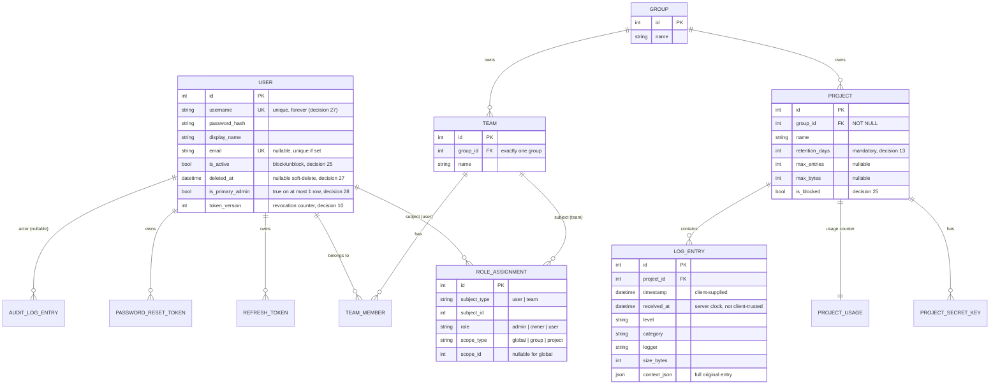

# Data model

*Читать на [русском](data-model.ru.md).*

The storage schema (`log-server-storage`) backs everything else in the
system. This document walks through the entities and their lifecycle
fields; for the exhaustive field list and every scenario, see
[specs/log-server-storage/spec.md](../../openspec/changes/add-structured-log-server/specs/log-server-storage/spec.md).

## Entity relationships

## Why these entities and not others

- **`Group` owns `Project`s; `Team` is a separate entity from `Group`.**
  A `Project`'s `group_id` is `NOT NULL` — it can't exist outside a
  group. `Team` exists purely for bulk role grants to a subset of a
  group's users; it is *not* a rename of "users in a group." Decision 6
  rejects collapsing the two: a group can hold several teams with
  different rights, and a `Group` simultaneously owning projects *and*
  being a grant recipient would conflate two different concepts.
- **`RoleAssignment` is one polymorphic table, not per-scope columns.**
  `subject_type: user|team` × `scope_type: global|group|project` covers
  every grant shape the RBAC model needs (decision 6, 7) — see
  [rbac-and-lifecycle.md](rbac-and-lifecycle.md) for how it's
  interpreted. A `team`-scoped grant is resolved through current
  membership at authorization time, not copied onto each member — adding
  someone to a team changes their effective rights immediately, with
  nothing to keep in sync.
- **`LogEntry` keeps typed columns *and* the full original JSON.**
  `project_id`/`timestamp`/`level`/`category`/`logger`/correlation
  fields get their own indexed columns because they're the common filter
  targets (composite index on `(project_id, level, timestamp)`); every
  other field — including arbitrary user-supplied `context` keys with no
  fixed schema — lives in `context_json`, queried via SQLite's JSON1
  (`json_extract`) when needed. Nothing is lost to fit a schema that
  can't know about a caller's custom fields in advance.
- **`received_at` is not `timestamp`.** `timestamp` is whatever the
  client claims; `received_at` is when the server actually saw the
  batch. They can diverge under retry/backoff delivery delays, and both
  are kept so an incident investigation can tell "when it happened"
  from "when we found out."
- **Refresh tokens and password-reset tokens are marked revoked/used,
  never deleted.** Keeping the row (with `revoked_at`/`used_at` set)
  lets the server distinguish "this token never existed" from "this
  token existed and was already consumed" — the latter is the signal
  used to detect refresh-token reuse and revoke the whole chain (see
  [auth.md](auth.md)).

## User lifecycle fields, at a glance

`User` carries three independent-but-related state fields — conflating
them was a real design trap this schema avoids:

| Field | Meaning | Set by | Reversible? |
|---|---|---|---|
| `is_active` | Can this account authenticate right now? | `block`/`unblock` (decision 25), also flipped by delete | Yes, via `unblock` — except see below |
| `deleted_at` | Was this account ever deleted (self or admin)? | `DELETE /v1/users/me` / `DELETE /v1/users/:id` (decision 27) | No — `unblock` explicitly refuses accounts with `deleted_at` set |
| `is_primary_admin` | Is this the one account bootstrap created first? | The first bootstrap only — auto-creation on an empty database (decision 49) or `create-admin` (decision 28) | N/A — no API path sets or clears it |

Deletion sets `is_active = false` *and* `deleted_at = now()` — it reuses
blocking's revocation mechanics (refresh-token revocation, `token_version`
bump) rather than inventing a second one, but adds the permanent marker
on top. See [rbac-and-lifecycle.md](rbac-and-lifecycle.md) for the full
state machine and who can trigger which transition.

## Indexes that matter

- `log_entries`: `project_id`, `timestamp`, `level`, `category`,
  `session_id`, `request_id`, plus a composite `(project_id, level,
  timestamp)` for the single most common query shape (scope + level +
  time range).
- `users.username`: unique, **not** scoped to `deleted_at IS NULL` — a
  deleted account's username stays reserved until the row is physically
  purged (decision 27; purge itself is an explicit non-goal).
- `users.email`: unique partial index (`WHERE email IS NOT NULL`), same
  non-exclusion of deleted rows.
- `users.is_primary_admin`: unique partial index (`WHERE
  is_primary_admin = true`) — a schema-level guarantee that a second row
  can never carry the flag, even if either bootstrap path had a bug
  (decisions 28/49).

## Storage engine

`drift` over embedded SQLite (`NativeDatabase`, `journal_mode=WAL`), one
`QueryExecutor` in one isolate — see
[technology-stack.md](technology-stack.md) for why `drift` specifically,
and the "Single isolate" principle in
[README.md](README.md) for what that constrains elsewhere in the design.
