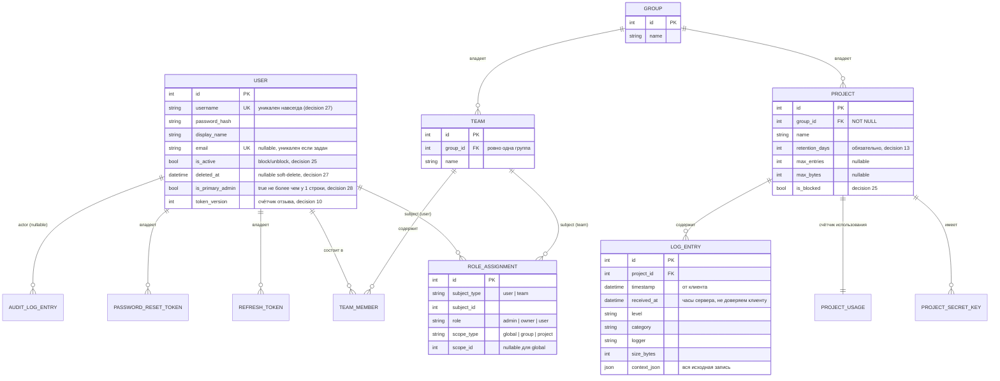

# Модель данных

*Read in [English](data-model.md).*

Схема хранения (`log-server-storage`) лежит в основе всего остального в
системе. Этот документ проходится по сущностям и полям их жизненного
цикла; исчерпывающий список полей и все сценарии — в
[specs/log-server-storage/spec.md](../../openspec/changes/add-structured-log-server/specs/log-server-storage/spec.md).

## Связи сущностей

## Почему именно эти сущности, а не другие

- **`Group` владеет `Project`-ами; `Team` — отдельная сущность от
  `Group`.** `group_id` у `Project` — `NOT NULL`, он не может
  существовать вне группы. `Team` существует исключительно для массовой
  выдачи прав подмножеству пользователей группы; это *не* переименование
  «пользователей в группе». Decision 6 отклоняет слияние двух сущностей:
  одна группа может держать несколько команд с разным набором прав, а
  `Group`, одновременно владеющая проектами *и* являющаяся получателем
  гранта, смешала бы два разных понятия.
- **`RoleAssignment` — одна полиморфная таблица, не отдельные колонки на
  каждую область.** `subject_type: user|team` × `scope_type:
  global|group|project` покрывает любую форму гранта, нужную модели RBAC
  (decision 6, 7) — как это трактуется, см.
  [rbac-and-lifecycle.md](rbac-and-lifecycle.ru.md). Грант,
  выданный команде, резолвится через текущее членство на момент проверки
  доступа, а не копируется на каждого участника — добавление человека в
  команду немедленно меняет его эффективные права, без необходимости
  что-либо синхронизировать.
- **`LogEntry` хранит и типизированные колонки, и полный исходный
  JSON.** `project_id`/`timestamp`/`level`/`category`/`logger`/поля
  корреляции получают собственные индексированные колонки, потому что
  это частые цели фильтрации (составной индекс на `(project_id, level,
  timestamp)`); всё остальное — включая произвольные пользовательские
  ключи `context` без фиксированной схемы — живёт в `context_json`,
  запрашиваемом через JSON1 SQLite (`json_extract`) при необходимости.
  Ничего не теряется ради схемы, которая не может заранее знать о
  пользовательских полях вызывающего.
- **`received_at` — не `timestamp`.** `timestamp` — то, что заявляет
  клиент; `received_at` — момент, когда сервер фактически увидел батч.
  Они могут расходиться при задержках доставки (retry/backoff), и оба
  хранятся, чтобы при расследовании инцидента можно было отличить «когда
  это произошло» от «когда мы об этом узнали».
- **Refresh-токены и токены восстановления пароля помечаются
  отозванными/использованными, но никогда не удаляются.** Сохранение
  строки (с установленным `revoked_at`/`used_at`) позволяет серверу
  отличить «этот токен никогда не существовал» от «этот токен
  существовал и уже был использован» — второй случай — сигнал,
  используемый для обнаружения повторного использования refresh-токена и
  отзыва всей цепочки (см. [auth.md](auth.ru.md)).

## Поля жизненного цикла User — кратко

`User` несёт три независимых, но связанных поля состояния — смешение их
в одно было бы реальной дизайн-ловушкой, которую эта схема избегает:

| Поле | Значение | Устанавливается | Обратимо? |
|---|---|---|---|
| `is_active` | Может ли аккаунт сейчас аутентифицироваться? | `block`/`unblock` (decision 25), также меняется при удалении | Да, через `unblock` — с исключением ниже |
| `deleted_at` | Был ли аккаунт когда-либо удалён (сам или админом)? | `DELETE /v1/users/me` / `DELETE /v1/users/:id` (decision 27) | Нет — `unblock` явно отказывает аккаунтам с установленным `deleted_at` |
| `is_primary_admin` | Это тот самый аккаунт, что bootstrap создал первым? | Только первый bootstrap — автосоздание на пустой базе (decision 49) или `create-admin` (decision 28) | Н/Д — ни один API-путь не устанавливает и не снимает его |

Удаление устанавливает `is_active = false` *и* `deleted_at = now()` —
переиспользует механику отзыва прав блокировки (отзыв refresh-токенов,
инкремент `token_version`), а не изобретает вторую, но добавляет поверх
постоянную метку. Полную диаграмму состояний и то, кто может вызвать
какой переход — см. [rbac-and-lifecycle.md](rbac-and-lifecycle.ru.md).

## Значимые индексы

- `log_entries`: `project_id`, `timestamp`, `level`, `category`,
  `session_id`, `request_id`, плюс составной `(project_id, level,
  timestamp)` под самый частый паттерн запроса (область + уровень +
  диапазон времени).
- `users.username`: уникален, **не** ограничен `deleted_at IS NULL` —
  username удалённого аккаунта остаётся зарезервированным, пока строка
  физически не вычищена (decision 27; сама очистка — явный non-goal).
- `users.email`: уникальный частичный индекс (`WHERE email IS NOT
  NULL`), то же неисключение удалённых строк.
- `users.is_primary_admin`: уникальный частичный индекс (`WHERE
  is_primary_admin = true`) — гарантия на уровне схемы, что вторая
  строка никогда не сможет нести этот флаг, даже если бы в любом из двух
  путей bootstrap была ошибка (decisions 28/49).

## Движок хранения

`drift` поверх embedded SQLite (`NativeDatabase`, `journal_mode=WAL`):
одно соединение-писатель и — раз чтения больше не делят его — пул
соединений-читателей, каждое на своём isolate (`--db-read-pool-size`) —
почему именно `drift` и про пул читателей см.
[technology-stack.md](technology-stack.ru.md), а что ограничивает
единственный писатель в остальном дизайне — принцип «один процесс» в
[README.md](README.ru.md).

### PostgreSQL: выбираемый оператором альтернативный backend

Реализовано — `--db-backend=postgres` (`StructuredLogDatabase.openPostgres`,
`lib/src/storage/database.dart`) настоящая, протестированная альтернатива
дефолтному SQLite-пути, а не план. Полная запись решения (контекст,
альтернативы, риски и все найденные по ходу дела диалект-специфичные
фиксы) — в
[openspec/changes/add-postgres-backend/](../../openspec/changes/add-postgres-backend/)
(`proposal.md`/`design.md`/`specs/`); это краткое изложение для читателя
архитектуры, не замена тем документам.

Embedded SQLite соответствует позиционированию сервера «один процесс,
без внешних зависимостей» (см. [README.md](README.ru.md#зачем-вообще-сервер)),
но не каждое развёртывание хочет именно этот компромисс — оператор, у
которого уже есть управляемый PostgreSQL (бэкапы, мониторинг, HA там уже
решены), ничего не выигрывает от второго, отдельно обслуживаемого
механизма хранения. Backend хранения — **явная настройка, которую
выбирает оператор при развёртывании** (`--db-backend=sqlite|postgres`,
SQLite по умолчанию, поведение не меняется) — никогда не переключение в
рантайме и никогда не автоматическая миграция данных между ними;
оператор, выбравший Postgres, начинает с пустой базы.

Что это **не** меняет: схему объектов (один набор таблиц `drift`,
генерируемых под оба диалекта через `drift_postgres`) и любое поведение,
видимое через HTTP API — round-trip произвольных полей `context`,
фильтрацию по ним, порядок id при конкурентном приёме. Это остаётся
одинаковым независимо от backend'а; различается только механизм под
капотом — подтверждено, а не предположено: у каждого диалект-специфичного
пути кода есть тест, прогоняющий его против настоящего Postgres
(`test/storage/postgres_*.dart`, тег `postgres`).

Что архитектурно различается по-настоящему:

- **Под Postgres нет пула изолятов-читателей.** `--db-read-pool-size`
  существует именно потому, что у одного файла SQLite одно
  соединение-писатель; PostgreSQL — настоящая клиент-серверная база со
  своим пулом соединений (`Pool` из `package:postgres`) и нативными
  конкурентными писателями (MVCC) — переносить отдельное понятие
  «пул читателей» некуда, есть только настройка размера одного общего
  пула, устроенная иначе (`--db-postgres-pool-size`, по умолчанию `10`).
  `--db-read-pool-size` под этим backend'ом только предупреждает при
  старте — на поведение не влияет.
- **Под Postgres нет тюнинга `PRAGMA`.** `journal_mode=WAL`/
  `busy_timeout`/`synchronous=NORMAL` существуют, чтобы обойти то, что
  нужно файлу SQLite с одним писателем; долговечность и поведение при
  конкурентном чтении/записи у PostgreSQL — его собственные значения по
  умолчанию, а не то, что этому серверу нужно настраивать.
- **Отдельная, специфичная для Postgres реализация горячего пути
  батч-вставки** (`DriftLogStore._insertPostgres`,
  `lib/src/storage/log_store.dart`). SQLite-путь с `last_insert_rowid()`
  и чтением диапазона id (конкретный механизм за цифрами пропускной
  способности из `technology-stack.md`, пул чтения/групповой коммит)
  опирается на то, что одно соединение держит транзакцию, в которую
  больше никто не может вставить параллельно — надёжно для SQLite, но не
  безопасное предположение для Postgres в общем случае. Postgres-путь
  вместо этого делает один multi-row `INSERT ... RETURNING *`, который
  напрямую связывает возвращённые строки со вставленными, без опоры на
  соседство id — проверено именно на конкурентных батчах, а не только на
  одиночном (`test/storage/postgres_log_store_test.dart`).
- **Фильтрация по `context.<key>` переносится** с SQLite'шного JSON1
  `json_extract` на `jsonb`-оператор пути `#>>` PostgreSQL
  (`LogFilter.appendConditions`, `lib/src/storage/log_filter.dart`) —
  единственная функция, которой нет ни в одном общем наборе у обоих
  диалектов. Одна принятая, задокументированная асимметрия переживает
  перенос: JSON-булево значение читается как `1`/`0` под SQLite (нет
  нативного булева типа), но как текст `true`/`false` под Postgres;
  in-memory предикат, которым пользуется живой поток
  (`LogFilter.matches`), не знает диалекта, которым порождена строка,
  которую сверяет, — он всегда рендерит по-SQLite'шному.
- **Плейсхолдеры сырого SQL не переносятся вовсе** — `?` это
  синтаксис SQLite/ODBC, который проводной протокол Postgres прямо
  отвергает (вместо этого — позиционные параметры `$1`, `$2`, ...).
  Каждый рукописный сырой SQL-фрагмент (`buildLogQuerySql` в
  `query.dart`, `buildAuditQuerySql` в `audit_query.dart`, батч-вставка
  выше) прогоняет готовый текст SQL через один небольшой
  диалект-осведомлённый проход перенумерации (`placeholdersForDialect`),
  а не встраивает синтаксис плейсхолдера в каждое условие по отдельности.

Всё остальное, что сегодня в коде выглядит «специфичным для SQLite» —
DB-side выражение по умолчанию для `createdAt` (подтверждено, что оно
уже диалект-переносимо без изменений — «неожиданная» часть этого
решения), пара булевых литералов в сыром SQL, одно DDL-выражение
частичного индекса — деталь переносимости с уже принятым и реализованным
решением в `design.md`, а не архитектурная развилка; полный список —
там.
