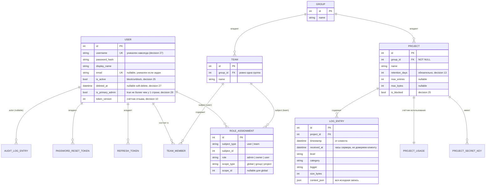

# Модель данных

*Read in [English](data-model.md).*

Схема хранения (`log-server-storage`) лежит в основе всего остального в
системе. Здесь разобраны сущности и поля их жизненного
цикла; исчерпывающий список полей и все сценарии — в
[specs/log-server-storage/spec.md](../../openspec/changes/add-structured-log-server/specs/log-server-storage/spec.md).

## Связи сущностей

Сущности вкратце:

- **`Group`** («группа») — контейнер верхнего уровня для вашей
  организации; ей принадлежат проекты и команды.
- **`Project`** («проект») — место, где физически хранятся записи логов;
  принадлежит одной `Group`.
- **`Team`** («команда») — именованный набор пользователей внутри
  `Group`, которому можно выдать роль как единому целому.
- **`User`** («пользователь») — учётная запись; получает роли через
  прямые выдачи или членство в команде.
- **`RoleAssignment`** («выдача роли») — грант одной роли одному
  субъекту (пользователю или команде) на одну область (глобально,
  группа или проект).
- **`LogEntry`** («запись лога») — одна структурированная запись лога.
- **`ProjectUsage`** («использование проекта») — текущие счётчики,
  которыми проверяется квота проекта.

```mermaid
erDiagram
    USER ||--o{ ROLE_ASSIGNMENT : "subject (user)"
    USER ||--o{ TEAM_MEMBER : "состоит в"
    USER ||--o{ REFRESH_TOKEN : владеет
    USER ||--o{ PASSWORD_RESET_TOKEN : владеет
    GROUP ||--o{ PROJECT : владеет
    GROUP ||--o{ TEAM : владеет
    TEAM ||--o{ TEAM_MEMBER : содержит
    TEAM ||--o{ ROLE_ASSIGNMENT : "subject (team)"
    PROJECT ||--o{ PROJECT_SECRET_KEY : имеет
    PROJECT ||--|| PROJECT_USAGE : "счётчик использования"
    PROJECT ||--o{ LOG_ENTRY : содержит
    USER ||--o{ AUDIT_LOG_ENTRY : "actor (nullable)"

    USER {
        int id PK
        string username UK "уникален навсегда (decision 27)"
        string password_hash
        string display_name
        string email UK "nullable, уникален если задан"
        bool is_active "block/unblock, decision 25"
        datetime deleted_at "nullable soft-delete, decision 27"
        bool is_primary_admin "true не более чем у 1 строки, decision 28"
        int token_version "счётчик отзыва, decision 10"
    }
    GROUP {
        int id PK
        string name
    }
    TEAM {
        int id PK
        int group_id FK "ровно одна группа"
        string name
    }
    PROJECT {
        int id PK
        int group_id FK "NOT NULL"
        string name
        int retention_days "обязательно, decision 13"
        int max_entries "nullable"
        int max_bytes "nullable"
        bool is_blocked "decision 25"
    }
    ROLE_ASSIGNMENT {
        int id PK
        string subject_type "user | team"
        int subject_id
        string role "admin | owner | user"
        string scope_type "global | group | project"
        int scope_id "nullable для global"
    }
    LOG_ENTRY {
        int id PK
        int project_id FK
        datetime timestamp "от клиента"
        datetime received_at "часы сервера, не доверяем клиенту"
        string level
        string category
        string logger
        int size_bytes
        json context_json "вся исходная запись"
    }
```

## Почему именно эти сущности, а не другие

- **`Project` принадлежат `Group`; `Team` — сущность, отдельная от
  `Group`.** `group_id` у `Project` — `NOT NULL`: проект не может
  существовать вне группы. `Team` существует исключительно для массовой
  выдачи прав подмножеству пользователей группы; это *не* переименование
  «пользователей в группе». Decision 6 отклоняет слияние двух сущностей:
  одна группа может содержать несколько команд с разными правами, а
  `Group`, которой одновременно принадлежат проекты *и* выдаются
  гранты, смешала бы два разных понятия.
- **`RoleAssignment` — одна полиморфная таблица, а не отдельные колонки
  на каждую область.** `subject_type: user|team` × `scope_type:
  global|group|project` описывает любую форму гранта, какая нужна модели
  RBAC (decision 6, 7); как это трактуется — см.
  [rbac-and-lifecycle.md](rbac-and-lifecycle.ru.md). Грант,
  выданный команде, резолвится через текущее членство на момент проверки
  доступа, а не копируется каждому участнику, поэтому добавление человека
  в команду сразу меняет его эффективные права и ничего синхронизировать
  не нужно.
- **`LogEntry` хранит и типизированные колонки, и полный исходный
  JSON.** `project_id`/`timestamp`/`level`/`category`/`logger`/поля
  корреляции получают собственные индексированные колонки, потому что
  по ним часто фильтруют (составной индекс на `(project_id, level,
  timestamp)`); всё остальное — включая произвольные пользовательские
  ключи `context` без фиксированной схемы — хранится в `context_json`
  и при необходимости запрашивается через JSON1 SQLite (`json_extract`).
  Схема не может заранее знать о пользовательских полях вызывающего, но
  ради неё ничего не теряется.
- **`received_at` — не `timestamp`.** `timestamp` — время, которое сообщает
  клиент; `received_at` — момент, когда сервер на самом деле получил батч.
  Они могут расходиться при задержках доставки (retry/backoff), и оба
  хранятся, чтобы при расследовании инцидента можно было отличить «когда
  это произошло» от «когда мы об этом узнали».
- **Refresh-токены и токены восстановления пароля помечаются
  отозванными/использованными, но никогда не удаляются.** Пока строка
  сохранена (с установленным `revoked_at`/`used_at`), сервер может
  отличить «этот токен никогда не существовал» от «этот токен
  существовал и уже был использован»; именно второй случай служит
  сигналом, по которому обнаруживается повторное использование
  refresh-токена и отзывается вся цепочка (см. [auth.md](auth.ru.md)). Refresh-токен хранит
  и то, *почему* он отозван (`revoked_reason`): сигналом повторного
  использования служит только токен, потраченный ротацией, а не
  завершённый выходом, сменой пароля или администратором.

## Поля жизненного цикла User — кратко

У `User` три независимых, но связанных поля состояния. Свести их в
одно — настоящая ловушка дизайна, и эта схема в неё не попадает:

| Поле | Значение | Устанавливается | Обратимо? |
|---|---|---|---|
| `is_active` | Может ли аккаунт сейчас аутентифицироваться? | `block`/`unblock` (decision 25), также меняется при удалении | Да, через `unblock` — с исключением ниже |
| `deleted_at` | Был ли аккаунт когда-либо удалён (сам или админом)? | `DELETE /v1/users/me` / `DELETE /v1/users/:id` (decision 27) | Нет — `unblock` явно отказывает аккаунтам с установленным `deleted_at` |
| `is_primary_admin` | Это тот самый аккаунт, что bootstrap создал первым? | Только первый bootstrap — автосоздание на пустой базе (decision 49) или `create-admin` (decision 28) | Н/Д — ни один API-путь не устанавливает и не снимает его |

Удаление устанавливает `is_active = false` *и* `deleted_at = now()`: оно
переиспользует механику отзыва прав, которой пользуется блокировка (отзыв
refresh-токенов, увеличение `token_version`), а не изобретает вторую, и
лишь добавляет поверх постоянную метку. Полная диаграмма состояний и то,
кто какой переход может вызвать, — в [rbac-and-lifecycle.md](rbac-and-lifecycle.ru.md).

## Важные индексы

- `log_entries`: `project_id`, `timestamp`, `level`, `category`,
  `session_id`, `request_id`, плюс составной `(project_id, level,
  timestamp)` под самый частый паттерн запроса (область + уровень +
  диапазон времени).
- `users.username`: уникален, **не** ограничен `deleted_at IS NULL` —
  username удалённого аккаунта остаётся зарезервированным, пока строка
  физически не вычищена (decision 27; сама очистка — явный non-goal).
- `users.email`: уникальный частичный индекс (`WHERE email IS NOT
  NULL`) — удалённые строки, как и там, не исключены.
- `users.is_primary_admin`: уникальный частичный индекс (`WHERE
  is_primary_admin = true`) — схема гарантирует, что этот флаг
  никогда не окажется у второй строки, даже если бы в одном из двух
  путей bootstrap была ошибка (decisions 28/49).

## Движок хранения

`drift` поверх embedded SQLite (`NativeDatabase`, `journal_mode=WAL`):
одно соединение-писатель и пул соединений-читателей, каждое на своём
isolate (`--db-read-pool-size`), — чтения больше не делят соединение с
записью. Почему выбран именно `drift` и как устроен пул читателей — см.
[technology-stack.md](technology-stack.ru.md); чем единственный писатель
по-прежнему ограничивает остальной дизайн — см. принцип «один процесс» в
[README.md](README.ru.md) (почему сервер не шардируется по процессам).

### PostgreSQL: выбираемый оператором альтернативный backend

Реализовано: `--db-backend=postgres` (`StructuredLogDatabase.openPostgres`,
`lib/src/storage/database.dart`) — настоящая, протестированная альтернатива
дефолтному SQLite-пути, а не план. Полная запись решения (контекст,
альтернативы, риски и все найденные по ходу дела диалект-специфичные
фиксы) — в
[openspec/changes/archive/2026-10-01-add-postgres-backend/](../../openspec/changes/archive/2026-10-01-add-postgres-backend/)
(`proposal.md`/`design.md`/`specs/`); это краткое изложение для читателя
архитектуры, а не замена тем документам.

Embedded SQLite соответствует позиционированию сервера «один процесс,
без внешних зависимостей» (см. [README.md](README.ru.md#зачем-вообще-сервер)),
но этот компромисс устраивает не каждое развёртывание — оператор, у
которого уже есть управляемый PostgreSQL (бэкапы, мониторинг, HA там уже
решены), ничего не выигрывает от второго, отдельно обслуживаемого
механизма хранения. Backend хранения — **явная настройка, которую
выбирает оператор при развёртывании** (`--db-backend=sqlite|postgres`,
SQLite по умолчанию, поведение не меняется), а не переключение в
рантайме и не автоматическая миграция данных между ними;
оператор, выбравший Postgres, начинает с пустой базы.

Что это **не** меняет: схему объектов (один набор таблиц `drift`,
генерируемых под оба диалекта через `drift_postgres`) и любое поведение,
видимое через HTTP API — round-trip произвольных полей `context`,
фильтрацию по ним, порядок id при конкурентном приёме. Это остаётся
одинаковым независимо от backend'а; различается только внутренний
механизм, и это подтверждено, а не предположено: у каждого диалект-специфичного
пути кода есть тест, прогоняющий его против настоящего Postgres
(`test/storage/postgres_*.dart`, тег `postgres`).

Что архитектурно различается по-настоящему:

- **Под Postgres нет пула изолятов-читателей.** `--db-read-pool-size`
  существует именно потому, что у одного файла SQLite одно
  соединение-писатель; PostgreSQL — настоящая клиент-серверная база со
  своим пулом соединений (`Pool` из `package:postgres`) и нативными
  конкурентными писателями (MVCC), так что переносить отдельное понятие
  «пул читателей» некуда: есть только размер одного общего пула, и
  задаётся он иначе (`--db-postgres-pool-size`, по умолчанию `10`).
  `--db-read-pool-size` под этим backend'ом лишь выдаёт предупреждение
  при старте и на поведение не влияет.
- **Под Postgres нет тюнинга `PRAGMA`.** `journal_mode=WAL`/
  `busy_timeout`/`synchronous=NORMAL` нужны, чтобы приспособиться к файлу
  SQLite с одним писателем; долговечность и поведение при конкурентном
  чтении/записи у PostgreSQL задают его собственные значения по
  умолчанию, и настраивать их этому серверу не нужно.
- **Отдельная, специфичная для Postgres реализация горячего пути
  батч-вставки** (`DriftLogStore._insertPostgres`,
  `lib/src/storage/log_store.dart`). SQLite-путь с `last_insert_rowid()`
  и чтением диапазона id (именно он стоит за цифрами пропускной
  способности из `technology-stack.md`, пул чтения/групповой коммит)
  опирается на то, что одно соединение держит транзакцию, в которую
  больше никто не может вставить параллельно: для SQLite это надёжно, а
  для Postgres в общем случае — небезопасное предположение. Postgres-путь
  вместо этого выполняет один multi-row `INSERT ... RETURNING *`, который
  сразу возвращает именно вставленные строки и не опирается на то, что их
  id идут подряд; это проверено именно на конкурентных батчах, а не только
  на одиночном (`test/storage/postgres_log_store_test.dart`).
- **Фильтрация по `context.<key>` переносится** с SQLite'шного JSON1
  `json_extract` на `jsonb`-оператор пути `#>>` PostgreSQL
  (`LogFilter.appendConditions`, `lib/src/storage/log_filter.dart`) —
  единственная функция, у которой в двух диалектах нет общего
  аналога. При переносе сохраняется одна принятая и задокументированная
  асимметрия: JSON-булево значение читается как `1`/`0` под SQLite (нет
  нативного булева типа), но как текст `true`/`false` под Postgres;
  in-memory предикат живого потока (`LogFilter.matches`)
  всегда следует соглашению SQLite: диалекта, на который можно было бы
  опереться, у него нет.
- **Плейсхолдеры сырого SQL не переносятся вовсе** — `?` это
  синтаксис SQLite/ODBC, который проводной протокол Postgres прямо
  отвергает (вместо этого — позиционные параметры `$1`, `$2`, ...).
  Готовый текст каждого рукописного фрагмента сырого SQL
  (`buildLogQuerySql` в `query.dart`, `buildAuditQuerySql` в
  `audit_query.dart`, батч-вставка выше) проходит через один небольшой
  шаг перенумерации с учётом диалекта (`placeholdersForDialect`), вместо
  того чтобы вписывать синтаксис плейсхолдера в каждое условие отдельно.

Всё остальное, что сегодня выглядит в коде «специфичным для SQLite», —
выражение по умолчанию для `createdAt` на стороне БД (оказалось, что оно
переносится между диалектами без изменений, — «неожиданная» часть этого
решения), пара булевых литералов в сыром SQL, одно DDL-выражение
частичного индекса — это детали переносимости, решение по которым уже
принято и реализовано в `design.md`, а не архитектурные развилки; полный
список — там.
