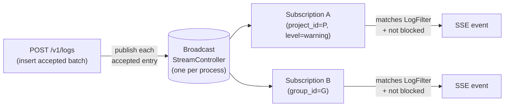
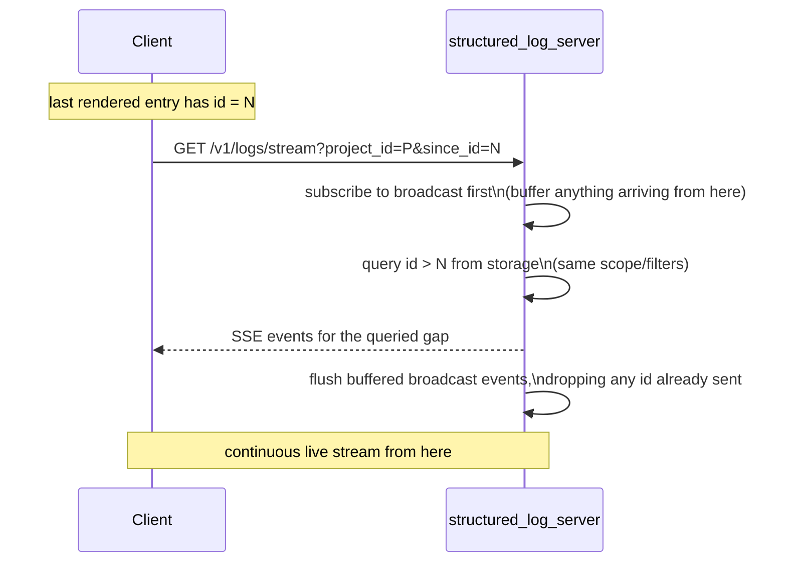
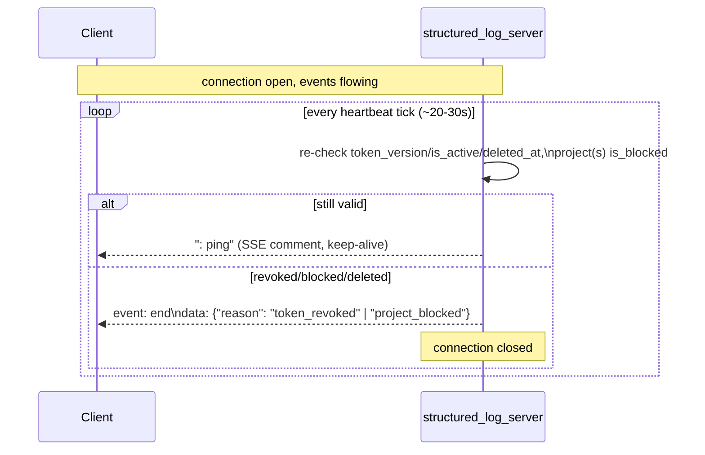

# Live log streaming (SSE)

*Читать на [русском](live-streaming.ru.md).*

Covers `log-server-live-stream` (decisions 29–31 in `design.md`).
Normative requirements:
[specs/log-server-live-stream/spec.md](../../openspec/changes/add-structured-log-server/specs/log-server-live-stream/spec.md).

## Why SSE, not WebSocket or polling

`GET /v1/logs/stream` is strictly one-directional (server → client; the
client only chooses its scope/filters once, via query parameters at
subscribe time). WebSocket would add protocol complexity (handshake,
framing, hand-rolled keep-alive) for a duplex capability nothing here
uses. Polling was rejected outright — the user asked for push delivery
specifically, and polling either wastes cycles on frequent empty
responses or adds latency if infrequent. SSE is a plain HTTP request
with a streamed response body (`Content-Type: text/event-stream`) — it
rides the same `shelf` `Pipeline` and the same infrastructure (proxies,
load balancers) as the rest of the API.

## Where the events come from: in-process broadcast



The server already runs in one isolate with one `QueryExecutor`
(decision 4) — every insert is visible to that same process, so a
`StreamController<LogEntry>.broadcast()` is enough; no external pub/sub
(Redis or similar) is introduced. Each open SSE connection is a
subscriber that independently applies:

1. **Scope match** — does the entry's `project_id` belong to the
   subscription's `project_id`/`group_id`?
2. **Not blocked** — a point-lookup of the project's current
   `is_blocked` (checked per event, not just once at subscribe time —
   see [rbac-and-lifecycle.md](rbac-and-lifecycle.md) for what blocking
   means).
3. **`LogFilter.matches(entry)`** — the *same* predicate model used to
   build the SQL `WHERE` clause for `GET /v1/logs`, refactored to also
   work as an in-memory check (decision 29) — one filter model, two
   consumers, instead of two implementations that could drift apart.

This means cross-isolate scaling (already an explicit non-goal for the
whole server) would require replacing this broadcast with something
external — it isn't a gap specific to streaming, just where the
single-isolate assumption becomes visible.

## Bridging the gap: `since_id` catch-up

There's an inherent window between the last `GET /v1/logs` page a client
rendered and the moment its `GET /v1/logs/stream` subscription opens.
`since_id` closes it without loss or duplication:



Subscribing to the broadcast *before* running the catch-up query (not
after) is what prevents a lost event in the gap — anything that arrives
during the query is buffered, not missed. `since_id` is optional; when
it's omitted, the stream simply starts from the moment of subscription
with no catch-up.

## Response buffering: `shelf` turns it on by default

`shelf_io` buffers a streamed response body until the buffer fills — which
for a live stream means never: the client sees neither events nor
heartbeats, and the connection looks open and dead at the same time. The
opt-out is an explicit key in `Response.context`:

```dart
return Response.ok(
  body.stream,
  headers: sseHeaders,
  context: const {'shelf.io.buffer_output': false},
);
```

What matters is that this defect is invisible to tests that call the
`Handler` directly and read `response.read()`: the buffering lives in
`HttpResponse`, so it only appears on a real socket. That is why delivery
is also covered by an integration test that starts `bin/server.dart` as a
process (`test/bin/server_integration_test.dart`), not by handler tests
alone.

The response headers carry `Cache-Control: no-cache, no-transform` and
`X-Accel-Buffering: no` for the same reason — an intermediary proxy that
decides to "collect" the body reproduces exactly the same picture.

## Re-validating a long-lived connection

An access token is short-lived by design (minutes — see
[auth.md](auth.md)), but an SSE connection can outlive it. Trusting the
token for the connection's whole lifetime would be the one place the
system's "immediate revocation" guarantee (`token_version`, decision 10)
quietly stopped applying — there's no "next request" on an open stream
to catch a revoked grant.



The HTTP status is already `200` by the time revocation is detected —
it can't be retroactively turned into a `401`/`403`, so the signal is a
terminal SSE event instead. The client treats this exactly like an
out-of-band `401`/`403`: reconnect through the same refresh-token flow
used elsewhere (see [admin-client.md](admin-client.md)).

## Project blocking during an active subscription

Blocking mirrors `GET /v1/logs`'s existing behavior (see
[rbac-and-lifecycle.md](rbac-and-lifecycle.md)), but now has to account
for a connection that outlives the blocking event itself:

| Scenario | Behavior |
|---|---|
| Subscribe directly to an already-blocked `project_id` | `403 project_blocked`, connection never opens |
| Subscribe to a `group_id` containing a blocked project | Connection opens; that project's events are silently excluded, others delivered normally |
| A project is blocked *while* a direct `project_id` subscription is open | Connection is closed with a terminal event, not left open silently |

## Endpoint contract, in brief

`GET /v1/logs/stream` takes the same required `project_id`/`group_id`
(exactly one) and the same optional filters as `GET /v1/logs`
(`level`/`category`/`logger`/correlation fields/`q`/`context.*`), plus
`since_id` (optional). Authorization/404 happen before the response
upgrades to `event-stream` — a rejected subscription is a plain `403`/
`404`, not a stream that opens and immediately errors.

Frames:

```text
id: <log entry id>
event: log
data: <entry as JSON, one line>

: ping
```

## Why Bearer auth, not browser `EventSource`

Browser `EventSource` can't send custom headers, which is why the
obvious approach — a token in the URL's query string — comes up. It's
rejected here for the same reason `/v1/auth/token`'s revocation endpoint
avoids a URL-based token (decision 10 already made this call once): a
secret in the URL ends up in proxy/server logs and browser history.
`structured_log_admin_client` doesn't use `EventSource` — it reads the
stream through `dio`'s `ResponseType.stream`, with the same
`Authorization`-injecting interceptor used for every other request
(decision 19), and parses `data:`/`: ping` frames itself. This is
noted as an explicit trade-off: a browser build that wanted to consume
this endpoint directly via `EventSource` would need a different
mechanism (see `design.md`'s Open Questions).
