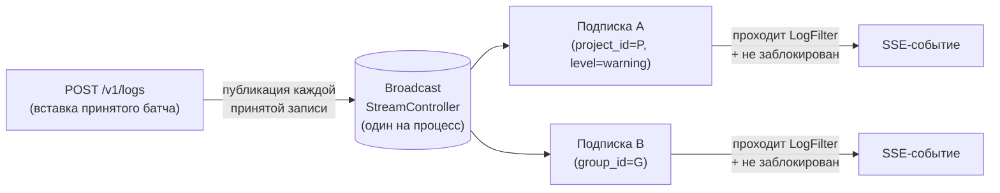
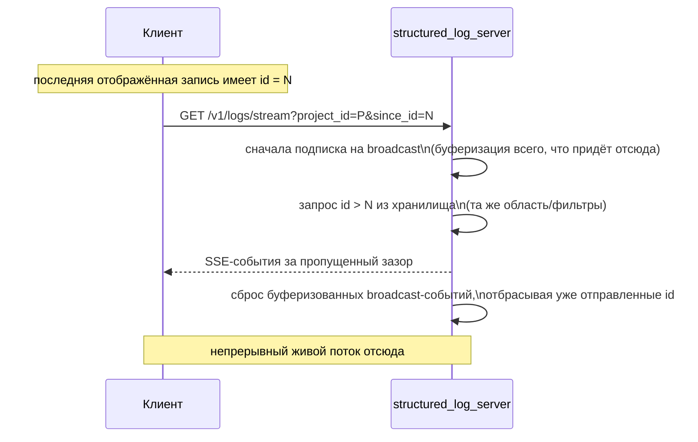
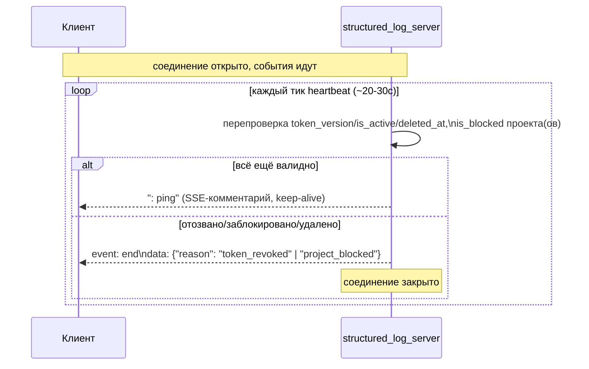

# Живая доставка логов (SSE)

*Read in [English](live-streaming.md).*

Охватывает `log-server-live-stream` (decisions 29–31 в `design.md`).
Нормативные требования:
[specs/log-server-live-stream/spec.md](../../openspec/changes/add-structured-log-server/specs/log-server-live-stream/spec.md).

## Почему SSE, а не WebSocket или polling

`GET /v1/logs/stream` строго однонаправлен (сервер → клиент; клиент
выбирает область/фильтры один раз, через query-параметры в момент
подписки). WebSocket добавил бы протокольную сложность (рукопожатие,
кадрирование, самодельный keep-alive) ради дуплекса, которым здесь никто
не пользуется. Polling отклонён однозначно — пользователь прямо просил
push-доставку, а polling либо тратит циклы на частые пустые ответы, либо
добавляет задержку при редком опросе. SSE — обычный HTTP-запрос с
потоковым телом ответа (`Content-Type: text/event-stream`) — идёт через
тот же `shelf` `Pipeline` и ту же инфраструктуру (прокси, балансировщики),
что и остальной API.

## Откуда берутся события: in-process broadcast



Сервер уже работает в одном isolate с одним `QueryExecutor` (decision
4) — каждая вставка видна этому же процессу, так что
`StreamController<LogEntry>.broadcast()` достаточно; внешний pub/sub
(Redis или аналог) не вводится. Каждое открытое SSE-соединение —
подписчик, независимо применяющий:

1. **Совпадение области** — принадлежит ли `project_id` события
   `project_id`/`group_id` подписки?
2. **Не заблокирован** — point-lookup текущего `is_blocked` проекта
   (проверяется на каждое событие, не только один раз при подписке — что
   означает блокировка, см. [rbac-and-lifecycle.md](rbac-and-lifecycle.ru.md)).
3. **`LogFilter.matches(entry)`** — *та же* модель предиката, что строит
   SQL-условие `WHERE` для `GET /v1/logs`, отрефакторенная, чтобы также
   работать как проверка в памяти (decision 29) — одна модель фильтра,
   два потребителя, вместо двух реализаций, которые могли бы разойтись.

Это значит, что кросс-isolate масштабирование (уже явный non-goal для
всего сервера) потребовало бы замены этого broadcast на что-то внешнее —
это не пробел, специфичный для стриминга, а просто место, где становится
видно допущение об одном isolate.

## Закрытие зазора: catch-up по `since_id`

Между последней страницей `GET /v1/logs`, которую отрендерил клиент, и
моментом открытия его подписки `GET /v1/logs/stream` неизбежен зазор.
`since_id` закрывает его без потери и без дублирования:



Именно подписка на broadcast *до* выполнения catch-up-запроса (не после)
предотвращает потерю события в зазоре — всё, что приходит во время
запроса, буферизуется, а не теряется. `since_id` необязателен; без него
поток просто начинается с момента подписки, без catch-up.

## Буферизация ответа: `shelf` по умолчанию её включает

`shelf_io` буферизует потоковое тело ответа, пока буфер не заполнится, —
для живого потока это означает «никогда»: клиент не видит ни событий, ни
heartbeat'ов, соединение выглядит открытым и мёртвым одновременно.
Отключается только явно, ключом в `Response.context`:

```dart
return Response.ok(
  body.stream,
  headers: sseHeaders,
  context: const {'shelf.io.buffer_output': false},
);
```

Существенно, что этот дефект не виден в тестах, которые вызывают `Handler`
напрямую и читают `response.read()`: буферизация живёт в `HttpResponse`,
то есть появляется только на настоящем сокете. Поэтому сценарий доставки
покрыт ещё и интеграционным тестом, поднимающим `bin/server.dart` как
процесс (`test/bin/server_integration_test.dart`), а не только
handler-тестами.

Заголовки ответа по той же причине включают `Cache-Control:
no-cache, no-transform` и `X-Accel-Buffering: no` — промежуточный прокси,
который решит «дособрать» тело, воспроизведёт ровно ту же картину.

## Ревалидация долгоживущего соединения

Access-токен короткоживущий по дизайну (минуты — см.
[auth.md](auth.ru.md)), но SSE-соединение может жить дольше него.
Доверять токену на весь срок жизни соединения было бы тем самым местом,
где гарантия системы «немедленный отзыв» (`token_version`, decision 10)
незаметно перестала бы действовать — на открытом потоке нет «следующего
запроса», который поймал бы отозванный грант.



HTTP-статус к моменту обнаружения отзыва уже `200` — его нельзя
задним числом превратить в `401`/`403`, поэтому сигнал — терминальное
SSE-событие. Клиент трактует это ровно как внеполосный `401`/`403`:
переподключение через тот же flow refresh-токена, что и везде (см.
[admin-client.md](admin-client.ru.md)).

## Блокировка проекта во время активной подписки

Блокировка зеркалит уже существующее поведение `GET /v1/logs` (см.
[rbac-and-lifecycle.md](rbac-and-lifecycle.ru.md)), но теперь должна
учитывать соединение, которое живёт дольше самого события блокировки:

| Сценарий | Поведение |
|---|---|
| Подписка напрямую на уже заблокированный `project_id` | `403 project_blocked`, соединение не открывается |
| Подписка на `group_id`, содержащую заблокированный проект | Соединение открывается; события этого проекта молча исключаются, остальные доставляются штатно |
| Проект блокируется *во время* открытой прямой подписки `project_id` | Соединение закрывается терминальным событием, не остаётся молча открытым |

## Контракт эндпоинта — кратко

`GET /v1/logs/stream` принимает тот же обязательный
`project_id`/`group_id` (ровно один) и те же опциональные фильтры, что
`GET /v1/logs` (`level`/`category`/`logger`/поля корреляции/`q`/`context.*`),
плюс `since_id` (опционален). Авторизация/404 происходят до перехода
ответа в `event-stream` — отклонённая подписка — обычный `403`/`404`, а
не поток, который открывается и сразу же выдаёт ошибку.

Кадры:

```text
id: <id записи лога>
event: log
data: <запись как JSON, одна строка>

: ping
```

## Почему Bearer-заголовок, а не браузерный `EventSource`

Браузерный `EventSource` не умеет отправлять произвольные заголовки,
поэтому напрашивается очевидный подход — токен в query-строке URL. Он
отклонён здесь по той же причине, по которой эндпоинт отзыва
`/v1/auth/token` избегает токена в URL (decision 10 уже принимала это
решение один раз): секрет в URL оседает в логах прокси/сервера и истории
браузера. `structured_log_admin_client` не использует `EventSource` —
читает поток через `ResponseType.stream` `dio`, тем же
interceptor'ом, подставляющим `Authorization`, что и на любой другой
запрос (decision 19), и сам разбирает кадры `data:`/`: ping`. Это
отмечено как осознанный компромисс: web-сборке, которая захотела бы
потреблять этот эндпоинт напрямую через `EventSource`, потребовался бы
другой механизм (см. Open Questions в `design.md`).
