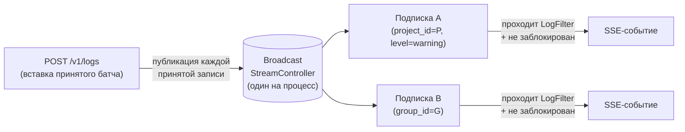
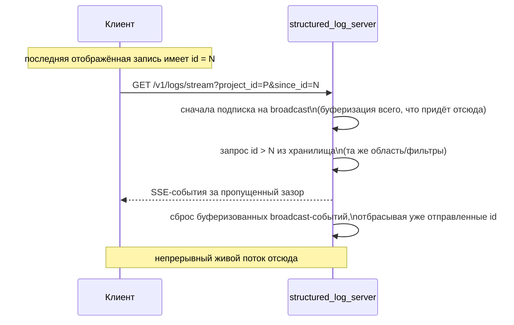
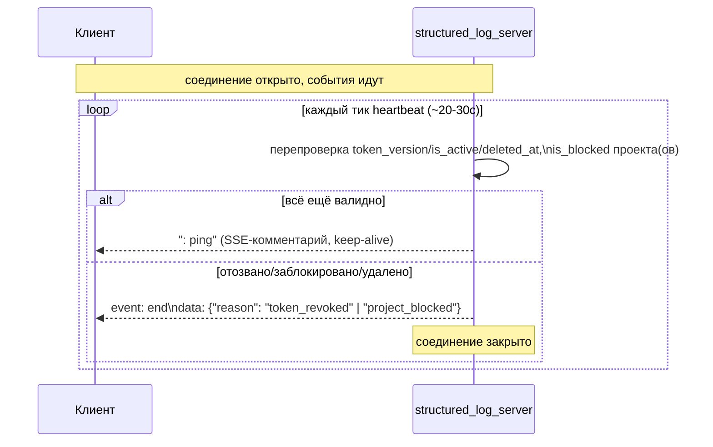

# Доставка логов в реальном времени (SSE)

*Read in [English](live-streaming.md).*

Здесь описан `log-server-live-stream` (decisions 29–31 в `design.md`).
Нормативные требования:
[specs/log-server-live-stream/spec.md](../../openspec/changes/add-structured-log-server/specs/log-server-live-stream/spec.md).

## Почему SSE, а не WebSocket или polling

`GET /v1/logs/stream` умеет отправлять данные только в одну сторону —
от сервера клиенту, а область и фильтры клиент выбирает один раз, через
query-параметры в момент подписки. WebSocket даёт двустороннюю
(«duplex») связь, которая здесь не нужна, а платить за неё пришлось бы
дополнительной сложностью протокола (рукопожатие, кадрирование,
самодельный keep-alive). Polling отклонён однозначно — пользователь прямо просил
push-доставку, а polling либо тратит циклы на частые пустые ответы, либо
добавляет задержку при редком опросе. SSE (Server-Sent Events) — это
обычный HTTP-запрос с потоковым телом ответа
(`Content-Type: text/event-stream`), и идёт он через тот же `shelf`
`Pipeline` и ту же инфраструктуру (прокси, балансировщики), что и
остальной API.

## Откуда берутся события: in-process broadcast


```mermaid
flowchart LR
    Ingest["POST /v1/logs\n(вставка принятого батча)"] -->|публикация каждой\nпринятой записи| BC[("Broadcast\nStreamController\n(один на процесс)")]
    BC --> S1["Подписка A\n(project_id=P, level=warning)"]
    BC --> S2["Подписка B\n(group_id=G)"]
    S1 -->|"проходит LogFilter\n+ не заблокирован"| E1["SSE-событие"]
    S2 -->|"проходит LogFilter\n+ не заблокирован"| E2["SSE-событие"]
```

Сервер уже обрабатывает запросы в одном isolate, и каждая вставка по-прежнему
идёт через единственное соединение-писатель, хотя у чтений теперь есть свой
пул (`technology-stack.md`) — так что `StreamController<LogEntry>.broadcast()`
достаточно; внешний pub/sub (Redis или аналог) не вводится. Каждое открытое
SSE-соединение — подписчик, который сам по себе проверяет:

1. **Совпадение области** — принадлежит ли `project_id` события
   `project_id`/`group_id` подписки?
2. **Не заблокирован** — point-lookup текущего `is_blocked` проекта
   (проверяется на каждом событии, а не однажды при подписке; что
   означает блокировка — см. [rbac-and-lifecycle.md](rbac-and-lifecycle.ru.md)).
3. **`LogFilter.matches(entry)`** — *та же* модель предиката, что строит
   SQL-условие `WHERE` для `GET /v1/logs`; её переработали так, чтобы она
   работала и как проверка в памяти (decision 29). Одна модель фильтра на
   двух потребителей — вместо двух реализаций, которые могли бы разойтись.

Это значит, что кросс-isolate масштабирование *обработки запросов* (уже
явный non-goal для всего сервера) потребовало бы заменить этот broadcast
чем-то внешним. Это не пробел именно стриминга — просто здесь это
допущение становится видно. Пул читателей его не затрагивает: эти
isolate обслуживают только `SELECT` и никогда не пишут, так что вставка
всегда идёт через единственного писателя и всегда в том же процессе, где
работает broadcast.

## Закрытие зазора: catch-up по `since_id`

Между последней страницей `GET /v1/logs`, которую отрисовал клиент, и
моментом открытия его подписки `GET /v1/logs/stream` неизбежен зазор.
`since_id` закрывает его без потери и без дублирования:


```mermaid
sequenceDiagram
    participant Client as Клиент
    participant Srv as structured_log_server

    Note over Client: последняя отображённая запись имеет id = N
    Client->>Srv: GET /v1/logs/stream?project_id=P&since_id=N
    Srv->>Srv: сначала подписка на broadcast\n(буферизация всего, что придёт отсюда)
    Srv->>Srv: запрос id > N из хранилища\n(та же область/фильтры)
    Srv-->>Client: SSE-события за пропущенный зазор
    Srv->>Srv: сброс буферизованных broadcast-событий,\nотбрасывая уже отправленные id
    Note over Srv,Client: непрерывный живой поток отсюда
```

Событие в зазоре не теряется именно потому, что подписка на broadcast
оформляется *до* catch-up-запроса, а не после: всё, что приходит во
время запроса, буферизуется. `since_id` необязателен; без него
поток просто начинается с момента подписки, без catch-up.

В передаче буфера та же гонка повторяется в миниатюре. Допустим, в момент
начала сброса буфер держит события 101–103. Если во время сброса
приходит событие 104, его нельзя потерять только потому, что буфер уже
вычитывался, — доставка буферизованного события может ждать (событие
проекта, о котором сервер ещё не спрашивал, требует чтения из базы), и
пока она ждёт, приходят и буферизуются новые события.
Поэтому сброс берёт буфер порциями, пока не найдёт его пустым, и переключается
на живую доставку в том же ходе цикла событий, в котором заглянул в него
последний раз: событие, попавшее
после того, как сброс снял копию, но до переключения, доставляется, а не
выбрасывается. (Раньше буфер очищался один раз в конце, и такие события
терялись; в последующем catch-up их тоже не было: клиент просит его только при
переподключении.)

## Буферизация ответа: `shelf` по умолчанию её включает

`shelf_io` буферизует потоковое тело ответа, пока буфер не заполнится, —
для живого потока это означает «никогда»: клиент не видит ни событий, ни
heartbeat'ов, соединение выглядит открытым и мёртвым одновременно.
Отключить её можно только явно, ключом в `Response.context`:

```dart
return Response.ok(
  body.stream,
  headers: sseHeaders,
  context: const {'shelf.io.buffer_output': false},
);
```

Важно, что этот дефект не виден в тестах, которые вызывают `Handler`
напрямую и читают `response.read()`: буферизация происходит в `HttpResponse`,
то есть проявляется только на настоящем сокете. Поэтому сценарий доставки
проверяет ещё и интеграционный тест, который поднимает `bin/server.dart`
процессом (`test/bin/server_integration_test.dart`), а не только
handler-тестами.

Заголовки ответа по той же причине включают `Cache-Control:
no-cache, no-transform` и `X-Accel-Buffering: no` — промежуточный прокси,
который решит «дособрать» тело, воспроизведёт ровно ту же картину.

### Первый кадр: заголовки ждут байта

`dart:io` отправляет заголовки ответа вместе с первым байтом тела. Поэтому подписка,
которой нечего сказать (обычное состояние тихого проекта), не отправляла
ничего, даже заголовков, до первого heartbeat: по умолчанию 25 с. Клиент,
прокси или браузер, ждущие заголовки, видели соединение, которое не открыто и
не упало. Поэтому первый кадр потока — комментарий `: connected`,
записываемый сразу, как только подписка создана (после авторизации, так что
отклонённый вызывающий по-прежнему получает обычную JSON-ошибку). Он не несёт
события, и клиенты его игнорируют, как и heartbeat. Как и буферизацию выше, это
не видно в handler-тесте (`Response` существует сразу), поэтому поведение
закреплено тестом на настоящем сокете с интервалом heartbeat, намного превышающим длительность
теста.

## Ревалидация долгоживущего соединения

Access-токен намеренно короткоживущий (минуты — см.
[auth.md](auth.ru.md)), но SSE-соединение может жить дольше него.
Если доверять токену на весь срок жизни соединения, именно здесь
гарантия системы «немедленный отзыв» (`token_version`, decision 10)
незаметно перестала бы действовать — на открытом потоке нет «следующего
запроса», который поймал бы отозванный грант.


```mermaid
sequenceDiagram
    participant Client as Клиент
    participant Srv as structured_log_server

    Note over Srv,Client: соединение открыто, события идут
    loop каждый тик heartbeat (~20-30с)
        Srv->>Srv: перепроверка token_version/is_active/deleted_at,\nis_blocked проекта(ов)
        alt всё ещё валидно
            Srv-->>Client: ": ping" (SSE-комментарий, keep-alive)
        else отозвано/заблокировано/удалено
            Srv-->>Client: event: end\ndata: {"reason": "token_revoked" | "project_blocked"}
            Note over Srv: соединение закрыто
        end
    end
```

HTTP-статус к моменту обнаружения отзыва уже `200` — его нельзя
задним числом превратить в `401`/`403`, поэтому сигнал — терминальное
SSE-событие. Клиент обрабатывает его так же, как внеполосный `401`/`403`:
переподключается через тот же flow refresh-токена, что и везде (см.
[admin-client.md](admin-client.ru.md)).

## Блокировка проекта во время активной подписки

Блокировка повторяет уже существующее поведение `GET /v1/logs` (см.
[rbac-and-lifecycle.md](rbac-and-lifecycle.ru.md)), но теперь должна
учитывать соединение, которое живёт дольше самого события блокировки:

| Сценарий | Поведение |
|---|---|
| Подписка напрямую на уже заблокированный `project_id` | `403 project_blocked`, соединение не открывается |
| Подписка на `group_id`, содержащую заблокированный проект | Соединение открывается; события этого проекта молча исключаются, остальные доставляются штатно |
| Проект блокируется *во время* открытой прямой подписки `project_id` | Соединение закрывается терминальным событием, а не остаётся молча открытым |

## Контракт эндпоинта — кратко

`GET /v1/logs/stream` принимает тот же обязательный
`project_id`/`group_id` (ровно один) и те же опциональные фильтры, что
`GET /v1/logs` (`level`/`category`/`logger`/поля корреляции/`q`/`context.*`),
плюс `since_id` (опционален). Авторизация и проверка на 404 выполняются до
того, как ответ переходит в `event-stream`: отклонённая подписка получает обычный
`403`/`404`, а не поток, который открывается и сразу же выдаёт ошибку.

Кадры:

```text
id: <id записи лога>
event: log
data: <запись как JSON, одна строка>

: ping
```

## Почему Bearer-заголовок, а не браузерный `EventSource`

Браузерный `EventSource` не умеет отправлять произвольные заголовки,
поэтому напрашивается очевидный подход — токен в query-строке URL. Он
отклонён здесь по той же причине, по которой эндпоинт отзыва
`/v1/auth/token` избегает токена в URL (decision 10 однажды уже так
решила): секрет в URL оседает в логах прокси/сервера и истории
браузера. `structured_log_admin_client` не использует `EventSource`:
он читает поток через `ResponseType.stream` в `dio` — с тем же
interceptor'ом, который подставляет `Authorization` в любой другой
запрос (decision 19), — и сам разбирает кадры `data:`/`: ping`. Это
осознанный и записанный компромисс: web-сборке, которая захотела бы
обращаться к этому эндпоинту напрямую через `EventSource`, потребовался бы
другой механизм (см. Open Questions в `design.md`).
