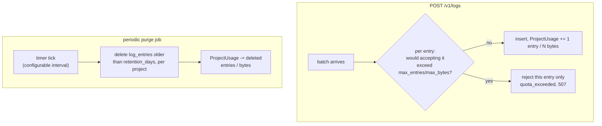
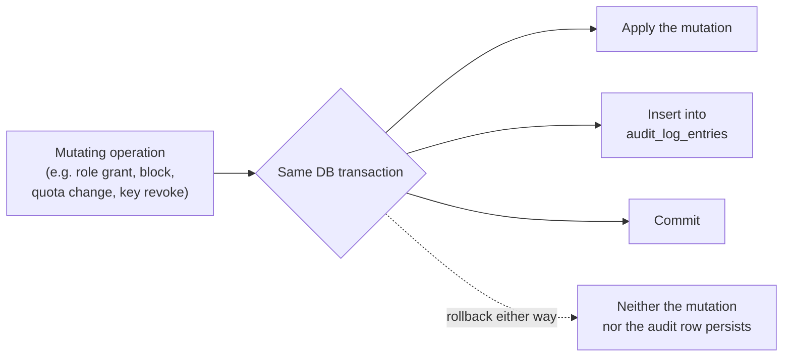

# Quotas and audit log

*Читать на [русском](quotas-and-audit.ru.md).*

Two independent capabilities that happen to share a theme — keeping the
system bounded and inspectable. Normative requirements:
[specs/log-server-quotas/spec.md](../../openspec/changes/add-structured-log-server/specs/log-server-quotas/spec.md),
[specs/log-server-audit/spec.md](../../openspec/changes/add-structured-log-server/specs/log-server-audit/spec.md).

## Quotas (`log-server-quotas`)

Every `Project` has `retention_days` (mandatory — no project can opt out
of a retention policy) and optionally `max_entries`/`max_bytes`
(`null` = unlimited on that dimension). Decision 13.

- **Usage is a maintained counter, not a live aggregate.** `ProjectUsage
  (project_id, entry_count, total_bytes)` is updated atomically in the
  same transaction as the batch insert and the purge job — so checking
  "are we over quota" is a cheap point-lookup, never a `COUNT(*)`/`SUM()`
  over the whole `log_entries` table.
- **`max_entries`/`max_bytes` enforcement rejects individual entries,
  not the whole batch** — the same partial-acceptance mechanism already
  used for validation errors (see
  [api/http-api.md](../api/http-api.md)'s ingestion entry).
- **`retention_days` enforcement is a periodic purge, not an on-write
  check** — this is deliberately *eventual*, not hard real-time: under
  very high load the purge job can lag briefly behind the nominal
  retention window. Documented as an accepted MVP trade-off, not a bug.
- **`507 Insufficient Storage`**, not `413`, is used for quota rejection
  — `413` is reserved in this API for exceeding the HTTP body size
  limit; `507`'s literal RFC semantics ("the server is unable to store
  the representation") fit the quota case more precisely.
- `GET /v1/projects/:id` returns current usage alongside the configured
  quota (`entry_count`/`total_bytes` next to `max_entries`/`max_bytes`)
  — a small addition made specifically so
  `structured_log_admin_client` can render "used / limit" without a
  second, internal-only endpoint.

## Audit log (`log-server-audit`)

Every mutating management operation — not log ingestion or querying —
is recorded, admin-readable only.

- **One transaction covers both the mutation and its audit row** — if
  the operation itself rolls back (e.g. a delete rejected by the
  sole-group-owner check, see
  [rbac-and-lifecycle.md](rbac-and-lifecycle.md)), no audit row is left
  behind claiming it happened.
- **A closed set of `action` values**, not free text: `user.created`,
  `user.blocked`, `user.unblocked`, `user.deleted`, `group.created`,
  `team.created`, `team.member_added`, `team.member_removed`,
  `project.created`, `project.quota_updated`, `project.blocked`,
  `project.unblocked`, `secret_key.created`, `secret_key.revoked`,
  `role_assignment.created`, `role_assignment.revoked`,
  `password.reset_confirmed`, `email.verified`, `user.updated`,
  `password.changed`, `auth.login_succeeded`, `auth.login_failed`,
  `auth.logged_out`, `auth.throttled`.
- **Authentication events are in the set, session refresh is not**
  (decision 44). A successful `grant_type=password`, a rejected one, an
  explicit `DELETE /v1/auth/token`, and the rate limiter tripping
  ([auth.md](auth.md#rate-limiting-throttling-without-lockout)) are all
  recorded; `grant_type=refresh_token` is not — it continues an access
  decision already made and recorded, and at roughly one event per
  session per 15 minutes it would outnumber everything else combined.
  These four are also the only actions exempt from the same-transaction
  rule above: a rejected login has no mutation to share a transaction
  with.
- **What authentication events never store**: the submitted password, in
  any form, and the submitted `username` when it matches no account. For
  an unknown account the row carries `actor_user_id: null` and
  `{"unknown_user": true}` — nothing more. The reason isn't volume: a
  password regularly lands in the username field (mistyped, or a
  password-manager paste that slipped a field), and storing "the unknown
  username" would quietly turn the admin audit view into a collection of
  other people's passwords in the clear. For a known account there's
  nothing to store anyway — `actor_user_id` already identifies them.
  `metadata` does carry `client_ip`, `user_agent`, and a `reason`
  (`invalid_password` / `unknown_user` / `email_not_verified` /
  `blocked` / `deleted`).
- **`auth.throttled` is written once per episode**, at the moment a
  bucket empties — not once per rejected request. Otherwise the audit
  log would amplify the very attack it records: a thousand rejected
  requests would mean a thousand inserts, making a rejected request more
  expensive for the server than an accepted one.
- **Explicitly excluded**: `POST`/`GET /v1/logs` and `GET
  /v1/logs/stream` (high-frequency business data, not an administrative
  action over the service's own resources — see
  [live-streaming.md](live-streaming.md)), and `grant_type=refresh_token`
  (see the authentication events note below).
- **`actor_user_id` is nullable** — for self-registration, the actor
  *is* the newly created user (they acted on themselves), not `null`;
  `null` is reserved for events genuinely without an authenticated
  caller in context, none of which exist in the current closed action
  set, but the column stays nullable for forward compatibility.
- **`metadata` is a JSON blob, not typed per-action columns** — the
  relevant details differ per `action` (e.g. `{before, after}` for a
  quota change vs. `{role, scope_type, scope_id, subject_type,
  subject_id}` for a role grant); a dedicated column set per action type
  was rejected as type-safety that doesn't pay for itself on a
  write-once, human-read record.
- **`GET /v1/audit-log`** — `admin` only (not `owner`, even for their own
  group — a deliberate narrowing, see `design.md`'s Risks for why), with
  `actor_user_id`/`action`/`target_type`/`target_id`/`from`/`to` filters
  and keyset pagination, the same pattern as `GET /v1/logs`.
- **No retention/quota on the audit log itself** in this MVP — a gap
  that decision 44 makes heavier, since failed logins and throttling are
  generated by outside, unauthenticated traffic rather than by rare
  administrative acts; the limiter caps how fast that can happen, but
  retention is now the likeliest next piece of work here — it grows
  unbounded, unlike `log_entries`. Accepted because administrative
  mutations are orders of magnitude rarer than log entries; a retention
  mechanism can be layered on later without a schema change.

## A risk worth carrying forward: keeping this in sync

The closed `action` enum needs manual discipline — every future mutating
endpoint has to remember to write an audit row; nothing enforces a 1:1
correspondence automatically. `openspec-verify-change` (tasks.md's
finalization step) checks this once, for this change's own endpoints —
it won't catch a regression introduced by a later, unrelated change.
