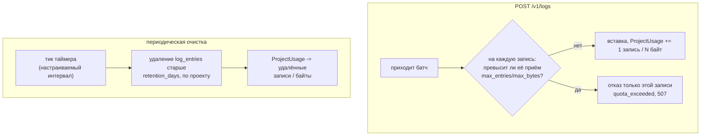
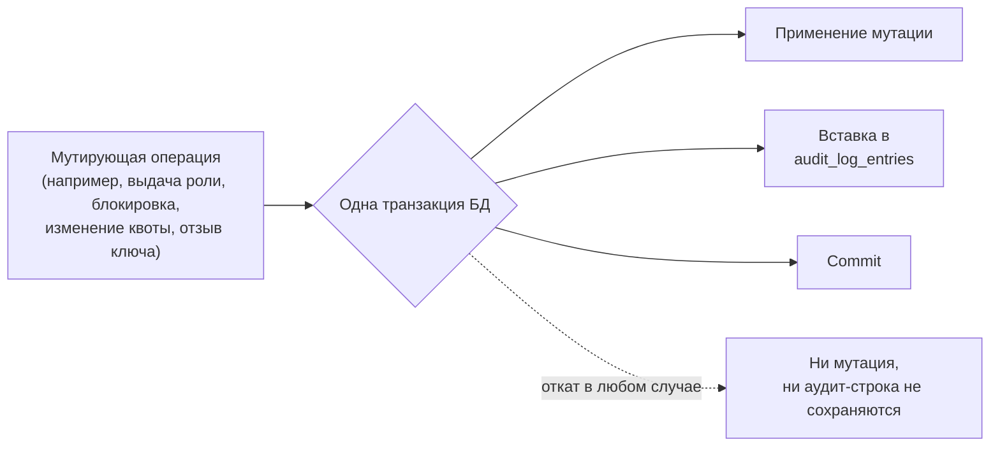

# Квоты и аудит-лог

*Read in [English](quotas-and-audit.md).*

Две независимые capability, связанные общей темой — держать систему
ограниченной и проверяемой. Нормативные требования:
[specs/log-server-quotas/spec.md](../../openspec/changes/add-structured-log-server/specs/log-server-quotas/spec.md),
[specs/log-server-audit/spec.md](../../openspec/changes/add-structured-log-server/specs/log-server-audit/spec.md).

## Квоты (`log-server-quotas`)

У каждого `Project` есть `retention_days` (обязательно — ни один проект
не может отказаться от политики хранения) и опционально
`max_entries`/`max_bytes` (`null` = без лимита по этому измерению).
Decision 13.

- **Использование — поддерживаемый счётчик, не живой агрегат.**
  `ProjectUsage(project_id, entry_count, total_bytes)` обновляется
  атомарно в той же транзакции, что вставка батча и очистка — так что
  проверка «не превышена ли квота» — дешёвый point-lookup, никогда не
  `COUNT(*)`/`SUM()` по всей таблице `log_entries`.
- **Enforcement `max_entries`/`max_bytes` отклоняет отдельные записи, не
  весь батч** — тот же механизм частичного приёма, что уже используется
  для ошибок валидации (см. раздел о приёме в
  [api/http-api.md](../api/http-api.ru.md)).
- **Enforcement `retention_days` — периодическая очистка, не проверка
  на записи** — это намеренно *eventual*-поведение, не жёсткий real-time:
  при очень высокой нагрузке job очистки может ненадолго отставать от
  номинального окна retention. Задокументировано как принятый компромисс
  MVP, не баг.
- **`507 Insufficient Storage`**, не `413`, используется для отказа по
  квоте — `413` в этом API зарезервирован за превышением лимита размера
  HTTP-тела; буквальная семантика RFC для `507` («сервер не может
  сохранить представление») точнее подходит случаю квоты.
- `GET /v1/projects/:id` возвращает текущее использование рядом с
  настроенной квотой (`entry_count`/`total_bytes` рядом с
  `max_entries`/`max_bytes`) — небольшое добавление, сделанное именно
  чтобы `structured_log_admin_client` мог отобразить «использовано /
  лимит» без второго, внутреннего эндпоинта.

## Аудит-лог (`log-server-audit`)

Каждая мутирующая management-операция — не приём и не запрос логов —
записывается, доступна для чтения только `admin`.

- **Одна транзакция покрывает и мутацию, и её аудит-строку** — если сама
  операция откатывается (например, удаление отклонено проверкой
  единственного владельца группы, см.
  [rbac-and-lifecycle.md](rbac-and-lifecycle.ru.md)), никакая аудит-строка
  не остаётся, утверждая, что это произошло.
- **Закрытый набор значений `action`**, не произвольный текст:
  `user.created`, `user.blocked`, `user.unblocked`, `user.deleted`,
  `group.created`, `team.created`, `team.member_added`,
  `team.member_removed`, `project.created`, `project.quota_updated`,
  `project.blocked`, `project.unblocked`, `secret_key.created`,
  `secret_key.revoked`, `role_assignment.created`,
  `role_assignment.revoked`, `password.reset_confirmed`, `email.verified`,
  `user.updated`, `password.changed`, `auth.login_succeeded`,
  `auth.login_failed`, `auth.logged_out`, `auth.throttled`.
- **События аутентификации входят в набор, продление сессии — нет**
  (decision 44). Успешный `grant_type=password`, отклонённый, явный
  `DELETE /v1/auth/token` и срабатывание ограничителя частоты
  ([auth.md](auth.ru.md#ограничение-частоты-throttling-без-блокировки))
  записываются все; `grant_type=refresh_token` — нет: он продолжает уже
  принятое и уже записанное решение о доступе, а при примерно одном
  событии на сессию каждые 15 минут превзошёл бы по количеству всё
  остальное вместе взятое. Эти же четыре действия — единственные, на
  которые не распространяется правило одной транзакции выше: у
  отклонённого входа нет мутации, с которой можно было бы разделить
  транзакцию.
- **Чего события аутентификации не хранят никогда**: отправленный пароль
  в любом виде и отправленный `username`, если он не соответствует ни
  одной учётной записи. Для неизвестной учётной записи запись несёт
  `actor_user_id: null` и `{"unknown_user": true}` — и ничего больше.
  Причина не в объёме: пароль регулярно попадает в поле имени
  пользователя (промахнулись полем или сдвинулась вставка из менеджера
  паролей), и хранение «неизвестного username» тихо превратило бы
  админский просмотр аудита в коллекцию чужих паролей в открытом виде.
  Для известной учётной записи хранить и нечего — `actor_user_id` уже
  указывает на неё. При этом `metadata` несёт `client_ip`, `user_agent`
  и `reason` (`invalid_password` / `unknown_user` / `email_not_verified` /
  `blocked` / `deleted`).
- **`auth.throttled` пишется один раз на эпизод**, в момент опустошения
  ведра, а не на каждый отклонённый запрос. Иначе аудит стал бы
  усилителем той самой атаки, которую фиксирует: тысяча отклонённых
  запросов означала бы тысячу вставок, и отклонённый запрос обходился бы
  серверу дороже обработанного.
- **Явно исключено**: `POST`/`GET /v1/logs` и `GET /v1/logs/stream`
  (высокочастотные бизнес-данные, не административное действие над
  собственными ресурсами сервиса — см.
  [live-streaming.md](live-streaming.ru.md)), и `grant_type=refresh_token`
  (см. заметку о событиях аутентификации ниже).
- **`actor_user_id` — nullable** — для самостоятельной регистрации actor
  *и есть* только что созданный пользователь (он совершил действие над
  собой), не `null`; `null` зарезервирован для событий, действительно не
  имеющих аутентифицированного вызывающего в контексте — таких пока нет
  в текущем закрытом наборе действий, но колонка остаётся nullable для
  совместимости на будущее.
- **`metadata` — JSON-блоб, не типизированные колонки на каждое
  действие** — релевантные детали разные для каждого `action` (например,
  `{before, after}` для изменения квоты vs. `{role, scope_type,
  scope_id, subject_type, subject_id}` для выдачи роли); отдельный набор
  колонок на тип действия отклонён как типобезопасность, не окупающая
  себя на записи, создаваемой один раз и читаемой человеком.
- **`GET /v1/audit-log`** — только `admin` (не `owner`, даже для своей
  собственной группы — осознанное сужение, почему — см. раздел Risks
  `design.md`), с фильтрами
  `actor_user_id`/`action`/`target_type`/`target_id`/`from`/`to` и
  keyset-пагинацией, тем же паттерном, что `GET /v1/logs`.
- **Без retention/квоты на сам аудит-лог** в этом MVP — пробел, который
  decision 44 делает весомее: неудачные входы и срабатывания
  ограничителя порождаются внешним, неаутентифицированным трафиком, а не
  редкими административными действиями; ограничитель задаёт потолок
  частоте, но retention теперь — наиболее вероятная следующая доработка
  здесь — он растёт
  неограниченно, в отличие от `log_entries`. Принято, потому что
  административных мутаций на порядки меньше, чем записей лога; механизм
  retention можно добавить позже без изменения схемы.

## Риск, о котором стоит помнить: поддержание синхронности

Закрытый enum `action` требует ручной дисциплины — каждый будущий
мутирующий эндпоинт должен не забыть записать аудит-строку; ничто не
обеспечивает соответствие 1:1 автоматически. `openspec-verify-change`
(шаг финализации `tasks.md`) проверяет это один раз, для эндпоинтов этой
конкретной доработки — регрессию, внесённую более поздней, не связанной
доработкой, он не поймает.
