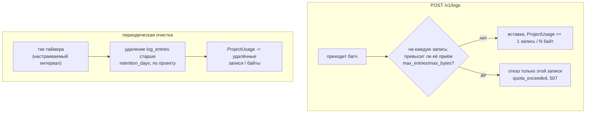
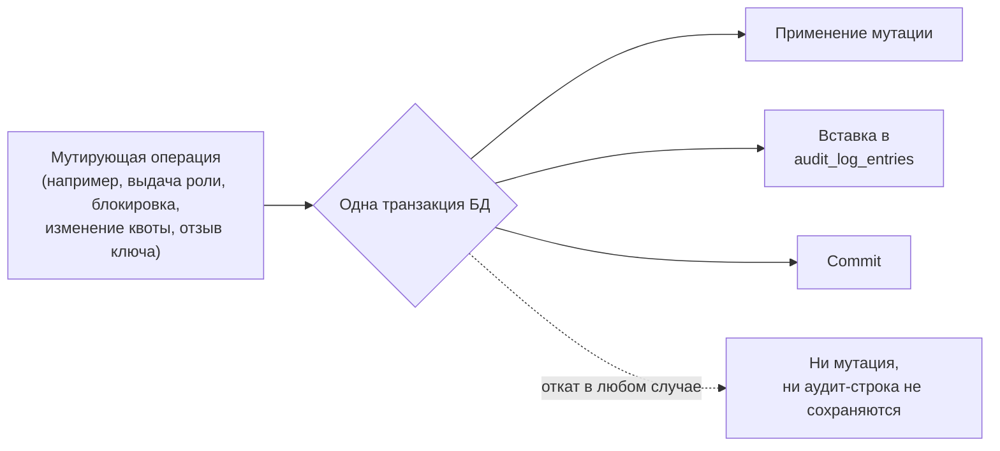

# Квоты и аудит-лог

*Read in [English](quotas-and-audit.md).*

На этой странице описаны две независимые capability с общей темой:
система должна оставаться ограниченной (квоты ограничивают, сколько может
хранить проект) и проверяемой (аудит-лог фиксирует, кто что изменил).
Нормативные требования:
[specs/log-server-quotas/spec.md](../../openspec/changes/add-structured-log-server/specs/log-server-quotas/spec.md),
[specs/log-server-audit/spec.md](../../openspec/changes/add-structured-log-server/specs/log-server-audit/spec.md).

## Квоты (`log-server-quotas`)

У каждого `Project` есть `retention_days` (обязательно — ни один проект
не может отказаться от политики хранения) и опционально
`max_entries`/`max_bytes` (`null` = без лимита по этому измерению).
Decision 13.

```mermaid
flowchart TD
    subgraph Ingest["POST /v1/logs"]
        A["приходит батч"] --> B{"на каждую запись:\nпревысит ли её приём\nmax_entries/max_bytes?"}
        B -->|нет| C["вставка, ProjectUsage += 1 запись / N байт"]
        B -->|да| D["отказ только этой записи\nquota_exceeded, 507"]
    end
    subgraph Purge["периодическая очистка"]
        E["тик таймера\n(настраиваемый интервал)"] --> F["удаление log_entries старше\nretention_days, по проекту"]
        F --> G["ProjectUsage -= удалённые\nзаписи / байты"]
    end
```

- **Использование хранится счётчиком, а не считается агрегатом на лету.**
  `ProjectUsage(project_id, entry_count, total_bytes)` обновляется
  атомарно в той же транзакции, что вставка батча и очистка, поэтому
  проверка «не превышена ли квота» — дешёвый point-lookup, а не
  `COUNT(*)`/`SUM()` по всей таблице `log_entries`.
- **Ограничение по `max_entries`/`max_bytes` отклоняет отдельные записи,
  а не весь батч** — тот же механизм частичного приёма, что уже используется
  для ошибок валидации (см. раздел о приёме в
  [api/http-api.md](../api/http-api.ru.md)).
- **`retention_days` обеспечивается периодической очисткой, а не
  проверкой при записи** : поведение намеренно *eventual*, а не жёсткое real-time, и
  при очень высокой нагрузке задача очистки может ненадолго отставать от
  номинального окна retention. Это задокументированный компромисс MVP, а
  не баг.
- **`507 Insufficient Storage`**, а не `413`, — так сервер отказывает по
  квоте: `413` в этом API зарезервирован за превышением лимита размера
  HTTP-тела; буквальная семантика RFC для `507` («сервер не может
  сохранить представление») точнее подходит случаю квоты.
- `GET /v1/projects/:id` возвращает текущее использование рядом с
  настроенной квотой (`entry_count`/`total_bytes` рядом с
  `max_entries`/`max_bytes`) ; это небольшое дополнение сделано именно
  затем, чтобы `structured_log_admin_client` мог показать «использовано /
  лимит» без второго, внутреннего эндпоинта.

## Аудит-лог (`log-server-audit`)

Каждая management-операция, которая что-то меняет (а не приём или
запрос логов), записывается в аудит-лог; читать его может только `admin`.

```mermaid
flowchart LR
    Op["Мутирующая операция\n(например, выдача роли, блокировка,\nизменение квоты, отзыв ключа)"] --> Tx{"Одна транзакция БД"}
    Tx --> M["Применение мутации"]
    Tx --> A["Вставка в\naudit_log_entries"]
    Tx --> Commit["Commit"]
    Tx -.->|откат в любом случае| Rollback["Ни мутация,\nни аудит-строка не сохраняются"]
```

- **Изменение и его аудит-строка пишутся в одной транзакции**: если сама
  операция откатывается (например, удаление отклонено проверкой
  единственного владельца группы, см.
  [rbac-and-lifecycle.md](rbac-and-lifecycle.ru.md)), не остаётся и
  аудит-строки, утверждающей, что она произошла.
- **Закрытый набор значений `action`**, а не произвольный текст:
  `user.created`, `user.blocked`, `user.unblocked`, `user.deleted`,
  `group.created`, `team.created`, `team.member_added`,
  `team.member_removed`, `project.created`, `project.quota_updated`,
  `project.blocked`, `project.unblocked`, `secret_key.created`,
  `secret_key.revoked`, `role_assignment.created`,
  `role_assignment.revoked`, `password.reset_confirmed`, `email.verified`,
  `user.updated`, `password.changed`, `auth.login_succeeded`,
  `auth.login_failed`, `auth.logged_out`, `auth.throttled`, `audit.purged`.
- **События аутентификации входят в набор, продление сессии — нет**
  (decision 44). Успешный `grant_type=password`, отклонённый, явный
  `DELETE /v1/auth/token` и срабатывание ограничителя частоты
  ([auth.md](auth.ru.md#ограничение-частоты-throttling-без-блокировки))
  записываются все; `grant_type=refresh_token` — нет: он продолжает уже
  принятое и уже записанное решение о доступе, а при примерно одном
  событии на сессию каждые 15 минут превзошёл бы по количеству всё
  остальное вместе взятое. Эти четыре действия — и `audit.purged` —
  единственные, на которые не распространяется правило одной транзакции
  выше: ни у отклонённого входа, ни у прохода очистки нет мутации
  ресурса, с которой можно было бы разделить транзакцию.
- **Чего события аутентификации не хранят никогда**: отправленный пароль
  в любом виде и отправленный `username`, если он не соответствует ни
  одной учётной записи. Для неизвестной учётной записи в событии есть
  `actor_user_id: null` и `{"unknown_user": true}` — и ничего больше.
  Причина не в объёме: пароль регулярно попадает в поле имени
  пользователя (промахнулись полем или сдвинулась вставка из менеджера
  паролей), и хранение «неизвестного username» тихо превратило бы
  админский просмотр аудита в коллекцию чужих паролей в открытом виде.
  Для известной учётной записи хранить и нечего — `actor_user_id` уже
  указывает на неё. При этом в `metadata` есть `client_ip`, `user_agent`
  и `reason` (`invalid_password` / `unknown_user` / `email_not_verified` /
  `blocked` / `deleted`).
- **`auth.throttled` пишется один раз на эпизод**, в момент опустошения
  ведра, а не на каждый отклонённый запрос. Иначе аудит стал бы
  усилителем той самой атаки, которую фиксирует: тысяча отклонённых
  запросов означала бы тысячу вставок, и отклонённый запрос обходился бы
  серверу дороже обработанного.
- **Явно исключено**: `POST`/`GET /v1/logs` и `GET /v1/logs/stream`
  (высокочастотные бизнес-данные, а не административное действие над
  собственными ресурсами сервиса — см.
  [live-streaming.md](live-streaming.ru.md)), и `grant_type=refresh_token`
  (см. заметку о событиях аутентификации ниже).
- **`actor_user_id` — nullable.** При самостоятельной регистрации actor —
  *это и есть* только что созданный пользователь (он совершил действие над
  собой), а не `null`; `null` оставлен для событий, у которых
  аутентифицированного вызывающего действительно нет. В текущем закрытом
  наборе действий таких пока нет, но колонка остаётся nullable на
  будущее.
- **`metadata` — JSON-блоб, а не типизированные колонки на каждое
  действие**: нужные детали у каждого `action` свои (например,
  `{before, after}` для изменения квоты и `{role, scope_type,
  scope_id, subject_type, subject_id}` для выдачи роли). Отдельный набор
  колонок на тип действия отклонили: такая типобезопасность не окупается
  на записи, которую создают один раз и читает человек.
- **`GET /v1/audit-log`** — только `admin` (не `owner`, даже для его
  собственной группы; это осознанное сужение, причины — в разделе Risks
  `design.md`), с фильтрами
  `actor_user_id`/`action`/`target_type`/`target_id`/`from`/`to` и
  keyset-пагинацией по тому же образцу, что у `GET /v1/logs`.
- **Два срока хранения, оба по умолчанию выключены** (decision 46). Один
  относится к событиям аутентификации, другой — ко всему остальному;
  любой из них можно не задавать, и это значит «хранить вечно». Так и
  есть по умолчанию, поэтому обновление сервера никогда молча не удаляет
  чью-то историю. Разделение существует потому, что классы
  различаются во всём существенном: административных мутаций мало, они
  ценны годами и не содержат ничего, кроме идентификаторов ресурсов;
  `auth.*`-события порождаются внешним трафиком и несут
  `client_ip`/`user_agent`, долгое хранение которых — скорее риск,
  чем польза.
- **Класс записи определяется явным списком значений `action`**, а не
  префиксом `LIKE 'auth.%'` — набор действий закрыт, поэтому запрос
  очистки использует `IN (...)`/`NOT IN (...)` и уже существующий индекс
  по `action`. Плата — ручная дисциплина (будущее `auth.*`-действие
  нужно внести в список), подстрахованная тестом, который требует, чтобы
  каждое значение закрытого набора попало ровно в один класс. Сам
  `audit.purged` относится к административному классу, поэтому объяснение
  удаления переживает удалённые им записи.
- **Удаление выполняет тот же периодический проход, что применяет
  `retention_days` к `log_entries`** (decision 14) — второго таймера нет.
  Удаление идёт порциями, а не одним запросом: WAL допускает чтение во время
  записи, но не вторую запись, и единственный `DELETE` на миллионы строк
  заблокировал бы приём логов на всё время выполнения.
- **Проход, что-то удаливший, пишет `audit.purged`**
  (`actor_user_id: null`, `metadata` с классом, числом строк и границей
  возраста). Без этого администратор, обнаруживший пропажу прошлогодней
  истории, не отличит настроенную политику от заметания следов — а это
  единственный вопрос, ради которого аудит и существует. Одна запись на
  класс за проход, то есть объём ограничен интервалом таймера, а не
  трафиком.
- **Ничто не удаляет запись аудита вручную.** Нет ни
  `DELETE /v1/audit-log`, ни удаления отдельной записи, ни действия в UI,
  ни роли, которой это доступно; сроки хранения тоже задаются
  конфигурацией при старте, а не через API. Администратор — субъект этого
  журнала, а не его владелец: возможность выборочно стереть собственный
  след обесценила бы запись целиком. (Тот, у кого есть файл БД, разумеется,
  может сделать что угодно, — но от такого уровня доступа API никогда и не
  защищал.)
- **Действующая политика возвращается в ответе `GET /v1/audit-log`**
  рядом с `items`/`next_cursor`: администратор, ищущий событие двухлетней
  давности, видит причину его отсутствия там же, где искал.

## Риск на будущее: аудит держится на дисциплине

Закрытый enum `action` требует ручной дисциплины — каждый будущий
мутирующий эндпоинт должен не забыть записать аудит-строку; автоматически
соответствие 1:1 ничем не обеспечивается. `openspec-verify-change`
(шаг финализации `tasks.md`) проверяет это один раз, для эндпоинтов этой
конкретной доработки — регрессию, внесённую более поздней, не связанной
доработкой, он не поймает.
