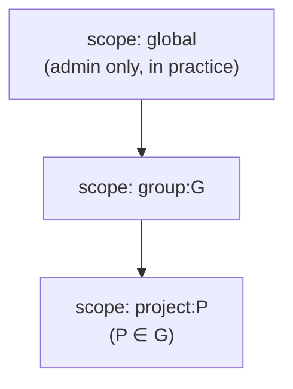
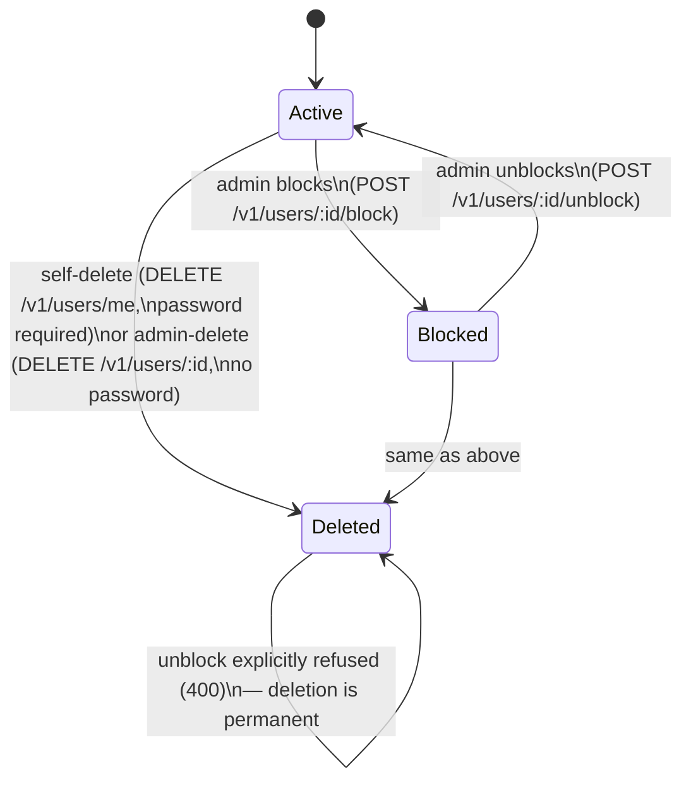
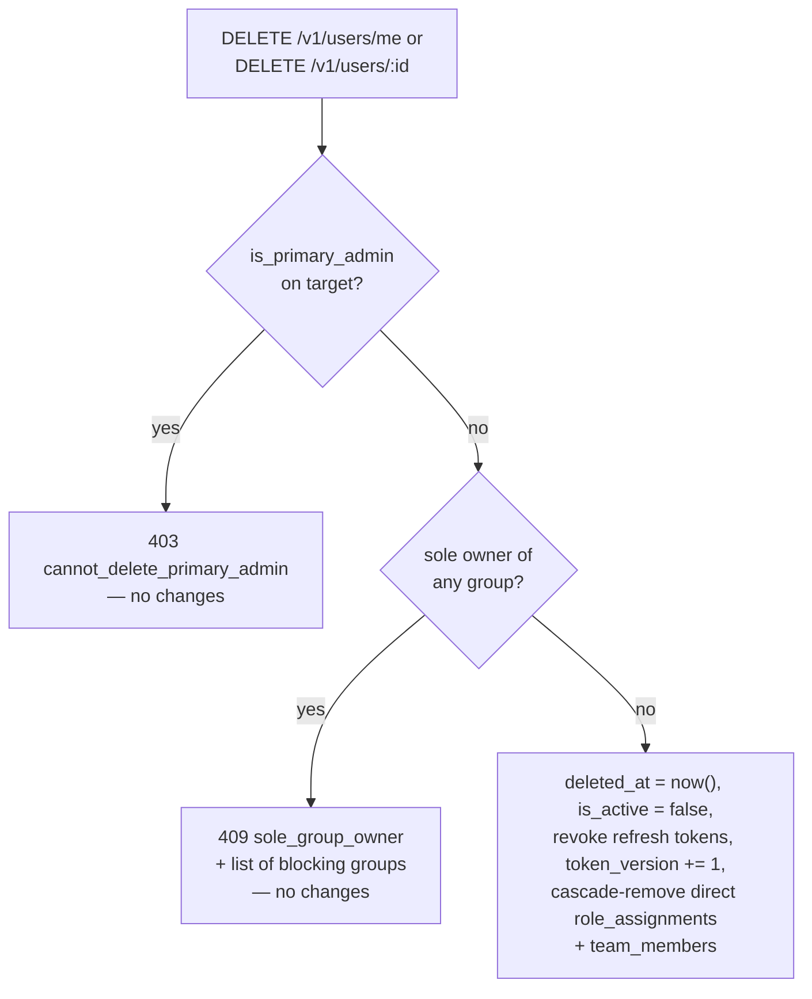

# RBAC, blocking, and account deletion

*Читать на [русском](rbac-and-lifecycle.ru.md).*

Covers `log-server-rbac` and the RBAC-adjacent parts of `log-server-auth`
(blocking, deletion, primary-administrator protection). Normative
requirements:
[specs/log-server-rbac/spec.md](../../openspec/changes/add-structured-log-server/specs/log-server-rbac/spec.md),
[specs/log-server-auth/spec.md](../../openspec/changes/add-structured-log-server/specs/log-server-auth/spec.md).

## Roles and scope hierarchy

Three fixed roles, three scope types, strictly nested:

| Role | Can do | Cannot do |
|---|---|---|
| `admin` | Everything, any scope — the only role that can create `Group`s/`User`s, grant `admin`, block/unblock, delete any user | (nothing) |
| `owner` (on a group `G`) | Create/manage `Team`/`Project` inside `G`, edit quotas, rotate secret keys, grant `owner`/`user` on `G` or its projects | Grant `admin`; block/unblock anyone or anything, even inside their own group; delete anyone, including themselves via the admin path |
| `user` | Read/search logs in explicitly granted scopes | Grant any role; manage any resource |

A grant's `scope_type: group` covers the group *and every project in
it*; `scope_type: project` covers only that one project. A team-scoped
grant applies to every current member, resolved at authorization time —
not copied onto members individually (see
[data-model.md](data-model.md)).

**Why `owner` can't grant `admin`:** `admin` is a global role, not tied
to any group — letting a group `owner` hand it out would let group-scoped
authority escape its own boundary, defeating the isolation the whole
model exists for (decision 7).

### Access matrix by scope level

A `role_assignment` is a `(role, scope_type, scope_id)` triple, and the
two parts answer different questions: `scope_type`/`scope_id` say *how
far* the grant reaches (via `_covers`, in `access_check.dart`), `role`
says *what* it lets its holder do there. The table below covers *reach*
first (how far a grant extends), then *capability* (what each role can
do once it reaches its target).

| Grant's `scope_type` | Reaches |
|---|---|
| `global` | Every group and every project — only `admin` can create a `global`-scoped grant at all (`canCreateOrRevokeRoleAssignment` never lets an `owner` target `global`), and the admin-only UI only ever offers `role: admin` there, but neither the schema nor the handler forces that pairing |
| `group:G` | `G` itself, and every project inside `G` |
| `project:P` | `P` only |

What each `role` lets its holder do, once a grant reaches the target
(`access_check.dart`'s exported predicates, each backed by
`test/rbac/*_test.dart`):

| Action | `admin` | `owner` | `user` |
|---|---|---|---|
| Read logs / list a reached group or project (`canRead`) | Yes, everywhere | Yes, where reached | Yes, where reached |
| Create/edit a Team/Project, edit quotas, rotate secret keys, block a project (`canWrite`) | Yes, everywhere | Yes, where reached | No |
| Grant or revoke `admin`, any scope | Yes | No — rejected outright, regardless of scope | No |
| Grant or revoke `owner`/`user` at a scope the caller reaches | Yes | Yes, but only from a **`group`-scoped** `owner` grant of their own (see note) | No |
| List `role_assignments` for one specific scope (`canReadRoleAssignmentsForScope`) | Yes | Yes, same scope rule as `canWrite` | No |
| List `role_assignments` unfiltered, or by `subject_id` alone — "grants held by this user" (`canManageRoleAssignments`) | Yes | No | No |
| Search users, `GET /v1/users` (`canSearchUsers`) | Yes | Yes — any `owner` grant qualifies, not only one on the group being searched into | No |

**Note on granting/revoking:** the check that lets an `owner` grant or
revoke a role (`canCreateOrRevokeRoleAssignment`) requires the *granting*
role's own `scope_type` to be `group`, not just that it reaches the
target — an `owner` grant scoped directly to a `project` (legal in the
schema, just unusual) can still write to that project (`canWrite` has no
such restriction) but cannot grant or revoke roles on it. The asymmetry
exists because delegation is a group-owner privilege specifically
(`design.md`, Stage 4, section 4.3), not a general consequence of "can
write here."

## Blocking vs. deletion: same mechanics, different operations

Both are ways to cut off an account's access, and both reuse the exact
same revocation primitives — but they are not the same operation with a
different flag, and that distinction is load-bearing (decision 25 vs.
27):

| | Blocking | Deletion |
|---|---|---|
| Who can trigger it | `admin` only — not even `owner` of the target's own group | Self (`/me`, password-confirmed) or `admin` (`/​:id`, no password needed) |
| Reversible? | Yes, `unblock` | No — no undelete endpoint exists |
| Field(s) set | `is_active = false` | `is_active = false` **and** `deleted_at = now()` |
| Extra effects | Revokes all refresh tokens; `grant_type=refresh_token` also checks `is_active` so a not-yet-expired refresh token can't mint a new access token for a blocked user | Same revocation, **plus** cascading removal of the user's direct `role_assignments` and `team_members` rows |
| Guarded by | Nothing extra | The sole-group-owner check (below) and the primary-administrator check (below) |

Why they're separate endpoints rather than one with a flag: they have
different authorization stories (blocking is strictly `admin`-only;
self-deletion is available to anyone over their own account) and
different reversibility guarantees — folding per-field authorization
into one generic `PATCH` was rejected specifically because that's easy
to get wrong in implementation (decision 25).

**Project blocking** is the same idea applied to `Project.is_blocked`
instead of a user: it halts both ingestion (`POST /v1/logs` → 403
`project_blocked`) and direct reads of that project
(`GET /v1/logs?project_id=...` → 403, overriding normal RBAC rather than
adding to it), while a `group_id` query silently excludes the blocked
project's entries instead of failing the whole request. It does not
revoke the project's secret keys — that stays a separate, irreversible
action (key revocation).

## Deletion's two guard checks

Both deletion endpoints run two independent checks before touching
anything; either one blocking the request means *no* changes are made:

- **Sole group owner** (decision 27): the server won't let a deletion
  leave a group with no `owner` at all. It doesn't pick a replacement
  automatically (that's a human decision) — it blocks with `409
  sole_group_owner` and a list of the groups involved, until ownership
  is transferred via the already-existing `POST /v1/role-assignments`.
  Ownership is **effective**: an owner grant to a *team* makes each
  member an owner, so the sole member of an owning team is the sole owner,
  and a direct owner beside an owning team is not. The same rule holds for
  the other two ways to lose an owner — removing the last member of an
  owning team (`DELETE /v1/teams/:teamId/members/:userId`) and revoking the
  last owner grant (`DELETE /v1/role-assignments/:id`, including an
  owner's own) — with the same `409 sole_group_owner`. A group that had no
  owner to begin with does not block unrelated changes.
- **Primary administrator** (decision 28): exactly one account in the
  system's history — the one `create-admin` created on its first-ever
  successful run — can never be deleted, by itself or by any other
  `admin`, no matter how many other `admin`s exist. This is deliberately
  an *identity* check (`is_primary_admin = true` on one specific row),
  not a *count* check ("don't delete the last admin") — the user asked
  for the former by name, and a count-based check would also be
  race-prone under concurrent deletions in a way a single fixed flag
  isn't. Blocking the primary administrator is still allowed — only
  deletion is protected, matching the literal wording of the
  requirement. See the "Two kinds of last-admin protection" note below.

## Two kinds of "protect the last admin" — only one is implemented

It's easy to conflate these; the design deliberately keeps them
separate:

- **Identity-based** (implemented, decision 28): *this one specific
  account* can never be deleted. You can delete every other `admin` down
  to zero *others* and the system still has exactly the primary
  administrator left, guaranteed.
- **Count-based** (explicit non-goal): "don't let the last remaining
  active `admin`, whoever they are, be deleted." Not implemented — the
  identity-based guarantee already ensures at least one `admin` always
  exists, so the risk this would mitigate (a system with zero admins) is
  already closed by decision 28. The one gap it leaves: the primary
  administrator can still be *blocked* by another admin, which
  practically locks everyone out even though no deletion occurred — see
  `design.md`'s Risks section for why this is accepted as out of scope
  for now.

## Bootstrap: two paths to the first admin

The first `admin` arrives one of two ways (decision 49 revised
decision 12, which originally allowed only the second):

**Automatically, on a first start against an empty database.** If the
`users` table holds no rows at all and auto-bootstrap isn't switched
off, the server creates an admin before it opens the port: username from
`STRUCTURED_LOG_BOOTSTRAP_ADMIN_USERNAME` (default `admin`), password
from `STRUCTURED_LOG_BOOTSTRAP_ADMIN_PASSWORD` (or its `_FILE` variant),
or — when none is given — a freshly generated random one, printed once
to the startup log and marked temporary. The account gets
`is_primary_admin = true` and `must_change_password = true`, so until
that password is changed it can do nothing except change it
([auth.md](auth.md#patch-v1usersid-and-the-mandatory-temporary-password)).
No `email` is collected, which is precisely why mandatory verification
doesn't lock it out.

The condition is *no users at all*, not *no active admin*: a running
system whose admins were deleted or blocked must never sprout an account
named `admin` on the next restart. An empty table happens once in a
database's life.

Decision 12 rejected auto-creation because of "default credentials left
behind by accident". That objection is answered rather than ignored:
there is no predictable password in any mode, the password is temporary,
and the whole behaviour switches off with
`--bootstrap-admin-enabled=false`.

**Explicitly, with `create-admin`.** The CLI command
(`create-admin --username ... --password ...`) still exists, and it's
the only path on a non-empty database — re-bootstrapping after the sole
active admin blocked themselves, or setting up a deployment with
auto-bootstrap disabled. Unlike auto-creation it does *not* set
`must_change_password`: the operator typed that password themselves,
which makes it the same situation as self-registration. The command
refuses to run if an active, non-deleted `admin` already exists — but that check is independent of whether `is_primary_admin` has
ever been set, so a legitimate re-bootstrap after the sole active admin
blocked themselves doesn't create a second primary administrator
(decision 28's guard: the flag is set only if *no* user in the table's
history has ever carried it, full stop).
