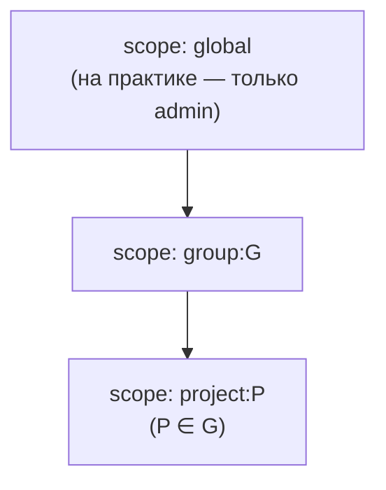
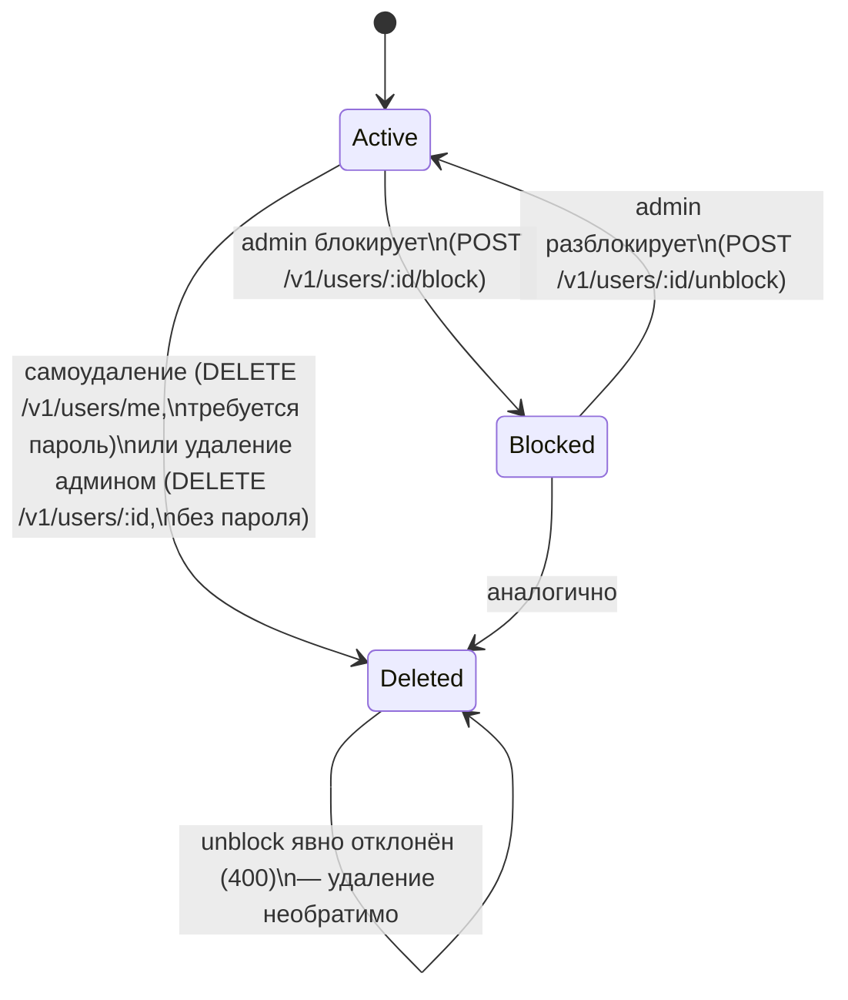
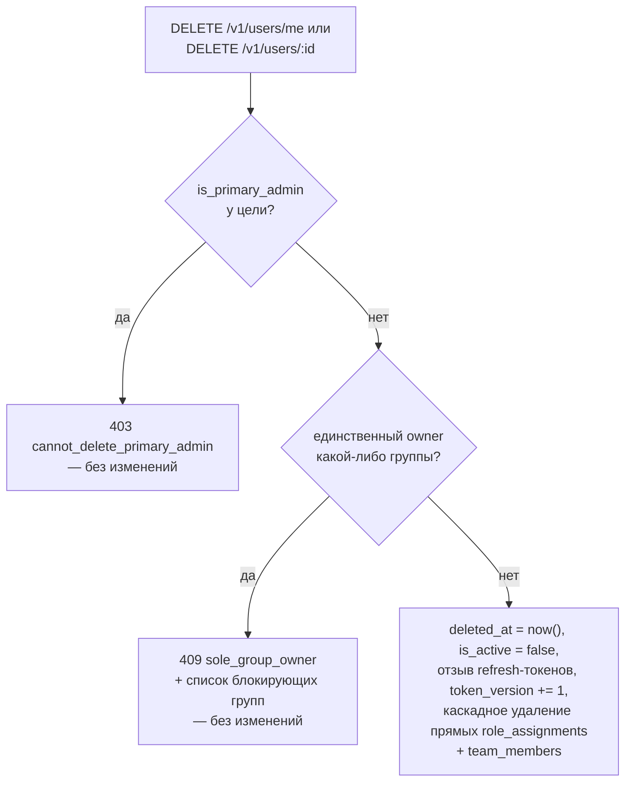

# RBAC, блокировка и удаление аккаунтов

*Read in [English](rbac-and-lifecycle.md).*

Охватывает `log-server-rbac` и смежные с RBAC части `log-server-auth`
(блокировка, удаление, защита основного администратора). Нормативные
требования:
[specs/log-server-rbac/spec.md](../../openspec/changes/add-structured-log-server/specs/log-server-rbac/spec.md),
[specs/log-server-auth/spec.md](../../openspec/changes/add-structured-log-server/specs/log-server-auth/spec.md).

## Роли и иерархия областей видимости

Три фиксированные роли, три типа области, строго вложенные:

| Роль | Может | Не может |
|---|---|---|
| `admin` | Всё, в любой области — единственная роль, создающая `Group`/`User`, выдающая `admin`, блокирующая/разблокирующая, удаляющая любого пользователя | — |
| `owner` (на группу `G`) | Создавать/управлять `Team`/`Project` внутри `G`, редактировать квоты, ротировать секретные ключи, выдавать `owner`/`user` на `G` или её проекты | Выдавать `admin`; блокировать/разблокировать кого-либо, даже в своей группе; удалять кого-либо, включая себя через admin-путь |
| `user` | Читать/искать логи в явно выданных областях | Выдавать любую роль; управлять любым ресурсом |

`scope_type: group` в гранте покрывает группу *и все её проекты*;
`scope_type: project` — только этот один проект. Грант, выданный команде,
применяется ко всем текущим участникам, резолвится в момент проверки
доступа — не копируется на участников по отдельности (см.
[data-model.md](data-model.ru.md)).

**Почему `owner` не может выдать `admin`:** `admin` — глобальная роль, не
привязанная ни к одной группе — позволить владельцу группы раздавать её
означало бы, что права, ограниченные группой, вырываются за собственную
границу, сводя на нет изоляцию, ради которой вся модель существует
(decision 7).

## Блокировка vs. удаление: одна механика, разные операции

Обе — способы отрезать доступ аккаунту, обе переиспользуют одни и те же
примитивы отзыва — но это не одна операция с разным флагом, и это
различие несёт смысловую нагрузку (decision 25 vs. 27):

| | Блокировка | Удаление |
|---|---|---|
| Кто может выполнить | Только `admin` — даже не `owner` группы цели | Сам (`/me`, с паролем) или `admin` (`/​:id`, без пароля) |
| Обратимо? | Да, `unblock` | Нет — эндпоинта отмены не существует |
| Устанавливаемые поля | `is_active = false` | `is_active = false` **и** `deleted_at = now()` |
| Дополнительные эффекты | Отзыв всех refresh-токенов; `grant_type=refresh_token` также проверяет `is_active`, так что ещё не истёкший refresh-токен не может выпустить новый access-токен заблокированному пользователю | Тот же отзыв, **плюс** каскадное удаление прямых `role_assignments` и записей `team_members` пользователя |
| Дополнительно защищено | Ничем | Проверкой единственного владельца группы (ниже) и проверкой основного администратора (ниже) |

Почему это разные эндпоинты, а не один с флагом: у них разная история
авторизации (блокировка — строго `admin` only; самоудаление доступно
любому над своим аккаунтом) и разные гарантии обратимости — сведение
авторизации по полю в один универсальный `PATCH` отклонено именно
потому, что это легко реализовать неправильно (decision 25).

**Блокировка проекта** — та же идея, применённая к `Project.is_blocked`
вместо пользователя: останавливает и приём (`POST /v1/logs` → 403
`project_blocked`), и прямое чтение этого проекта (`GET
/v1/logs?project_id=...` → 403, перекрывая обычный RBAC, а не дополняя
его), тогда как запрос по `group_id` молча исключает записи
заблокированного проекта, не отклоняя весь запрос. Секретные ключи
проекта не отзываются — это остаётся отдельным, необратимым действием
(отзыв ключа).

## Две защитные проверки при удалении

Оба эндпоинта удаления выполняют две независимые проверки, прежде чем
что-либо менять; срабатывание любой из них означает, что изменений *не*
произошло:

- **Единственный владелец группы** (decision 27): сервер не даст
  удалению оставить группу вовсе без `owner`. Замену не выбирает
  автоматически (это решение человека) — блокирует 409'ым
  `sole_group_owner` со списком затронутых групп, пока владение не
  передано через уже существующий `POST /v1/role-assignments`.
- **Основной администратор** (decision 28): ровно один аккаунт за всю
  историю системы — тот, что `create-admin` создал самым первым успешным
  запуском — не может быть удалён никогда, ни собой, ни другим `admin`,
  независимо от того, сколько ещё `admin` есть в системе. Это намеренно
  проверка *по идентичности* (`is_primary_admin = true` на одной
  конкретной строке), а не *по количеству* («не удалять последнего
  admin») — пользователь запросил именно первое, буквально назвав это;
  проверка по количеству также сложнее корректно реализовать при
  параллельных удалениях так, как этого не имеет одна фиксированная
  проверка флага. Блокировка основного администратора по-прежнему
  разрешена — под защитой только удаление, ровно по буквальной
  формулировке требования. См. заметку «Два вида защиты последнего
  админа» ниже.

## Два вида защиты «последнего администратора» — реализован только один

Их легко смешать; дизайн намеренно держит их раздельно:

- **По идентичности** (реализовано, decision 28): *конкретный один*
  аккаунт никогда не может быть удалён. Можно удалить всех остальных
  `admin` до нуля *остальных*, и в системе гарантированно останется
  ровно основной администратор.
- **По количеству** (явный non-goal): «не давать удалить последнего
  оставшегося активного `admin`, кем бы он ни был». Не реализовано —
  гарантия по идентичности уже обеспечивает, что хотя бы один `admin`
  всегда существует, так что риск, который это бы смягчало (система без
  единого admin), уже закрыт decision 28. Единственный оставшийся
  пробел: основного администратора всё ещё можно *заблокировать* другим
  админом, что практически лишает всех доступа, хотя удаления и не
  произошло — почему это принято как вне рамок сейчас, см. раздел Risks
  `design.md`.

## Bootstrap: `create-admin`

Первый `admin` создаётся явной CLI-командой (`create-admin --username
... --password ...`), запускаемой оператором сервера отдельно от
обычного `dart run bin/server.dart` — никогда автоматически при первом
запуске из переменных окружения (decision 12). Команда отказывается
выполняться, если активный, неудалённый `admin` уже существует — но эта
проверка не зависит от того, был ли когда-либо установлен
`is_primary_admin`, так что легитимный повторный bootstrap после того,
как единственный активный admin заблокировал себя, не создаёт второго
основного администратора (защита decision 28: флаг устанавливается,
только если *ни один* пользователь за всю историю таблицы никогда его не
нёс, без исключений).
