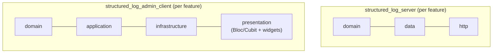
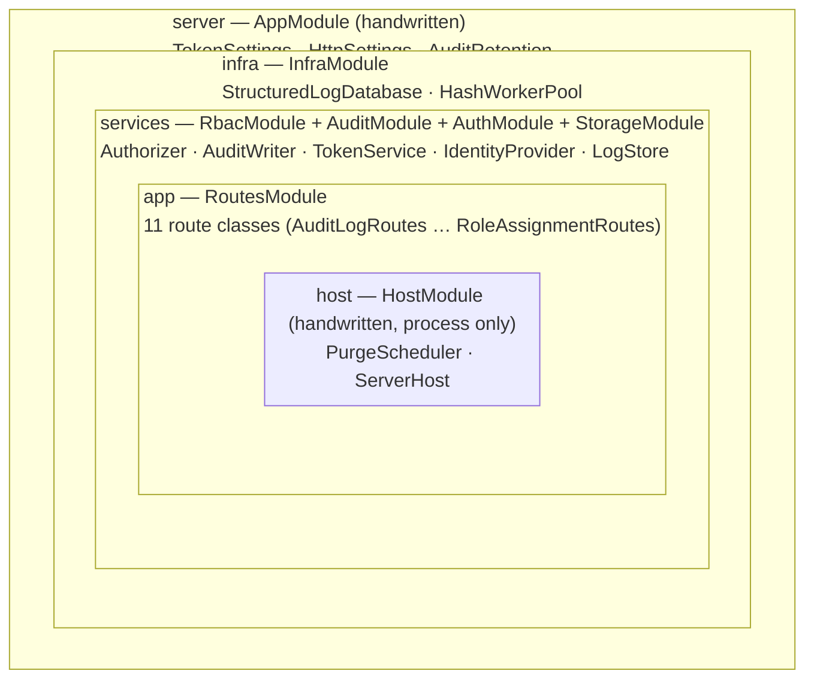
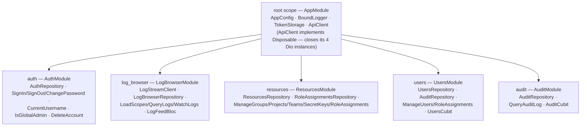

# Technology stack

*Читать на [русском](technology-stack.ru.md).*

Every major dependency choice, the alternative it beat, and why. Each
row traces to a `design.md` decision — read there for the full argument.

## `structured_log_server`

| Choice | Rejected alternative | Why |
|---|---|---|
| `shelf` + `shelf_router` | `dart_frog` | `dart_frog create` imposes its own skeleton/CLI as the primary workflow — breaks with the flat, codegen-free layout of every other package. `dart_frog` is itself built on `shelf`; nothing functional is lost. (decision 1) |
| `shelf_router_generator` for the route table | Hand-written `Router` cascade | The route was written twice — once in `buildHandler`, once in the handler's doc comment — and path-parameter names were checked only at runtime (a typo answered 404 forever). Annotating handlers makes the path single-sourced and the parameter arity a build error. Only viable *after* `unify-server-auth`: the generator cannot annotate middleware, so while auth wrappers sat on each route, adopting it would have pushed them into handler bodies. |
| `drift` over embedded SQLite (`NativeDatabase`) | raw `package:sqlite3` | The first deliberate codegen exception in the workspace, by direct user instruction — type-safe, compile-checked queries and built-in schema migration outweigh `build_runner`'s cost for a 7+ table multi-tenant schema. Scoped to this one package; `*.g.dart` is not committed. (decision 2, extended by decision 34 below) |
| `LIKE '%term%'` full-text search (via `customSelect`) | FTS5 | Avoids a schema/migration-path complication for functionality outside the agreed MVP scope. Upgrade path noted, not built. (decision 3) |
| One writer `QueryExecutor`, WAL, and a pool of reader isolates (`--db-read-pool-size`) | Isolate-per-request / sharding | `shelf` already serves requests in one isolate by default — a single writer needs no extra synchronization, and remains the explicit non-goal for scaling past. Reads used to share that one connection too, so a read queued behind whatever batch ingestion was writing; WAL lets a pool of extra connections, each its own isolate, serve `SELECT`s outside a transaction while the one writer keeps everything that mutates (`AGENTS.md`). Ingestion itself: concurrent `POST /v1/logs` requests are no longer each their own transaction either — one that arrives while a commit is running joins the next one, which is what took a single-entry request from ~0.65 ms of fixed transaction overhead to a share of a batch's (`AGENTS.md`, `IngestCoordinator`). Neither change touches why the [live-stream broadcast](live-streaming.md) can stay an in-process `StreamController`: every accepted insert still passes through the one writer, in the one process, reader pool or not. **Planned, not implemented:** PostgreSQL as an operator-chosen alternative to this SQLite setup, via `drift_postgres` — see [data-model.md](data-model.md#planned-postgresql-as-an-operator-chosen-alternative-backend) and [openspec/changes/add-postgres-backend/](../../openspec/changes/add-postgres-backend/) for the full decision record. (decision 4) |
| `dart_jsonwebtoken` (JWT, HS256) | — | Standard JWT library for access-token signing; see [auth.md](auth.md) for the claim shape. |
| `bcrypt` for passwords / SHA-256 for high-entropy secrets | One hash for everything | Two different threat models (offline dictionary attack resistance vs. no need for it) get two different algorithms — see [auth.md](auth.md#password-vs-secret-key-hashing-two-algorithms-for-two-threats). (decision 11) |
| `package:mailer` behind an `EmailSender` interface | Hard-coded SMTP calls | The interface lets an operator swap in a transactional email API without touching the password-reset flow. (decision 24) |
| `structured_log` for the server's own diagnostics | `package:logging`, or `print()` | The workspace exists for this library — picking someone else's for its own service would say either that it isn't ready for real use or that its author doesn't use it. Also the first non-trivial consumer of `BoundLogger`/`AsyncRotatingFileOutput` (decision 48) |
| `cherrypick` for dependency injection | Manual wiring in `buildHandler` | Adopted for the server after `structured_log_admin_client` already used it (decision 35) — the object graph is declared by modules instead of assembled by hand, so a type nothing binds fails when the handler is built (at startup for the real process, in every test that builds one) rather than on the first request that needed it. The graph is layered by dependency (given values → database/hash-workers → services → routes → the process's own purge job and listening socket), so stopping the process is one `closeScope` call, innermost first, instead of a hand-kept shutdown order (`AGENTS.md`). |
| `fpdart` (`Either`/`Option`) for expected failures | Exceptions everywhere (the rest of the workspace's style) | Validation errors, RBAC denials, quota limits are part of the contract a caller must handle explicitly, not exceptional control flow; genuine bugs still throw. (decision 33) |
| `freezed` + `json_serializable` for immutable models/unions | Hand-written value classes | Same `build_runner` run already needed for `drift`; avoids hand-maintained `==`/`copyWith` drifting out of sync as the model count grows. (decision 34) |

## `structured_log_http`

| Choice | Rejected alternative | Why |
|---|---|---|
| Separate package, `structured_log` as its only dependency | Extend `structured_log` core, or fold into `structured_log_server` | The wire contract evolves with the *server*, not the logging core — coupling it to the independently-versioned, already-published core package isn't justified. It also can't live in `structured_log_server`: an app that only sends logs shouldn't need `shelf`/`drift`/etc. as transitive dependencies. (decision 5) |
| `_SerializedAsyncOutput` pattern (from `AsyncFileOutput`) + batching + retry/backoff | A new queuing design | Reuses an already-proven pattern in the workspace instead of inventing a second one for the same problem shape (serialized delivery, per-step error isolation). |

`structured_log_http` is not part of the decisions 32–38 tech-stack expansion below — it stays a small, dependency-free client package, unaffected by `structured_log_server`'s or `structured_log_admin_client`'s internal choices.

## `structured_log_admin_client`

| Choice | Rejected alternative | Why |
|---|---|---|
| One app, no core/skin split | `structured_log_admin_core` + swappable UI kit | Premature abstraction with a single consumer — the same "don't abstract before a second consumer" principle already applied in `add-structured-log-flutter/design.md`. (decision 18) |
| `fluent_ui`, not Material 3 | Material 3 (the original decision 18) | Revises decision 18's UI-kit pick specifically (the "no core/skin split" part is unrelated and stands). Screens are pre-designed externally (Claude Design); implementation follows those mockups where they exist. Does **not** mean reusing `structured_log_fluent`'s widgets — decision 21 (different data source) still applies; the shared design system is a visual coincidence, not shared code. (decision 38) |
| `dio` + `retrofit` for typed endpoints | `package:http`, or hand-written `dio` calls everywhere | `dio` needs interceptor chaining (token injection, 401→refresh→retry) as a built-in primitive (decision 19); `retrofit` removes hand-written serialization boilerplate for the ~15 JSON endpoints. `GET /v1/logs/stream` is the one deliberate exception — hand-written directly on the same `dio` instance, because a long-lived streamed body with custom SSE-frame parsing doesn't fit retrofit's one-call/one-typed-response model. (decisions 19, 37) |
| `flutter_secure_storage` | `shared_preferences` | Access/refresh tokens are secrets; `shared_preferences` stores plaintext on most platforms. (decision 20) |
| `flutter_bloc` (`Bloc`/`Cubit`) for state | `riverpod`/`provider`/an unspecified `ChangeNotifier`-style controller | Concretizes the "own small state layer" for the log browser (decision 21/30) as an explicit state machine — the log feed's `Following`/`ScrolledUp`/`Paused` states and their transitions map directly onto a `Bloc`. Used the same way for every other screen. (decision 36) |
| `fpdart` (`Either`/`Option`) for expected failures | Exceptions everywhere | Same principle as the server (see above): network errors, `invalid_grant`, permission denials flow as `Either` from `infrastructure`/`application` up to `presentation`. (decision 33) |
| `freezed` + `json_serializable` for models/DTOs/Bloc states | Hand-written value classes | Pairs naturally with `fpdart`'s `Either<Failure, T>` — both sides are typically `freezed` classes. (decision 34) |
| `structured_log` for the app's own diagnostics | `package:logging`, `debugPrint` | Same dogfooding argument as the server. Revises decision 19's blanket "no dependency on `structured_log`" — a general-purpose logging library carries no part of the API contract, so the no-shared-contract-code rule is untouched (decision 48) |
| `cherrypick` for dependency injection | `get_it`/`provider`/manual constructor wiring | Same author's own DI library — already the namesake for this workspace's `emb/` layout convention (`AGENTS.md`), now used directly as a dependency for the first time. (decision 35) |

## `structured_log_admin_ui`

| Choice | Rejected alternative | Why |
|---|---|---|
| Separate package, `flutter` sdk + `fluent_ui` only | A `lib/shared/widgets/` folder inside `structured_log_admin_client` | A folder is a convention a `Bloc` import can violate by accident; a separate package with no dependency on `fpdart`/`freezed`/`cherrypick`/`flutter_bloc`/`dio`/`retrofit`/`structured_log_admin_client` makes that a compile error instead. (decision 39) |
| Only `atoms`/`molecules`/`organisms` (three tiers) | The classic five-tier Atomic Design (+ `templates`/`pages`) | `templates`/`pages` assemble organisms with real data — by definition tied to one feature's business logic, which is exactly what this package must not contain. They stay in `structured_log_admin_client`'s own `presentation` layer instead. (decision 39) |
| `LogLevelBadge` owns its own color mapping | Import `logLevelColor()` from `structured_log_material`/`fluent` | Decision 21 already rules out sharing code with the viewer packages; this follows the same duplication precedent those two packages already set between each other. |

See [admin-client.md](admin-client.md#the-component-library-structured_log_admin_ui)
for the tier boundaries and an illustrated component tree.

## Architecture pattern

Both new packages are organized **feature-first** (`auth`, `users`,
`projects`, `logs`, ...) rather than by technical file type across the
whole package — decision 32. Inside each feature, the layering differs
because only one of the two packages has a UI to separate from domain
logic:

- **Server: a simpler layered split, not full Clean Architecture** — no
  presentation layer exists in a headless HTTP API, so a four-layer
  split would be structure for its own sake.
- **Client: full Clean Architecture** (`domain`/`application`/`infrastructure`/`presentation`)
  — the client has a real presentation layer (`flutter_bloc` +
  `fluent_ui` widgets), so separating it from domain/business logic pays
  for itself in testability (domain logic tested without Flutter,
  `infrastructure` swapped for a fake in tests).
- **Shared code** (the server's multi-tenant storage tables; the
  client's `ApiClient`/token storage/DI wiring) lives outside any one
  feature, in a `shared`/`common` layer used by several features at
  once.
- **Exact folder names are left to implementation** — `tasks.md`
  describes work by capability, not by a fixed file tree, so this
  doesn't get pinned down speculatively ahead of writing real code (see
  `design.md`'s Open Questions).

## Dependency injection graph

Both new packages declare their object graph with `cherrypick` modules
instead of assembling it by hand (decision 35) — but the two shapes are
opposite, because the two packages have opposite sharing patterns
between their features.

### Server: one scope per *layer*, because routes share services

Every route of every feature depends on the same handful of services
(`Authorizer`, `AuditWriter`, `LogStore`, ...), so a scope per feature
would just rebind them once per feature for no benefit. The server graph
is instead layered by dependency — each scope resolves only *up*, never
sideways — nested from what the server is given to what only a running
process has:

`openServerScope` (`http/server.dart`) opens `server` → `infra` →
`services` → `app` in one call; `openServerHost` opens `host` on top once
a `Handler` exists to give it. `bin/server.dart` is the only caller that
passes `into:`/`process:` — it opens `server` through
`CherryPick.openScope(scopeName: serverScopeName)` (so the global
observer and cycle detector reach it) and hands over a
`ProcessResources`, which is what makes this scope *own* the database,
the hash-worker pool and the logging: `openServerScope` explicitly
`resolve()`s all three right after installing `InfraModule`/`AppModule`,
because a scope only closes what its own bindings *created*, and a
`toInstance` binding (what tests pass in) was never created by anything.
Tests build many handlers against their own database, sharing one
hash-worker pool for the whole test isolate, and never pass
`process:` — their graph leaves the database and pool alone when it
closes.

Shutdown is a single call, `CherryPick.closeScope(scopeName:
serverScopeName)`, from `bin/server.dart`'s signal handler. Closing a
scope closes its nested scopes first, so the layers unwind
innermost-out — `host → app → services → infra → server` — the listening
socket and the purge job stop before the database and hash workers they
still use, and `ServerLogging` (which everything above might still be
writing to) is flushed last of all (`AGENTS.md`).

### Client: one scope per *feature*, because features barely share

The client's five features (`auth`, `log_browser`, `resources`, `users`,
`audit`) each own a largely independent slice of the domain, so here a
scope per feature is the natural cut — every feature scope is a direct
child of the root, not nested inside each other:

`openAppScope` installs `AppModule` into `CherryPick.openRootScope()`
before anything else runs, so the global observer and cycle detectors
(both local and cross-scope) are already set when the first feature
scope opens. `HomeShell.dispose()` closes its four feature scopes
(`log_browser`/`resources`/`users`/`audit`); `AuthGate.dispose()` closes
`auth` — a scope `HomeShell` also joins by name rather than reopening,
since `AuthGate` outlives it across a sign-in. `openAuthScope` is the one
opener that *joins* instead of reinstalling: two call sites (`AuthGate`
and the `HomeShell` it hosts) ask for the same scope by name, and
reinstalling `$AuthModule()` a second time would just stack duplicate
bindings, so it installs the module only when nothing in the scope
resolves `AuthRepository` yet.

### Two `cherrypick` behaviors worth knowing before touching either graph

- **A missing binding isn't a build-time error.** The generator doesn't
  check the graph — a type nothing provides passes `analyze` and
  compiles, then throws `StateError` on the first `resolve()`. Both
  graphs are pinned against this by a test that resolves everything a
  scope promises right after building it
  (`test/di/server_scope_test.dart` on the server,
  `test/shared/di/scopes_test.dart` on the client) — confirmed by
  mutation: removing a provider method turns the matching test red.
- **`@instance()` binds eagerly, `@provide()` binds lazily.** A
  `@provide()`/`toProvide` binding resolves its dependencies from
  sibling bindings when something first asks for it; `@instance()`/
  `toInstance` evaluates immediately inside `builder()`, before the rest
  of the module's own bindings necessarily exist yet — using it for a
  value with a same-module dependency throws `Can't resolve dependency`
  at `installModules` time, not a wiring mistake in the dependency
  itself. Neither graph uses `@instance()` for this reason; values with
  no dependencies of their own (`TokenSettings`, `AppConfig`, ...) are
  bound with `toInstance` directly in the handwritten modules instead.

## What's deliberately *not* copied from Keycloak

The auth contract (see [auth.md](auth.md)) matches Keycloak's token
endpoint shape closely enough for an off-the-shelf OAuth2 client to work
against it, but stops well short of a full OIDC/Keycloak surface:

- `client`/`client_id`/`client_secret` and client registration — there's
  exactly one implicit "client" (this API itself), no separate apps to
  register.
- Token introspection endpoint (RFC 7662).
- OIDC UserInfo endpoint.
- Discovery document (`.well-known/openid-configuration`).

None of these serve a consumer this change actually has (decision 10).
Adding them speculatively would be exactly the kind of "abstraction
without a second consumer" the design otherwise avoids everywhere else.

## The one non-negotiable constraint this stack doesn't touch

`structured_log` itself keeps its zero-runtime-dependency rule (only
`meta`) — none of the three new packages add a dependency to it. They're
new packages, not new weight on the existing one.
