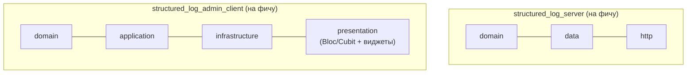
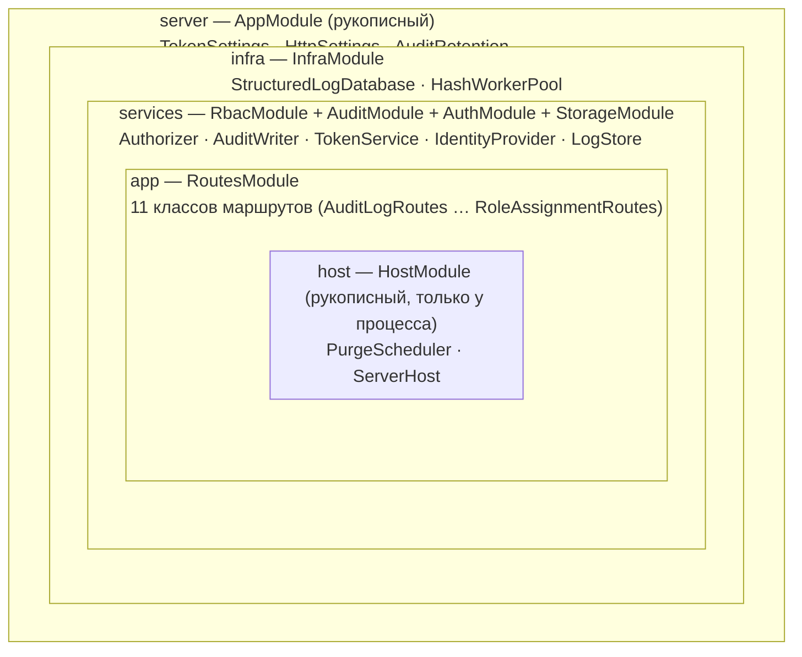
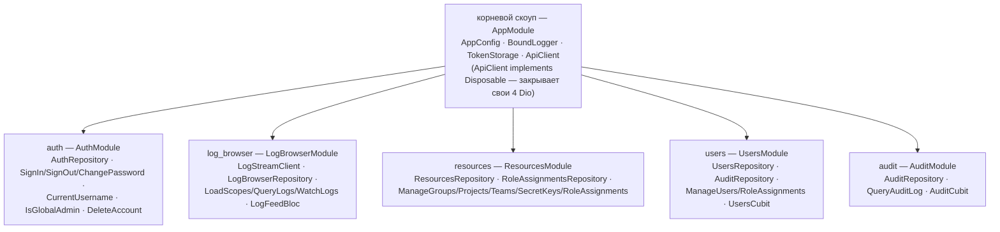

# Технологический стек

*Read in [English](technology-stack.md).*

Каждый значимый выбор зависимости, отклонённая альтернатива и почему.
Каждая строка привязана к decision в `design.md` — там полный аргумент.

## `structured_log_server`

| Выбор | Отклонённая альтернатива | Почему |
|---|---|---|
| `shelf` + `shelf_router` | `dart_frog` | `dart_frog create` навязывает собственный скелет/CLI как основной воркфлоу — расходится с плоской, без codegen раскладкой всех остальных пакетов. `dart_frog` сам построен на `shelf`; функционально ничего не теряется. (decision 1) |
| `shelf_router_generator` для таблицы маршрутов | Ручной каскад `Router` | Маршрут был записан дважды — строкой в `buildHandler` и текстом в doc-комментарии хендлера, — а имена path-параметров проверялись только в рантайме (опечатка давала вечный 404). Аннотация на хендлере делает путь единственным, а арность параметров — ошибкой сборки. Стало возможным только **после** `unify-server-auth`: генератор не умеет аннотировать middleware, поэтому пока обёртки аутентификации висели на каждом маршруте, внедрение загнало бы их в тела хендлеров. |
| `drift` поверх embedded SQLite (`NativeDatabase`) | raw `package:sqlite3` | Первое осознанное исключение codegen в воркспейсе, по прямому указанию пользователя — типобезопасные, проверяемые на этапе компиляции запросы и встроенная миграция схемы перевешивают цену `build_runner` для мультитенантной схемы из 7+ таблиц. Ограничено этим одним пакетом; `*.g.dart` не коммитится. (decision 2, расширено decision 34 ниже) |
| Полнотекстовый поиск `LIKE '%term%'` (через `customSelect`) | FTS5 | Избегает усложнения схемы/пути миграции ради функциональности вне согласованного объёма MVP. Путь апгрейда отмечен, не реализован. (decision 3) |
| Один писатель-`QueryExecutor`, WAL и пул isolate-читателей (`--db-read-pool-size`) | Isolate на запрос / шардирование | `shelf` уже обслуживает запросы в одном isolate по умолчанию — единственный писатель не требует дополнительной синхронизации, и масштабирование сверх этого остаётся явным non-goal. Чтения раньше делили с ним то же соединение, поэтому чтение стояло в очереди за тем, что в этот момент писал приём. WAL позволяет пулу дополнительных соединений, каждое на своём isolate, обслуживать `SELECT` вне транзакции, пока единственный писатель ведёт всё, что меняет данные (`AGENTS.md`). Сам приём: параллельные `POST /v1/logs` тоже больше не открывают каждый свою транзакцию — запрос, пришедший пока идёт коммит, присоединяется к следующему, из-за чего одиночный запрос перестал платить ~0,65 мс фиксированных накладных расходов транзакции целиком, разделив их с пачкой (`AGENTS.md`, `IngestCoordinator`). Ни одно из двух изменений не трогает, почему [broadcast живого потока](live-streaming.ru.md) остаётся in-process `StreamController`: каждая принятая вставка по-прежнему проходит через единственного писателя, в одном процессе, есть пул читателей или нет. (decision 4) |
| `dart_jsonwebtoken` (JWT, HS256) | — | Стандартная библиотека JWT для подписи access-токена; форма claims — в [auth.md](auth.ru.md). |
| `bcrypt` для паролей / SHA-256 для высокоэнтропийных секретов | Один хэш на всё | Две разные модели угроз (устойчивость к офлайн-словарному перебору vs. отсутствие в ней необходимости) получают два разных алгоритма — см. [auth.md](auth.ru.md#хэширование-пароля-vs-секретного-ключа-два-алгоритма-для-двух-угроз). (decision 11) |
| `package:mailer` за интерфейсом `EmailSender` | Захардкоженные вызовы SMTP | Интерфейс позволяет оператору подставить транзакционный email API, не трогая flow восстановления пароля. (decision 24) |
| `structured_log` для собственной диагностики сервера | `package:logging` или `print()` | Воркспейс существует ради этой библиотеки — выбрать для собственного сервиса чужую означало бы либо что своя не готова к реальному применению, либо что автор ей не пользуется. Заодно первый нетривиальный потребитель `BoundLogger`/`AsyncRotatingFileOutput` (decision 48) |
| `cherrypick` для внедрения зависимостей | Ручная проводка в `buildHandler` | Принято для сервера вслед за `structured_log_admin_client`, который уже им пользовался (decision 35) — граф объектов объявлен модулями, а не собран вручную, поэтому тип, который никто не связал, падает при построении обработчика (на старте настоящего процесса, в каждом тесте, который его строит), а не на первом запросе, которому он понадобился. Граф разложен на слои по зависимости (то, что дают → БД/воркеры хэширования → сервисы → маршруты → собственные purge и слушающий сокет процесса), поэтому остановка процесса — один вызов `closeScope`, от внутреннего слоя к внешнему, а не порядок остановки, за которым нужно следить вручную (`AGENTS.md`). |
| `fpdart` (`Either`/`Option`) для ожидаемых исходов | Исключения везде (стиль остального воркспейса) | Ошибки валидации, отказы RBAC, лимиты квоты — часть контракта, который вызывающий обязан явно обработать, не исключительный поток управления; настоящие баги по-прежнему выбрасываются. (decision 33) |
| `freezed` + `json_serializable` для неизменяемых моделей/объединений | Написанные вручную value-классы | Тот же прогон `build_runner`, что уже нужен `drift`; избегает расхождения вручную поддерживаемых `==`/`copyWith` по мере роста числа моделей. (decision 34) |

## `structured_log_http`

| Выбор | Отклонённая альтернатива | Почему |
|---|---|---|
| Отдельный пакет, `structured_log` — единственная зависимость | Расширение core `structured_log`, или часть `structured_log_server` | Wire-контракт эволюционирует вместе с *сервером*, не с ядром логирования — привязывать к этому независимо версионируемый, уже опубликованный core-пакет не оправдано. Также не может жить в `structured_log_server`: приложению, которое только отправляет логи, не должны быть нужны `shelf`/`drift`/и т.п. как транзитивные зависимости. (decision 5) |
| Паттерн `_SerializedAsyncOutput` (из `AsyncFileOutput`) + батчинг + retry/backoff | Новый дизайн очереди | Переиспользует уже проверенный в воркспейсе паттерн вместо изобретения второго для той же формы проблемы (сериализованная доставка, изоляция ошибок на каждом шаге). |

`structured_log_http` не входит в расширение технологического стека decisions 32–38 ниже — остаётся маленьким пакетом без сторонних зависимостей, не затронутым внутренними решениями `structured_log_server`/`structured_log_admin_client`.

## `structured_log_admin_client`

| Выбор | Отклонённая альтернатива | Почему |
|---|---|---|
| Одно приложение, без разделения core/скин | `structured_log_admin_core` + сменный UI-кит | Преждевременная абстракция при единственном потребителе — тот же принцип «не абстрагировать раньше второго потребителя», уже применённый в `add-structured-log-flutter/design.md`. (decision 18) |
| `fluent_ui`, не Material 3 | Material 3 (исходная ревизия decision 18) | Пересматривает именно выбор UI-кита в decision 18 (часть про «без core/skin» не связана с этим и остаётся в силе). Экраны уже отрисованы отдельно (Claude Design); реализация следует этим макетам там, где они существуют. Это **не** значит переиспользование виджетов `structured_log_fluent` — decision 21 (другой источник данных) по-прежнему применяется; общая дизайн-система — визуальное совпадение, не общий код. (decision 38) |
| `dio` + `retrofit` для типизированных эндпоинтов | `package:http`, или ручные вызовы `dio` везде | `dio` нужна цепочка interceptor'ов (подстановка токена, 401→refresh→повтор) как штатный примитив (decision 19); `retrofit` снимает ручной шаблонный код сериализации для ~15 JSON-эндпоинтов. `GET /v1/logs/stream` — единственное осознанное исключение — написан вручную поверх того же `dio`-инстанса, потому что долгоживущее потоковое тело с собственным разбором SSE-кадров не укладывается в модель retrofit «один вызов → один типизированный ответ». (decisions 19, 37) |
| `flutter_secure_storage` | `shared_preferences` | Access/refresh-токены — секреты; `shared_preferences` хранит их в открытом виде на большинстве платформ. (decision 20) |
| `flutter_bloc` (`Bloc`/`Cubit`) для состояния | `riverpod`/`provider`/неспецифицированный `ChangeNotifier`-подобный контроллер | Конкретизирует «собственный маленький слой состояния» просмотрщика логов (decision 21/30) как явный автомат состояний — состояния ленты `Following`/`ScrolledUp`/`Paused` и переходы между ними прямо ложатся на `Bloc`. Тот же подход — для любого другого экрана. (decision 36) |
| `fpdart` (`Either`/`Option`) для ожидаемых исходов | Исключения везде | Тот же принцип, что на сервере (см. выше): сетевые ошибки, `invalid_grant`, отказы по правам идут как `Either` из `infrastructure`/`application` вверх до `presentation`. (decision 33) |
| `freezed` + `json_serializable` для моделей/DTO/состояний Bloc | Написанные вручную value-классы | Естественно сочетается с `Either<Failure, T>` из `fpdart` — обе стороны обычно `freezed`-классы. (decision 34) |
| `structured_log` для собственной диагностики приложения | `package:logging`, `debugPrint` | Тот же аргумент, что у сервера. Пересматривает общий запрет decision 19 «никакой зависимости на `structured_log`»: библиотека логирования общего назначения не несёт ни одной части контракта API, поэтому правило «никакого общего кода контракта» не затронуто (decision 48) |
| `cherrypick` для dependency injection | `get_it`/`provider`/ручная передача через конструкторы | Собственная DI-библиотека того же автора — уже давшая название конвенции раскладки `emb/` этого воркспейса (`AGENTS.md`), теперь впервые используется напрямую как зависимость. (decision 35) |

## `structured_log_admin_ui`

| Выбор | Отклонённая альтернатива | Почему |
|---|---|---|
| Отдельный пакет, только `flutter` sdk + `fluent_ui` | Папка `lib/shared/widgets/` внутри `structured_log_admin_client` | Папка — соглашение, которое импорт `Bloc` может случайно нарушить; отдельный пакет без зависимости на `fpdart`/`freezed`/`cherrypick`/`flutter_bloc`/`dio`/`retrofit`/`structured_log_admin_client` превращает это в ошибку компиляции. (decision 39) |
| Только `atoms`/`molecules`/`organisms` (три уровня) | Классический пятиуровневый Atomic Design (+ `templates`/`pages`) | `templates`/`pages` собирают organisms с реальными данными — по определению завязаны на бизнес-логику конкретной фичи, то есть ровно то, чего в этом пакете быть не должно. Остаются в собственном `presentation`-слое `structured_log_admin_client`. (decision 39) |
| `LogLevelBadge` владеет собственным мэппингом цвета | Импорт `logLevelColor()` из `structured_log_material`/`fluent` | Decision 21 уже исключает деление кода с viewer-пакетами; следует тому же прецеденту дублирования, что уже установлен между этими двумя пакетами. |

Границы уровней и иллюстрированное дерево компонентов — см.
[admin-client.md](admin-client.ru.md#библиотека-компонентов-structured_log_admin_ui).

## Паттерн архитектуры

Оба новых пакета организованы **feature-first** (`auth`, `users`,
`projects`, `logs`, ...), а не по техническому типу файла на весь
пакет — decision 32. Внутри каждой фичи слои различаются, потому что
только у одного из двух пакетов есть UI, который стоит отделять от
доменной логики:

- **Сервер: более простое слоистое деление, не полный Clean
  Architecture** — в headless HTTP API нет presentation-слоя, так что
  четырёхслойное деление было бы структурой ради структуры.
- **Клиент: полный Clean Architecture** (`domain`/`application`/`infrastructure`/`presentation`)
  — у клиента есть настоящий presentation-слой (`flutter_bloc` +
  виджеты `fluent_ui`), так что отделение его от domain/бизнес-логики
  окупается тестируемостью (доменная логика тестируется без Flutter,
  `infrastructure` подменяется фейком в тестах).
- **Общий код** (мультитенантные таблицы хранения сервера; `ApiClient`/хранилище
  токенов/DI-обвязка клиента) живёт вне какой-либо одной фичи, в слое
  `shared`/`common`, используемом несколькими фичами сразу.
- **Точные имена директорий оставлены реализации** — `tasks.md`
  описывает работу по capability, не по зафиксированному дереву файлов,
  чтобы не закреплять это спекулятивно до написания реального кода (см.
  Open Questions `design.md`).

## Граф внедрения зависимостей

Оба новых пакета объявляют граф объектов модулями `cherrypick`, а не
собирают его вручную (decision 35) — но формы графов противоположны,
потому что у пакетов противоположный паттерн разделения между фичами.

### Сервер: один скоуп на *слой*, потому что маршруты делят сервисы

Каждый маршрут каждой фичи зависит от одного и того же небольшого
набора сервисов (`Authorizer`, `AuditWriter`, `LogStore`, ...), так что
скоуп на фичу просто пересвязывал бы их по разу на фичу без всякой
пользы. Вместо этого граф сервера разложен по слоям по зависимостям —
каждый скоуп резолвит только *вверх*, никогда вбок — вложенными от
того, что серверу *дают*, до того, что есть только у запущенного
процесса:

`openServerScope` (`http/server.dart`) открывает `server` → `infra` →
`services` → `app` одним вызовом; `openServerHost` открывает `host`
поверх, как только появился `Handler`, который ему отдать.
`bin/server.dart` — единственный вызывающий, передающий `into:`/
`process:` — открывает `server` через `CherryPick.openScope(scopeName:
serverScopeName)` (так глобальный наблюдатель и детектор циклов его
достают) и передаёт `ProcessResources`, что и делает этот скоуп
*владельцем* БД, пула хэш-воркеров и логирования: `openServerScope`
явно `resolve()`-ит все три сразу после установки `InfraModule`/
`AppModule`, потому что скоуп закрывает только то, что *создали* его
собственные биндинги, а биндинг `toInstance` (то, что передают тесты)
никем не создавался. Тесты строят много обработчиков на своей базе,
деля один пул хэш-воркеров на весь тестовый изолят, и никогда не
передают `process:` — их граф не трогает ни базу, ни пул при закрытии.

Остановка — один вызов, `CherryPick.closeScope(scopeName:
serverScopeName)`, из обработчика сигнала в `bin/server.dart`. Закрытие
скоупа сначала закрывает вложенные, так что слои разворачиваются
изнутри наружу — `host → app → services → infra → server` — слушающий
сокет и purge-задача останавливаются раньше базы и хэш-воркеров,
которыми всё ещё пользуются, а `ServerLogging` (куда всё выше могло
ещё писать) сбрасывается последним из всех (`AGENTS.md`).

### Клиент: один скоуп на *фичу*, потому что фичи почти не делятся

Пять фич клиента (`auth`, `log_browser`, `resources`, `users`, `audit`)
каждая владеет в основном независимым куском домена, так что здесь
естественный разрез — скоуп на фичу; каждый скоуп фичи — прямой
потомок корня, не вложен друг в друга:

`openAppScope` устанавливает `AppModule` в `CherryPick.openRootScope()`
раньше, чем что-либо ещё выполняется, так что глобальный наблюдатель и
детекторы циклов (и локальный, и межскоуповый) уже включены к моменту
открытия первого скоупа фичи. `HomeShell.dispose()` закрывает свои
четыре скоупа фич (`log_browser`/`resources`/`users`/`audit`);
`AuthGate.dispose()` закрывает `auth` — скоуп, к которому `HomeShell`
тоже присоединяется по имени, а не переоткрывает, поскольку `AuthGate`
переживает его через смену входа. `openAuthScope` — единственный
opener, который *присоединяется*, а не переустанавливает: два места
вызова (`AuthGate` и хостящий его `HomeShell`) просят один и тот же
скоуп по имени, а повторная установка `$AuthModule()` просто наложила
бы дублирующие биндинги друг на друга, поэтому модуль ставится, только
если в скоупе ещё ничего не резолвит `AuthRepository`.

### Два поведения `cherrypick`, важные перед правкой любого из графов

- **Отсутствующий биндинг — не ошибка на этапе сборки.** Генератор не
  проверяет граф — тип, который никто не предоставляет, проходит
  `analyze` и компилируется, а бросает `StateError` только на первом
  `resolve()`. Оба графа закреплены против этого тестом, резолвящим
  всё, что скоуп обещает, сразу после его постройки
  (`test/di/server_scope_test.dart` на сервере,
  `test/shared/di/scopes_test.dart` на клиенте) — подтверждено
  мутацией: удаление метода-провайдера красит соответствующий тест.
- **`@instance()` связывает нетерпеливо, `@provide()` — лениво.**
  Биндинг `@provide()`/`toProvide` резолвит свои зависимости из
  соседних биндингов, когда их кто-то впервые запрашивает; `@instance()`/
  `toInstance` вычисляется сразу внутри `builder()`, раньше, чем
  остальные биндинги того же модуля обязательно уже существуют —
  использование его для значения с зависимостью внутри того же модуля
  бросает `Can't resolve dependency` в момент `installModules`, а не
  ошибку проводки в самой зависимости. Ни один из графов не использует
  `@instance()` по этой причине; значения без собственных зависимостей
  (`TokenSettings`, `AppConfig`, ...) связаны через `toInstance` прямо
  в рукописных модулях.

## Что осознанно *не* скопировано из Keycloak

Контракт аутентификации (см. [auth.md](auth.ru.md)) достаточно близко
повторяет форму token-эндпоинта Keycloak, чтобы с ним работал готовый
OAuth2-клиент, но намеренно не дотягивает до полной поверхности
OIDC/Keycloak:

- `client`/`client_id`/`client_secret` и регистрация клиентов — есть
  ровно один неявный «клиент» (сам этот API), нет отдельных приложений
  для регистрации.
- Token introspection endpoint (RFC 7662).
- OIDC UserInfo endpoint.
- Discovery-документ (`.well-known/openid-configuration`).

Ничто из этого не обслуживает потребителя, который реально есть у этой
доработки (decision 10). Добавление этого спекулятивно было бы ровно тем
видом «абстракции без второго потребителя», которого дизайн избегает
везде в остальном.

## Единственное неизменное ограничение, которого этот стек не касается

Сам `structured_log` сохраняет правило нулевых runtime-зависимостей
(только `meta`) — ни один из трёх новых пакетов не добавляет ему
зависимость. Это новые пакеты, не новый вес на существующем.
