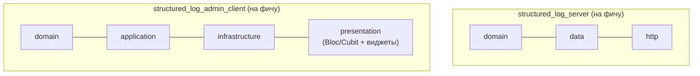
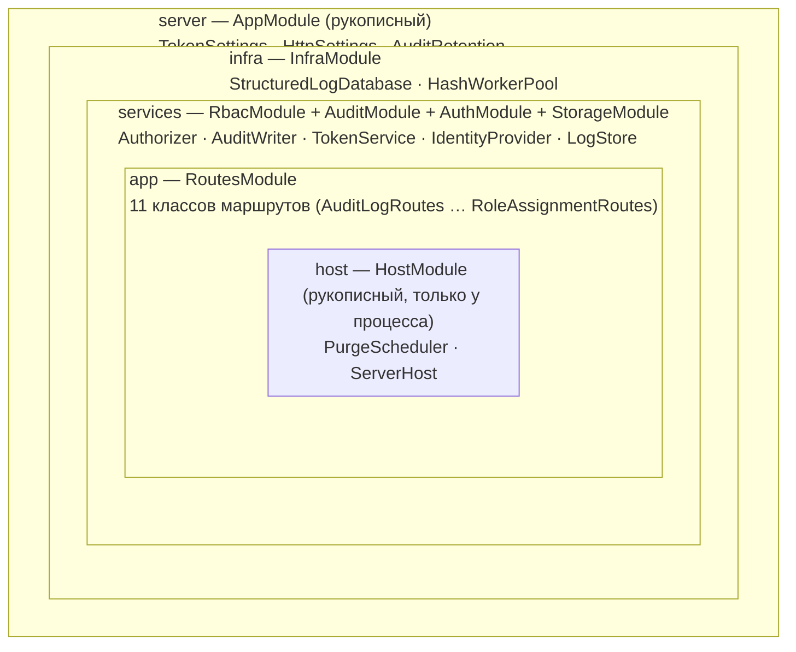
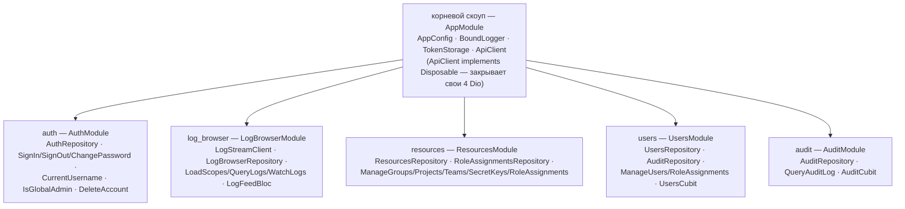

# Технологический стек

*Read in [English](technology-stack.md).*

Здесь собраны все значимые зависимости, отклонённые альтернативы и причины
выбора.
Каждая строка привязана к decision в `design.md` — там полное обоснование.

## `structured_log_server`

| Выбор | Отклонённая альтернатива | Почему |
|---|---|---|
| `shelf` + `shelf_router` | `dart_frog` | `dart_frog create` навязывает собственный скелет и CLI как основной способ работы, а это расходится с плоской раскладкой без codegen, как у всех остальных пакетов. `dart_frog` сам построен на `shelf`; функционально ничего не теряется. (decision 1) |
| `shelf_router_generator` для таблицы маршрутов | Ручной каскад `Router` | Маршрут был записан дважды — строкой в `buildHandler` и текстом в doc-комментарии хендлера, — а имена path-параметров проверялись только в рантайме (опечатка давала вечный 404). Аннотация на хендлере делает путь единственным, а арность параметров — ошибкой сборки. Стало возможным только **после** `unify-server-auth`: генератор не умеет аннотировать middleware, поэтому пока обёртки аутентификации висели на каждом маршруте, переход на генератор загнал бы их в тела хендлеров. |
| `drift` поверх embedded SQLite (`NativeDatabase`) | raw `package:sqlite3` | Первое осознанное исключение из запрета на codegen в воркспейсе, сделанное по прямому указанию пользователя: для мультитенантной схемы из 7+ таблиц типобезопасные, проверяемые на этапе компиляции запросы и встроенная миграция схемы стоят цены `build_runner`. Ограничено этим одним пакетом; `*.g.dart` не коммитится. (decision 2, расширено decision 34 ниже) |
| Полнотекстовый поиск `LIKE '%term%'` (через `customSelect`) | FTS5 | Не усложняет схему и путь миграции ради функциональности за пределами согласованного объёма MVP. Путь перехода записан, но не реализован. (decision 3) |
| Один писатель-`QueryExecutor`, WAL и пул isolate-читателей (`--db-read-pool-size`) | Isolate на запрос / шардирование | `shelf` по умолчанию и так обслуживает запросы в одном isolate, поэтому единственному писателю не нужна дополнительная синхронизация, а масштабирование сверх этого остаётся явным non-goal. Раньше чтения делили с писателем одно соединение и ждали в очереди, пока приём допишет текущее. WAL позволяет пулу дополнительных соединений, каждое на своём isolate, обслуживать `SELECT` вне транзакции, пока всё, что меняет данные, идёт через единственного писателя (`AGENTS.md`). Сам приём: параллельные `POST /v1/logs` тоже больше не открывают каждый свою транзакцию — запрос, пришедший во время коммита, присоединяется к следующему, так что одиночный запрос больше не оплачивает в одиночку ~0,65 мс фиксированных накладных расходов транзакции, а делит их с пачкой (`AGENTS.md`, `IngestCoordinator`). Ни одно из двух изменений не затрагивает причину, по которой [broadcast живого потока](live-streaming.ru.md) остаётся in-process `StreamController`: каждая принятая вставка по-прежнему проходит через единственного писателя в одном процессе, есть пул читателей или нет. Конфигурация «один писатель + пул читателей» целиком специфична для SQLite; выбираемая оператором альтернатива — в следующей строке. (decision 4) |
| `drift_postgres` (`PgDatabase`) как выбираемый оператором альтернативный backend (`--db-backend=postgres`) | Обязательный PostgreSQL всегда, либо второй слой хранения с нуля | SQLite остаётся дефолтом; PostgreSQL включают по желанию операторы, которым нужен MVCC или у которых уже есть инфраструктура backup/HA; полное сравнение backend'ов — в [data-model.md](data-model.ru.md#postgresql-выбираемый-оператором-альтернативный-backend). (add-postgres-backend decisions 1–10) |
| `dart_jsonwebtoken` (JWT, HS256) | — | Стандартная библиотека JWT для подписи access-токена; форма claims — в [auth.md](auth.ru.md). |
| `bcrypt` для паролей / SHA-256 для высокоэнтропийных секретов | Один хэш на всё | Двум разным моделям угроз (нужна устойчивость к офлайн-перебору по словарю или не нужна) — два разных алгоритма — см. [auth.md](auth.ru.md#хэширование-пароля-и-секретного-ключа-два-алгоритма-для-двух-угроз). (decision 11) |
| `package:mailer` за интерфейсом `EmailSender` | Захардкоженные вызовы SMTP | Интерфейс позволяет оператору подставить транзакционный email API, не трогая flow восстановления пароля. (decision 24) |
| `structured_log` для собственной диагностики сервера | `package:logging` или `print()` | Воркспейс существует ради этой библиотеки — выбрать для собственного сервиса чужую означало бы либо что своя не готова к реальному применению, либо что автор ей не пользуется. Заодно сервер стал первым нетривиальным потребителем `BoundLogger`/`AsyncRotatingFileOutput` (decision 48) |
| `cherrypick` для внедрения зависимостей | Ручная проводка в `buildHandler` | Принято для сервера вслед за `structured_log_admin_client`, который уже им пользовался (decision 35) — граф объектов объявлен модулями, а не собран вручную, поэтому тип, который никто не связал, падает при построении обработчика (на старте настоящего процесса, в каждом тесте, который его строит), а не на первом запросе, которому он понадобился. Граф разложен на слои по зависимости (то, что дают → БД/воркеры хэширования → сервисы → маршруты → собственные purge и слушающий сокет процесса), поэтому остановка процесса — один вызов `closeScope`, от внутреннего слоя к внешнему, а не порядок остановки, за которым нужно следить вручную (`AGENTS.md`). |
| `fpdart` (`Either`/`Option`) для ожидаемых исходов | Исключения везде (стиль остального воркспейса) | Ошибки валидации, отказы RBAC, лимиты квоты — часть контракта, который вызывающий обязан явно обработать, а не исключительный поток управления; настоящие баги по-прежнему выбрасываются. (decision 33) |
| `freezed` + `json_serializable` для неизменяемых моделей/объединений | Написанные вручную value-классы | Использует тот же прогон `build_runner`, который уже нужен `drift`; с ростом числа моделей рукописные `==`/`copyWith` не начинают расходиться. (decision 34) |

`drift_postgres` переиспользует одну схему `drift` для обоих диалектов
(генерируется для обоих через `sql: dialects:` в `build.yaml`), а не
дублирует модели — каждое реальное различие сводится к
небольшой ветке по `executor.dialect`, а не к параллельной реализации:

- **Синтаксис плейсхолдера в сыром SQL** различается напрямую (`?` у
  SQLite против собственных позиционных параметров Postgres).
- **Извлечение JSON-пути** отличается по диалекту.
- **Булев литерал частичного индекса** отличается по диалекту.
- **Батч-вставка** на Postgres использует `RETURNING`, а на SQLite —
  `last_insert_rowid()`.

Backend никогда не переключается во время работы, и данные никогда не
переносятся SQLite→Postgres автоматически: выбор делается один раз, при
развёртывании, на пустой базе. Полная запись решения — включая два
дефекта, найденных только запуском настоящего сервера против
настоящего Postgres (зависание при остановке из-за незакрытого пула
соединений, и необходимость `--concurrency=1` для Postgres-тегированных
тестовых файлов) — лежит в
[openspec/changes/archive/2026-10-01-add-postgres-backend/](../../openspec/changes/archive/2026-10-01-add-postgres-backend/).

## `structured_log_remote_sync`

| Выбор | Отклонённая альтернатива | Почему |
|---|---|---|
| Отдельный пакет, `structured_log` — единственная зависимость | Расширение core `structured_log`, или часть `structured_log_server` | Wire-контракт меняется вместе с *сервером*, а не с ядром логирования, и привязывать к нему независимо версионируемый, уже опубликованный core-пакет нет оснований. Жить в `structured_log_server` пакет тоже не может: приложению, которое только отправляет логи, не должны быть нужны `shelf`/`drift`/и т.п. как транзитивные зависимости. (decision 5) |
| Паттерн `_SerializedAsyncOutput` (из `AsyncFileOutput`) + батчинг + retry/backoff | Новый дизайн очереди | Переиспользует проверенный в воркспейсе паттерн, а не изобретает второй для задачи того же рода (сериализованная доставка, изоляция ошибок на каждом шаге). |
| Каждая запись кодируется `encodeLogEntry` ядра в момент вызова sink'а; в буфере лежат JSON-строки, батч — их массив | Хранить в буфере карты и кодировать весь батч `jsonEncode` при отправке | Раньше из-за одного значения, которое не принял `jsonEncode`, терялся весь батч (до `batchSize` записей); теперь нечитаемая запись отбрасывается одна, и об этом сообщается. Заодно запись уходит такой, какой была в момент логирования, — карта, изменённая позже, в неё не просачивается, — а строка занимает примерно впятеро меньше памяти, чем карта, из которой получена. Публичный `BatchSender` сохранил сигнатуру: подставной отправитель получает записи, декодированные обратно в карты, — то, что прочитал бы сервер. (harden-structured-log-core decision 16) |

Расширение технологического стека из decisions 32–38 ниже `structured_log_remote_sync` не касается: он остаётся маленьким пакетом без сторонних зависимостей, и внутренние решения `structured_log_server`/`structured_log_admin_client` на него не влияют.

## `structured_log_admin_client`

| Выбор | Отклонённая альтернатива | Почему |
|---|---|---|
| Одно приложение, без разделения core/скин | `structured_log_admin_core` + сменный UI-кит | Преждевременная абстракция при единственном потребителе — тот же принцип «не абстрагировать раньше второго потребителя», уже применённый в `add-structured-log-flutter/design.md`. (decision 18) |
| `fluent_ui`, не Material 3 | Material 3 (исходная ревизия decision 18) | Пересматривает именно выбор UI-кита в decision 18 (часть про «без core/skin» не связана с этим и остаётся в силе). Экраны уже отрисованы отдельно (Claude Design); реализация следует этим макетам там, где они есть. Это **не** значит, что переиспользуются виджеты `structured_log_fluent`: decision 21 (другой источник данных) по-прежнему действует, а общая дизайн-система — лишь визуальное совпадение, а не общий код. (decision 38) |
| `dio` + `retrofit` для типизированных эндпоинтов | `package:http`, или ручные вызовы `dio` везде | `dio` выбран ради штатной цепочки interceptor'ов — подстановка токена, 401→refresh→повтор (decision 19); `retrofit` избавляет от рукописного шаблонного кода сериализации для ~15 JSON-эндпоинтов. `GET /v1/logs/stream` — единственное осознанное исключение — написан вручную поверх того же `dio`-инстанса, потому что долгоживущее потоковое тело с собственным разбором SSE-кадров не укладывается в модель retrofit «один вызов → один типизированный ответ». (decisions 19, 37) |
| `flutter_secure_storage` | `shared_preferences` | Access/refresh-токены — секреты; `shared_preferences` хранит их в открытом виде на большинстве платформ. (decision 20) |
| `flutter_bloc` (`Bloc`/`Cubit`) для состояния | `riverpod`/`provider`/не уточнённый контроллер в духе `ChangeNotifier` | Конкретизирует «собственный маленький слой состояния» просмотрщика логов (decision 21/30) как явный автомат состояний — состояния ленты `Following`/`ScrolledUp`/`Paused` и переходы между ними прямо ложатся на `Bloc`. Тот же подход — для любого другого экрана. (decision 36) |
| `fpdart` (`Either`/`Option`) для ожидаемых исходов | Исключения везде | Тот же принцип, что на сервере (см. выше): сетевые ошибки, `invalid_grant`, отказы по правам идут как `Either` из `infrastructure`/`application` вверх до `presentation`. (decision 33) |
| `freezed` + `json_serializable` для моделей/DTO/состояний Bloc | Написанные вручную value-классы | Естественно сочетается с `Either<Failure, T>` из `fpdart` — обе стороны обычно `freezed`-классы. (decision 34) |
| `structured_log` для собственной диагностики приложения | `package:logging`, `debugPrint` | Тот же довод, что у сервера. Пересматривает общий запрет decision 19 «никакой зависимости на `structured_log`»: библиотека логирования общего назначения не несёт ни одной части контракта API, поэтому правило «никакого общего кода контракта» не затронуто (decision 48) |
| `cherrypick` для dependency injection | `get_it`/`provider`/ручная передача через конструкторы | Собственная DI-библиотека того же автора — уже давшая название конвенции раскладки `emb/` этого воркспейса (`AGENTS.md`), теперь впервые используется напрямую как зависимость. (decision 35) |

## `structured_log_admin_ui`

| Выбор | Отклонённая альтернатива | Почему |
|---|---|---|
| Отдельный пакет, только `flutter` sdk + `fluent_ui` | Папка `lib/shared/widgets/` внутри `structured_log_admin_client` | Папка — соглашение, которое импорт `Bloc` может случайно нарушить; отдельный пакет без зависимости на `fpdart`/`freezed`/`cherrypick`/`flutter_bloc`/`dio`/`retrofit`/`structured_log_admin_client` превращает это в ошибку компиляции. (decision 39) |
| Только `atoms`/`molecules`/`organisms` (три уровня) | Классический пятиуровневый Atomic Design (+ `templates`/`pages`) | `templates`/`pages` собирают organisms с реальными данными и потому по определению завязаны на бизнес-логику конкретной фичи — ровно то, чего в этом пакете быть не должно. Они остаются в собственном `presentation`-слое `structured_log_admin_client`. (decision 39) |
| У `LogLevelBadge` собственное соответствие «уровень → цвет» | Импорт `logLevelColor()` из `structured_log_material`/`fluent` | Decision 21 уже исключает общий код с viewer-пакетами; дублирование повторяет прецедент, уже созданный этими двумя пакетами. |

Границы уровней и иллюстрированное дерево компонентов — см.
[admin-client.md](admin-client.ru.md#библиотека-компонентов-structured_log_admin_ui).

## Паттерн архитектуры

Оба новых пакета организованы **feature-first** (`auth`, `users`,
`projects`, `logs`, ...), а не по техническому типу файла на весь
пакет — decision 32. Внутри каждой фичи слои различаются, потому что
только у одного из двух пакетов есть UI, который стоит отделять от
доменной логики:

```mermaid
flowchart TB
    subgraph Server["structured_log_server (на фичу)"]
        SD["domain"] --- SDa["data"] --- SH["http"]
    end
    subgraph Client["structured_log_admin_client (на фичу)"]
        CD["domain"] --- CA["application"] --- CI["infrastructure"] --- CP["presentation\n(Bloc/Cubit + виджеты)"]
    end
```

- **Сервер: более простое деление на слои, а не полная Clean
  Architecture** — в headless HTTP API нет presentation-слоя, так что
  четырёхслойное деление было бы структурой ради структуры.
- **Клиент: полная Clean Architecture** (`domain`/`application`/`infrastructure`/`presentation`)
  — у клиента есть настоящий presentation-слой (`flutter_bloc` +
  виджеты `fluent_ui`), так что отделение его от domain/бизнес-логики
  окупается тестируемостью (доменная логика тестируется без Flutter,
  `infrastructure` подменяется фейком в тестах).
- **Общий код** (мультитенантные таблицы хранения сервера; `ApiClient`/хранилище
  токенов/DI-обвязка клиента) лежит вне отдельных фич, в слое
  `shared`/`common`, которым пользуются сразу несколько фич.
- **Точные имена директорий оставлены реализации** : `tasks.md`
  описывает работу по capability, а не по зафиксированному дереву файлов,
  чтобы не закреплять раскладку наугад, пока не написан реальный код (см.
  Open Questions `design.md`).

## Граф внедрения зависимостей

Оба новых пакета объявляют граф объектов модулями `cherrypick`, а не
собирают его вручную (decision 35) , но графы устроены противоположно,
потому что фичи двух пакетов делят зависимости противоположным образом.

### Сервер: один скоуп на *слой*, потому что маршруты делят сервисы

Каждый маршрут каждой фичи зависит от одного и того же небольшого
набора сервисов (`Authorizer`, `AuditWriter`, `LogStore`, ...), так что
скоуп на фичу просто пересвязывал бы их по разу на фичу без всякой
пользы. Поэтому граф сервера разложен на слои по зависимостям —
каждый скоуп резолвит только *вверх*, никогда вбок, — и слои вложены
друг в друга: от того, что серверу *дают*, до того, что есть только у
запущенного процесса:

```mermaid
flowchart TB
    subgraph server["server — AppModule (рукописный)\nTokenSettings · HttpSettings · AuditRetention\nLogBroadcast · ServerLogging (только у процесса, provider)"]
      subgraph infra["infra — InfraModule\nStructuredLogDatabase · HashWorkerPool"]
        subgraph services["services — RbacModule + AuditModule + AuthModule + StorageModule\nAuthorizer · AuditWriter · TokenService · IdentityProvider · LogStore"]
          subgraph app["app — RoutesModule\n11 классов маршрутов (AuditLogRoutes … RoleAssignmentRoutes)"]
            subgraph host["host — HostModule (рукописный, только у процесса)\nPurgeScheduler · ServerHost"]
            end
          end
        end
      end
    end
```

`openServerScope` (`http/server.dart`) открывает `server` → `infra` →
`services` → `app` одним вызовом; `openServerHost` открывает поверх
них `host`, как только появляется `Handler`, который можно ему передать.
`bin/server.dart` — единственный, кто передаёт `into:`/`process:`: он
открывает `server` через `CherryPick.openScope(scopeName:
serverScopeName)` (так до него дотягиваются глобальный наблюдатель и
детектор циклов) и передаёт `ProcessResources` — именно это делает скоуп
*владельцем* БД, пула хэш-воркеров и логирования: `openServerScope`
явно `resolve()`-ит все три сразу после установки `InfraModule`/
`AppModule`, потому что скоуп закрывает только то, что *создали* его
собственные биндинги, а биндинг `toInstance` (то, что передают тесты)
никем не создавался. Тесты строят много обработчиков на своей базе,
деля один пул хэш-воркеров на весь тестовый изолят, и никогда не
передают `process:`, поэтому при закрытии их граф не трогает ни базу, ни
пул.

Остановка — один вызов, `CherryPick.closeScope(scopeName:
serverScopeName)`, из обработчика сигнала в `bin/server.dart`. Закрытие
скоупа сначала закрывает вложенные, так что слои закрываются
изнутри наружу (`host → app → services → infra → server`): слушающий
сокет и purge-задача останавливаются раньше базы и хэш-воркеров,
которыми они ещё пользуются, а `ServerLogging` (куда всё перечисленное
ещё могло писать) сбрасывается самым последним (`AGENTS.md`).

### Клиент: один скоуп на *фичу*, потому что фичи почти не делятся

У каждой из пяти фич клиента (`auth`, `log_browser`, `resources`, `users`,
`audit`) свой, в основном независимый кусок домена, так что здесь
естественный разрез — скоуп на фичу; скоупы фич — прямые потомки
корня и друг в друга не вложены:

```mermaid
flowchart TB
    root["корневой скоуп — AppModule\nAppConfig · BoundLogger · TokenStorage · ApiClient\n(ApiClient implements Disposable — закрывает свои 4 Dio)"]
    root --> auth["auth — AuthModule\nAuthRepository · SignIn/SignOut/ChangePassword ·\nCurrentUsername · IsGlobalAdmin · DeleteAccount"]
    root --> logBrowser["log_browser — LogBrowserModule\nLogStreamClient · LogBrowserRepository ·\nLoadScopes/QueryLogs/WatchLogs · LogFeedBloc"]
    root --> resources["resources — ResourcesModule\nResourcesRepository · RoleAssignmentsRepository ·\nManageGroups/Projects/Teams/SecretKeys/RoleAssignments"]
    root --> users["users — UsersModule\nUsersRepository · AuditRepository ·\nManageUsers/RoleAssignments · UsersCubit"]
    root --> audit["audit — AuditModule\nAuditRepository · QueryAuditLog · AuditCubit"]
```

`openAppScope` устанавливает `AppModule` в `CherryPick.openRootScope()`
раньше всего остального, так что глобальный наблюдатель и
детекторы циклов (и локальный, и межскоуповый) уже включены к моменту
открытия первого скоупа фичи. `HomeShell.dispose()` закрывает свои
четыре скоупа фич (`log_browser`/`resources`/`users`/`audit`);
`AuthGate.dispose()` закрывает `auth` — скоуп, к которому `HomeShell`
тоже присоединяется по имени, а не переоткрывает, поскольку `AuthGate`
живёт дольше `HomeShell` и переживает смену входа. `openAuthScope` —
единственная функция открытия, которая *присоединяется* к скоупу, а не
устанавливает модуль заново: два места
вызова (`AuthGate` и хостящий его `HomeShell`) просят один и тот же
скоуп по имени, а повторная установка `$AuthModule()` просто наложила
бы дублирующие биндинги друг на друга, поэтому модуль ставится, только
если в скоупе ещё ничего не резолвит `AuthRepository`.

### Две особенности `cherrypick`, которые надо знать, прежде чем править графы

- **Отсутствующий биндинг — не ошибка на этапе сборки.** Генератор не
  проверяет граф: тип, который никто не предоставляет, проходит
  `analyze` и компилируется, а `StateError` выбрасывается только на
  первом `resolve()`. От этого оба графа защищены тестом, который
  резолвит всё, что обещает скоуп, сразу после его построения
  (`test/di/server_scope_test.dart` на сервере,
  `test/shared/di/scopes_test.dart` на клиенте); это подтверждено
  мутацией: удаление метода-провайдера роняет соответствующий тест.
- **`@instance()` связывает сразу, `@provide()` — лениво.**
  Биндинг `@provide()`/`toProvide` резолвит свои зависимости из
  соседних биндингов, когда их кто-то впервые запрашивает; `@instance()`/
  `toInstance` вычисляется сразу внутри `builder()`, когда
  остальных биндингов того же модуля может ещё не быть, ;
  если взять его для значения, зависящего от чего-то в том же модуле,
  `installModules` упадёт с `Can't resolve dependency`, хотя ошибки
  проводки в самой зависимости нет. По этой причине ни один из графов
  `@instance()` не использует; значения без собственных зависимостей
  (`TokenSettings`, `AppConfig`, ...) связаны через `toInstance` прямо
  в рукописных модулях.

## Что осознанно *не* скопировано из Keycloak

Контракт аутентификации (см. [auth.md](auth.ru.md)) достаточно близко
повторяет форму token-эндпоинта Keycloak, чтобы с ним работал готовый
OAuth2-клиент, но намеренно не воспроизводит OIDC/Keycloak
целиком:

- `client`/`client_id`/`client_secret` и регистрация клиентов — есть
  ровно один неявный «клиент» (сам этот API), нет отдельных приложений
  для регистрации.
- Token introspection endpoint (RFC 7662).
- OIDC UserInfo endpoint.
- Discovery-документ (`.well-known/openid-configuration`).

Ничего из этого единственному реальному потребителю этой доработки
не нужно (decision 10). Добавлять это на всякий случай — ровно та
«абстракция без второго потребителя», которой дизайн избегает во всём
остальном.

## Незыблемое ограничение, которого этот стек не касается

Сам `structured_log` сохраняет правило нулевых runtime-зависимостей
(только `meta`) — ни один из трёх новых пакетов не добавляет ему
зависимость. Это новые пакеты, а не новая нагрузка на существующий.

С `harden-structured-log-core` его главная библиотека не импортирует и
`dart:io`, поэтому собирается под web: четыре файловых выхода
(`fileOutput`, `rotatingFileOutput`, `AsyncFileOutput`,
`AsyncRotatingFileOutput`) живут в `package:structured_log/io.dart`, и
сервер ради своего `AsyncRotatingFileOutput` импортирует его рядом с
главной библиотекой. Условный экспорт отвергли: API библиотеки тогда
зависел бы от платформы, а отсутствующий символ обнаруживался бы только
при сборке под web (decision 12 той же заявки).
