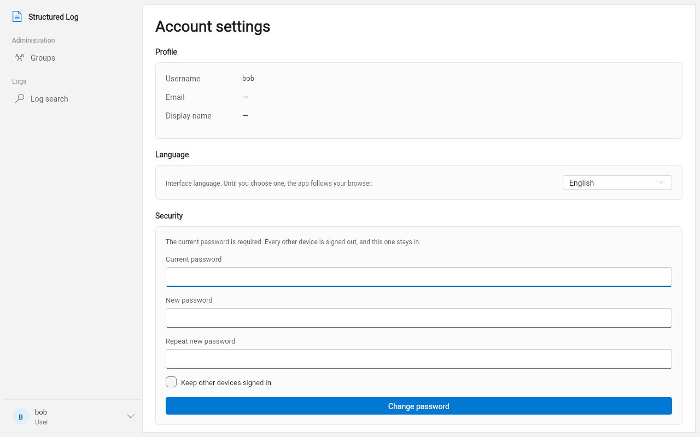

# User Guide

*Читать на [русском](user-guide.ru.md).*

For anyone who's been given an account on a `structured_log` server and
signs in to the admin client to read, search or manage logs. If you're
deploying or configuring the server itself, see the
[Administrator / DevOps Guide](admin-guide.md) instead; if you're
sending logs *into* the system from your own application, see the
[Developer Guide](developer-guide.md).

Every screenshot below is a real screen from a running server — a small
demo workspace (a "Payments Platform" group with an `orders-api`
project, an owner and a read-only user), not mockups.

## What you're looking at

The admin client is a web app: one page, served by your organization at
some URL an administrator gave you (for example
`https://logs.example.com`). Everything in this guide happens there — no
separate desktop app, no command line. The server address is shown in
small print under the sign-in form, so you can confirm you're pointed at
the right one before typing a password into it.

## Signing in

You don't sign yourself up — there's no "create account" link, because
this system doesn't offer self-registration. An administrator (or, for
your own group, an `owner`) creates your account and gives you a
username and a temporary password out of band (chat, a password
manager, however your organization shares secrets).

1. Enter the username and temporary password you were given.
2. The app immediately asks you to set a real password — this isn't
   optional. Until you do, nothing else in the app works: every screen
   redirects you back to this one. It's a one-time step, not something
   you'll see again unless an administrator resets your password later
   (same gate, same reason).
3. Pick a password 8–72 characters long. There's no other rule — no
   forced mix of symbols, numbers, or cases.

Once you've changed it, the app confirms and lets you in — from here
on, the temporary password no longer works.

Once you're through, the app remembers you (a session that renews
itself quietly in the background) until you sign out, until an
administrator revokes your access, or until you haven't used the app in
a long while.

**If your session ends unexpectedly** — a banner reading "Session
ended — sign in again" — this isn't necessarily something you did
wrong. It happens when an administrator changed your access, changed
your password on your behalf, or blocked/unblocked you while you were
signed in; the app enforces changes to your access immediately, not on
your next scheduled check-in. Sign in again and you're back where you
left off.

## What your role lets you do

Access is granted per **group** or per individual **project**, and it
comes in three levels. An administrator (or, for a group, its owner)
decides what you're granted — this isn't something you configure
yourself:

| Role | What it means for you |
|---|---|
| **`user`** | Read-only. You can search and live-tail logs in the groups/projects you've been granted access to. You cannot create, edit, or delete anything, and you cannot see the audit log. |
| **`owner`** (of a group) | Everything `user` can do, plus: - Create and manage projects and teams inside that group - Edit their storage quotas - Create/revoke their secret keys - Grant `owner`/`user` roles to others within that same group  Still can't grant `admin`, block/unblock accounts, or read the audit log — those stay administrator-only. |
| **`admin`** | Full access everywhere: - Every group, every project - User management - Role grants of any kind (including `admin` itself) - The audit log |

The app itself reflects this: an action you're not allowed to take is
simply not shown, rather than shown and then refused. If a navigation
item (Users, Audit, the "Create group" button, ...) isn't in your
sidebar, it's because your role doesn't reach it — not a bug.

A grant on a project doesn't automatically cover its parent group, and
the reverse holds too, one level down: a grant on a *group* does cover
every project inside it, but you won't see that group itself unless you
were granted access to the group directly. Below is exactly what a
`user` with one project-level grant (on `orders-api`) and one
group-level grant (on `Internal Tools`) sees after signing in — only
`Internal Tools` appears under Groups, and only the two nav sections a
read-only role reaches (**Administration** — see
[Finding your way around](#finding-your-way-around) below — is reduced
to Groups; there's no Users or Audit):

## Finding your way around

The left-hand navigation is grouped by what it's for:

- **Overview** — **Dashboard** *(`admin` only)*: a quick landing view of
  every group on the server and a handful of its projects, for jumping
  straight into one rather than searching for it.
- **Administration** *(visible only if your role reaches it)* —
  **Groups**, **Users**, **Audit**.
- **Logs** — **Search logs**, the log browser covered below.

Your account menu is in the bottom-left corner (your username), with
sign-out and account settings under it.

## Searching and reading logs

Open **Search logs** and you'll first be asked to pick a **scope**: one
project, or one group (which searches across every project in it). The
list only offers what you actually have access to — a project reached
through a direct grant, or through a group grant that covers it.
You can't search across an arbitrary mix of projects — pick the
narrowest scope that covers what you're looking for.

Once a scope is chosen, you get a filter bar above a live, newest-first
feed:

| Filter | What it matches |
|---|---|
| Free-text search | The event name and log content |
| Level | A minimum severity — `trace`/`debug`/`info`/`warning`/`error`/`critical` — everything at or above it |
| From / To | A time range |
| Correlation id | Session, request, or another correlation field a developer attached when logging — click "+ correlation id" to add one |

Filters combine (AND, not OR): setting a level and a time range narrows
by both at once. Clearing a filter widens the results again
immediately — there's no separate "Apply"/"Reset" round trip beyond the
"Find" button that runs the search.

Setting the level filter to "Error and above" narrows the same feed to
only what needs attention:

### Reading one entry

Click any row in the feed to open its full detail on the right: the
standard fields (level, timestamp, when the server received it) and,
below them, every custom field the application attached when it logged
that event — whatever an engineer chose to include (an order id, a
user id, an error code, ...). Nothing is truncated or hidden; if a
field was sent, it's here. A "Copy" action puts the whole entry on your
clipboard as JSON, handy for pasting into a bug report or a chat thread.

### Live tailing

The green **"Live"** indicator means new entries matching your current
filter appear at the bottom automatically as they arrive — no manual
refresh. Two independent things to know:

- **Scrolling up to read history doesn't fight you.** If you scroll away
  from the bottom to read older entries, new arrivals don't yank you
  back down; instead a small "N new" badge appears. Tap it when you're
  ready to jump back to the live edge.
- **"Pause"** stops the visible list from updating at all (useful while
  you're reading something and don't want the list to shift under your
  cursor), while still collecting what arrives in the background — tap
  "Resume" to catch up.

Changing any filter or the scope closes the live connection and opens a
fresh one under the new criteria — you're never watching a stale mix of
old and new filters.

## If you're an `owner` or `admin`: managing groups and projects

An `owner` sees only the groups they were granted; here's the same
**Groups** screen for an account that owns exactly one:

Open one to see its projects, teams, and (for `admin`) who has access
to it:

From there:

- **Create a project** inside the group — it needs a name and a
  **retention period** (how many days its logs are kept before being
  automatically deleted; every project must have one). Optionally cap
  it by entry count and/or total storage size — leave either blank for
  no limit on that dimension.

  

  

- **Rotate secret keys** — a project's secret key is what an
  application uses to *send* logs to it (see the
  [Developer Guide](developer-guide.md#sending-logs-to-the-server)). A
  new key's value is shown **exactly once**, at creation — copy it
  immediately, there's no way to retrieve it again afterward. Revoking
  a key is immediate and irreversible; any application still using the
  revoked key starts getting rejected right away.

  

- **Grant access** — pick a person (or a team, if your role reaches
  `admin`'s team-management surface) and a role, scoped to this group
  or to one specific project inside it. The recipient field searches as
  you type.

  

- **Create a team** (within a group) to grant access to several people
  at once, instead of one grant per person — add or remove members and
  everyone's access updates together.

  

  

Editing a project's quota takes effect immediately; it doesn't touch
data already stored, only what happens going forward.

## If you're an `admin`: users and the audit log

### Users

**Users** lists every account on the server. An account with a
temporary, not-yet-changed password is flagged right in the list:

Open one to see their profile, current roles, and recent activity, and
to:

- **Create an account** — username and a temporary password (you set
  it, or leave it to be generated); the new user goes through the same
  forced password-change step you did on your own first sign-in.

  

  Once open, a user's own screen shows their granted roles side by
  side with their most recent audit events — no need to cross-reference
  a separate screen to see what someone with access has actually been
  doing:

  

- **Edit** display name or reset their password (also always forces a
  change on their next sign-in — there's no way to set a password an
  admin sets as "permanent" on someone else's behalf).

  

- **Block / unblock** — reversible. A blocked account can't sign in or
  use an existing session at all, but nothing about the account is
  removed; unblocking restores it exactly as it was.
- **Delete** — *not* reversible; there's no "undelete." Two situations
  are deliberately protected against by the system itself, not left to
  you to remember:
  - You can't delete someone who is the **sole owner** of a group — the
    app tells you which group(s) block the deletion and offers to grant
    ownership to someone else first, right there.

    

  - The account that was the **very first administrator** created on
    this server can never be deleted (though it can still be blocked).
    This is intentional — it guarantees the system can never lock
    everyone out permanently.

### Audit

**Audit** is a single, filterable log of every administrative action
taken on the server — who created what, who was blocked or granted a
role, and every sign-in attempt (successful, failed, or throttled) —
in one place, so investigating "what happened to this account" doesn't
mean cross-referencing several screens. It is read-only by design: there
is no way to edit or delete an entry, from this screen or any other —
an administrator is a subject of this log, not its owner.

Filter by who did it, what kind of action, what it was done to, or a
time range. Records eventually age out according to a retention period
your server operator configured (shown at the top of the screen) — or
are kept forever if none was set.

## Account settings

From your account menu: change your own password at any time (not just
when forced to), and switch the interface language between English and
Russian — the choice is remembered in your browser for next time. Two
language links also appear on the sign-in and forced-password-change
screens themselves, for before you're signed in at all.

**Changing your password signs your other devices out.** The device you
are changing it on stays signed in; every other browser or machine
where this account is signed in has to sign in again with the new
password. That is deliberate — the usual reason to change a password is
that somebody else might know it, and ending their access is the point.
If you are only replacing a password you are tired of and would rather
not sign yourself out everywhere, tick **Keep other devices signed in**
before saving.

## Getting help

If something in the app refuses an action with a message you don't
understand, that message is deliberately specific — copy it exactly
when asking an administrator for help; it names precisely what was
rejected and often why. If the app itself seems unreachable (not just
"nothing found," but the whole page failing to load), that's a server
or network issue outside the app — check with whoever operates it (see
the [Administrator Guide](admin-guide.md#troubleshooting)).
