# Руководство пользователя

*Read in [English](user-guide.md).*

Для тех, у кого есть учётная запись на сервере `structured_log` и кто
входит в admin-клиент, чтобы читать, искать логи и (иногда) управлять
ресурсами. Если вы разворачиваете или настраиваете сам сервер — см.
[Руководство администратора / DevOps](admin-guide.ru.md); если вы
отправляете логи *в* систему из своего приложения — см.
[Руководство разработчика](developer-guide.ru.md).

Каждый скриншот ниже — реальный экран работающего сервера: небольшое
демо-пространство (группа «Payments Platform» с проектом `orders-api`,
её владелец и пользователь только для чтения), а не макет.

## Что перед вами

Admin-клиент — веб-приложение: одна страница, которую ваша организация
разместила по какому-то адресу (например,
`https://logs.example.com`). Всё в этом руководстве происходит там —
никакого отдельного desktop-приложения, никакой командной строки. Адрес
сервера показан мелким шрифтом под формой входа — можно убедиться, что
вы попали туда, куда нужно, прежде чем вводить пароль.

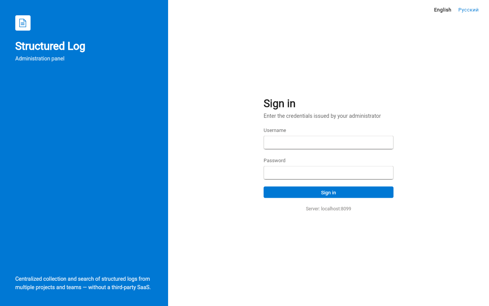

## Вход

Вы не регистрируетесь сами — ссылки «создать аккаунт» нет, потому что
самостоятельная регистрация в этой системе не предусмотрена.
Администратор (или, для вашей собственной группы, `owner`) создаёт
вашу учётную запись и передаёт логин и временный пароль вне этого
приложения (в чате, через менеджер паролей — как принято у вас в
организации).

1. Введите логин и временный пароль, которые вам дали.
2. Приложение сразу же попросит задать настоящий пароль — это не
   опционально. Пока вы это не сделаете, ничего остального не работает:
   любой экран возвращает вас обратно сюда. Это одноразовый шаг — вы не
   увидите его снова, если только администратор позже не сбросит вам
   пароль (тот же механизм, та же причина).
3. Выберите пароль длиной от 8 до 72 символов. Других требований нет —
   не нужно принудительно смешивать символы, цифры и регистр.

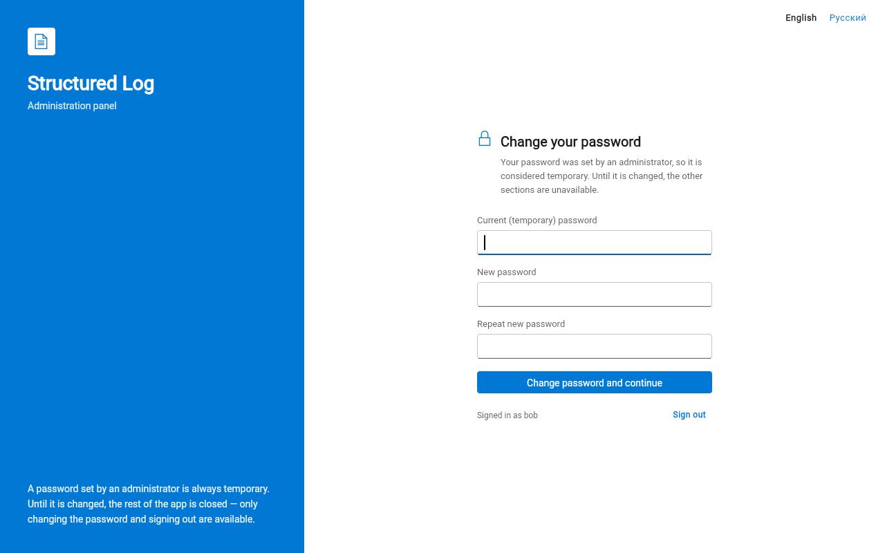

После смены пароля приложение подтверждает это и пускает внутрь — с
этого момента временный пароль больше не действует.

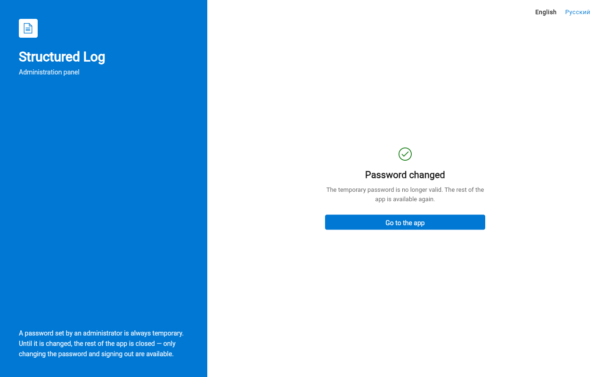

После входа приложение помнит вас (сессия тихо обновляется сама в
фоне), пока вы не выйдете сами, пока администратор не отзовёт ваш
доступ или пока приложением долго не пользуются.

**Если сессия неожиданно завершилась** — баннер «Сессия завершена —
войдите снова» — это не обязательно что-то, что вы сделали не так. Так
бывает, когда администратор изменил ваш доступ, сбросил вам пароль или
заблокировал/разблокировал вас, пока вы были в системе: приложение
применяет изменения доступа немедленно, а не при следующей плановой
проверке. Войдите заново — и вы окажетесь там же, где были.

## Что позволяет ваша роль

Доступ выдаётся на **группу** или на отдельный **проект**, и бывает
трёх уровней. Что именно выдать вам, решает администратор (или, для
группы, её `owner`) — это не то, что настраивается вами самостоятельно:

| Роль | Что она значит для вас |
|---|---|
| **`user`** | Только чтение. Вы можете искать и следить в реальном времени за логами в группах/проектах, к которым получили доступ. Вы не можете ничего создавать, редактировать или удалять и не видите журнал аудита. |
| **`owner`** (группы) | Всё, что может `user`, плюс: - Создавать и вести проекты и команды внутри этой группы - Редактировать их квоты хранения - Создавать/отзывать их секретные ключи - Выдавать роли `owner`/`user` другим внутри этой же группы  По-прежнему нельзя выдавать `admin`, блокировать/разблокировать учётные записи или читать журнал аудита — это только для администраторов. |
| **`admin`** | Полный доступ везде: - Любая группа, любой проект - Управление пользователями - Выдача любых ролей (включая `admin`) - Журнал аудита |

Само приложение это отражает: действие, которое вам не разрешено,
просто не показывается, а не показывается и потом отклоняется. Если
пункта навигации (Пользователи, Аудит, кнопки «Создать группу», ...)
нет в вашей боковой панели — это потому, что ваша роль до него не
дотягивается, а не баг.

Грант на проект автоматически не покрывает его родительскую группу, и
обратное тоже верно лишь частично: грант на *группу* покрывает все
проекты внутри неё, но саму группу вы не увидите, если доступ не выдан
на неё напрямую. Ниже — ровно то, что видит после входа `user` с одним
грантом уровня проекта (на `orders-api`) и одним грантом уровня группы
(на «Internal Tools»): в разделе «Группы» видна только «Internal
Tools», а из всей навигации доступны только два раздела для роли
только для чтения (**Администрирование** — см.
[Как ориентироваться](#как-ориентироваться) ниже — сведено к пункту
«Группы» — нет ни Пользователей, ни Аудита):

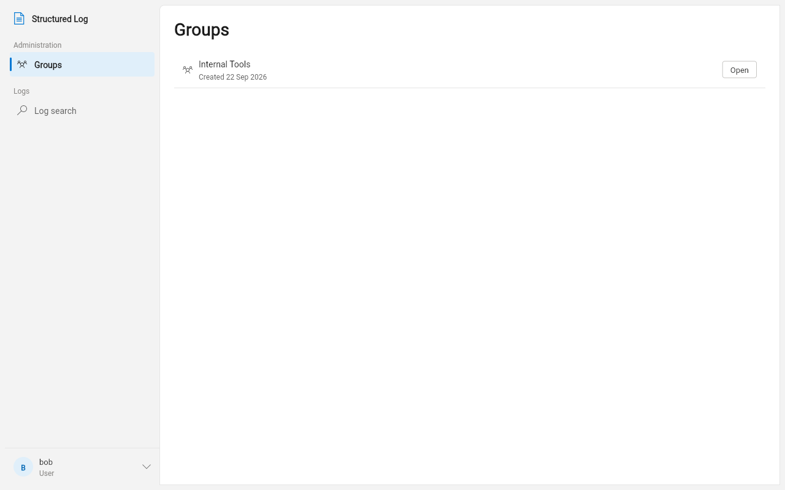

## Как ориентироваться

Левая навигация сгруппирована по назначению:

- **Обзор** — **Дашборд** *(только для `admin`)*: быстрый обзор каждой
  группы на сервере и нескольких её проектов, чтобы сразу перейти к
  нужному, а не искать его.
- **Администрирование** *(видно, только если ваша роль до него
  дотягивается)* — **Группы**, **Пользователи**, **Аудит**.
- **Логи** — **Поиск логов**, просмотрщик логов ниже.

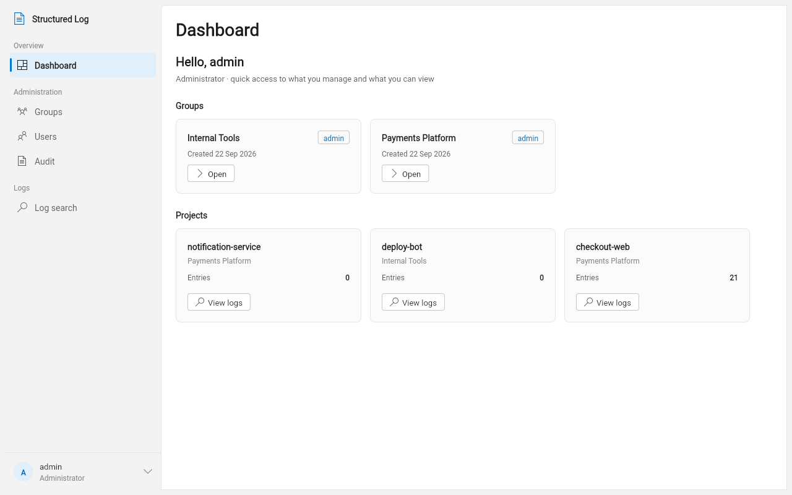

Меню вашей учётной записи — в левом нижнем углу (ваше имя пользователя),
под ним — выход и настройки аккаунта.

## Поиск и чтение логов

Откройте **Поиск логов** — сначала спросят, какая **область**:
один проект или одна группа (поиск по всем проектам в ней сразу).
Список предлагает только то, к чему у вас действительно есть доступ —
проект по прямому гранту либо по гранту группы, которая его покрывает.
Искать по произвольному набору проектов нельзя — выбирайте самую узкую
область, которая покрывает то, что вы ищете.

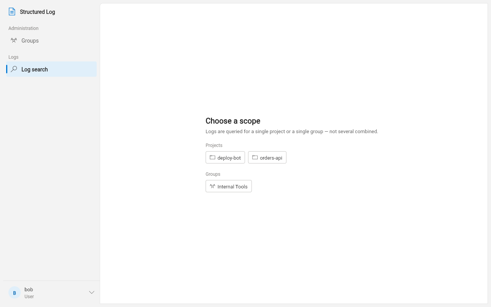

После выбора области появляется панель фильтров над живой лентой
записей (новые сверху... точнее снизу — см. ниже):

| Фильтр | Что ищет |
|---|---|
| Свободный текст | По имени события и содержимому |
| Уровень | Минимальная серьёзность — `debug`/`info`/`warning`/`error`/`critical` — всё на этом уровне и выше |
| С / По | Диапазон времени |
| Correlation id | Session, request или другое поле корреляции, которое разработчик привязал при логировании — кнопка «+ correlation id» добавляет его |

Фильтры комбинируются (И, не ИЛИ): заданные уровень и диапазон времени
сужают результат сразу по обоим. Снятие фильтра сразу расширяет
результаты — отдельного «Применить»/«Сбросить» помимо кнопки «Найти»,
которая запускает поиск, не требуется.

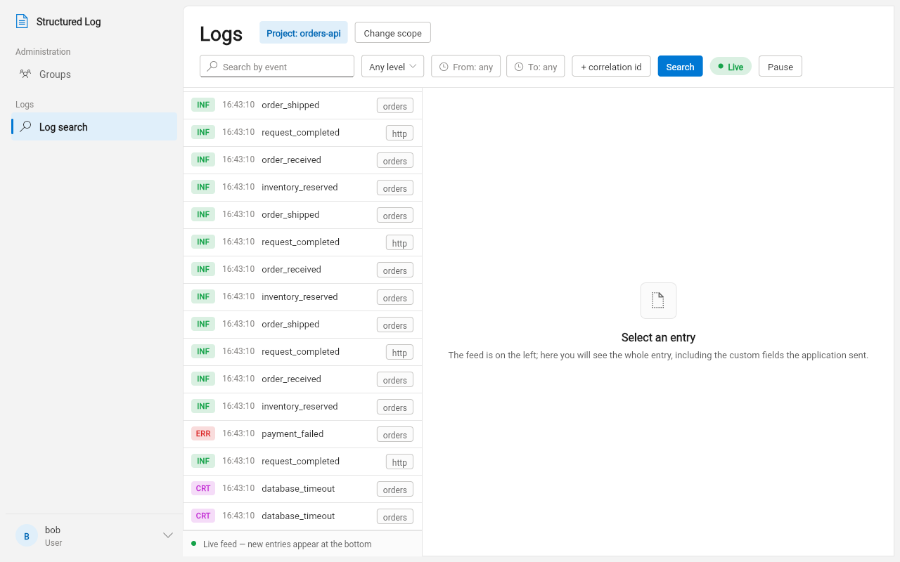

Установка фильтра уровня «Error and above» сужает ту же ленту до
записей, которые действительно требуют внимания:

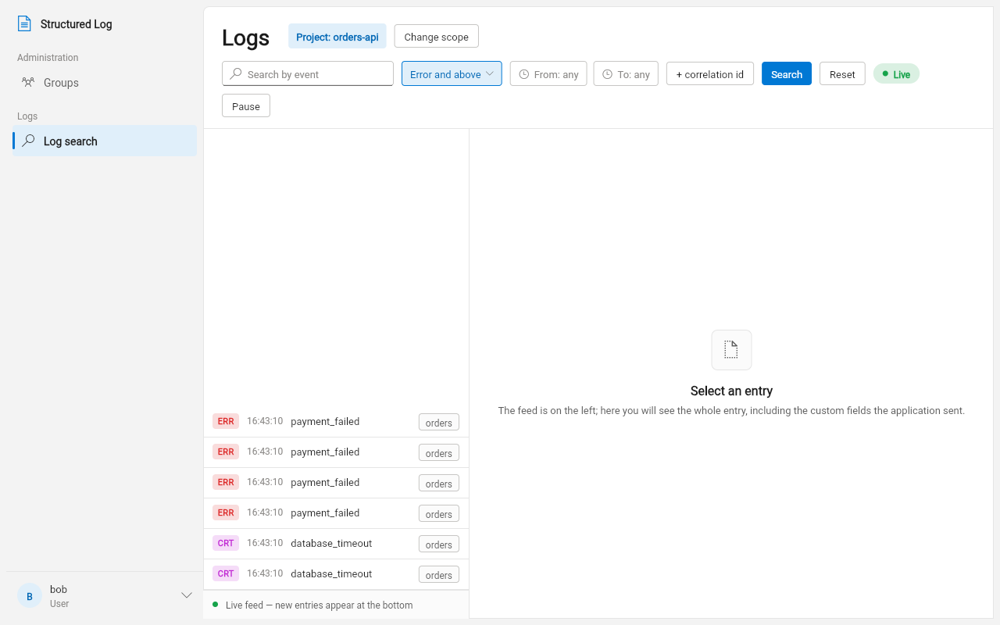

### Чтение одной записи

Кликните по любой строке в ленте, чтобы открыть её целиком справа:
стандартные поля (уровень, время, когда сервер её получил) и ниже —
все произвольные поля, которые приложение приложило при логировании —
что бы инженер ни решил включить (id заказа, id пользователя, код
ошибки, ...). Ничего не обрезается и не скрывается: если поле было
отправлено — оно здесь. Действие «Копировать» кладёт всю запись в
буфер обмена как JSON — удобно вставить в баг-репорт или в чат.

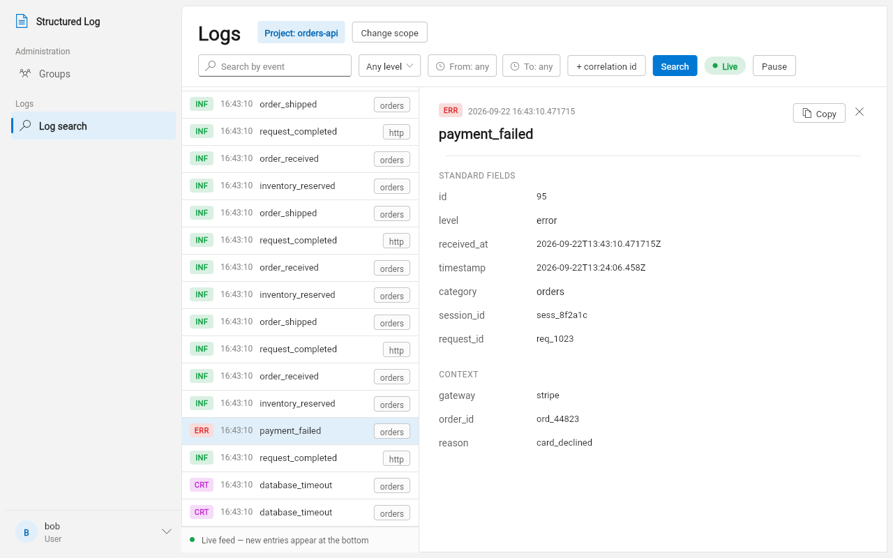

### Живая лента

Зелёный индикатор **«В реальном времени»** означает, что новые записи,
подходящие под текущий фильтр, появляются автоматически — без ручного
обновления. Два независимых момента:

- **Прокрутка вверх для чтения истории не мешает.** Если вы
  прокрутили ленту вверх, чтобы почитать старые записи, новые
  поступления не утаскивают вас обратно вниз — вместо этого появляется
  небольшой бейдж «N новых». Нажмите на него, когда будете готовы
  вернуться к живому краю.
- **«Пауза»** полностью останавливает обновление видимого списка
  (удобно, когда вы читаете что-то и не хотите, чтобы список сдвигался
  под курсором), продолжая собирать поступающее в фоне — «Продолжить»
  подхватывает пропущенное.

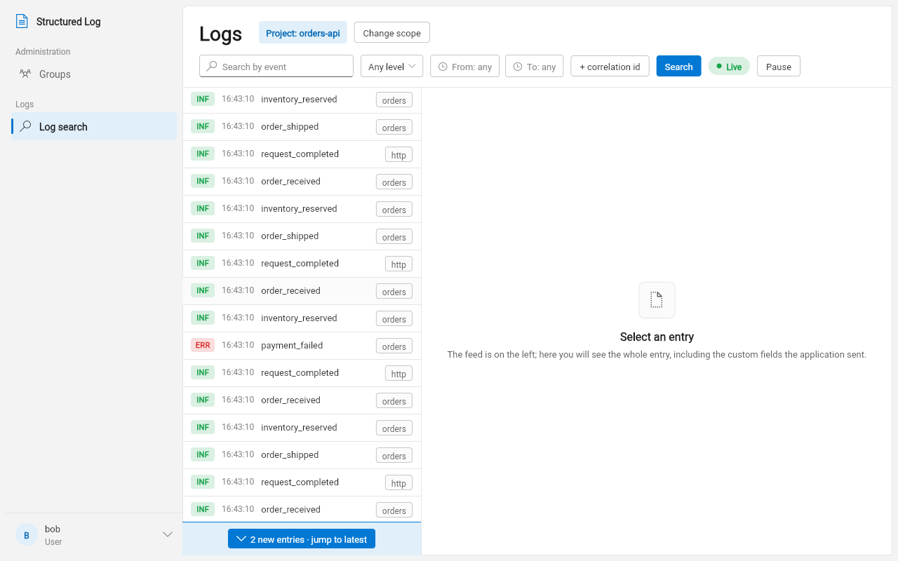

Смена любого фильтра или области закрывает текущее живое соединение и
открывает новое под новыми критериями — вы никогда не смотрите на
устаревшую смесь старого и нового фильтра.

## Если вы `owner` или `admin`: управление группами и проектами

`owner` видит только те группы, что ему выданы; вот тот же экран
**Группы** для учётной записи, которая владеет ровно одной:

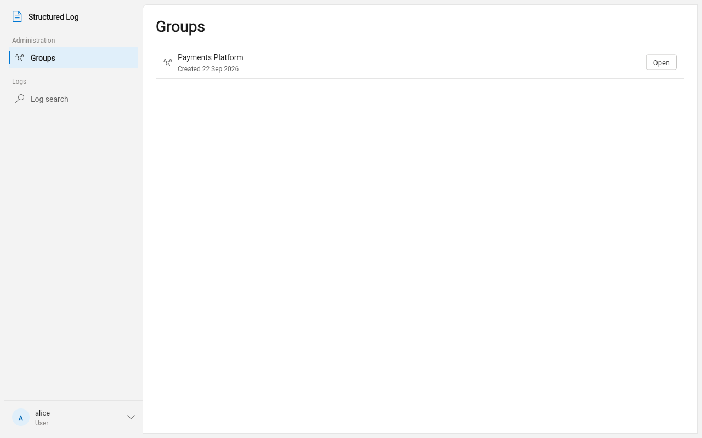

Откройте одну, чтобы увидеть её проекты, команды и (для `admin`) у
кого есть доступ:

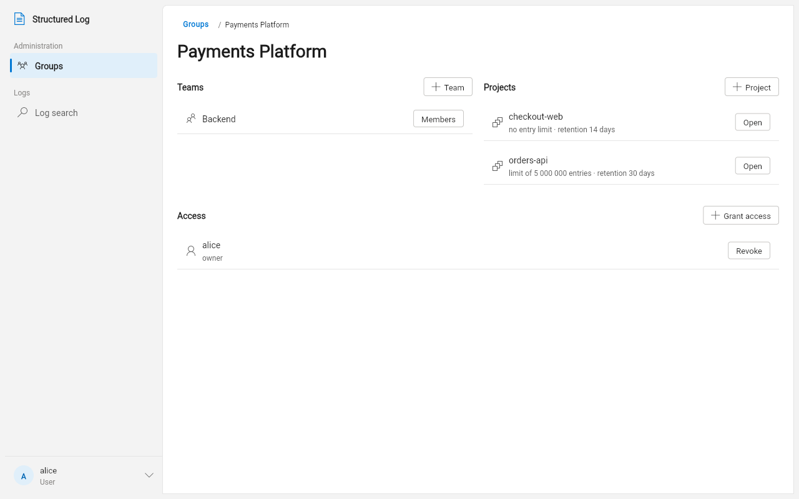

Оттуда можно:

- **Создать проект** внутри группы — нужны имя и **срок хранения**
  (сколько дней хранятся его логи, прежде чем автоматически удалятся;
  он обязателен для каждого проекта). При желании ограничить проект по
  числу записей и/или общему объёму — оставьте поле пустым для
  отсутствия лимита по этому измерению.

  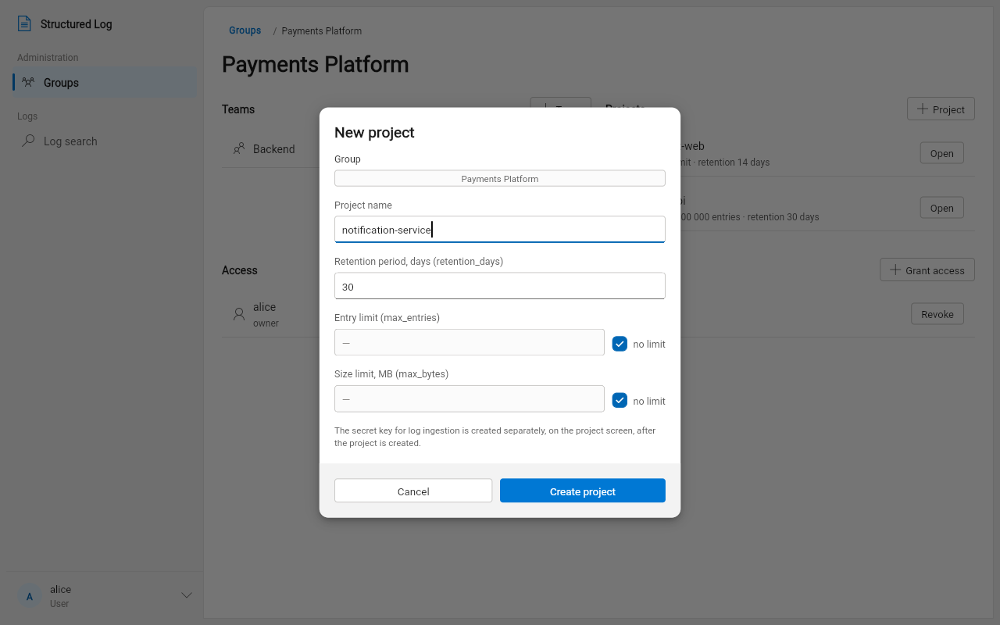

  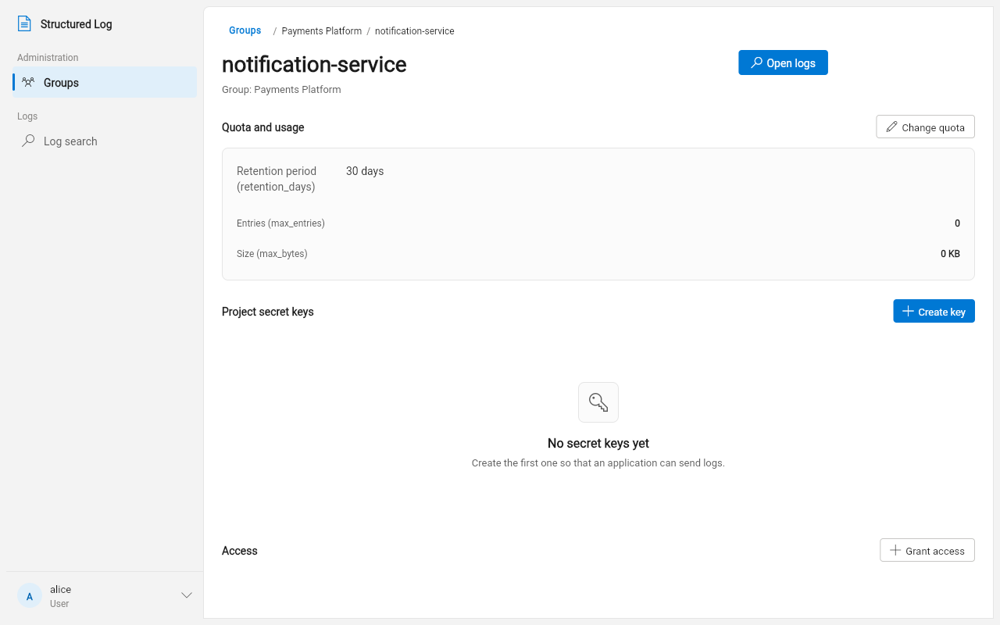

- **Ротировать секретные ключи** — секретный ключ проекта нужен
  приложению, чтобы *отправлять* в него логи (см.
  [Руководство разработчика](developer-guide.ru.md#отправка-логов-на-сервер)).
  Значение нового ключа показывается **ровно один раз**, при создании —
  скопируйте сразу, повторно получить его нельзя. Отзыв ключа
  немедленный и необратимый: любое приложение, всё ещё использующее
  отозванный ключ, начинает получать отказ сразу же.

  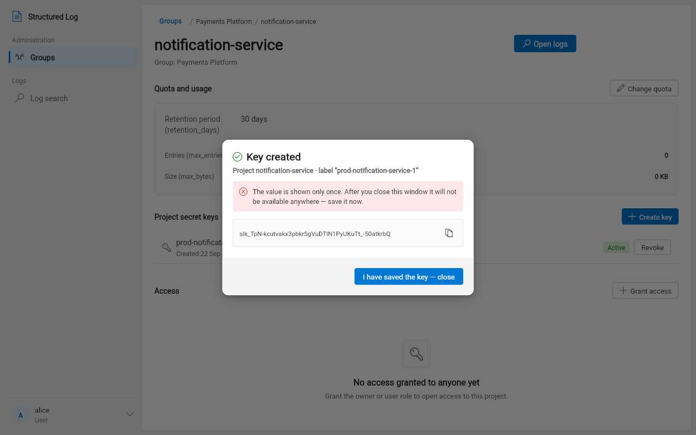

- **Выдать доступ** — выберите человека (или команду, если ваша роль
  дотягивается до управления командами уровня `admin`) и роль, в
  области этой группы или одного конкретного проекта внутри неё. Поле
  получателя ищет по мере ввода.

  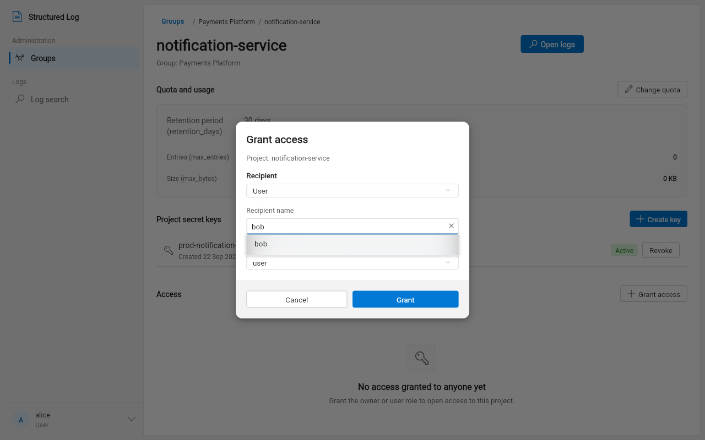

- **Создать команду** (внутри группы), чтобы выдать доступ сразу
  нескольким людям, а не по одному гранту на человека — добавление или
  удаление участников обновляет доступ всех сразу.

  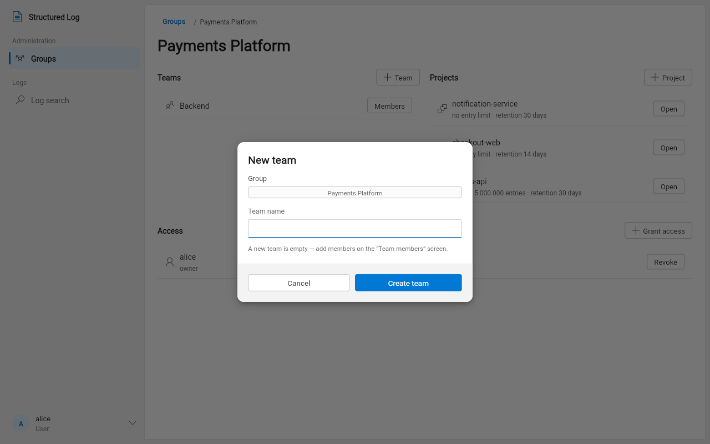

  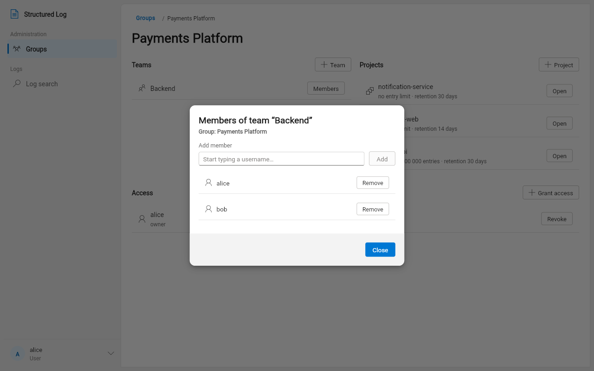

Изменение квоты проекта вступает в силу немедленно; оно не трогает уже
сохранённые данные, только то, что происходит дальше.

## Если вы `admin`: пользователи и журнал аудита

### Пользователи

**Пользователи** показывает всех, у кого есть учётная запись на
сервере. Учётная запись с временным, ещё не сменённым паролем помечена
прямо в списке:

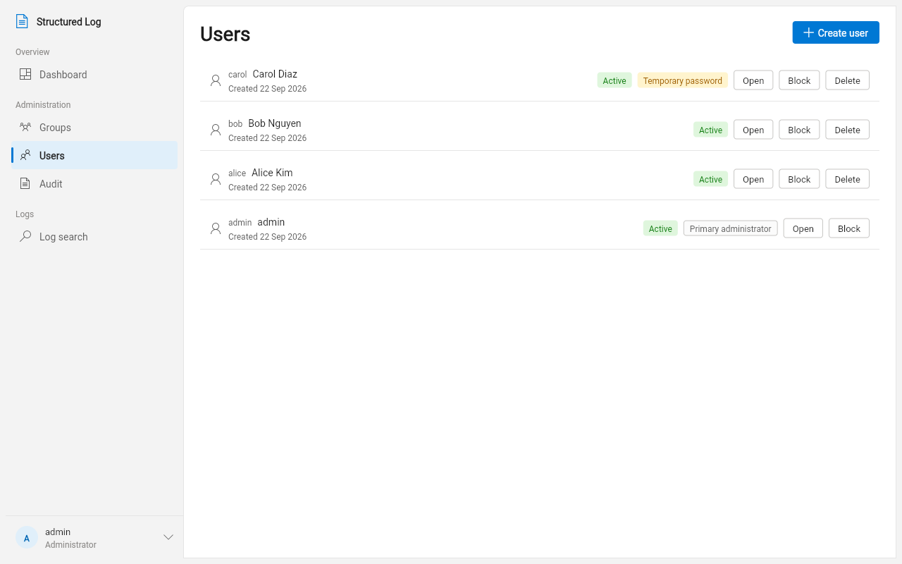

Откройте одного, чтобы увидеть профиль, текущие роли и недавнюю
активность, а также:

- **Создать учётную запись** — логин и временный пароль (вы задаёте
  его сами или оставляете сгенерированным); новый пользователь пройдёт
  тот же принудительный шаг смены пароля, что и вы при первом входе.

  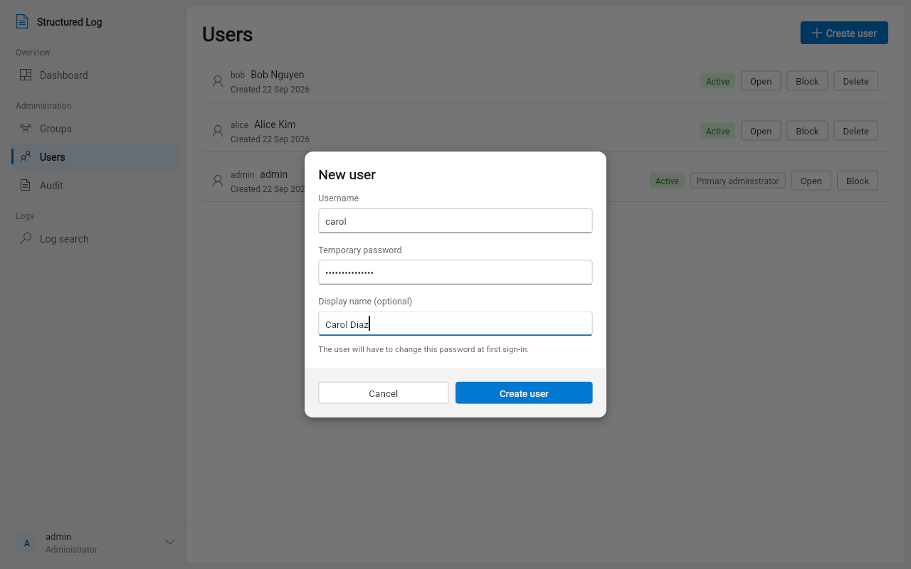

  Открытый экран пользователя показывает выданные ему роли рядом с его
  последними событиями аудита — не нужно сверяться с отдельным экраном,
  чтобы понять, чем на самом деле занимался обладатель доступа:

  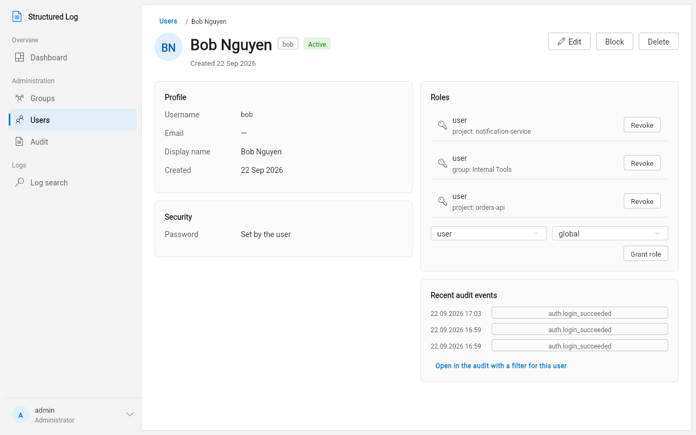

- **Изменить** отображаемое имя или сбросить пароль (тоже всегда
  требует смены при следующем входе — задать пароль, который админ
  установил как «постоянный» от лица другого пользователя, нельзя).

  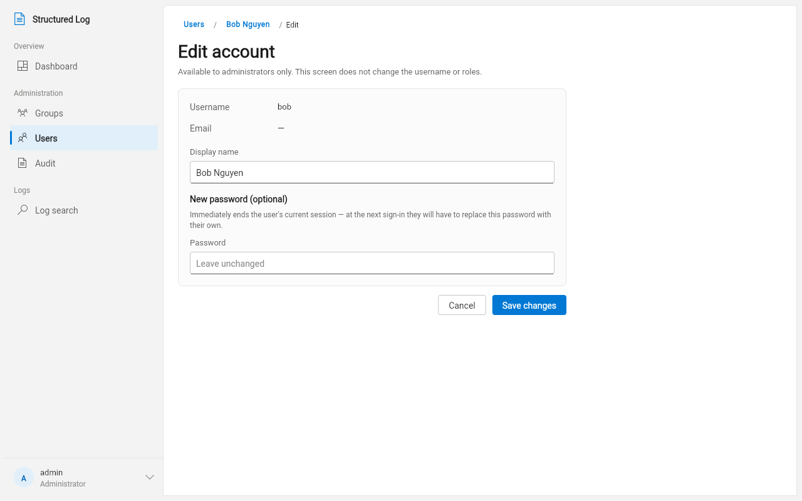

- **Заблокировать / разблокировать** — обратимо. Заблокированная
  учётная запись не может ни войти, ни продолжать использовать уже
  открытую сессию, но ничего из аккаунта не удаляется; разблокировка
  возвращает всё как было.
- **Удалить** — *необратимо*, «отменить удаление» нет. Две ситуации
  система защищает сама, а не оставляет на вашу память:
  - Нельзя удалить того, кто является **единственным owner** группы —
    приложение покажет, какая группа (или группы) блокирует удаление,
    и тут же предложит выдать владение кому-то другому.

    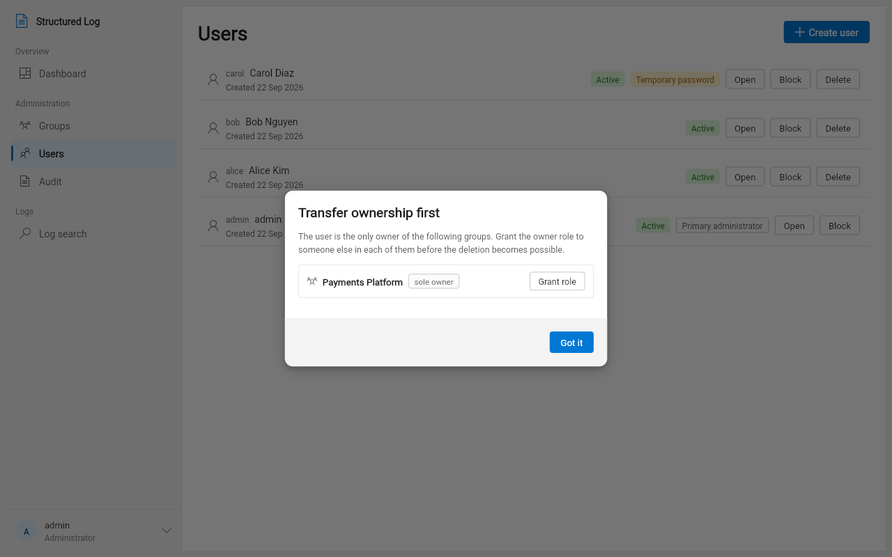

  - Учётная запись, которая была **самым первым администратором**,
    созданным на этом сервере, никогда не может быть удалена (хотя её
    всё ещё можно заблокировать). Это намеренно — гарантирует, что
    система никогда не окажется заблокирована для всех навсегда.

### Аудит

**Аудит** — единый, фильтруемый журнал каждого административного
действия на сервере: кто что создал, кого заблокировали или кому
выдали роль, и каждая попытка входа (успешная, неудачная или
отклонённая ограничителем частоты) — в одном месте, чтобы расследование
«что случилось с этим аккаунтом» не означало сверку нескольких экранов.
Он намеренно только для чтения: ни отредактировать, ни удалить запись
нельзя — ни с этого экрана, ни с любого другого; администратор —
субъект этого журнала, а не его владелец.

Фильтруйте по тому, кто что сделал, по виду действия, по цели или по
диапазону времени. Записи со временем исчезают согласно сроку хранения,
который настроил оператор сервера (показан вверху экрана), — или
хранятся вечно, если срок не задан.

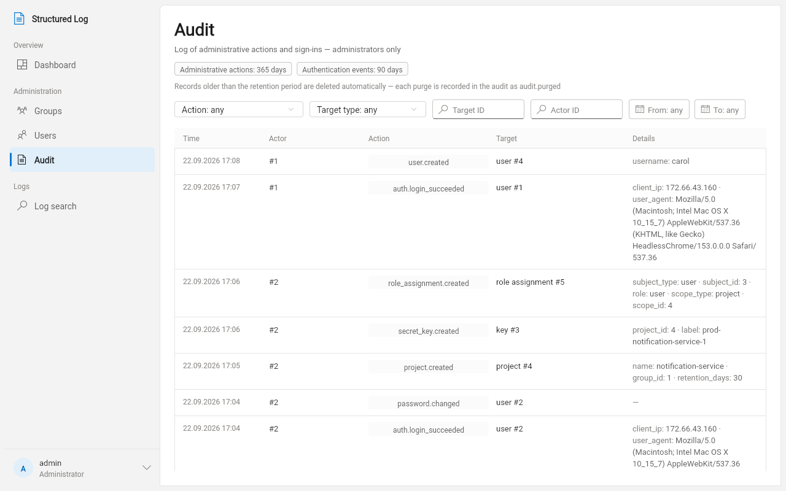

## Настройки аккаунта

Из меню учётной записи: смените свой пароль в любой момент (не только
когда это принудительно требуется), и переключите язык интерфейса
между английским и русским — выбор запоминается в вашем браузере до
следующего раза. Те же две ссылки языка есть на экранах входа и
принудительной смены пароля — для случая, когда вы ещё не вошли.

**Смена пароля выводит из системы остальные ваши устройства.** То, на
котором вы её делаете, остаётся в системе; на любом другом браузере или
компьютере, где эта учётная запись была открыта, придётся войти заново
с новым паролем. Так задумано: пароль обычно меняют потому, что его мог
узнать кто-то ещё, и прекратить его доступ — это и есть смысл действия.
Если вы просто меняете надоевший пароль и не хотите выходить отовсюду,
отметьте **Оставить другие устройства в системе** перед сохранением.

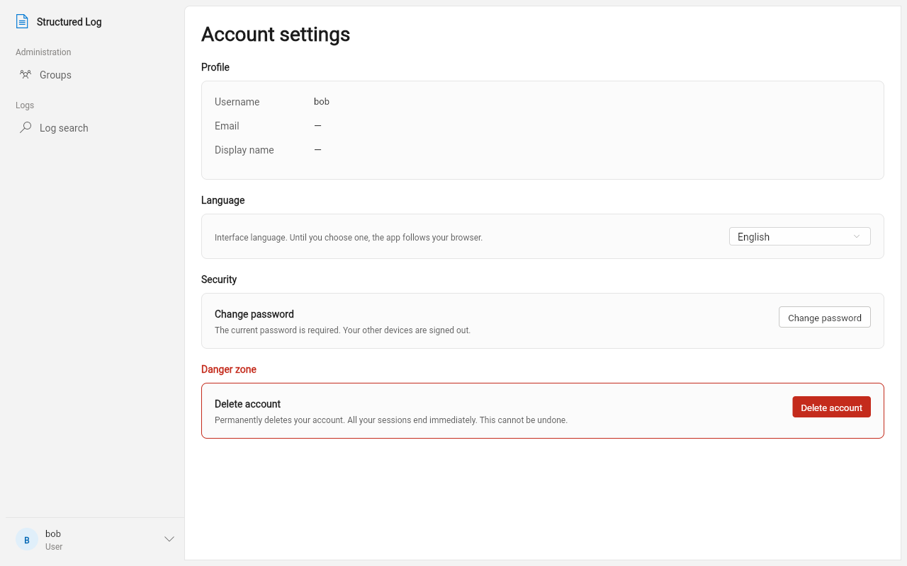

## Если нужна помощь

Если приложение отклоняет действие с сообщением, которое вам непонятно,
это сообщение намеренно конкретное — скопируйте его дословно, когда
обращаетесь за помощью к администратору: оно точно называет, что
именно отклонено, и часто — почему. Если само приложение выглядит
недоступным (не «ничего не найдено», а вся страница не загружается) —
это проблема сервера или сети вне приложения; обратитесь к тому, кто
его эксплуатирует (см.
[Руководство администратора](admin-guide.ru.md#диагностика)).
