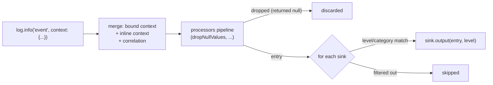

# structured_log

[](https://github.com/pese-git/structured_log/actions/workflows/ci.yml)

*Читать на [русском](README.ru.md).*

Structured logging for Dart, inspired by [Python's structlog](https://www.structlog.org/).

Log JSON with context binding, processors, and flexible output destinations.

## Features

- **Structured JSON output** — logs are machine-readable by default
- **Context binding** — immutable `bind()` / `unbind()` for attaching metadata to loggers
- **Typed correlation fields** — `withCorrelation()` for session/request/connection/tool-call/message/operation ids
- **Processors** — transform log entries before output (filter, enrich, format)
- **Multiple outputs** — stdout, file, rotating file, or custom
- **Multi-sink routing** — deliver one entry to several destinations with independent level/category filtering and runtime toggling
- **Colored console** — human-readable development output
- **Configurable** — global configuration with `StructlogConfiguration.configure()`
- **Zero dependencies** — only Dart SDK

## How It Works

Every log call flows through the same pipeline: your bound context and
correlation fields are merged into the entry, the entry passes through the
configured processors (which can enrich, mask, or drop it), and what
survives is delivered to every sink whose level/category filters accept it:



A single `output:` in `StructlogConfiguration.configure()` is shorthand for
one sink — most apps never need more than that. See
[Multi-Sink Routing](#multi-sink-routing) below for delivering to several
destinations at once, and [doc/ARCHITECTURE.md](doc/ARCHITECTURE.md) for the
full internal design (with sequence diagrams) if you're extending the
package.

## Installation

Add to your `pubspec.yaml`:

```yaml
dependencies:
  structured_log: ^0.2.0
```

## Quick Start

```dart
import 'package:structured_log/structured_log.dart';

void main() {
  final log = getLogger();
  log.info('user_login', context: {'user_id': 42, 'ip': '127.0.0.1'});
}
```

Output:

```json
{
  "user_id": 42,
  "ip": "127.0.0.1",
  "event": "user_login",
  "level": "info",
  "timestamp": "2026-04-27T12:00:00.000000"
}
```

## API Reference

### Getting a Logger

```dart
// Default logger
final log = getLogger();

// Named logger (adds 'logger' key to context)
final log = getLogger('auth');
```

### Log Levels

| Method     | Level    | Color (console) |
|------------|----------|-----------------|
| `trace()`  | trace    | grey            |
| `debug()`  | debug    | cyan            |
| `info()`   | info     | green           |
| `warning()`| warning  | yellow          |
| `error()`  | error    | red             |
| `critical()`| critical| magenta         |

Levels are ordered from least to most severe: `trace` < `debug` < `info` <
`warning` < `error` < `critical`. A sink's default `minLevel` is `debug`,
so `trace()` calls are filtered out everywhere unless a sink explicitly
sets `minLevel: LogLevel.trace` — handy for high-volume detail (e.g. raw
protocol frames) that should stay off by default.

```dart
log.trace('raw_frame', context: {'bytes': 128});
log.debug('cache miss', context: {'key': 'session:42'});
log.info('request completed', context: {'duration_ms': 150});
log.warning('slow query', context: {'sql': 'SELECT ...', 'ms': 2000});
log.error('payment failed', context: {'error': 'timeout', 'order_id': 123});
log.critical('database down', context: {'host': 'db-primary'});
```

### Context Binding

`bind()` returns a **new** logger instance with merged context (immutable pattern):

```dart
final baseLog = getLogger();

// Bind request-level context
final requestLog = baseLog.bind({'request_id': 'abc-123', 'trace_id': 'xyz'});

// Bind user-level context on top
final userLog = requestLog.bind({'user_id': 42});

userLog.info('purchase');
// → {"request_id": "abc-123", "trace_id": "xyz", "user_id": 42, "event": "purchase", ...}
```

`unbind()` removes keys:

```dart
final cleanLog = userLog.unbind(['user_id']);
```

### Typed Correlation Fields

For the recurring identifiers most non-trivial clients need — sessions, requests,
reconnects, async operations — `withCorrelation()` binds a fixed, typed set of
fields instead of ad-hoc map keys:

```dart
final log = getLogger().withCorrelation(
  sessionId: 's-14',
  requestId: 'r-42',
  connectionGeneration: 8,
);

// Child scope inherits the parent's fields and can add/override its own,
// without mutating the parent:
final toolLog = log.withCorrelation(toolCallId: 'tc-3');

toolLog.info('tool_invoked');
// → {"session_id": "s-14", "request_id": "r-42", "connection_generation": 8,
//    "tool_call_id": "tc-3", "event": "tool_invoked", ...}
```

All six fields are optional — bind any subset. They serialize under fixed
snake_case keys: `session_id`, `request_id`, `connection_generation`,
`tool_call_id`, `message_id`, `operation_id`. If a typed field and a
same-named key from `bind()`/inline `context` are both set, the **typed
field wins**.

### Inline Context

Pass per-call context directly:

```dart
log.info('event', context: {'one_off': true});
```

Context is merged in order: `initialContext` → `bind()` → inline `context`.

## Configuration

### Global Configuration

```dart
StructlogConfiguration.configure(
  processors: [dropNullValues, myCustomProcessor],
  output: fileOutput('logs/app.log'),
  initialContext: {'app': 'my_app', 'version': '1.0.0'},
);
```

| Parameter        | Type                  | Default           | Description                                       |
|------------------|-----------------------|-------------------|----------------------------------------------------|
| `processors`     | `List<Processor>`     | `[dropNullValues]`| Pipeline to transform entries                     |
| `output`         | `OutputFunction`      | `defaultOutput`   | Shorthand for a single sink named `'default'`     |
| `sinks`          | `List<LogSink>`       | one `output` sink | Multiple destinations with independent filtering  |
| `initialContext` | `Map<String, dynamic>`| `{}`              | Context added to all loggers                      |

Reset to defaults:

```dart
StructlogConfiguration.reset();
```

### Outputs

#### Console (default)

Pretty-printed JSON to stdout:

```dart
StructlogConfiguration.configure(output: defaultOutput);
```

#### Colored Console

Human-readable with ANSI colors:

```dart
StructlogConfiguration.configure(output: coloredConsoleOutput);
```

Output:

```
[2026-04-27T12:00:00.000000] INFO: user_login {"user_id": 42}
```

#### File

Append JSON lines (JSONL) to a file. Directories are created automatically:

```dart
StructlogConfiguration.configure(
  output: fileOutput('logs/app.log'),
);
```

#### Rotating File

Automatically rotates when file exceeds size limit:

```dart
StructlogConfiguration.configure(
  output: rotatingFileOutput(
    'logs/app.log',
    maxSizeBytes: 10 * 1024 * 1024, // 10MB
    maxBackups: 5,                   // keep 5 rotated files
  ),
);
```

Rotated files: `app.log`, `app.log.0`, `app.log.1`, ... `app.log.4`

#### Async File / Async Rotating File

`fileOutput`/`rotatingFileOutput` write with `File.writeAsStringSync` —
simple and safe, but it blocks whichever isolate makes the log call (e.g.
the UI isolate in a Flutter app, if you log frequently there). `AsyncFileOutput`
and `AsyncRotatingFileOutput` use non-blocking file I/O instead, same
options as their sync counterparts:

```dart
final asyncOutput = AsyncFileOutput('logs/app.log');
// or: AsyncRotatingFileOutput('logs/app.log', maxSizeBytes: 10 * 1024 * 1024);
StructlogConfiguration.configure(output: asyncOutput);

getLogger().info('request completed');

// Await this before process exit (or in tests) to know every write so far
// has actually landed on disk:
await asyncOutput.flushed;
```

Unlike the other outputs, these are **classes**, not plain functions —
keep a reference so you can await `.flushed`. Writes are still delivered
in order and a failing write is caught and reported to `stderr` without
affecting the writes queued after it — the same isolation guarantee
[Multi-Sink Routing](#multi-sink-routing) provides for sinks, just
implemented for the async case. See
[doc/ARCHITECTURE.md](doc/ARCHITECTURE.md#async-outputs) for why the
write queue works the way it does.

#### Custom Output

Implement your own:

```dart
void myOutput(Map<String, dynamic> entry, LogLevel level) {
  // Send to Sentry, CloudWatch, etc.
}

StructlogConfiguration.configure(output: myOutput);
```

### Multi-Sink Routing

Deliver one log entry to several destinations at once — e.g. human-readable
console output for developers plus a JSON file for later analysis — each
with its own level and category filtering:

```dart
StructlogConfiguration.configure(sinks: [
  LogSink(
    name: 'console',
    output: coloredConsoleOutput,
  ),
  LogSink(
    name: 'protocol',
    output: rotatingFileOutput('protocol.log', maxSizeBytes: 10 * 1024 * 1024),
    minLevel: LogLevel.debug,
    categories: {'protocol'}, // only entries tagged with this category
    enabled: false,           // off by default, can be flipped at runtime
  ),
]);

final log = getLogger();
log.info('request_started');                              // → console only
log.debug('raw_frame', context: {'category': 'protocol'}); // → protocol sink, if enabled
```

A category is just a regular context value under the `'category'` key —
either bound once per logger (`bind({'category': 'protocol'})`) or passed
inline. A sink with `categories: null` (the default) accepts every category.

Toggle a sink at runtime without rebuilding the configuration or existing loggers:

```dart
StructlogConfiguration.setSinkEnabled('protocol', enabled: true);
```

A single `output:` (as shown above) remains fully supported — it's
shorthand for a single sink named `'default'`. If a sink's `output` throws,
the error is caught and reported to `stderr`; it never stops delivery to
the other sinks or crashes the caller.

## Processors

Processors are functions that transform log entries before output. Return `null` to drop the entry.

### Built-in Processors

| Processor        | Description                    |
|------------------|--------------------------------|
| `dropNullValues` | Removes keys with `null` value |
| `addTimestamp`   | Adds ISO 8601 timestamp        |
| `addLogLevel`    | Ensures level key exists       |
| `jsonRenderer`   | Prints entry as JSON           |
| `logfmtRenderer` | Prints as `key=value` pairs    |
| `redactKeys()`   | Replaces sensitive values, at any depth |

### Redacting secrets

`redactKeys()` replaces a value with `***` wherever it appears — top level,
nested maps, lists — and decides what to replace by any of three criteria,
used alone or together:

```dart
StructlogConfiguration.configure(
  processors: [
    redactKeys(),                       // defaultSensitiveKeys, as-is
    dropNullValues,
  ],
);

// or, tuned:
redactKeys(
  keys: {...defaultSensitiveKeys, 'x-internal-signature'},  // names
  matchesKey: (key) => key.endsWith('_token'),              // name families
  matchesValue: looksLikeJwtOrBearer,                       // the value itself
);
```

| Criterion | Catches | Note |
|---|---|---|
| `keys` | The whole name, case-insensitively | Separators are **not** normalised: `card_number` misses `cardNumber`. Passing a set **replaces** `defaultSensitiveKeys`; `const {}` switches it off |
| `matchesKey` | `refresh_token`, `x-api-key`, … | Yours to write; a wide predicate silently eats useful fields |
| `matchesValue` | A secret under an innocent name | Offered `String` values only. `looksLikeJwtOrBearer` ships; `looksLikeCardNumber` ships too but is **not** a default — length plus Luhn still cannot tell a card from a 16-digit order id |

Spelling is the sharp edge worth knowing about. The default names are
written as headers and JSON payloads spell them (`api_key`,
`refresh_token`), while Dart map keys are usually camelCase — and nothing
bridges the two. List the spelling your code uses, or normalise once in
`matchesKey`:

```dart
const sensitive = {'cardnumber', 'cvc', 'apikey'};
redactKeys(
  matchesKey: (key) =>
      sensitive.contains(key.toLowerCase().replaceAll(RegExp('[_-]'), '')),
);
```

`defaultSensitiveKeys` holds names whose value is a credential everywhere
(`password`, `token`, `authorization`, `cookie`, …). The correlation fields
this package produces — `session_id`, `request_id` and the rest — are
deliberately absent: they exist to be read back.

Two things worth knowing:

- **Put it before any renderer.** `jsonRenderer` and `logfmtRenderer` print
  as they run, so a redactor after one of them has already lost.
- **It rebuilds, it does not edit.** `BoundLogger` copies bound context
  shallowly, so a nested map in an entry is the same object your code still
  holds — a hand-written redactor that walks and assigns takes your own
  token away. `redactKeys` copies only along the path it changed, and
  returns the very same map when nothing matched.

### Custom Processor

```dart
// For redaction itself, prefer `redactKeys()` above — this is only safe
// because it assigns at the top level, which is a fresh copy per entry.
Map<String, dynamic>? tagEnvironment(Map<String, dynamic> entry) {
  entry['env'] = 'staging';
  return entry;
}

StructlogConfiguration.configure(
  processors: [dropNullValues, tagEnvironment],
);
```

Processor order matters — they run sequentially:

```dart
processors: [
  dropNullValues,      // 1. Clean nulls
  redactKeys(),        // 2. Mask secrets
  addCorrelationId,    // 3. Enrich
]
```

## Examples

### Web Server Request Logging

```dart
import 'package:structured_log/structured_log.dart';

void handleRequest(Request req) {
  final log = getLogger().bind({
    'request_id': req.id,
    'method': req.method,
    'path': req.path,
    'ip': req.remoteAddress,
  });

  log.info('request started');

  try {
    final response = processRequest(req);
    log.info('request completed', context: {
      'status': response.status,
      'duration_ms': response.duration,
    });
  } catch (e, st) {
    log.error('request failed', context: {
      'error': e.toString(),
      'stack_trace': st.toString(),
    });
    rethrow;
  }
}
```

### Multiple Loggers (file + console)

```dart
// Console logger for development
final consoleLog = getLogger('console');
consoleLog.info('app started');

// Switch to file output
StructlogConfiguration.configure(output: fileOutput('logs/production.log'));
final fileLog = getLogger('production');
fileLog.info('same event, different output');
```

### Async-Safe Logging

The library uses synchronous file I/O, making it safe for use in any context:

```dart
Future<void> asyncTask() async {
  final log = getLogger().bind({'task': 'background_job'});
  log.info('task started');

  await Future.delayed(Duration(seconds: 1));

  log.info('task completed');
}
```

## Comparison with Python structlog

| Feature              | Python structlog | Dart structured_log |
|----------------------|------------------|----------------|
| Context binding      | `bind()`         | `bind()`       |
| Typed correlation ids| No (manual)      | `withCorrelation()` |
| Processors           | Yes              | Yes            |
| JSON output          | Yes              | Yes            |
| Console output       | Yes              | Yes (colored)  |
| File output          | Via stdlib       | Built-in       |
| Rotating file        | Via handlers     | Built-in       |
| Multi-destination routing | Via stdlib logging handlers | Built-in (`LogSink`) |
| Async support        | Yes              | Sync I/O       |
| Wrapper classes      | Yes              | No (simple)    |

## License

MIT
