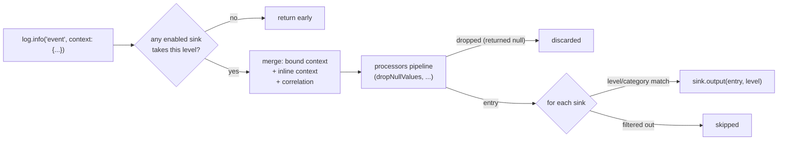

# structured_log

[](https://github.com/pese-git/structured_log/actions/workflows/ci.yml)

*Читать на [русском](README.ru.md).*

**Log events with data instead of strings — entries that read well in a
terminal, parse as JSON, and can be filtered by any field, on every
platform Dart runs on.**

Inspired by [Python's structlog](https://www.structlog.org/). Documentation:
[structured-log.openidealab.com](https://structured-log.openidealab.com).

## Why

`print('User 42 logged in from 127.0.0.1')` is quick to write and costly to
use: to find every login of user 42, count logins per IP, or follow one
request through the log, you are back to regular expressions over prose —
and they break the day someone rewords the message.

`structured_log` makes each log call an **event with data**:
`log.info('user_login', context: {'user_id': 42, 'ip': '127.0.0.1'})`. The
event name stays stable, the fields stay fields, and context you bind once —
a request id, a user, a session — rides along on every entry after it.
Processors redact secrets before anything is written, and sinks send the
same entry to the console, a file, or anywhere else, each with its own
filter.

## Features

### Writing entries

- **Events, not sentences** — an event name plus a map of fields, six
  levels from `trace` to `critical`; pass `error:` and `stackTrace:` and
  they become the `error`, `error_type` and `stack_trace` fields.
- **Context that travels with the logger** — `bind()`/`unbind()` return a
  new logger and never change the old one, so a request-scoped logger can
  be passed around and across `await`s; `initialContext` adds app-wide
  fields to every entry.
- **Typed correlation ids** — `withCorrelation()` binds session, request,
  connection generation, tool call, message and operation ids under fixed
  snake_case keys, so every part of an app spells them the same way.

### Shaping entries

- **Processors** — plain functions that enrich, rewrite or drop an entry
  before any output sees it.
- **Secret redaction** — `redactKeys()` masks passwords, tokens, cookies and
  keys by field name (built-in multi-word names come in three spellings,
  so `accessToken` is caught too), by a name predicate of yours, or by the
  value itself (`looksLikeJwtOrBearer`, opt-in `looksLikeCardNumber`) — at
  any depth, without touching the maps your code still holds.

### Delivering entries

- **The format you need** — pretty JSON by default, JSON lines, logfmt
  (escaped so a value can never forge a field or a line), an ANSI-colored
  console line, or your own function.
- **Files** — append, rotate by size, or write without blocking the calling
  isolate (`AsyncFileOutput`, with `flushed` to await delivery); these need
  `dart:io` and live in `package:structured_log/io.dart`.
- **Several destinations at once** — each `LogSink` has its own minimum
  level, category filter and on/off switch, and can be toggled at runtime
  with `setSinkEnabled()`.

### Behaving well in production

- **A log call never throws** — a failing sink is reported and the other
  sinks still get the entry; a failing processor yields a stub instead of
  the entry, because the processor that failed may be the one that redacts.
- **One odd value costs one field, not the entry** — `DateTime`, enums,
  `Duration`, exceptions and anything else `jsonEncode` refuses are
  converted on output (`encodeLogEntry`, also available to your own
  outputs).
- **Cheap when nobody listens** — the level is checked before any context
  is merged or processor runs, and `isEnabled()` lets you skip building an
  expensive entry altogether.
- **Unambiguous timestamps** — UTC by default, or local time with its
  offset; never a local time that a reader would mistake for their own.
- **Configure whenever** — loggers from `getLogger()` follow the current
  configuration, so one kept in a `static final` created before
  `configure()` still picks it up.
- **Everywhere Dart runs** — VM, Flutter and the web; the main library has
  no `dart:io`, and the only dependency is `meta`.

## Where it fits

This package is the core of the
[structured_log project](https://structured-log.openidealab.com), and it is
all you need to start. Everything else is optional and builds on the same
entries, in one of two ways: **standalone** — keep logs inside the app, add
an in-app viewer and adapters for libraries you already use, no server at
all — or **with a self-hosted server** — add one more sink, and entries from
every install land in a central store your team can search and tail live.
Moving from the first to the second doesn't change a single logging call.

| Package | Role |
|---|---|
| [`structured_log_flutter`](https://pub.dev/packages/structured_log_flutter) | Headless in-app log viewer core: `LogBuffer` sink, `LogViewerController` |
| [`structured_log_material`](https://pub.dev/packages/structured_log_material) · [`_fluent`](https://pub.dev/packages/structured_log_fluent) · [`_cupertino`](https://pub.dev/packages/structured_log_cupertino) | Ready-made viewer screens in Material 3, Fluent UI and Cupertino style |
| [`structured_log_bloc`](https://pub.dev/packages/structured_log_bloc) · [`_dio`](https://pub.dev/packages/structured_log_dio) · [`_http_client`](https://pub.dev/packages/structured_log_http_client) · [`_go_router`](https://pub.dev/packages/structured_log_go_router) · [`_cherrypick`](https://pub.dev/packages/structured_log_cherrypick) | Log what those libraries already do, with no change to how you use them |
| [`structured_log_remote_sync`](https://pub.dev/packages/structured_log_remote_sync) | A sink that ships entries to the server in batches, with retries and a bounded buffer |
| [`structured_log_server`](https://github.com/pese-git/structured_log/tree/master/backend/structured_log_server) | Self-hosted, multi-tenant log server: ingestion, search, live tail (an app, not on pub.dev) |
| [`structured_log_admin_client`](https://github.com/pese-git/structured_log/tree/master/frontend/structured_log_admin_client) | Web admin for reading logs and running the server (an app, not on pub.dev) |

Start with the
[Embedding Guide](https://structured-log.openidealab.com/guides/embedding-guide/)
for the standalone setup; the
[User](https://structured-log.openidealab.com/guides/user-guide/),
[Administrator](https://structured-log.openidealab.com/guides/admin-guide/)
and [Developer](https://structured-log.openidealab.com/guides/developer-guide/)
guides and the [HTTP API](https://structured-log.openidealab.com/api/http-api/)
reference cover the server side. The source lives in one repository,
[pese-git/structured_log](https://github.com/pese-git/structured_log).

## Installation

```bash
dart pub add structured_log
```

or add it to your `pubspec.yaml`:

```yaml
dependencies:
  structured_log: ^0.3.0
```

## Quick Start

```dart
import 'package:structured_log/structured_log.dart';

void main() {
  final log = getLogger();
  log.info('user_login', context: {'user_id': 42, 'ip': '127.0.0.1'});
}
```

Output:

```json
{
  "user_id": 42,
  "ip": "127.0.0.1",
  "event": "user_login",
  "level": "info",
  "timestamp": "2026-04-27T12:00:00.000Z"
}
```

The `timestamp` is UTC, ISO-8601, ending in `Z` — see
[Timestamps](#timestamps) for writing local time instead.

A step further — one JSON line per entry, secrets masked, and context bound
once for a whole request:

```dart
import 'package:structured_log/structured_log.dart';

void main() {
  StructlogConfiguration.configure(
    processors: [redactKeys(), dropNullValues],
    output: jsonLineOutput,
  );

  final log = getLogger('api').bind({'request_id': 'r-42'});
  log.info('login_attempt', context: {'user': 'alice', 'password': 'hunter2'});
  // {"logger":"api","request_id":"r-42","user":"alice","password":"***",
  //  "event":"login_attempt","level":"info","timestamp":"..."}
}
```

## How It Works

Every log call flows through the same pipeline: if no enabled sink takes
the call's level, it stops right there; otherwise your bound context and
correlation fields are merged into the entry, the entry passes through the
configured processors (which can enrich, mask, or drop it), and what
survives is delivered to every sink whose level/category filters accept it:


```mermaid
flowchart LR
    A["log.info('event', context: {...})"] --> L{"any enabled sink<br/>takes this level?"}
    L -->|no| Y[return early]
    L -->|yes| B["merge: bound context<br/>+ inline context<br/>+ correlation"]
    B --> C["processors pipeline<br/>(dropNullValues, ...)"]
    C -->|"dropped (returned null)"| X[discarded]
    C -->|entry| D{"for each sink"}
    D -->|"level/category match"| E["sink.output(entry, level)"]
    D -->|"filtered out"| F[skipped]
```

A single `output:` in `StructlogConfiguration.configure()` is shorthand for
one sink — most apps never need more than that. See
[Multi-Sink Routing](#multi-sink-routing) below for delivering to several
destinations at once, and [doc/ARCHITECTURE.md](doc/ARCHITECTURE.md) for the
full internal design (with sequence diagrams) if you're extending the
package.

## API Reference

### Getting a Logger

```dart
// Default logger
final log = getLogger();

// Named logger (adds 'logger' key to context)
final log = getLogger('auth');
```

A logger from `getLogger()` reads the current global configuration — sinks,
processors, `initialContext` — on every entry, not when it is created. So
it is safe to keep one in a `static final` field initialised before
`StructlogConfiguration.configure()` runs: it follows that call, and every
later one, as do the loggers derived from it with `bind()`/`unbind()`/
`withCorrelation()`.

To pin a logger to one configuration instead — dependency injection, a test
that must not share global state — construct `BoundLogger` with it. Such a
logger ignores later `configure()` calls and does not merge
`initialContext`:

```dart
final log = BoundLogger(StructlogConfiguration(output: myOutput));
```

### Log Levels

| Method     | Level    | Color (console) |
|------------|----------|-----------------|
| `trace()`  | trace    | grey            |
| `debug()`  | debug    | cyan            |
| `info()`   | info     | green           |
| `warning()`| warning  | yellow          |
| `error()`  | error    | red             |
| `critical()`| critical| magenta         |

Levels are ordered from least to most severe: `trace` < `debug` < `info` <
`warning` < `error` < `critical`. A sink's default `minLevel` is `debug`,
so `trace()` calls are filtered out everywhere unless a sink explicitly
sets `minLevel: LogLevel.trace` — handy for high-volume detail (e.g. raw
protocol frames) that should stay off by default.

```dart
log.trace('raw_frame', context: {'bytes': 128});
log.debug('cache miss', context: {'key': 'session:42'});
log.info('request completed', context: {'duration_ms': 150});
log.warning('slow query', context: {'sql': 'SELECT ...', 'ms': 2000});
log.error('payment failed', context: {'order_id': 123});
log.critical('database down', context: {'host': 'db-primary'});
```

Every level method (and `tryLog`) also takes `error:` and `stackTrace:`. They
become the fields `error` (the error's `toString()`), `error_type` (its
runtime type) and `stack_trace`, and win over same-named keys in `context`:

```dart
try {
  await charge(order);
} catch (e, st) {
  log.error('payment failed', error: e, stackTrace: st,
      context: {'order_id': 123});
}
```

`isEnabled(level, {category})` answers whether an entry at that level (and
category) would reach any enabled sink — use it to skip building a costly
entry nobody will see:

```dart
if (log.isEnabled(LogLevel.trace)) {
  log.trace('frame', context: {'hex': hexDump(bytes)});
}
```

The logging call does the level half of that check itself, first: when no
enabled sink takes the level, it returns before merging any context or
running any processor — so processors never see an entry no sink would
take at its level.

### Context Binding

`bind()` returns a **new** logger instance with merged context (immutable pattern):

```dart
final baseLog = getLogger();

// Bind request-level context
final requestLog = baseLog.bind({'request_id': 'abc-123', 'trace_id': 'xyz'});

// Bind user-level context on top
final userLog = requestLog.bind({'user_id': 42});

userLog.info('purchase');
// → {"request_id": "abc-123", "trace_id": "xyz", "user_id": 42, "event": "purchase", ...}
```

`unbind()` removes keys:

```dart
final cleanLog = userLog.unbind(['user_id']);
```

### Typed Correlation Fields

For the recurring identifiers most non-trivial clients need — sessions, requests,
reconnects, async operations — `withCorrelation()` binds a fixed, typed set of
fields instead of ad-hoc map keys:

```dart
final log = getLogger().withCorrelation(
  sessionId: 's-14',
  requestId: 'r-42',
  connectionGeneration: 8,
);

// Child scope inherits the parent's fields and can add/override its own,
// without mutating the parent:
final toolLog = log.withCorrelation(toolCallId: 'tc-3');

toolLog.info('tool_invoked');
// → {"session_id": "s-14", "request_id": "r-42", "connection_generation": 8,
//    "tool_call_id": "tc-3", "event": "tool_invoked", ...}
```

All six fields are optional — bind any subset. They serialize under fixed
snake_case keys: `session_id`, `request_id`, `connection_generation`,
`tool_call_id`, `message_id`, `operation_id`. If a typed field and a
same-named key from `bind()`/inline `context` are both set, the **typed
field wins**.

### Inline Context

Pass per-call context directly:

```dart
log.info('event', context: {'one_off': true});
```

Context is merged in order: `initialContext` → `bind()` → inline `context` →
the `error:`/`stackTrace:` fields → correlation fields.

## Configuration

### Global Configuration

```dart
import 'package:structured_log/io.dart'; // fileOutput
import 'package:structured_log/structured_log.dart';

StructlogConfiguration.configure(
  processors: [dropNullValues, myCustomProcessor],
  output: fileOutput('logs/app.log'),
  initialContext: {'app': 'my_app', 'version': '1.0.0'},
);
```

Loggers already obtained with `getLogger()` pick the change up on their
next entry — there is no need to fetch them again.

| Parameter        | Type                  | Default           | Description                                       |
|------------------|-----------------------|-------------------|----------------------------------------------------|
| `processors`     | `List<Processor>`     | `[dropNullValues]`| Pipeline to transform entries                     |
| `output`         | `OutputFunction`      | `defaultOutput`   | Shorthand for a single sink named `'default'`     |
| `sinks`          | `List<LogSink>`       | one `output` sink | Multiple destinations with independent filtering  |
| `initialContext` | `Map<String, dynamic>`| `{}`              | Context added to all loggers                      |
| `timestampMode`  | `TimestampMode`       | `TimestampMode.utc` | How `timestamp` is written — see [Timestamps](#timestamps) |

Reset to defaults:

```dart
StructlogConfiguration.reset();
```

### Timestamps

Every entry gets a `timestamp` before any processor runs. `timestampMode`
decides how it is written; either way it names one instant unambiguously:

```dart
StructlogConfiguration.configure(timestampMode: TimestampMode.utc); // default
// "timestamp": "2026-10-02T09:30:15.250Z"

StructlogConfiguration.configure(
  timestampMode: TimestampMode.localWithOffset,
);
// "timestamp": "2026-10-02T12:30:15.250+03:00"
```

`TimestampMode.utc` lets entries from devices in different time zones sort
and compare as written; `TimestampMode.localWithOffset` keeps the wall clock
the person on the device saw, with its offset. Local time *without* an
offset is not offered: whoever parses it reads it as their own local time.

### Outputs

Every built-in output encodes the entry with `encodeLogEntry`, which you can
call from your own outputs too. Values `jsonEncode` refuses are converted
instead of losing the entry: a `DateTime` becomes ISO-8601 in UTC, an enum
its `name`, a `Duration` its microseconds, a `Set` a list, an object with
a `toJson()` method what that returns (as `jsonEncode` itself would), and
anything else its `toString()`.
An entry that contains itself is written as a stub with `encoding_failed`.
The conversion happens only in the output — processors and in-memory sinks
still see the original objects.

The console outputs and `jsonLineOutput`/`logfmtOutput` are in the main
library and work everywhere, the web included. The file outputs need
`dart:io`, so they live in a separate library — import
`package:structured_log/io.dart` alongside the main one to use them. That
split is what keeps `package:structured_log/structured_log.dart` free of
`dart:io` and usable on the web.

#### Console (default)

Pretty-printed JSON to stdout:

```dart
StructlogConfiguration.configure(output: defaultOutput);
```

#### JSON lines / logfmt

One line per entry, to stdout — JSON (`jsonLineOutput`) or `key=value`
pairs (`logfmtOutput`):

```dart
StructlogConfiguration.configure(output: jsonLineOutput);
// {"pid":123,"event":"startup","level":"info","timestamp":"..."}

StructlogConfiguration.configure(output: logfmtOutput);
// pid=123 event="startup" level="info" timestamp="..."
```

`logfmtOutput` (and `formatLogfmt`, which builds its line) escapes quotes,
backslashes, newlines and other control characters in values and replaces
unsafe characters in keys, so whatever an entry holds, it is one line whose
fields are exactly the entry's keys — a value cannot forge a field or a
line.

#### Colored Console

Human-readable with ANSI colors:

```dart
StructlogConfiguration.configure(output: coloredConsoleOutput);
```

Output:

```
[2026-04-27T12:00:00.000Z] INFO: user_login {"user_id":42}
```

#### File

Append JSON lines (JSONL) to a file. Directories are created automatically:

```dart
import 'package:structured_log/io.dart';

StructlogConfiguration.configure(
  output: fileOutput('logs/app.log'),
);
```

#### Rotating File

Automatically rotates when file exceeds size limit:

```dart
import 'package:structured_log/io.dart';

StructlogConfiguration.configure(
  output: rotatingFileOutput(
    'logs/app.log',
    maxSizeBytes: 10 * 1024 * 1024, // 10MB
    maxBackups: 5,                   // keep 5 rotated files
  ),
);
```

Rotated files: `app.log`, `app.log.0`, `app.log.1`, ... `app.log.4`

#### Async File / Async Rotating File

`fileOutput`/`rotatingFileOutput` write with `File.writeAsStringSync` —
simple and safe, but it blocks whichever isolate makes the log call (e.g.
the UI isolate in a Flutter app, if you log frequently there). `AsyncFileOutput`
and `AsyncRotatingFileOutput` use non-blocking file I/O instead, same
options as their sync counterparts:

```dart
import 'package:structured_log/io.dart';

final asyncOutput = AsyncFileOutput('logs/app.log');
// or: AsyncRotatingFileOutput('logs/app.log', maxSizeBytes: 10 * 1024 * 1024);
StructlogConfiguration.configure(output: asyncOutput);

getLogger().info('request completed');

// Await this before process exit (or in tests) to know every write so far
// has actually landed on disk:
await asyncOutput.flushed;
```

Unlike the other outputs, these are **classes**, not plain functions —
keep a reference so you can await `.flushed`. Writes are still delivered
in order and a failing write is caught and reported to `stderr` without
affecting the writes queued after it — the same isolation guarantee
[Multi-Sink Routing](#multi-sink-routing) provides for sinks, just
implemented for the async case. See
[doc/ARCHITECTURE.md](doc/ARCHITECTURE.md#async-outputs) for why the
write queue works the way it does.

#### Custom Output

Implement your own:

```dart
void myOutput(Map<String, dynamic> entry, LogLevel level) {
  // Send to Sentry, CloudWatch, etc.
}

StructlogConfiguration.configure(output: myOutput);
```

### Multi-Sink Routing

Deliver one log entry to several destinations at once — e.g. human-readable
console output for developers plus a JSON file for later analysis — each
with its own level and category filtering:

```dart
import 'package:structured_log/io.dart'; // rotatingFileOutput

StructlogConfiguration.configure(sinks: [
  LogSink(
    name: 'console',
    output: coloredConsoleOutput,
  ),
  LogSink(
    name: 'protocol',
    output: rotatingFileOutput('protocol.log', maxSizeBytes: 10 * 1024 * 1024),
    minLevel: LogLevel.debug,
    categories: {'protocol'}, // only entries tagged with this category
    enabled: false,           // off by default, can be flipped at runtime
  ),
]);

final log = getLogger();
log.info('request_started');                              // → console only
log.debug('raw_frame', context: {'category': 'protocol'}); // → protocol sink, if enabled
```

A category is just a regular context value under the `'category'` key —
either bound once per logger (`bind({'category': 'protocol'})`) or passed
inline. A sink with `categories: null` (the default) accepts every category.

Toggle a sink at runtime without rebuilding the configuration or existing loggers:

```dart
StructlogConfiguration.setSinkEnabled('protocol', enabled: true);
```

A single `output:` (as shown above) remains fully supported — it's
shorthand for a single sink named `'default'`.

A logging call never throws. If a sink's `output` throws, the error is
caught and reported; it never stops delivery to the other sinks or crashes
the caller. If a **processor** throws, the processors after it do not run
and the sinks get a stub instead of the entry: `event`, `level`,
`timestamp`, `logger` and `category` (where they are strings) plus
`processor_failed` naming the exception's type. The original entry is not
delivered on purpose — the processor that failed may be the one meant to
redact it. Reports go to `stderr`, or through `print` on the web.

## Processors

Processors are functions that transform log entries before output. Return `null` to drop the entry.

### Built-in Processors

| Processor        | Description                    |
|------------------|--------------------------------|
| `dropNullValues` | Removes keys with `null` value |
| `redactKeys()`   | Replaces sensitive values, at any depth |
| `addTimestamp`   | **Deprecated** — every entry already has a `timestamp`; set its form with `timestampMode` |
| `addLogLevel`    | **Deprecated** — a no-op: every entry already has a `level` |
| `jsonRenderer`   | **Deprecated** — prints from inside the chain; use `jsonLineOutput` as a sink output |
| `logfmtRenderer` | **Deprecated** — prints from inside the chain; use `logfmtOutput` as a sink output |

### Redacting secrets

`redactKeys()` replaces a value with `***` wherever it appears — top level,
nested maps, lists, sets, and inside what an object's `toJson()` returns, so
a DTO in the context is redacted as the JSON it will be written as — and decides what to replace by any of three criteria,
used alone or together:

```dart
StructlogConfiguration.configure(
  processors: [
    redactKeys(),                       // defaultSensitiveKeys, as-is
    dropNullValues,
  ],
);

// or, tuned:
redactKeys(
  keys: {...defaultSensitiveKeys, 'x-internal-signature'},  // names
  matchesKey: (key) => key.endsWith('_token'),              // name families
  matchesValue: looksLikeJwtOrBearer,                       // the value itself
);
```

| Criterion | Catches | Note |
|---|---|---|
| `keys` | The whole name, case-insensitively | Separators are **not** normalised: `card_number` misses `cardNumber`. Passing a set **replaces** `defaultSensitiveKeys`; `const {}` switches it off |
| `matchesKey` | `refresh_token`, `x-api-key`, … | Yours to write; a wide predicate silently eats useful fields |
| `matchesValue` | A secret under an innocent name | Offered `String` values only. `looksLikeJwtOrBearer` ships; `looksLikeCardNumber` ships too but is **not** a default — length plus Luhn still cannot tell a card from a 16-digit order id |

Spelling is the sharp edge. `defaultSensitiveKeys` handles it by listing
every multi-word name three times — `access_token`, `access-token`,
`accesstoken` — the last of which is what catches `accessToken` and
`AccessToken`. A name **you** add covers one spelling unless you add it
three times too, or normalise once in `matchesKey`:

```dart
const sensitive = {'cardnumber', 'cvc', 'apikey'};
redactKeys(
  matchesKey: (key) =>
      sensitive.contains(key.toLowerCase().replaceAll(RegExp('[_-]'), '')),
);
```

`defaultSensitiveKeys` holds names whose value is a credential everywhere
(`password`, `token`, `authorization`, `cookie`, `api_key`, …, each
multi-word one in all three spellings). The correlation fields
this package produces — `session_id`, `request_id` and the rest — are
deliberately absent: they exist to be read back.

Worth knowing:

- **Print from a sink, not from a processor.** The deprecated `jsonRenderer`
  and `logfmtRenderer` print as they run, so a redactor after one of them
  has already lost. A sink output — `jsonLineOutput`, `logfmtOutput` — runs
  after every processor, so the redactor cannot end up behind it.
- **It survives cycles.** A map or list that contains itself is written as
  `'<cycle>'` where it recurs, instead of walking forever.
- **It rebuilds, it does not edit.** `BoundLogger` copies bound context
  shallowly, so a nested map in an entry is the same object your code still
  holds — a hand-written redactor that walks and assigns takes your own
  token away. `redactKeys` copies only along the path it changed, and
  returns the very same map when nothing matched.

### Custom Processor

```dart
// For redaction itself, prefer `redactKeys()` above — this is only safe
// because it assigns at the top level, which is a fresh copy per entry.
Map<String, dynamic>? tagEnvironment(Map<String, dynamic> entry) {
  entry['env'] = 'staging';
  return entry;
}

StructlogConfiguration.configure(
  processors: [dropNullValues, tagEnvironment],
);
```

Processor order matters — they run sequentially:

```dart
processors: [
  dropNullValues,      // 1. Clean nulls
  redactKeys(),        // 2. Mask secrets
  addCorrelationId,    // 3. Enrich
]
```

## Examples

### Web Server Request Logging

```dart
import 'package:structured_log/structured_log.dart';

void handleRequest(Request req) {
  final log = getLogger().bind({
    'request_id': req.id,
    'method': req.method,
    'path': req.path,
    'ip': req.remoteAddress,
  });

  log.info('request started');

  try {
    final response = processRequest(req);
    log.info('request completed', context: {
      'status': response.status,
      'duration_ms': response.duration,
    });
  } catch (e, st) {
    log.error('request failed', error: e, stackTrace: st);
    rethrow;
  }
}
```

### Switching Outputs at Runtime

A logger from `getLogger()` follows the configuration, so changing the output
redirects loggers you already hold — there is nothing to re-fetch:

```dart
import 'package:structured_log/io.dart'; // fileOutput
import 'package:structured_log/structured_log.dart';

void main() {
  final log = getLogger('app');
  log.info('app started'); // → console (defaultOutput)

  StructlogConfiguration.configure(output: fileOutput('logs/production.log'));
  log.info('same logger, now to the file'); // → logs/production.log
}
```

### Async-Safe Logging

A logger is a plain immutable value, so it can be used across `await`s; the
context bound to it travels with it:

```dart
Future<void> asyncTask() async {
  final log = getLogger().bind({'task': 'background_job'});
  log.info('task started');

  await Future.delayed(Duration(seconds: 1));

  log.info('task completed');
}
```

## Comparison with Python structlog

| Feature              | Python structlog | Dart structured_log |
|----------------------|------------------|----------------|
| Context binding      | `bind()`         | `bind()`       |
| Typed correlation ids| No (manual)      | `withCorrelation()` |
| Processors           | Yes              | Yes            |
| JSON output          | Yes              | Yes            |
| Console output       | Yes              | Yes (colored)  |
| File output          | Via stdlib       | Built-in       |
| Rotating file        | Via handlers     | Built-in       |
| Multi-destination routing | Via stdlib logging handlers | Built-in (`LogSink`) |
| Async file output    | Via handlers     | Built-in (`AsyncFileOutput`) |
| Wrapper classes      | Yes              | No (simple)    |

## Migrating to 0.3.0

0.3.0 has three breaking changes:

- **Timestamps are UTC.** `timestamp` now ends in `Z`
  (`2026-10-02T09:30:15.250Z`) instead of an offset-less local time. If
  you need local time, ask for it with its offset; if you parse timestamps,
  parse them as ISO-8601 with a zone:

  ```dart
  StructlogConfiguration.configure(timestampMode: TimestampMode.localWithOffset);
  ```

- **`getLogger()` loggers follow the configuration.** They read sinks,
  processors and `initialContext` on every entry, so re-fetching loggers
  after `configure()` is no longer needed — you can delete it. If you relied
  on a logger keeping the configuration it was created under, pin it
  explicitly (a pinned logger does not merge `initialContext`):

  ```dart
  final log = BoundLogger(StructlogConfiguration.current);
  ```

- **File outputs moved to `io.dart`.** `fileOutput`, `rotatingFileOutput`,
  `AsyncFileOutput` and `AsyncRotatingFileOutput` are no longer exported by
  `package:structured_log/structured_log.dart`. Add the import wherever you
  use them:

  ```dart
  import 'package:structured_log/io.dart';
  ```

`jsonRenderer`, `logfmtRenderer`, `addTimestamp` and `addLogLevel` are
deprecated but still work; see [Built-in Processors](#built-in-processors)
for what replaces them.

## Related packages

The rest of the `structured_log` family:

**In-app log viewer**

- [`structured_log_flutter`](https://pub.dev/packages/structured_log_flutter) — headless viewer core: `LogBuffer` and `LogViewerController`
- [`structured_log_material`](https://pub.dev/packages/structured_log_material) — Material 3 log viewer
- [`structured_log_fluent`](https://pub.dev/packages/structured_log_fluent) — Fluent UI (WinUI-style) log viewer
- [`structured_log_cupertino`](https://pub.dev/packages/structured_log_cupertino) — Cupertino (iOS-style) log viewer

**Shipping logs to a server**

- [`structured_log_remote_sync`](https://pub.dev/packages/structured_log_remote_sync) — batching, retrying sink for a self-hosted `structured_log_server`

**Integrations**

- [`structured_log_bloc`](https://pub.dev/packages/structured_log_bloc) — `BlocObserver` for `bloc`/`flutter_bloc`
- [`structured_log_dio`](https://pub.dev/packages/structured_log_dio) — `dio` interceptor that logs HTTP calls
- [`structured_log_http_client`](https://pub.dev/packages/structured_log_http_client) — `package:http` client wrapper that logs HTTP calls
- [`structured_log_go_router`](https://pub.dev/packages/structured_log_go_router) — logs `go_router` navigation
- [`structured_log_cherrypick`](https://pub.dev/packages/structured_log_cherrypick) — observer for the `cherrypick` DI container
- [`structured_log_drift`](https://pub.dev/packages/structured_log_drift) — drift `QueryInterceptor` that logs queries, failures and transactions

## License

MIT
