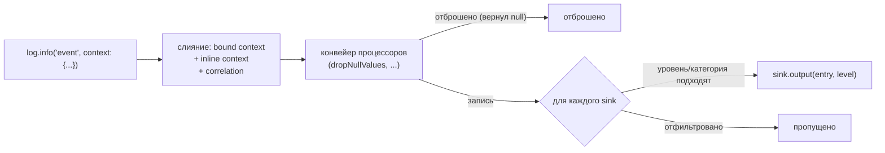

# structured_log

[](https://github.com/pese-git/structured_log/actions/workflows/ci.yml)

*Read this in [English](README.md).*

Структурированное логирование для Dart и Flutter, вдохновлённое
[Python structlog](https://www.structlog.org/): записи лога в JSON с
привязанным контекстом, конвейер процессоров и маршрутизация в сколько
угодно выводов.

Этот пакет — ядро **проекта structured_log**: вокруг него — семейство пакетов
и self-hosted сервис для централизованного сбора логов. Ядро работает само по
себе везде, где работает Dart; всё остальное необязательно и строится поверх
него.

## Проект structured_log

Пользоваться им можно двумя способами: начать с первого, а второй добавить
позже — и при этом не менять то, как код пишет логи.

### Самостоятельно — внутри приложения, без сервера

- **Структурированное логирование** — этот пакет: записи в JSON, привязка
  контекста, типизированные correlation-id, процессоры (включая маскирование
  секретов), вывод в консоль, файл, ротируемый и асинхронный файл,
  multi-sink маршрутизация с фильтрами по уровню/категории на каждый синк.
- **Просмотрщик логов внутри Flutter-приложения** — живой список всего, что
  приложение только что записало, с поиском и фильтрами — прямо в работающем
  приложении.
  [`structured_log_flutter`](https://pub.dev/packages/structured_log_flutter)
  — headless-ядро (ограниченный синк `LogBuffer` и `LogViewerController` с
  поиском, фильтрами по уровню/категории, паузой и очисткой), а поверх него —
  три готовых скина:
  [Material 3](https://pub.dev/packages/structured_log_material),
  [Fluent UI](https://pub.dev/packages/structured_log_fluent) и
  [Cupertino](https://pub.dev/packages/structured_log_cupertino), каждый
  адаптивный (список и детали рядом на широком экране, детали отдельным
  экраном на узком).
- **Интеграции** — то, что делают ваши библиотеки, попадает в лог записями
  `structured_log`, а пользоваться ими можно точно так же, как раньше:

  | Пакет | Что пишет |
  |---|---|
  | [`structured_log_bloc`](https://pub.dev/packages/structured_log_bloc) | создание, события, смену состояния, ошибки и закрытие каждого блока и кубита (`BlocObserver`; работает с `flutter_bloc`) |
  | [`structured_log_dio`](https://pub.dev/packages/structured_log_dio) | каждый запрос `dio` и его итог, с уровнем по статусу ответа и маскированием заголовков авторизации и токенов |
  | [`structured_log_http_client`](https://pub.dev/packages/structured_log_http_client) | то же для `package:http`, тело ответа — без буферизации |
  | [`structured_log_go_router`](https://pub.dev/packages/structured_log_go_router) | каждый переход, перенаправление и ошибку маршрутизации `go_router` |
  | [`structured_log_cherrypick`](https://pub.dev/packages/structured_log_cherrypick) | работу DI-контейнера `cherrypick` — скоупы, модули, циклы, ошибки разрешения |

Начните с
[руководства по встраиванию](https://structured-log.openidealab.com/ru/guides/embedding-guide/).

### Вместе с self-hosted сервером — собрано, с поиском, для всей команды

- **[`structured_log_remote_sync`](https://pub.dev/packages/structured_log_remote_sync)**
  — ещё один синк: отправляет записи на сервер по HTTP батчами, повторяет
  отправку с backoff, держит записи в ограниченном буфере, пока сервер
  недоступен, и никогда не блокирует код, который пишет в лог.
- **[`structured_log_server`](https://github.com/pese-git/structured_log/tree/master/backend/structured_log_server)**
  — мультитенантный сервис, который вы запускаете сами (по умолчанию SQLite,
  по выбору PostgreSQL): приём логов, поиск по уровню, категории, диапазону
  времени, полному тексту и любому собственному полю, живая лента через SSE,
  группы, проекты, команды и секретные ключи проектов, роли, квоты, срок
  хранения, ограничение частоты и журнал аудита.
- **[`structured_log_admin_client`](https://github.com/pese-git/structured_log/tree/master/frontend/structured_log_admin_client)**
  — веб-приложение, чтобы читать эти логи и управлять сервером: поиск по логам
  с живой лентой, группы, проекты и ключи, пользователи и роли, журнал аудита;
  английский и русский языки.

Сервер и admin-клиент — приложения, а не библиотеки, поэтому их нет на
pub.dev; они разворачиваются вместе через Docker Compose или в Kubernetes.
См. руководства
[пользователя](https://structured-log.openidealab.com/ru/guides/user-guide/),
[администратора](https://structured-log.openidealab.com/ru/guides/admin-guide/)
и [разработчика](https://structured-log.openidealab.com/ru/guides/developer-guide/),
а также справочник по [HTTP API](https://structured-log.openidealab.com/ru/api/http-api/).

Вся документация — на
**[structured-log.openidealab.com](https://structured-log.openidealab.com/ru/)**;
исходный код — в одном репозитории,
[pese-git/structured_log](https://github.com/pese-git/structured_log).

## Возможности

Что даёт этот пакет — ядро, на котором строится всё перечисленное выше:

- **Структурированный JSON** — логи машиночитаемы по умолчанию
- **Привязка контекста** — иммутабельные `bind()` / `unbind()` для добавления метаданных
- **Типизированные correlation-поля** — `withCorrelation()` для session/request/connection/tool-call/message/operation id
- **Процессоры** — трансформация записей перед выводом (фильтрация, обогащение, форматирование)
- **Маскирование секретов** — `redactKeys()` скрывает пароли, токены и ключи по имени поля, а по значению — с поставляемыми проверками `looksLikeJwtOrBearer` / `looksLikeCardNumber`
- **Несколько выводов** — stdout, цветная консоль, файл, ротируемый файл или кастомный
- **Асинхронный вывод в файл** — `AsyncFileOutput` / `AsyncRotatingFileOutput` пишут, не блокируя вызывающего, с `flushed`, чтобы дождаться записи
- **Multi-sink маршрутизация** — доставка одной записи в несколько приёмников с независимой фильтрацией по уровню/категории и переключением в рантайме
- **Конфигурация** — глобальная настройка через `StructlogConfiguration.configure()`
- **Без сторонних runtime-зависимостей** — только Dart SDK и `meta`

## Как это работает

Каждый вызов лога проходит один и тот же конвейер: привязанный контекст и
correlation-поля объединяются в запись, запись проходит через настроенные
процессоры (которые могут обогатить, замаскировать или отбросить её), а
то, что осталось, доставляется в каждый синк, который пропускает её по
уровню и категории:



Параметр `output:` в `StructlogConfiguration.configure()` — это
сокращение для одного синка; большинству приложений больше и не нужно. Раздел
[Multi-sink маршрутизация](#multi-sink-маршрутизация) ниже — про доставку в
несколько приёмников сразу, а [doc/ARCHITECTURE.ru.md](doc/ARCHITECTURE.ru.md)
— про полную внутреннюю архитектуру с диаграммами последовательностей,
если вы дорабатываете сам пакет.

## Установка

Добавьте в `pubspec.yaml`:

```yaml
dependencies:
  structured_log: ^0.2.2
```

## Быстрый старт

```dart
import 'package:structured_log/structured_log.dart';

void main() {
  final log = getLogger();
  log.info('user_login', context: {'user_id': 42, 'ip': '127.0.0.1'});
}
```

Вывод:

```json
{
  "user_id": 42,
  "ip": "127.0.0.1",
  "event": "user_login",
  "level": "info",
  "timestamp": "2026-04-27T12:00:00.000000"
}
```

## Справочник API

### Получение логгера

```dart
// Логгер по умолчанию
final log = getLogger();

// Именованный логгер (добавляет ключ 'logger' в контекст)
final log = getLogger('auth');
```

### Уровни логирования

| Метод       | Уровень   | Цвет (консоль) |
|-------------|-----------|----------------|
| `trace()`   | trace     | серый          |
| `debug()`   | debug     | голубой        |
| `info()`    | info      | зелёный        |
| `warning()` | warning   | жёлтый         |
| `error()`   | error     | красный        |
| `critical()`| critical  | фиолетовый     |

Уровни упорядочены от наименее к наиболее серьёзному: `trace` < `debug` <
`info` < `warning` < `error` < `critical`. По умолчанию `minLevel` у синка
— `debug`, поэтому вызовы `trace()` везде отфильтровываются, если только
синк явно не задаст `minLevel: LogLevel.trace`. Это удобно для
объёмных подробностей (например, сырых фреймов протокола), которые по
умолчанию должны быть выключены.

```dart
log.trace('raw_frame', context: {'bytes': 128});
log.debug('cache miss', context: {'key': 'session:42'});
log.info('request completed', context: {'duration_ms': 150});
log.warning('slow query', context: {'sql': 'SELECT ...', 'ms': 2000});
log.error('payment failed', context: {'error': 'timeout', 'order_id': 123});
log.critical('database down', context: {'host': 'db-primary'});
```

### Привязка контекста

`bind()` возвращает **новый** экземпляр логгера с объединённым контекстом (иммутабельный паттерн):

```dart
final baseLog = getLogger();

// Привязка контекста запроса
final requestLog = baseLog.bind({'request_id': 'abc-123', 'trace_id': 'xyz'});

// Привязка контекста пользователя поверх
final userLog = requestLog.bind({'user_id': 42});

userLog.info('purchase');
// → {"request_id": "abc-123", "trace_id": "xyz", "user_id": 42, "event": "purchase", ...}
```

`unbind()` удаляет ключи:

```dart
final cleanLog = userLog.unbind(['user_id']);
```

### Типизированные correlation-поля

Для идентификаторов, которые снова и снова нужны почти любому нетривиальному
клиенту, — сессии, запросы, реконнекты, async-операции — `withCorrelation()`
привязывает фиксированный типизированный набор полей вместо самодельных
ключей в map:

```dart
final log = getLogger().withCorrelation(
  sessionId: 's-14',
  requestId: 'r-42',
  connectionGeneration: 8,
);

// Дочерний scope наследует поля родителя и может добавить/переопределить свои,
// не затрагивая родителя:
final toolLog = log.withCorrelation(toolCallId: 'tc-3');

toolLog.info('tool_invoked');
// → {"session_id": "s-14", "request_id": "r-42", "connection_generation": 8,
//    "tool_call_id": "tc-3", "event": "tool_invoked", ...}
```

Все шесть полей необязательны — привязывайте любое подмножество. Они
сериализуются под фиксированными snake_case-ключами: `session_id`,
`request_id`, `connection_generation`, `tool_call_id`, `message_id`,
`operation_id`. Если типизированное поле и одноимённый ключ из
`bind()`/инлайн `context` заданы одновременно — **побеждает типизированное
поле**.

### Инлайн-контекст

Передавайте контекст для отдельного вызова:

```dart
log.info('event', context: {'one_off': true});
```

Контекст объединяется в порядке: `initialContext` → `bind()` → инлайн `context`.

## Конфигурация

### Глобальная конфигурация

```dart
StructlogConfiguration.configure(
  processors: [dropNullValues, myCustomProcessor],
  output: fileOutput('logs/app.log'),
  initialContext: {'app': 'my_app', 'version': '1.0.0'},
);
```

| Параметр         | Тип                   | По умолчанию      | Описание                                          |
|------------------|-----------------------|-------------------|-----------------------------------------------------|
| `processors`     | `List<Processor>`     | `[dropNullValues]`| Цепочка трансформации записей                     |
| `output`         | `OutputFunction`      | `defaultOutput`   | Сокращение для одного синка с именем `'default'`  |
| `sinks`          | `List<LogSink>`       | один синк из `output` | Несколько приёмников с независимой фильтрацией |
| `initialContext` | `Map<String, dynamic>`| `{}`              | Контекст для всех логгеров                        |

Сброс к настройкам по умолчанию:

```dart
StructlogConfiguration.reset();
```

### Вывод (Outputs)

#### Консоль (по умолчанию)

JSON с отступами в stdout:

```dart
StructlogConfiguration.configure(output: defaultOutput);
```

#### Цветная консоль

Читаемый вывод с ANSI-цветами:

```dart
StructlogConfiguration.configure(output: coloredConsoleOutput);
```

Вывод:

```
[2026-04-27T12:00:00.000000] INFO: user_login {"user_id": 42}
```

#### Файл

Дописывает JSON-строки (JSONL) в файл. Директории создаются автоматически:

```dart
StructlogConfiguration.configure(
  output: fileOutput('logs/app.log'),
);
```

#### Ротируемый файл

Автоматическая ротация при превышении размера:

```dart
StructlogConfiguration.configure(
  output: rotatingFileOutput(
    'logs/app.log',
    maxSizeBytes: 10 * 1024 * 1024, // 10MB
    maxBackups: 5,                   // хранить 5 ротированных файлов
  ),
);
```

Ротированные файлы: `app.log`, `app.log.0`, `app.log.1`, ... `app.log.4`

#### Асинхронный файл / асинхронный ротируемый файл

`fileOutput`/`rotatingFileOutput` пишут через `File.writeAsStringSync` —
просто и безопасно, но это блокирует тот изолят, откуда сделан вызов лога
(например, UI-изолят во Flutter-приложении, если логировать оттуда часто).
`AsyncFileOutput` и `AsyncRotatingFileOutput` вместо этого используют
неблокирующий файловый I/O, с теми же опциями, что и синхронные аналоги:

```dart
final asyncOutput = AsyncFileOutput('logs/app.log');
// или: AsyncRotatingFileOutput('logs/app.log', maxSizeBytes: 10 * 1024 * 1024);
StructlogConfiguration.configure(output: asyncOutput);

getLogger().info('request completed');

// Дождитесь этого перед выходом из процесса (или в тестах), чтобы знать,
// что все записи на текущий момент реально попали на диск:
await asyncOutput.flushed;
```

В отличие от остальных выводов, это **классы**, а не обычные функции —
храните ссылку на экземпляр, чтобы можно было дождаться `.flushed`.
Записи по-прежнему доставляются по порядку, а ошибка записи
перехватывается и выводится в `stderr`, не затрагивая записи, поставленные
в очередь после неё, — та же гарантия изоляции, что
[Multi-sink маршрутизация](#multi-sink-маршрутизация) даёт синкам,
только для асинхронного случая. См.
[doc/ARCHITECTURE.ru.md](doc/ARCHITECTURE.ru.md#асинхронные-выводы) — почему
очередь записи устроена именно так.

#### Кастомный вывод

Реализуйте свой:

```dart
void myOutput(Map<String, dynamic> entry, LogLevel level) {
  // Отправка в Sentry, CloudWatch и т.д.
}

StructlogConfiguration.configure(output: myOutput);
```

### Multi-sink маршрутизация

Доставка одной записи лога сразу в несколько приёмников — например,
человекочитаемый вывод в консоль для разработчика и параллельно JSON-файл
для последующего анализа — каждый со своей фильтрацией по уровню и
категории:

```dart
StructlogConfiguration.configure(sinks: [
  LogSink(
    name: 'console',
    output: coloredConsoleOutput,
  ),
  LogSink(
    name: 'protocol',
    output: rotatingFileOutput('protocol.log', maxSizeBytes: 10 * 1024 * 1024),
    minLevel: LogLevel.debug,
    categories: {'protocol'}, // только записи с этой категорией
    enabled: false,           // по умолчанию выключен, можно включить в рантайме
  ),
]);

final log = getLogger();
log.info('request_started');                              // → только в консоль
log.debug('raw_frame', context: {'category': 'protocol'}); // → в protocol sink, если включён
```

Категория — это обычное значение в контексте под ключом `'category'`:
привязывается один раз на логгер (`bind({'category': 'protocol'})`) либо
передаётся инлайн. Синк с `categories: null` (по умолчанию) принимает
любую категорию.

Синк можно включать и выключать в рантайме, не пересобирая конфигурацию и
логгеры:

```dart
StructlogConfiguration.setSinkEnabled('protocol', enabled: true);
```

Параметр `output:` (как выше) по-прежнему полностью поддерживается — это
сокращение для одного синка с именем `'default'`. Если `output` какого-то
синка бросает исключение, оно перехватывается и выводится в `stderr`;
доставку в остальные синки это не останавливает и вызывающий код не
роняет.

## Процессоры

Процессоры — функции, преобразующие записи перед выводом. Верните `null`, чтобы отбросить запись.

### Встроенные процессоры

| Процессор        | Описание                          |
|------------------|-----------------------------------|
| `dropNullValues` | Удаляет ключи со значением `null` |
| `addTimestamp`   | Добавляет метку времени ISO 8601  |
| `addLogLevel`    | Гарантирует наличие ключа уровня  |
| `jsonRenderer`   | Выводит запись как JSON           |
| `logfmtRenderer` | Выводит в формате `key=value`     |
| `redactKeys()`   | Затирает секреты на любой глубине |

### Затирание секретов

`redactKeys()` заменяет значение на `***` везде, где оно встретится — на
верхнем уровне, во вложенных картах, в списках, — а что именно заменять,
решают три независимых критерия, по отдельности или вместе:

```dart
StructlogConfiguration.configure(
  processors: [
    redactKeys(),                       // defaultSensitiveKeys как есть
    dropNullValues,
  ],
);

// или с настройкой:
redactKeys(
  keys: {...defaultSensitiveKeys, 'x-internal-signature'},  // имена
  matchesKey: (key) => key.endsWith('_token'),              // семейства имён
  matchesValue: looksLikeJwtOrBearer,                       // само значение
);
```

| Критерий | Что ловит | Замечание |
|---|---|---|
| `keys` | Имя целиком, без учёта регистра | Разделители **не** нормализуются: `card_number` не ловит `cardNumber`. Переданный набор **заменяет** `defaultSensitiveKeys`; `const {}` выключает критерий |
| `matchesKey` | `refresh_token`, `x-api-key`, … | Пишете вы; слишком широкий предикат молча съест полезные поля |
| `matchesValue` | Секрет под безобидным именем | Спрашивается только о `String`. `looksLikeJwtOrBearer` есть в пакете; `looksLikeCardNumber` тоже есть, но **не** в умолчаниях — длина и Лун всё равно не отличают карту от 16-значного номера заказа |

Главная ловушка — написание имени. `defaultSensitiveKeys` обходит её так:
перечисляет каждое составное имя трижды — `access_token`, `access-token`,
`accesstoken`, — и как раз последнее написание ловит `accessToken` и
`AccessToken`. Имя, которое добавляете **вы**, покрывает только одно
написание — если только вы тоже не добавите его трижды или не нормализуете
имя один раз в `matchesKey`:

```dart
const sensitive = {'cardnumber', 'cvc', 'apikey'};
redactKeys(
  matchesKey: (key) =>
      sensitive.contains(key.toLowerCase().replaceAll(RegExp('[_-]'), '')),
);
```

В `defaultSensitiveKeys` лежат имена, значение которых везде — учётные
данные (`password`, `token`, `authorization`, `cookie`, `api_key`, …,
каждое составное — во всех трёх написаниях).
Корреляционных полей этого пакета — `session_id`, `request_id` и остальных —
там намеренно нет: они существуют затем, чтобы их читали.

Два важных момента:

- **Ставьте до любого рендерера.** `jsonRenderer` и `logfmtRenderer` печатают
  запись сразу, так что затирать секреты после них уже поздно.
- **Он пересобирает, а не правит.** `BoundLogger` копирует привязанный
  контекст поверхностно, поэтому вложенная карта в записи — **тот же объект**,
  который держит ваш код: самописный процессор, который обходит карту и
  присваивает значения, затрёт токен и в вашем собственном объекте. `redactKeys` копирует только путь, который
  изменил, и возвращает ту же самую карту, если ничего не совпало.

### Кастомный процессор

```dart
// Для затирания секретов берите `redactKeys()` выше — этот пример безопасен
// только потому, что присваивает на верхнем уровне, а он копируется на
// каждую запись.
Map<String, dynamic>? tagEnvironment(Map<String, dynamic> entry) {
  entry['env'] = 'staging';
  return entry;
}

StructlogConfiguration.configure(
  processors: [dropNullValues, tagEnvironment],
);
```

Порядок процессоров важен — они выполняются последовательно:

```dart
processors: [
  dropNullValues,      // 1. Очистка null
  redactKeys(),        // 2. Маскировка секретов
  addCorrelationId,    // 3. Обогащение
]
```

## Примеры

### Логирование запросов веб-сервера

```dart
import 'package:structured_log/structured_log.dart';

void handleRequest(Request req) {
  final log = getLogger().bind({
    'request_id': req.id,
    'method': req.method,
    'path': req.path,
    'ip': req.remoteAddress,
  });

  log.info('request started');

  try {
    final response = processRequest(req);
    log.info('request completed', context: {
      'status': response.status,
      'duration_ms': response.duration,
    });
  } catch (e, st) {
    log.error('request failed', context: {
      'error': e.toString(),
      'stack_trace': st.toString(),
    });
    rethrow;
  }
}
```

### Несколько логгеров (файл + консоль)

```dart
// Консольный логгер для разработки
final consoleLog = getLogger('console');
consoleLog.info('app started');

// Переключение на файловый вывод
StructlogConfiguration.configure(output: fileOutput('logs/production.log'));
final fileLog = getLogger('production');
fileLog.info('same event, different output');
```

### Асинхронное логирование

Библиотека использует синхронный файловый I/O, что безопасно в любом контексте:

```dart
Future<void> asyncTask() async {
  final log = getLogger().bind({'task': 'background_job'});
  log.info('task started');

  await Future.delayed(Duration(seconds: 1));

  log.info('task completed');
}
```

## Сравнение с Python structlog

| Возможность          | Python structlog | Dart structured_log |
|----------------------|------------------|----------------|
| Привязка контекста   | `bind()`         | `bind()`       |
| Типизированные correlation id | Нет (вручную) | `withCorrelation()` |
| Процессоры           | Да               | Да             |
| JSON вывод           | Да               | Да             |
| Консоль              | Да               | Да (цветная)   |
| Файловый вывод       | Через stdlib     | Встроенный     |
| Ротация файлов       | Через handlers   | Встроенная     |
| Маршрутизация в несколько приёмников | Через handlers stdlib logging | Встроенная (`LogSink`) |
| Асинхронный вывод в файл | Через handlers | Встроен (`AsyncFileOutput`) |
| Классы-обёртки       | Да               | Нет (простой)  |

## Связанные пакеты

Остальные пакеты семейства `structured_log`:

**Просмотрщик логов в приложении**

- [`structured_log_flutter`](https://pub.dev/packages/structured_log_flutter) — headless-ядро просмотрщика: `LogBuffer` и `LogViewerController`
- [`structured_log_material`](https://pub.dev/packages/structured_log_material) — просмотрщик на Material 3
- [`structured_log_fluent`](https://pub.dev/packages/structured_log_fluent) — просмотрщик на Fluent UI (в стиле WinUI)
- [`structured_log_cupertino`](https://pub.dev/packages/structured_log_cupertino) — просмотрщик на Cupertino (в стиле iOS)

**Доставка логов на сервер**

- [`structured_log_remote_sync`](https://pub.dev/packages/structured_log_remote_sync) — синк с батчингом и повторами для self-hosted `structured_log_server`

**Интеграции**

- [`structured_log_bloc`](https://pub.dev/packages/structured_log_bloc) — `BlocObserver` для `bloc`/`flutter_bloc`
- [`structured_log_dio`](https://pub.dev/packages/structured_log_dio) — перехватчик `dio`, логирующий HTTP-вызовы
- [`structured_log_http_client`](https://pub.dev/packages/structured_log_http_client) — обёртка клиента `package:http`, логирующая HTTP-вызовы
- [`structured_log_go_router`](https://pub.dev/packages/structured_log_go_router) — логирует навигацию `go_router`
- [`structured_log_cherrypick`](https://pub.dev/packages/structured_log_cherrypick) — наблюдатель DI-контейнера `cherrypick`

## Лицензия

MIT
