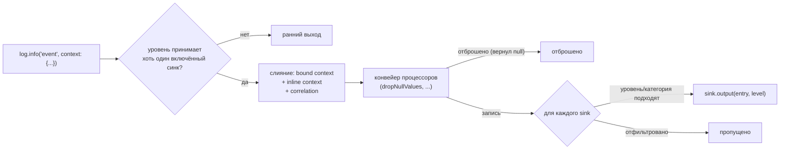

# structured_log

[](https://github.com/pese-git/structured_log/actions/workflows/ci.yml)

*Read this in [English](README.md).*

**Пишите в лог события с данными, а не строки: такие записи хорошо читаются
в терминале, разбираются как JSON и фильтруются по любому полю — на любой
платформе, где работает Dart.**

Идея взята у Python-библиотеки [`structlog`](https://www.structlog.org/). Документация:
[structured-log.openidealab.com](https://structured-log.openidealab.com/ru/).

## Зачем

`print('User 42 logged in from 127.0.0.1')` пишется за секунду, а
обходится дорого: чтобы найти все входы пользователя 42, посчитать входы по
IP или проследить один запрос, приходится разбирать текст сообщений регулярными
выражениями — и они ломаются, стоит кому-нибудь переформулировать
сообщение.

В `structured_log` каждый вызов лога — это **событие с данными**:
`log.info('user_login', context: {'user_id': 42, 'ip': '127.0.0.1'})`. Имя
события не меняется, поля остаются полями, а контекст, привязанный один
раз, — id запроса, пользователь, сессия — попадает в каждую следующую
запись сам. Процессоры затирают секреты ещё до того, как запись
куда-либо попадёт, а синки отправляют одну и ту же запись в консоль, в файл или
куда угодно ещё, каждый со своим фильтром.

## Возможности

### Запись

- **События, а не фразы** — запись состоит из имени события и карты полей,
  уровней шесть, от `trace` до `critical`; переданные `error:` и `stackTrace:` превращаются в
  поля `error`, `error_type` и `stack_trace`.
- **Контекст, который передаётся вместе с логгером** — `bind()`/`unbind()`
  возвращают новый логгер и не трогают прежний, так что логгер запроса можно
  передавать дальше, в том числе через `await`; `initialContext` добавляет общие для
  всего приложения поля в каждую запись.
- **Типизированные correlation-id** — `withCorrelation()` привязывает id
  сессии, запроса, поколения соединения, вызова инструмента, сообщения и
  операции под фиксированными snake_case-ключами, и все части приложения
  называют их одинаково.

### Обработка

- **Процессоры** — обычные функции, которые дополняют, переписывают или
  отбрасывают запись до того, как она попадёт в какой-либо вывод.
- **Затирание секретов** — `redactKeys()` скрывает пароли, токены, cookie и
  ключи по имени поля (встроенные составные имена перечислены в трёх
  написаниях, поэтому ловится и `accessToken`), по вашему предикату на имя
  или по самому значению (`looksLikeJwtOrBearer`, а по желанию и
  `looksLikeCardNumber`) — на любой глубине и не изменяя карты, на которые
  по-прежнему ссылается ваш код.

### Доставка

- **Нужный формат** — JSON с отступами по умолчанию, JSON-строки, logfmt
  (с экранированием: подделать через значение поле или новую строку нельзя),
  цветная строка в консоли или ваша собственная функция.
- **Файлы** — запись в конец файла, ротация по размеру и запись, не блокирующая
  вызывающий изолят (`AsyncFileOutput` с `flushed`, чтобы дождаться записи
  на диск); им нужен `dart:io`, поэтому они лежат в
  `package:structured_log/io.dart`.
- **Несколько приёмников сразу** — у каждого `LogSink` свой минимальный
  уровень, фильтр по категории и выключатель, а включать и выключать его
  можно прямо во время работы через `setSinkEnabled()`.

### Поведение в продакшене

- **Вызов лога никогда не выбрасывает исключений** — об упавшем синке
  сообщается, а остальные синки запись всё равно получают; если упал
  процессор, вместо записи доставляется заглушка, потому что упасть мог
  как раз тот, что затирает секреты.
- **Необычное значение затрагивает одно поле, а не всю запись** — `DateTime`,
  enum, `Duration`, исключения и всё прочее, от чего отказывается
  `jsonEncode`, преобразуется при выводе (`encodeLogEntry`, которым можно
  пользоваться и в своих выводах).
- **Почти ничего не стоит, если запись никому не нужна** — уровень
  проверяется раньше, чем объединяется контекст и запускаются процессоры,
  а `isEnabled()` позволяет вовсе не собирать дорогую запись.
- **Однозначные метки времени** — UTC по умолчанию или местное время со
  смещением; местного времени без смещения, которое читатель принял бы
  за своё, не бывает.
- **Настраивать можно в любой момент** — логгеры из `getLogger()` следуют текущей
  конфигурации, так что логгер в `static final`, созданный раньше
  `configure()`, её всё равно подхватит.
- **Везде, где работает Dart** — VM, Flutter и web; основная библиотека не
  импортирует `dart:io`, а единственная зависимость — `meta`.

## Место в проекте

Этот пакет — ядро
[проекта structured_log](https://structured-log.openidealab.com/ru/), и для
начала его одного достаточно. Всё остальное необязательно и работает с теми
же записями, причём двумя способами: **самостоятельно** — логи остаются в
приложении, к ним добавляются просмотрщик внутри приложения и адаптеры к уже
используемым библиотекам, сервер не нужен вовсе — или **вместе с self-hosted
сервером**: ещё один синк, и записи со всех установок приложения попадают в
общее хранилище, где команда ищет по ним и следит за новыми записями в реальном
времени. Переход от первого ко второму не требует менять ни одного вызова
лога.

| Пакет | Назначение |
|---|---|
| [`structured_log_flutter`](https://pub.dev/packages/structured_log_flutter) | Headless-ядро просмотрщика логов в приложении: синк `LogBuffer`, `LogViewerController` |
| [`structured_log_material`](https://pub.dev/packages/structured_log_material) · [`_fluent`](https://pub.dev/packages/structured_log_fluent) · [`_cupertino`](https://pub.dev/packages/structured_log_cupertino) | Готовые экраны просмотра в стиле Material 3, Fluent UI и Cupertino |
| [`structured_log_bloc`](https://pub.dev/packages/structured_log_bloc) · [`_dio`](https://pub.dev/packages/structured_log_dio) · [`_http_client`](https://pub.dev/packages/structured_log_http_client) · [`_go_router`](https://pub.dev/packages/structured_log_go_router) · [`_cherrypick`](https://pub.dev/packages/structured_log_cherrypick) | Пишут в лог то, что эти библиотеки и так делают, — пользоваться ими можно как раньше |
| [`structured_log_remote_sync`](https://pub.dev/packages/structured_log_remote_sync) | Синк, отправляющий записи на сервер батчами, с повторами и ограниченным буфером |
| [`structured_log_server`](https://github.com/pese-git/structured_log/tree/master/backend/structured_log_server) | Self-hosted мультитенантный сервер логов: приём, поиск, живая лента (приложение, на pub.dev его нет) |
| [`structured_log_admin_client`](https://github.com/pese-git/structured_log/tree/master/frontend/structured_log_admin_client) | Веб-админка, чтобы читать логи и управлять сервером (приложение, на pub.dev его нет) |

Без сервера начните с
[руководства по встраиванию](https://structured-log.openidealab.com/ru/guides/embedding-guide/);
серверную сторону описывают руководства
[пользователя](https://structured-log.openidealab.com/ru/guides/user-guide/),
[администратора](https://structured-log.openidealab.com/ru/guides/admin-guide/)
и [разработчика](https://structured-log.openidealab.com/ru/guides/developer-guide/),
а также справочник по [HTTP API](https://structured-log.openidealab.com/ru/api/http-api/).
Исходный код — в одном репозитории,
[pese-git/structured_log](https://github.com/pese-git/structured_log).

## Установка

```bash
dart pub add structured_log
```

или добавьте в `pubspec.yaml`:

```yaml
dependencies:
  structured_log: ^0.3.0
```

## Быстрый старт

```dart
import 'package:structured_log/structured_log.dart';

void main() {
  final log = getLogger();
  log.info('user_login', context: {'user_id': 42, 'ip': '127.0.0.1'});
}
```

Вывод:

```json
{
  "user_id": 42,
  "ip": "127.0.0.1",
  "event": "user_login",
  "level": "info",
  "timestamp": "2026-04-27T12:00:00.000Z"
}
```

`timestamp` записывается в UTC в формате ISO-8601 и оканчивается на `Z`;
как писать вместо этого местное время — в разделе
[Метки времени](#метки-времени).

Пример посложнее: запись одной строкой JSON, затёртые секреты и контекст,
привязанный один раз на весь запрос:

```dart
import 'package:structured_log/structured_log.dart';

void main() {
  StructlogConfiguration.configure(
    processors: [redactKeys(), dropNullValues],
    output: jsonLineOutput,
  );

  final log = getLogger('api').bind({'request_id': 'r-42'});
  log.info('login_attempt', context: {'user': 'alice', 'password': 'hunter2'});
  // {"logger":"api","request_id":"r-42","user":"alice","password":"***",
  //  "event":"login_attempt","level":"info","timestamp":"..."}
}
```

## Как это работает

Каждый вызов лога проходит один и тот же конвейер: если ни один включённый
синк не принимает уровень вызова, на этом всё и заканчивается; иначе
привязанный контекст и correlation-поля объединяются в запись, запись
проходит через настроенные
процессоры (которые могут обогатить, замаскировать или отбросить её), а
то, что осталось, доставляется в каждый синк, который пропускает её по
уровню и категории:



Параметр `output:` в `StructlogConfiguration.configure()` — это
сокращение для одного синка; большинству приложений больше и не нужно. Раздел
[Multi-sink маршрутизация](#multi-sink-маршрутизация) ниже — про доставку в
несколько приёмников сразу, а [doc/ARCHITECTURE.ru.md](doc/ARCHITECTURE.ru.md)
— про полную внутреннюю архитектуру с диаграммами последовательностей,
если вы дорабатываете сам пакет.

## Справочник API

### Получение логгера

```dart
// Логгер по умолчанию
final log = getLogger();

// Именованный логгер (добавляет ключ 'logger' в контекст)
final log = getLogger('auth');
```

Логгер из `getLogger()` читает текущую глобальную конфигурацию — синки,
процессоры, `initialContext` — на каждой записи, а не в момент создания.
Поэтому его спокойно можно держать в поле `static final`, которое
инициализируется раньше, чем выполнится `StructlogConfiguration.configure()`:
логгер подхватит и этот вызов, и все последующие. То же верно для логгеров,
полученных из него через `bind()`/`unbind()`/`withCorrelation()`.

Если логгер, наоборот, нужно привязать к одной конфигурации — для внедрения
зависимостей или теста, который не должен делить глобальное состояние, —
создайте `BoundLogger` с ней явно. Такой логгер не замечает последующих
вызовов `configure()` и не подмешивает `initialContext`:

```dart
final log = BoundLogger(StructlogConfiguration(output: myOutput));
```

### Уровни логирования

| Метод       | Уровень   | Цвет (консоль) |
|-------------|-----------|----------------|
| `trace()`   | trace     | серый          |
| `debug()`   | debug     | голубой        |
| `info()`    | info      | зелёный        |
| `warning()` | warning   | жёлтый         |
| `error()`   | error     | красный        |
| `critical()`| critical  | фиолетовый     |

Уровни упорядочены от наименее к наиболее серьёзному: `trace` < `debug` <
`info` < `warning` < `error` < `critical`. По умолчанию `minLevel` у синка
— `debug`, поэтому вызовы `trace()` везде отфильтровываются, если только
синк явно не задаст `minLevel: LogLevel.trace`. Это удобно для
объёмных подробностей (например, сырых фреймов протокола), которые по
умолчанию должны быть выключены.

```dart
log.trace('raw_frame', context: {'bytes': 128});
log.debug('cache miss', context: {'key': 'session:42'});
log.info('request completed', context: {'duration_ms': 150});
log.warning('slow query', context: {'sql': 'SELECT ...', 'ms': 2000});
log.error('payment failed', context: {'order_id': 123});
log.critical('database down', context: {'host': 'db-primary'});
```

Каждый метод уровня (и `tryLog`) принимает также `error:` и `stackTrace:`.
Из них получаются поля `error` (`toString()` ошибки), `error_type` (её
runtime-тип) и `stack_trace`; одноимённые ключи из `context` они
перекрывают:

```dart
try {
  await charge(order);
} catch (e, st) {
  log.error('payment failed', error: e, stackTrace: st,
      context: {'order_id': 123});
}
```

`isEnabled(level, {category})` отвечает, дойдёт ли запись этого уровня (и
категории) хоть до одного включённого синка, — так можно не собирать
дорогую запись, которую всё равно никто не увидит:

```dart
if (log.isEnabled(LogLevel.trace)) {
  log.trace('frame', context: {'hex': hexDump(bytes)});
}
```

Проверку по уровню вызов лога делает и сам, в самом начале: если уровень не
принимает ни один включённый синк, вызов сразу завершается, не объединяя
контекст и не запуская процессоров. Значит, процессоры не видят записей, которые ни
один синк не взял бы по уровню.

### Привязка контекста

`bind()` возвращает **новый** экземпляр логгера с объединённым контекстом, исходный логгер не меняется:

```dart
final baseLog = getLogger();

// Привязка контекста запроса
final requestLog = baseLog.bind({'request_id': 'abc-123', 'trace_id': 'xyz'});

// Привязка контекста пользователя поверх
final userLog = requestLog.bind({'user_id': 42});

userLog.info('purchase');
// → {"request_id": "abc-123", "trace_id": "xyz", "user_id": 42, "event": "purchase", ...}
```

`unbind()` удаляет ключи:

```dart
final cleanLog = userLog.unbind(['user_id']);
```

### Типизированные correlation-поля

Для идентификаторов, которые снова и снова нужны почти любому нетривиальному
клиенту, — сессии, запросы, реконнекты, async-операции — `withCorrelation()`
привязывает фиксированный типизированный набор полей вместо самодельных
ключей в map:

```dart
final log = getLogger().withCorrelation(
  sessionId: 's-14',
  requestId: 'r-42',
  connectionGeneration: 8,
);

// Дочерний scope наследует поля родителя и может добавить/переопределить свои,
// не затрагивая родителя:
final toolLog = log.withCorrelation(toolCallId: 'tc-3');

toolLog.info('tool_invoked');
// → {"session_id": "s-14", "request_id": "r-42", "connection_generation": 8,
//    "tool_call_id": "tc-3", "event": "tool_invoked", ...}
```

Все шесть полей необязательны — привязывайте любое подмножество. Они
сериализуются под фиксированными snake_case-ключами: `session_id`,
`request_id`, `connection_generation`, `tool_call_id`, `message_id`,
`operation_id`. Если типизированное поле и одноимённый ключ из
`bind()`/инлайн `context` заданы одновременно — **побеждает типизированное
поле**.

### Инлайн-контекст

Передавайте контекст для отдельного вызова:

```dart
log.info('event', context: {'one_off': true});
```

Контекст объединяется в порядке: `initialContext` → `bind()` → инлайн
`context` → поля из `error:`/`stackTrace:` → correlation-поля.

## Конфигурация

### Глобальная конфигурация

```dart
import 'package:structured_log/io.dart'; // fileOutput
import 'package:structured_log/structured_log.dart';

StructlogConfiguration.configure(
  processors: [dropNullValues, myCustomProcessor],
  output: fileOutput('logs/app.log'),
  initialContext: {'app': 'my_app', 'version': '1.0.0'},
);
```

Логгеры, уже полученные через `getLogger()`, подхватят изменение на
следующей же записи — заново получать их не нужно.

| Параметр         | Тип                   | По умолчанию      | Описание                                          |
|------------------|-----------------------|-------------------|-----------------------------------------------------|
| `processors`     | `List<Processor>`     | `[dropNullValues]`| Цепочка трансформации записей                     |
| `output`         | `OutputFunction`      | `defaultOutput`   | Сокращение для одного синка с именем `'default'`  |
| `sinks`          | `List<LogSink>`       | один синк из `output` | Несколько приёмников с независимой фильтрацией |
| `initialContext` | `Map<String, dynamic>`| `{}`              | Контекст для всех логгеров                        |
| `timestampMode`  | `TimestampMode`       | `TimestampMode.utc` | Как записывается `timestamp` — см. [Метки времени](#метки-времени) |

Сброс к настройкам по умолчанию:

```dart
StructlogConfiguration.reset();
```

### Метки времени

`timestamp` ставится каждой записи до того, как запустится первый
процессор. Как он записывается, решает `timestampMode`; в обоих режимах он
однозначно указывает на один момент времени:

```dart
StructlogConfiguration.configure(timestampMode: TimestampMode.utc); // по умолчанию
// "timestamp": "2026-10-02T09:30:15.250Z"

StructlogConfiguration.configure(
  timestampMode: TimestampMode.localWithOffset,
);
// "timestamp": "2026-10-02T12:30:15.250+03:00"
```

С `TimestampMode.utc` записи с устройств в разных часовых поясах
сортируются и сравниваются как есть; `TimestampMode.localWithOffset`
сохраняет время на часах устройства вместе с его смещением. Местного
времени *без* смещения среди режимов нет: кто бы его ни читал, он примет
его за своё местное.

### Вывод (Outputs)

Все встроенные выводы сериализуют запись через `encodeLogEntry` — его можно
вызывать и из своих выводов. Значения, от которых отказывается `jsonEncode`,
преобразуются, а не губят запись: `DateTime` становится строкой ISO-8601 в
UTC, enum — своим `name`, `Duration` — числом микросекунд, `Set` — списком,
объект с методом `toJson()` — тем, что он вернёт (как сделал бы сам
`jsonEncode`), всё остальное — результатом `toString()`. Запись, содержащая саму себя, выводится заглушкой
с полем `encoding_failed`. Преобразование происходит только в выводе —
процессоры и синки, хранящие записи в памяти, по-прежнему видят исходные
объекты.

Консольные выводы и `jsonLineOutput`/`logfmtOutput` лежат в основной
библиотеке и работают везде, в вебе тоже. Файловым выводам нужен `dart:io`,
поэтому они вынесены в отдельную библиотеку: чтобы ими пользоваться,
импортируйте `package:structured_log/io.dart` вместе с основной. Именно это
разделение и избавляет `package:structured_log/structured_log.dart` от
`dart:io`, так что основная библиотека работает в вебе.

#### Консоль (по умолчанию)

JSON с отступами в stdout:

```dart
StructlogConfiguration.configure(output: defaultOutput);
```

#### JSON-строки / logfmt

По строке на запись в stdout — JSON (`jsonLineOutput`) или пары
`key=value` (`logfmtOutput`):

```dart
StructlogConfiguration.configure(output: jsonLineOutput);
// {"pid":123,"event":"startup","level":"info","timestamp":"..."}

StructlogConfiguration.configure(output: logfmtOutput);
// pid=123 event="startup" level="info" timestamp="..."
```

`logfmtOutput` (и `formatLogfmt`, который собирает для него строку)
экранирует в значениях кавычки, обратные слэши, переводы строк и прочие
управляющие символы, а небезопасные символы в ключах заменяет. Что бы ни
лежало в записи, получится одна строка, поля которой — ровно ключи записи:
подделать через значение поле или новую строку нельзя.

#### Цветная консоль

Читаемый вывод с ANSI-цветами:

```dart
StructlogConfiguration.configure(output: coloredConsoleOutput);
```

Вывод:

```
[2026-04-27T12:00:00.000Z] INFO: user_login {"user_id":42}
```

#### Файл

Дописывает JSON-строки (JSONL) в файл. Директории создаются автоматически:

```dart
import 'package:structured_log/io.dart';

StructlogConfiguration.configure(
  output: fileOutput('logs/app.log'),
);
```

#### Ротируемый файл

Автоматическая ротация при превышении размера:

```dart
import 'package:structured_log/io.dart';

StructlogConfiguration.configure(
  output: rotatingFileOutput(
    'logs/app.log',
    maxSizeBytes: 10 * 1024 * 1024, // 10MB
    maxBackups: 5,                   // хранить 5 ротированных файлов
  ),
);
```

Ротированные файлы: `app.log`, `app.log.0`, `app.log.1`, ... `app.log.4`

#### Асинхронный файл / асинхронный ротируемый файл

`fileOutput`/`rotatingFileOutput` пишут через `File.writeAsStringSync` —
просто и безопасно, но это блокирует тот изолят, откуда сделан вызов лога
(например, UI-изолят во Flutter-приложении, если логировать оттуда часто).
`AsyncFileOutput` и `AsyncRotatingFileOutput` вместо этого используют
неблокирующий файловый I/O, с теми же опциями, что и синхронные аналоги:

```dart
import 'package:structured_log/io.dart';

final asyncOutput = AsyncFileOutput('logs/app.log');
// или: AsyncRotatingFileOutput('logs/app.log', maxSizeBytes: 10 * 1024 * 1024);
StructlogConfiguration.configure(output: asyncOutput);

getLogger().info('request completed');

// Дождитесь этого перед выходом из процесса (или в тестах), чтобы знать,
// что все записи на текущий момент реально попали на диск:
await asyncOutput.flushed;
```

В отличие от остальных выводов, это **классы**, а не обычные функции —
храните ссылку на экземпляр, чтобы можно было дождаться `.flushed`.
Записи по-прежнему доставляются по порядку, а ошибка записи
перехватывается и выводится в `stderr`, не затрагивая записи, поставленные
в очередь после неё, — та же гарантия изоляции, что
[Multi-sink маршрутизация](#multi-sink-маршрутизация) даёт синкам,
только для асинхронного случая. Почему очередь записи устроена именно
так, объясняет [doc/ARCHITECTURE.ru.md](doc/ARCHITECTURE.ru.md#асинхронные-выводы).

#### Кастомный вывод

Реализуйте свой:

```dart
void myOutput(Map<String, dynamic> entry, LogLevel level) {
  // Отправка в Sentry, CloudWatch и т.д.
}

StructlogConfiguration.configure(output: myOutput);
```

### Multi-sink маршрутизация

Доставка одной записи лога сразу в несколько приёмников — например,
человекочитаемый вывод в консоль для разработчика и параллельно JSON-файл
для последующего анализа — каждый со своей фильтрацией по уровню и
категории:

```dart
import 'package:structured_log/io.dart'; // rotatingFileOutput

StructlogConfiguration.configure(sinks: [
  LogSink(
    name: 'console',
    output: coloredConsoleOutput,
  ),
  LogSink(
    name: 'protocol',
    output: rotatingFileOutput('protocol.log', maxSizeBytes: 10 * 1024 * 1024),
    minLevel: LogLevel.debug,
    categories: {'protocol'}, // только записи с этой категорией
    enabled: false,           // по умолчанию выключен, можно включить в рантайме
  ),
]);

final log = getLogger();
log.info('request_started');                              // → только в консоль
log.debug('raw_frame', context: {'category': 'protocol'}); // → в protocol sink, если включён
```

Категория — это обычное значение в контексте под ключом `'category'`:
привязывается один раз на логгер (`bind({'category': 'protocol'})`) либо
передаётся инлайн. Синк с `categories: null` (по умолчанию) принимает
любую категорию.

Синк можно включать и выключать в рантайме, не пересобирая конфигурацию и
логгеры:

```dart
StructlogConfiguration.setSinkEnabled('protocol', enabled: true);
```

Параметр `output:` (как выше) по-прежнему полностью поддерживается — это
сокращение для одного синка с именем `'default'`.

Вызов лога никогда не выбрасывает исключений. Если исключение выбросит
`output` какого-то синка, оно перехватывается, и о нём сообщается; доставку
в остальные синки это не останавливает и вызывающий код не роняет. Если
исключение выбросит **процессор**, следующие за ним процессоры не запускаются, а синки вместо
записи получают заглушку: `event`, `level`, `timestamp`, `logger` и
`category` (те из них, что строки) плюс `processor_failed` с типом
исключения. Исходная запись не доставляется намеренно: упавший процессор
мог быть как раз тем, что затирает в ней секреты. Отчёты уходят в `stderr`,
а в вебе — через `print`.

## Процессоры

Процессоры — функции, преобразующие записи перед выводом. Верните `null`, чтобы отбросить запись.

### Встроенные процессоры

| Процессор        | Описание                          |
|------------------|-----------------------------------|
| `dropNullValues` | Удаляет ключи со значением `null` |
| `redactKeys()`   | Затирает секреты на любой глубине |
| `addTimestamp`   | **Устарел** — `timestamp` и так есть у каждой записи; его формат задаёт `timestampMode` |
| `addLogLevel`    | **Устарел** — ничего не делает: `level` и так есть у каждой записи |
| `jsonRenderer`   | **Устарел** — печатает изнутри цепочки; используйте `jsonLineOutput` как вывод синка |
| `logfmtRenderer` | **Устарел** — печатает изнутри цепочки; используйте `logfmtOutput` как вывод синка |

### Затирание секретов

`redactKeys()` заменяет значение на `***` везде, где оно встретится — на
верхнем уровне, во вложенных картах, в списках и множествах, а также внутри
того, что вернёт `toJson()` объекта (DTO в контексте маскируется в том виде, в
каком будет записан), — а что именно заменять,
решают три независимых критерия, по отдельности или вместе:

```dart
StructlogConfiguration.configure(
  processors: [
    redactKeys(),                       // defaultSensitiveKeys как есть
    dropNullValues,
  ],
);

// или с настройкой:
redactKeys(
  keys: {...defaultSensitiveKeys, 'x-internal-signature'},  // имена
  matchesKey: (key) => key.endsWith('_token'),              // семейства имён
  matchesValue: looksLikeJwtOrBearer,                       // само значение
);
```

| Критерий | Что ловит | Замечание |
|---|---|---|
| `keys` | Имя целиком, без учёта регистра | Разделители **не** нормализуются: `card_number` не ловит `cardNumber`. Переданный набор **заменяет** `defaultSensitiveKeys`; `const {}` выключает критерий |
| `matchesKey` | `refresh_token`, `x-api-key`, … | Предикат пишете вы; слишком широкий незаметно скроет полезные поля |
| `matchesValue` | Секрет под безобидным именем | Спрашивается только о `String`. `looksLikeJwtOrBearer` есть в пакете; `looksLikeCardNumber` тоже есть, но **не** в умолчаниях — длина и Лун всё равно не отличают карту от 16-значного номера заказа |

Главная ловушка — написание имени. `defaultSensitiveKeys` обходит её так:
перечисляет каждое составное имя трижды — `access_token`, `access-token`,
`accesstoken`, — и как раз последнее написание ловит `accessToken` и
`AccessToken`. Имя, которое добавляете **вы**, ловит только одно
написание — если только вы тоже не добавите его трижды или не нормализуете
имя один раз в `matchesKey`:

```dart
const sensitive = {'cardnumber', 'cvc', 'apikey'};
redactKeys(
  matchesKey: (key) =>
      sensitive.contains(key.toLowerCase().replaceAll(RegExp('[_-]'), '')),
);
```

В `defaultSensitiveKeys` лежат имена, значение которых везде — учётные
данные (`password`, `token`, `authorization`, `cookie`, `api_key`, …,
каждое составное — во всех трёх написаниях).
Корреляционных полей этого пакета — `session_id`, `request_id` и остальных —
там намеренно нет: их для того и пишут, чтобы читать.

Что важно знать:

- **Печатайте из синка, а не из процессора.** Устаревшие `jsonRenderer` и
  `logfmtRenderer` печатают запись сразу, так что затирать секреты после них
  уже поздно. Вывод синка — `jsonLineOutput`, `logfmtOutput` — работает
  после всех процессоров, и затирание секретов не может оказаться после
  него.
- **Циклы ему не страшны.** Карта или список, содержащие сами себя, там, где
  они повторяются, записываются как `'<cycle>'` — обход не зацикливается.
- **Он пересобирает, а не правит.** `BoundLogger` копирует привязанный
  контекст поверхностно, поэтому вложенная карта в записи — **тот же объект**,
  который держит ваш код: самописный процессор, который обходит карту и
  присваивает значения, затрёт токен и в вашем собственном объекте. `redactKeys` копирует только путь, который
  изменил, и возвращает ту же самую карту, если ничего не совпало.

### Кастомный процессор

```dart
// Для затирания секретов берите `redactKeys()` выше — этот пример безопасен
// только потому, что присваивает на верхнем уровне, а он копируется на
// каждую запись.
Map<String, dynamic>? tagEnvironment(Map<String, dynamic> entry) {
  entry['env'] = 'staging';
  return entry;
}

StructlogConfiguration.configure(
  processors: [dropNullValues, tagEnvironment],
);
```

Порядок процессоров важен — они выполняются последовательно:

```dart
processors: [
  dropNullValues,      // 1. Очистка null
  redactKeys(),        // 2. Маскировка секретов
  addCorrelationId,    // 3. Обогащение
]
```

## Примеры

### Логирование запросов веб-сервера

```dart
import 'package:structured_log/structured_log.dart';

void handleRequest(Request req) {
  final log = getLogger().bind({
    'request_id': req.id,
    'method': req.method,
    'path': req.path,
    'ip': req.remoteAddress,
  });

  log.info('request started');

  try {
    final response = processRequest(req);
    log.info('request completed', context: {
      'status': response.status,
      'duration_ms': response.duration,
    });
  } catch (e, st) {
    log.error('request failed', error: e, stackTrace: st);
    rethrow;
  }
}
```

### Переключение вывода во время работы

Логгер из `getLogger()` следует конфигурации, поэтому смена вывода
перенаправляет и уже полученные логгеры — получать их заново не нужно:

```dart
import 'package:structured_log/io.dart'; // fileOutput
import 'package:structured_log/structured_log.dart';

void main() {
  final log = getLogger('app');
  log.info('app started'); // → в консоль (defaultOutput)

  StructlogConfiguration.configure(output: fileOutput('logs/production.log'));
  log.info('same logger, now to the file'); // → в logs/production.log
}
```

### Асинхронное логирование

Логгер — обычное неизменяемое значение, поэтому его можно использовать и
после `await`: привязанный контекст сохраняется:

```dart
Future<void> asyncTask() async {
  final log = getLogger().bind({'task': 'background_job'});
  log.info('task started');

  await Future.delayed(Duration(seconds: 1));

  log.info('task completed');
}
```

## Сравнение с Python structlog

| Возможность          | Python structlog | Dart structured_log |
|----------------------|------------------|----------------|
| Привязка контекста   | `bind()`         | `bind()`       |
| Типизированные correlation id | Нет (вручную) | `withCorrelation()` |
| Процессоры           | Да               | Да             |
| JSON вывод           | Да               | Да             |
| Консоль              | Да               | Да (цветная)   |
| Файловый вывод       | Через stdlib     | Встроенный     |
| Ротация файлов       | Через handlers   | Встроенная     |
| Маршрутизация в несколько приёмников | Через handlers stdlib logging | Встроенная (`LogSink`) |
| Асинхронный вывод в файл | Через handlers | Встроен (`AsyncFileOutput`) |
| Классы-обёртки       | Да               | Нет (простой)  |

## Переход на 0.3.0

В 0.3.0 три ломающих изменения:

- **Метки времени — в UTC.** `timestamp` теперь оканчивается на `Z`
  (`2026-10-02T09:30:15.250Z`), а не записывается местным временем без
  смещения. Нужно местное время — запросите его вместе со смещением; если
  вы разбираете метки времени, разбирайте их как ISO-8601 с часовым поясом:

  ```dart
  StructlogConfiguration.configure(timestampMode: TimestampMode.localWithOffset);
  ```

- **Логгеры из `getLogger()` следят за конфигурацией.** Синки, процессоры и
  `initialContext` они читают на каждой записи, так что заново получать
  логгеры после `configure()` больше не нужно — этот код можно удалить. Если
  вы рассчитывали, что логгер сохранит конфигурацию, с которой создан,
  привяжите его к ней явно (такой логгер не подмешивает `initialContext`):

  ```dart
  final log = BoundLogger(StructlogConfiguration.current);
  ```

- **Файловые выводы переехали в `io.dart`.** `fileOutput`,
  `rotatingFileOutput`, `AsyncFileOutput` и `AsyncRotatingFileOutput` больше
  не экспортируются из `package:structured_log/structured_log.dart`.
  Добавьте импорт везде, где они используются:

  ```dart
  import 'package:structured_log/io.dart';
  ```

`jsonRenderer`, `logfmtRenderer`, `addTimestamp` и `addLogLevel` объявлены
устаревшими, но продолжают работать; чем их заменить — в разделе
[Встроенные процессоры](#встроенные-процессоры).

## Связанные пакеты

Остальные пакеты семейства `structured_log`:

**Просмотрщик логов в приложении**

- [`structured_log_flutter`](https://pub.dev/packages/structured_log_flutter) — headless-ядро просмотрщика: `LogBuffer` и `LogViewerController`
- [`structured_log_material`](https://pub.dev/packages/structured_log_material) — просмотрщик на Material 3
- [`structured_log_fluent`](https://pub.dev/packages/structured_log_fluent) — просмотрщик на Fluent UI (в стиле WinUI)
- [`structured_log_cupertino`](https://pub.dev/packages/structured_log_cupertino) — просмотрщик на Cupertino (в стиле iOS)

**Доставка логов на сервер**

- [`structured_log_remote_sync`](https://pub.dev/packages/structured_log_remote_sync) — синк с батчингом и повторами для self-hosted `structured_log_server`

**Интеграции**

- [`structured_log_bloc`](https://pub.dev/packages/structured_log_bloc) — `BlocObserver` для `bloc`/`flutter_bloc`
- [`structured_log_dio`](https://pub.dev/packages/structured_log_dio) — перехватчик `dio`, логирующий HTTP-вызовы
- [`structured_log_http_client`](https://pub.dev/packages/structured_log_http_client) — обёртка клиента `package:http`, логирующая HTTP-вызовы
- [`structured_log_go_router`](https://pub.dev/packages/structured_log_go_router) — логирует навигацию `go_router`
- [`structured_log_cherrypick`](https://pub.dev/packages/structured_log_cherrypick) — наблюдатель DI-контейнера `cherrypick`
- [`structured_log_drift`](https://pub.dev/packages/structured_log_drift) — `QueryInterceptor` для drift, логирующий запросы, сбои и транзакции
- [`structured_log_logging`](https://pub.dev/packages/structured_log_logging) — мост, передающий записи `package:logging` в `structured_log`

## Лицензия

MIT
