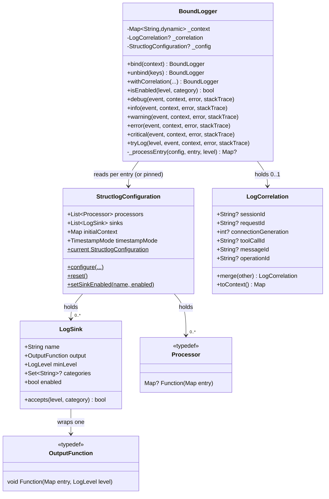
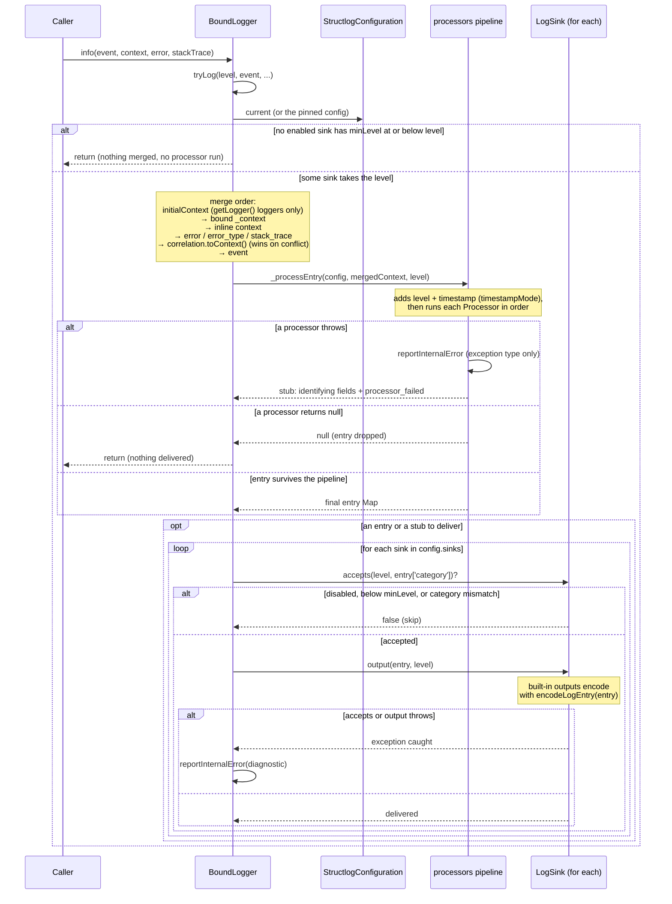
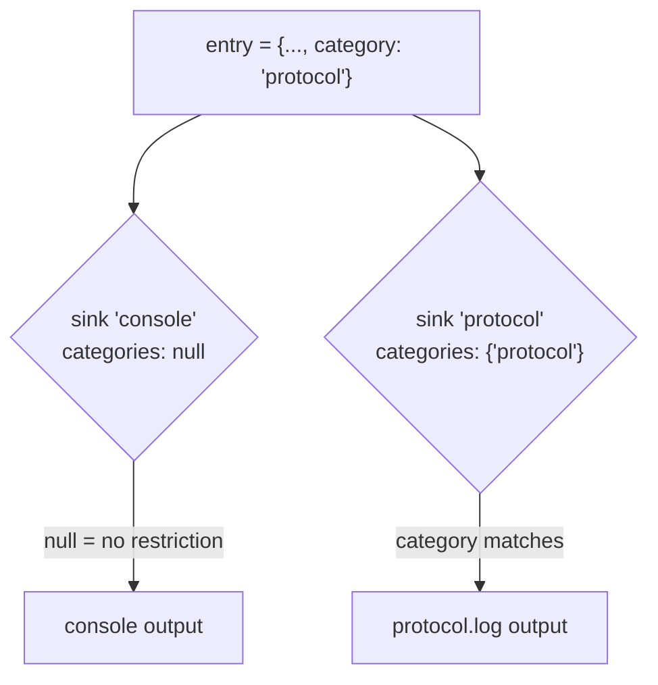
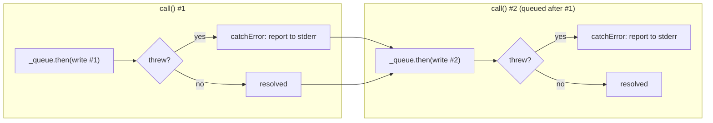

# Architecture

*Читать на [русском](ARCHITECTURE.ru.md).*

This document describes the internal design of `structured_log` for
contributors extending or maintaining the package. For usage as a
consumer, see [README.md](../README.md) (or [README.ru.md](../README.ru.md)).

## Design goals

- **No wrapper ceremony.** A `BoundLogger` is a thin, immutable value —
  `bind()`/`unbind()`/`withCorrelation()` all return a new instance rather
  than mutating state, so passing a logger around a call chain is safe.
- **One global configuration, many local loggers.** `StructlogConfiguration`
  is a process-wide singleton; individual `BoundLogger` instances only carry
  the context/correlation data specific to their scope.
- **Everything in the pipeline is a plain function.** Processors
  (`Map<String, dynamic>? Function(Map<String, dynamic>)`) and outputs
  (`void Function(Map<String, dynamic>, LogLevel)`) are typedef'd function
  types, not classes to subclass — custom behavior is just a closure. The
  async outputs (see [Async outputs](#async-outputs)) are the one exception:
  they're callable classes, because they need to carry state (a completion
  future) beyond the function itself.
- **A logging call never throws.** Whatever a processor, a sink or an
  encoder does, `tryLog()` catches it, reports it and returns — logging is
  never the reason the caller crashed.
- **The core runs everywhere.** The main library imports no `dart:io`; what
  needs it (the file outputs, `stderr`) lives behind
  [`io.dart`](../lib/io.dart) or a conditional import — see
  [Platform split](#platform-split-iodart-and-the-reporter).
- **Additive evolution.** Correlation, multi-sink routing, and the async
  outputs were all added without changing any existing method signature
  (see [CHANGELOG.md](../CHANGELOG.md)). 0.3.0 is the deliberate exception,
  with three breaking changes: UTC timestamps, loggers that follow the
  configuration, and the file outputs moving to `io.dart` (the README's
  "Migrating to 0.3.0" lists what to do).

## Components

| File | Responsibility |
|------|----------------|
| [lib/src/logger.dart](../lib/src/logger.dart) | `LogLevel`, `BoundLogger` — binds context/correlation, checks levels early, runs the processor pipeline (isolating failures), delivers to sinks |
| [lib/src/configuration.dart](../lib/src/configuration.dart) | `StructlogConfiguration` — global processors/sinks/initialContext/timestampMode, `configure()`/`reset()`/`setSinkEnabled()` |
| [lib/src/timestamp.dart](../lib/src/timestamp.dart) | `TimestampMode` and how `timestamp` is written (UTC with `Z`, or local with its offset) |
| [lib/src/correlation.dart](../lib/src/correlation.dart) | `LogCorrelation` — typed, mergeable correlation fields |
| [lib/src/sink.dart](../lib/src/sink.dart) | `LogSink` — one output destination with level/category filtering and a runtime enable switch |
| [lib/src/processors.dart](../lib/src/processors.dart) | `Processor` typedef + built-ins (`dropNullValues`, `redactKeys()`; deprecated: `addTimestamp`, `addLogLevel`, `jsonRenderer`, `logfmtRenderer`) |
| [lib/src/encoding.dart](../lib/src/encoding.dart) | `encodeLogEntry` — the JSON encoding every built-in output uses, converting values `jsonEncode` refuses; the identifying fields a stub keeps |
| [lib/src/formatters.dart](../lib/src/formatters.dart) | `OutputFunction` typedef + built-in outputs that need no `dart:io` (console, colored console, `jsonLineOutput`, `logfmtOutput`) and `formatLogfmt` |
| [lib/src/file_output.dart](../lib/src/file_output.dart) | `fileOutput`, `rotatingFileOutput` — sync file outputs; exported only from `io.dart` |
| [lib/src/async_file_output.dart](../lib/src/async_file_output.dart) | `AsyncFileOutput`, `AsyncRotatingFileOutput` — non-blocking counterparts of the sync file outputs; exported only from `io.dart` |
| [lib/src/report.dart](../lib/src/report.dart) (+ `report_io.dart`, `report_print.dart`) | `reportInternalError` — where internal failures are reported: `stderr`, or `print` on the web |

### Component relationships



A logger from `getLogger()` holds **no** configuration: its `_config` is
`null`, and every entry reads `StructlogConfiguration.current` — sinks,
processors, `initialContext`, `timestampMode` — afresh. A logger kept in a
`static final` field, created before the app's `configure()` call, follows
that call and every later one, and so does everything derived from it with
`bind()`/`unbind()`/`withCorrelation()` (they copy the `null`). A
`BoundLogger(config)` constructed explicitly is the other case: it keeps
`config` for good and does not merge `initialContext` — see
[Runtime toggling and the config snapshot](#runtime-toggling-and-the-config-snapshot).

## Log call lifecycle

Calling e.g. `log.info('event', context: {...})` walks through
`tryLog()` → level check → merge → `_processEntry()` → per-sink delivery.
The whole walk sits inside one `try/catch` in `tryLog()`, on top of the
narrower ones shown below:



Key invariants from this flow:

- **The level is checked before anything is built.** If no enabled sink's
  `minLevel` admits the level, `tryLog()` returns before merging context or
  running a processor — the cost of a filtered-out `trace()` is one pass
  over the sinks. The category cannot be checked this early (it is only
  known after the merge), so it is still checked per sink afterwards.
  `isEnabled()` asks the same question for callers who want to skip
  building a costly `context` themselves.
- **The configuration is read per entry.** For a `getLogger()` logger,
  `_configuration` is `StructlogConfiguration.current` at the moment of the
  call, read once per entry and used for the whole walk, so one entry never
  mixes sinks of one configuration with processors of another.
- **`error:`/`stackTrace:` beat `context`.** They are merged after the
  inline `context`, as `error` (`toString()`), `error_type` (runtime type)
  and `stack_trace`; correlation fields still come after them.
- **Typed correlation wins.** Correlation fields are merged *after* the
  inline `context` map, so a same-named key from `context:` never shadows a
  bound correlation field.
- **A processor returning `null` drops the entry entirely** — no sink sees
  it, and no diagnostic is printed (this is the standard filtering
  mechanism, e.g. for level-based suppression written as a custom
  processor).
- **Processor failures fail closed.** Each processor call is wrapped in its
  own `try/catch`. A processor that throws ends the pipeline: the processors
  after it do not run, and the sinks get a stub — `event`, `level`,
  `timestamp`, `logger`, `category` where they are strings
  (`identifyingFields` in [encoding.dart](../lib/src/encoding.dart)) plus
  `processor_failed` with the exception's type. The original entry is not
  delivered, because the failing processor may be the redactor; for the same
  reason the report names the exception's type, not its message.
- **Sink failures are isolated.** Each sink's `accepts()` + `output()` is
  wrapped in its own `try/catch`; one broken sink (e.g. an unwritable file
  path) never stops delivery to the others and never throws out of
  `tryLog()`.
- **Encoding happens in the output, not in the pipeline.** Processors and
  in-memory sinks see the original objects; the built-in outputs serialize
  with `encodeLogEntry`, which converts what `jsonEncode` refuses (`DateTime`
  → ISO-8601 UTC, enum → `name`, `Duration` → microseconds, `Set` → list,
  an object with `toJson()` → what it returns, anything else → `toString()`,
  or `'<TypeName>'` if that throws). Only an entry that
  contains itself cannot be encoded; it becomes a stub with
  `encoding_failed`.

## Multi-sink routing

`category` is not a first-class parameter on any logging method — it's
just a conventional context key (`'category'`), set via `bind()` or inline
`context:` like any other value. `LogSink.categories` matches against it:



`categories: null` (the default) means "no restriction" — the sink accepts
every category. A sink with a non-null `categories` set rejects entries
that have no `category` key or a non-matching one.

### Runtime toggling and the config snapshot

`LogSink.enabled` is a mutable field (not `final`) specifically so
`StructlogConfiguration.setSinkEnabled(name, enabled: ...)` can flip it in
place on the *existing* `LogSink` object — no new `StructlogConfiguration`
or `BoundLogger` needs to be created for the toggle to take effect.

`configure()` reuses the same `sinks` list (and thus the same `LogSink`
instances) when the caller doesn't pass a new `sinks:` argument — see the
`nextSinks` fallback in [configuration.dart](../lib/src/configuration.dart) —
so a toggle survives a later `configure()` that only changes, say, the
processors.

Loggers from `getLogger()` need nothing more: they read
`StructlogConfiguration.current` on every entry, so even a `configure(sinks:
[...])` that *replaces* the list wholesale reaches them on their next entry.
The snapshot exists only for a `BoundLogger(config)` constructed explicitly:
it keeps delivering to `config`'s sinks, with `config`'s processors,
whatever `configure()` does afterwards — which is the point of pinning one.
`setSinkEnabled()` reaches such a logger only if `config.sinks` holds the
same `LogSink` objects as `current`.

## Platform split: io.dart and the reporter

The main library, `package:structured_log/structured_log.dart`, must compile
on the web, so nothing it exports may import `dart:io`. Two things need it:

- **The file outputs.** `fileOutput`/`rotatingFileOutput`
  ([file_output.dart](../lib/src/file_output.dart)) and the async ones are
  exported only from [`lib/io.dart`](../lib/io.dart), a second library a
  consumer imports alongside the main one. `formatters.dart` keeps only the
  outputs that print.
- **Reporting internal failures.** Every caught failure — a sink, a
  processor, an async write — goes through `reportInternalError`
  ([report.dart](../lib/src/report.dart)), which picks its platform half by
  conditional import:

  ```dart
  import 'report_print.dart' if (dart.library.io) 'report_io.dart' as platform;
  ```

  `report_io.dart` writes to `stderr`; `report_print.dart`, used where
  `dart:io` does not exist, uses `print` (on the web `stderr` throws on
  every write). `reportInternalError` itself wraps the call in `try/catch`
  and drops a report it cannot deliver: it runs inside the code that keeps
  a logging call from throwing, so it must not throw either.

Rotating file outputs also count the file's size in memory — read once at
creation, incremented by the bytes written — instead of asking the file
system on every write.

## Async outputs

`fileOutput`/`rotatingFileOutput` use `File.writeAsStringSync`, which
blocks whichever isolate calls the logger — fine for occasional logging,
but a real cost if an app logs heavily from its UI/main isolate.
`AsyncFileOutput`/`AsyncRotatingFileOutput`
([lib/src/async_file_output.dart](../lib/src/async_file_output.dart)) use
the non-blocking `dart:io` File API instead, but `OutputFunction` is a
synchronous `void Function(...)` — there's no `Future` for a caller to
await inline. That constraint drives the whole implementation:

- Each `call()` enqueues its write onto a single chained `Future`
  (`_queue = _queue.then((_) => _write(...))`) instead of firing writes
  independently — otherwise two overlapping async `writeAsString(mode:
  FileMode.append)` calls to the same file could interleave or lose data.
- **Every step in the chain catches its own error** with `.catchError(...)`,
  not just once at the end. This is the detail that's easy to get wrong:
  `Future.then` without a matching `onError` *skips its callback and
  forwards the error* to whatever comes next. Without a per-step
  `catchError`, one failing write would silently cancel every write queued
  after it — the queue would look "stuck" with no exception ever visible
  to the caller.
- `flushed` exposes the tail of the chain so callers (tests, or shutdown
  code) can `await` "everything enqueued so far has completed" without the
  logging call sites themselves needing to be `async`.



Regardless of whether write #1 succeeds or fails, the chain always reaches
a *resolved* state before write #2 runs — that's what the `catchError` on
every step buys you. `AsyncRotatingFileOutput`'s size check + rotation +
write are all inside the same `_write()` step, so they're serialized
against themselves the same way; no separate locking is needed.

Being classes rather than closures is why they're the one exception to
"everything in the pipeline is a plain function" (see
[Design goals](#design-goals)) — `flushed` needs somewhere to live. Both
still satisfy the `OutputFunction` typedef structurally via Dart's
callable-class `call()` method, so they drop into `configure(output: ...)`
or a `LogSink` exactly like any other output, with no changes needed
anywhere else in the pipeline.

## Extension points

Everything pluggable is a plain function or a `LogSink`, so no interface to
implement:

- **Custom processor** — `Map<String, dynamic>? Function(Map<String, dynamic>)`.
  Return `null` to drop the entry; otherwise return the (possibly mutated)
  map. Order matters — processors run sequentially, each seeing the
  previous one's output.
- **Custom output** — `void Function(Map<String, dynamic>, LogLevel)`. Used
  directly via `configure(output: ...)` or wrapped in a `LogSink` for
  filtered/multi-destination delivery.
- **Custom sink** — construct a `LogSink` with any `OutputFunction`,
  `minLevel`, and `categories`; no subclassing needed.

## Testing approach

[test/structlog_test.dart](../test/structlog_test.dart) covers each
component in isolation, favoring a custom `OutputFunction`/`LogSink`
closure that appends to a local `List`/variable rather than asserting on
stdout or the filesystem — this keeps assertions on the exact
`Map<String, dynamic>` produced by the pipeline.

[test/integration_test.dart](../test/integration_test.dart) instead
exercises the package as a whole system: correlation + bound context +
processors + multi-sink routing combined the way a real consumer would use
them, real files on a real filesystem (via `Directory.systemTemp`, deleted
in `tearDown`), a mixed sync+async multi-sink configuration, full rotation
history reconstructed across a rotating output's numbered backups, and
`coloredConsoleOutput`'s actual printed format captured by overriding
`print` through a `Zone` — driven through a real `BoundLogger` call rather
than invoked directly.

Tests in both files that call `StructlogConfiguration.configure()` always
`tearDown(StructlogConfiguration.reset)` to avoid bleeding global state
into other tests.
