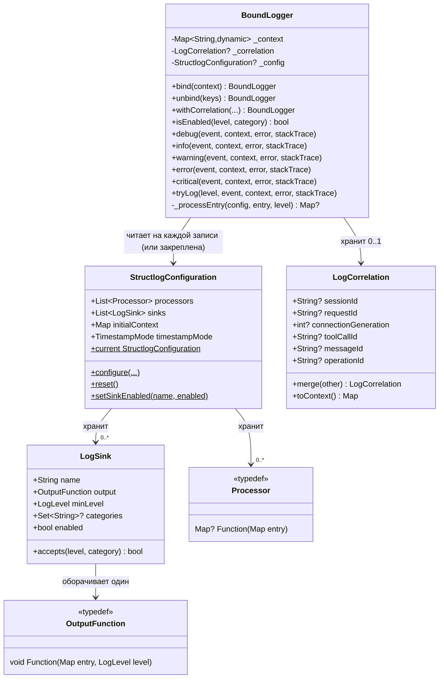
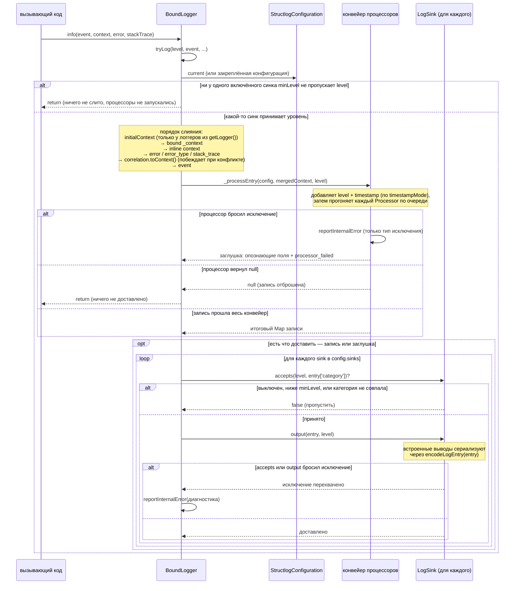
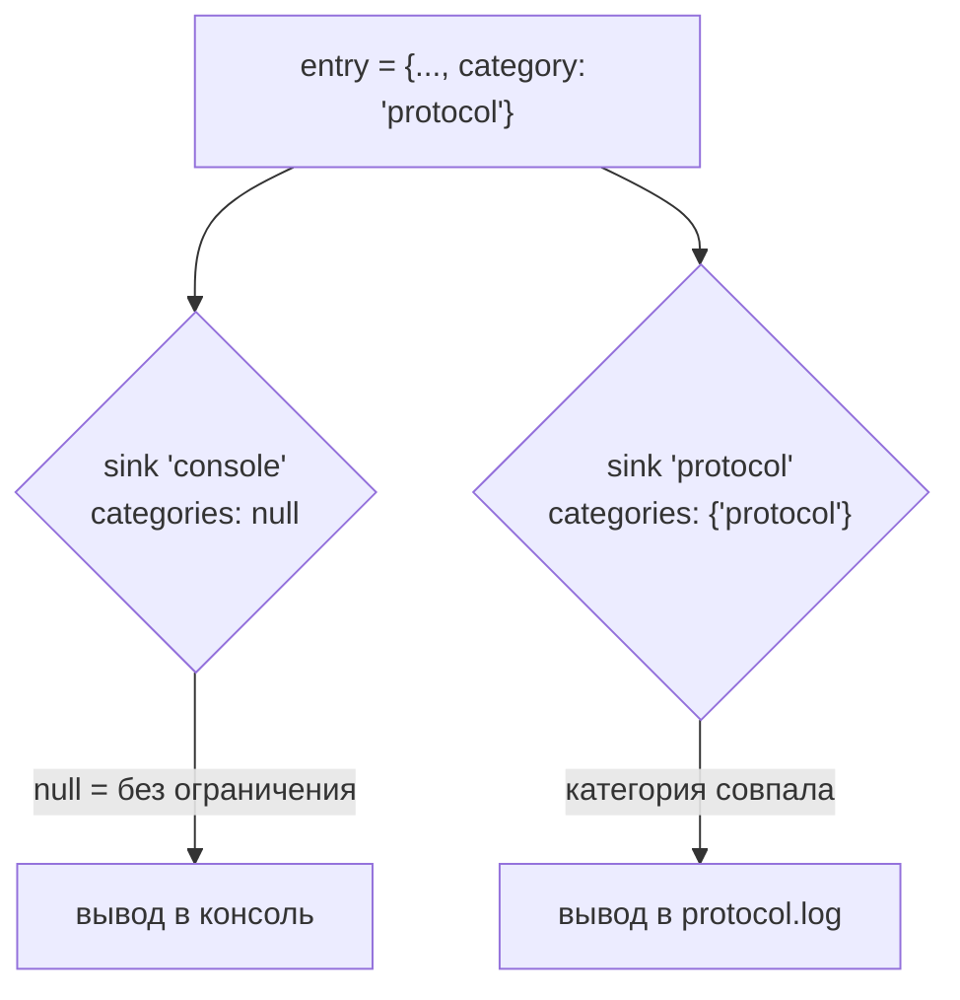
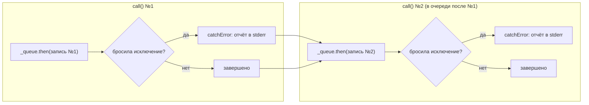

# Архитектура

*Read this in [English](ARCHITECTURE.md).*

Этот документ описывает внутреннее устройство `structured_log` для тех, кто
дорабатывает или поддерживает пакет. Как пользоваться
пакетом, описано в [README.md](../README.md) (или [README.ru.md](../README.ru.md)).

## Принципы проектирования

- **Без лишних обёрток.** `BoundLogger` — тонкое, иммутабельное
  значение: `bind()`/`unbind()`/`withCorrelation()` всегда возвращают новый
  экземпляр, а не мутируют состояние, поэтому логгер безопасно передавать
  дальше по цепочке вызовов.
- **Одна глобальная конфигурация, много локальных логгеров.**
  `StructlogConfiguration` — синглтон на весь процесс; отдельные экземпляры
  `BoundLogger` несут только те context/correlation-данные, что относятся к
  их скоупу.
- **Всё в конвейере — обычная функция.** Процессоры
  (`Map<String, dynamic>? Function(Map<String, dynamic>)`) и выводы
  (`void Function(Map<String, dynamic>, LogLevel)`) — это типы-функции
  (typedef), а не классы для наследования: кастомное поведение — просто
  замыкание. Async-выводы (см. [Асинхронные выводы](#асинхронные-выводы))
  — единственное исключение: им нужно хранить состояние (future завершения)
  помимо самой функции.
- **Вызов лога никогда не бросает.** Что бы ни сделали процессор, синк или
  сериализация, `tryLog()` перехватит исключение, сообщит о нём и вернёт
  управление — логирование не бывает причиной падения вызывающего кода.
- **Ядро работает везде.** Основная библиотека не импортирует `dart:io`; то,
  чему он нужен (файловые выводы, `stderr`), спрятано за
  [`io.dart`](../lib/io.dart) или за условным импортом — см.
  [Разделение по платформам](#разделение-по-платформам-iodart-и-отчёт-об-ошибках).
- **Аддитивная эволюция.** Correlation, multi-sink маршрутизацию и
  async-выводы добавили, не меняя сигнатур существующих методов
  (см. [CHANGELOG.md](../CHANGELOG.md)). Осознанное исключение — 0.3.0 с
  тремя ломающими изменениями: метки времени в UTC, логгеры, следящие за
  конфигурацией, и переезд файловых выводов в `io.dart` (что делать —
  в разделе README «Переход на 0.3.0»).

## Компоненты

| Файл | Ответственность |
|------|----------------|
| [lib/src/logger.dart](../lib/src/logger.dart) | `LogLevel`, `BoundLogger` — привязывает context/correlation, заранее проверяет уровень, прогоняет конвейер процессоров (изолируя их сбои), доставляет в синки |
| [lib/src/configuration.dart](../lib/src/configuration.dart) | `StructlogConfiguration` — глобальные processors/sinks/initialContext/timestampMode, `configure()`/`reset()`/`setSinkEnabled()` |
| [lib/src/timestamp.dart](../lib/src/timestamp.dart) | `TimestampMode` и то, как записывается `timestamp` (UTC с `Z` или местное время со смещением) |
| [lib/src/correlation.dart](../lib/src/correlation.dart) | `LogCorrelation` — типизированные, объединяемые correlation-поля |
| [lib/src/sink.dart](../lib/src/sink.dart) | `LogSink` — один приёмник вывода с фильтрацией по уровню/категории и выключателем в рантайме |
| [lib/src/processors.dart](../lib/src/processors.dart) | typedef `Processor` + встроенные (`dropNullValues`, `redactKeys()`; устаревшие: `addTimestamp`, `addLogLevel`, `jsonRenderer`, `logfmtRenderer`) |
| [lib/src/encoding.dart](../lib/src/encoding.dart) | `encodeLogEntry` — сериализация в JSON, общая для всех встроенных выводов, с преобразованием значений, от которых отказывается `jsonEncode`; поля, которые сохраняет заглушка |
| [lib/src/formatters.dart](../lib/src/formatters.dart) | typedef `OutputFunction` + встроенные выводы, которым не нужен `dart:io` (консоль, цветная консоль, `jsonLineOutput`, `logfmtOutput`), и `formatLogfmt` |
| [lib/src/file_output.dart](../lib/src/file_output.dart) | `fileOutput`, `rotatingFileOutput` — синхронные файловые выводы; экспортируются только из `io.dart` |
| [lib/src/async_file_output.dart](../lib/src/async_file_output.dart) | `AsyncFileOutput`, `AsyncRotatingFileOutput` — неблокирующие аналоги синхронных файловых выводов; экспортируются только из `io.dart` |
| [lib/src/report.dart](../lib/src/report.dart) (+ `report_io.dart`, `report_print.dart`) | `reportInternalError` — куда уходят сообщения о внутренних сбоях: в `stderr`, а в вебе — через `print` |

### Связи компонентов



Логгер из `getLogger()` **не хранит** конфигурацию: его `_config` равен
`null`, и каждая запись заново читает `StructlogConfiguration.current` —
синки, процессоры, `initialContext`, `timestampMode`. Логгер в поле
`static final`, созданный раньше, чем приложение вызвало `configure()`,
подхватывает и этот вызов, и все последующие; то же верно для всего, что
получено из него через `bind()`/`unbind()`/`withCorrelation()` (они
копируют тот же `null`). Явно созданный `BoundLogger(config)` — обратный
случай: он навсегда остаётся с `config` и не подмешивает `initialContext` —
см. [Переключение в рантайме и снапшот конфигурации](#переключение-в-рантайме-и-снапшот-конфигурации).

## Жизненный цикл вызова лога

Вызов, например, `log.info('event', context: {...})` проходит через
`tryLog()` → проверку уровня → слияние → `_processEntry()` → доставку по
синкам. Весь этот путь обёрнут в один `try/catch` в `tryLog()` — поверх
более узких, показанных ниже:



Ключевые инварианты этого потока:

- **Уровень проверяется раньше, чем что-либо собирается.** Если
  `minLevel` ни одного включённого синка не пропускает этот уровень,
  `tryLog()` возвращается, не сливая контекст и не запуская процессоров, —
  отфильтрованный `trace()` стоит одного прохода по синкам. Категорию так
  рано проверить нельзя (она известна только после слияния), поэтому её
  по-прежнему проверяет каждый синк потом. `isEnabled()` задаёт тот же
  вопрос для вызывающего кода, который хочет сам не собирать дорогой
  `context`.
- **Конфигурация читается на каждой записи.** Для логгера из `getLogger()`
  `_configuration` — это `StructlogConfiguration.current` в момент вызова;
  он читается один раз на запись и служит до конца её пути, так что одна
  запись никогда не смешивает синки одной конфигурации с процессорами
  другой.
- **`error:`/`stackTrace:` перекрывают `context`.** Они примешиваются после
  инлайн-`context` — как `error` (`toString()`), `error_type` (runtime-тип)
  и `stack_trace`; correlation-поля идут уже после них.
- **Типизированные correlation-поля побеждают.** Correlation-поля примешиваются
  *после* инлайн-`context`, поэтому одноимённый ключ из `context:` никогда
  не перекрывает привязанное correlation-поле.
- **Процессор, вернувший `null`, полностью отбрасывает запись** — её не
  видит ни один синк, и диагностика не печатается (это стандартный
  механизм фильтрации, например, для подавления по уровню через кастомный
  процессор).
- **Сбой процессора закрывает доставку.** Каждый вызов процессора обёрнут
  в собственный `try/catch`. Бросивший процессор обрывает конвейер:
  следующие за ним не запускаются, а синки получают заглушку — `event`,
  `level`, `timestamp`, `logger`, `category`, если это строки
  (`identifyingFields` в [encoding.dart](../lib/src/encoding.dart)), плюс
  `processor_failed` с типом исключения. Исходная запись не доставляется:
  упавший процессор мог быть как раз затирателем секретов. По той же причине
  в отчёте — тип исключения, а не его сообщение.
- **Сбои синков изолированы.** `accepts()` + `output()` каждого синка
  обёрнуты в собственный `try/catch`; один сломанный синк (например, с путём
  к файлу, куда нельзя писать) никогда не останавливает доставку в остальные
  и никогда не пробрасывает исключение из `tryLog()`.
- **Сериализация — дело вывода, а не конвейера.** Процессоры и синки,
  хранящие записи в памяти, видят исходные объекты; встроенные выводы
  сериализуют через `encodeLogEntry`, который преобразует то, от чего
  отказывается `jsonEncode` (`DateTime` → ISO-8601 в UTC, enum → `name`,
  `Duration` → микросекунды, `Set` → список, объект с `toJson()` → то, что
  он вернёт, остальное → `toString()` или `'<TypeName>'`,
  если тот бросил). Не сериализуется только запись, содержащая саму себя;
  она превращается в заглушку с `encoding_failed`.

## Multi-sink маршрутизация

`category` — не отдельный параметр какого-либо метода логирования, а
просто условленный ключ контекста (`'category'`), задаваемый через
`bind()` или инлайн `context:`, как любое другое значение. `LogSink.categories`
сопоставляется с ним:



`categories: null` (по умолчанию) означает «без ограничения» — синк
принимает любую категорию. Синк с непустым `categories` отклоняет записи,
у которых нет ключа `category` или он не совпадает.

### Переключение в рантайме и снапшот конфигурации

`LogSink.enabled` — изменяемое поле (не `final`) именно затем, чтобы
`StructlogConfiguration.setSinkEnabled(name, enabled: ...)` могло
переключать его прямо в *существующем* объекте `LogSink` — для этого не
нужно создавать новый `StructlogConfiguration` или `BoundLogger`.

`configure()` переиспользует тот же список `sinks` (а значит, те же
экземпляры `LogSink`), если вызывающий код не передал новый аргумент
`sinks:` — см. фолбэк `nextSinks` в
[configuration.dart](../lib/src/configuration.dart), — так что
переключение переживает более поздний `configure()`, меняющий, скажем,
только процессоры.

Логгерам из `getLogger()` больше ничего и не нужно: они читают
`StructlogConfiguration.current` на каждой записи, так что даже
`configure(sinks: [...])`, *полностью заменяющий* список, доходит до них
на следующей же записи. Снапшот остаётся только у явно созданного
`BoundLogger(config)`: что бы ни делал `configure()` потом, такой логгер
доставляет в синки `config` и с процессорами `config` — ради этого его и
закрепляют. `setSinkEnabled()` доходит до него, только если в `config.sinks`
лежат те же объекты `LogSink`, что и в `current`.

## Разделение по платформам: io.dart и отчёт об ошибках

Основная библиотека, `package:structured_log/structured_log.dart`, обязана
компилироваться в вебе, поэтому ничто из того, что она экспортирует, не
может импортировать `dart:io`. А нужен он в двух местах:

- **Файловые выводы.** `fileOutput`/`rotatingFileOutput`
  ([file_output.dart](../lib/src/file_output.dart)) и асинхронные выводы
  экспортируются только из [`lib/io.dart`](../lib/io.dart) — второй
  библиотеки, которую потребитель импортирует рядом с основной. В
  `formatters.dart` остались только выводы, которые печатают.
- **Отчёт о внутренних сбоях.** Каждый перехваченный сбой — синка,
  процессора, асинхронной записи — проходит через `reportInternalError`
  ([report.dart](../lib/src/report.dart)), а платформенную половину он
  выбирает условным импортом:

  ```dart
  import 'report_print.dart' if (dart.library.io) 'report_io.dart' as platform;
  ```

  `report_io.dart` пишет в `stderr`; `report_print.dart`, который
  подставляется там, где `dart:io` нет, пользуется `print` (в вебе `stderr`
  бросает на каждой записи). Сам `reportInternalError` оборачивает вызов в
  `try/catch` и молча отбрасывает отчёт, который не удалось доставить: он
  работает внутри того самого кода, что не даёт вызову лога бросить, и
  бросать не должен сам.

Ротируемые файловые выводы к тому же считают размер файла в памяти — читают
его один раз при создании и прибавляют записанные байты, — а не спрашивают
файловую систему на каждой записи.

## Асинхронные выводы

`fileOutput`/`rotatingFileOutput` используют `File.writeAsStringSync`,
что блокирует тот изолят, откуда вызван логгер. Для редкого логирования
это приемлемо, но если приложение активно пишет лог из UI-/main-изолята,
издержки ощутимы. `AsyncFileOutput`/`AsyncRotatingFileOutput`
([lib/src/async_file_output.dart](../lib/src/async_file_output.dart))
вместо этого используют неблокирующий File API из `dart:io`, но
`OutputFunction` — синхронная `void Function(...)`, у вызывающего кода нет
`Future`, который можно было бы дождаться инлайн. Это ограничение и
определяет всю реализацию:

- Каждый `call()` ставит свою запись в единую сцепленную `Future`-цепочку
  (`_queue = _queue.then((_) => _write(...))`), а не запускает записи
  независимо — иначе два пересекающихся асинхронных вызова
  `writeAsString(mode: FileMode.append)` к одному файлу могли бы
  перемешать данные или что-то потерять.
- **Каждый шаг цепочки перехватывает свою собственную ошибку** через
  `.catchError(...)`, а не один раз в конце. Это как раз то место, где
  легко ошибиться: `Future.then` без соответствующего `onError`
  *пропускает свой callback и пробрасывает ошибку* дальше. Без
  `catchError` на каждом шаге одна неудачная запись молча отменила бы все
  запланированные после неё — очередь выглядела бы «зависшей», а никакого
  исключения вызывающий код бы так и не увидел.
- `flushed` отдаёт хвост цепочки, чтобы вызывающий код (тесты или код
  завершения работы) мог дождаться, пока завершится всё, что было
  запланировано на текущий момент, — и при этом сами места вызова
  логирования не пришлось делать `async`.



Независимо от того, успешна запись №1 или нет, цепочка всегда доходит до
*завершённого* состояния перед тем, как выполнится запись №2 — именно это
и даёт `catchError` на каждом шаге. Проверка размера + ротация + запись у
`AsyncRotatingFileOutput` находятся внутри одного и того же шага
`_write()`, поэтому и они точно так же выполняются строго
последовательно — отдельная блокировка не нужна.

Именно потому, что это классы, а не замыкания, они и составляют единственное
исключение из принципа «всё в конвейере — обычная функция» (см.
[Принципы проектирования](#принципы-проектирования)): `flushed` нужно
где-то хранить. Оба класса при этом структурно соответствуют typedef
`OutputFunction` за счёт метода `call()` (callable class в Dart), поэтому
подставляются в `configure(output: ...)` или в `LogSink` точно так же, как
любой другой вывод, и больше нигде в конвейере ничего менять не нужно.

## Точки расширения

Всё, что подключается извне, — обычная функция или `LogSink`, никакого
интерфейса реализовывать не нужно:

- **Кастомный процессор** — `Map<String, dynamic>? Function(Map<String, dynamic>)`.
  Верните `null`, чтобы отбросить запись; иначе верните (возможно,
  изменённый) map. Порядок важен — процессоры выполняются последовательно,
  каждый видит результат предыдущего.
- **Кастомный output** — `void Function(Map<String, dynamic>, LogLevel)`.
  Используется напрямую через `configure(output: ...)` либо оборачивается
  в `LogSink` для доставки с фильтрацией или в несколько приёмников.
- **Кастомный синк** — постройте `LogSink` с любым `OutputFunction`,
  `minLevel` и `categories`; наследование не требуется.

## Подход к тестированию

[test/structlog_test.dart](../test/structlog_test.dart) покрывает каждый
компонент изолированно, предпочитая захватывать записи через кастомное
замыкание `OutputFunction`/`LogSink`, добавляющее их в локальный
`List`/переменную, а не проверять stdout или файловую систему, — так
проверки идут прямо по итоговому `Map<String, dynamic>`, который выдал
конвейер.

[test/integration_test.dart](../test/integration_test.dart) вместо этого
проверяет пакет как целостную систему: correlation + bound context +
процессоры + multi-sink маршрутизация вместе, так, как их
использовал бы настоящий потребитель, реальные файлы на реальной файловой системе
(через `Directory.systemTemp`, удаляются в `tearDown`), смешанная
sync+async multi-sink конфигурация, полная история лога, восстановленная
по пронумерованным резервным копиям ротируемого вывода, и реальный печатаемый формат
`coloredConsoleOutput`, захваченный через переопределение `print` в
`Zone` — прогнанный через настоящий вызов `BoundLogger`, а не вызванный
напрямую.

Тесты в обоих файлах, вызывающие `StructlogConfiguration.configure()`,
всегда делают `tearDown(StructlogConfiguration.reset)`, чтобы не
протаскивать глобальное состояние в другие тесты.
