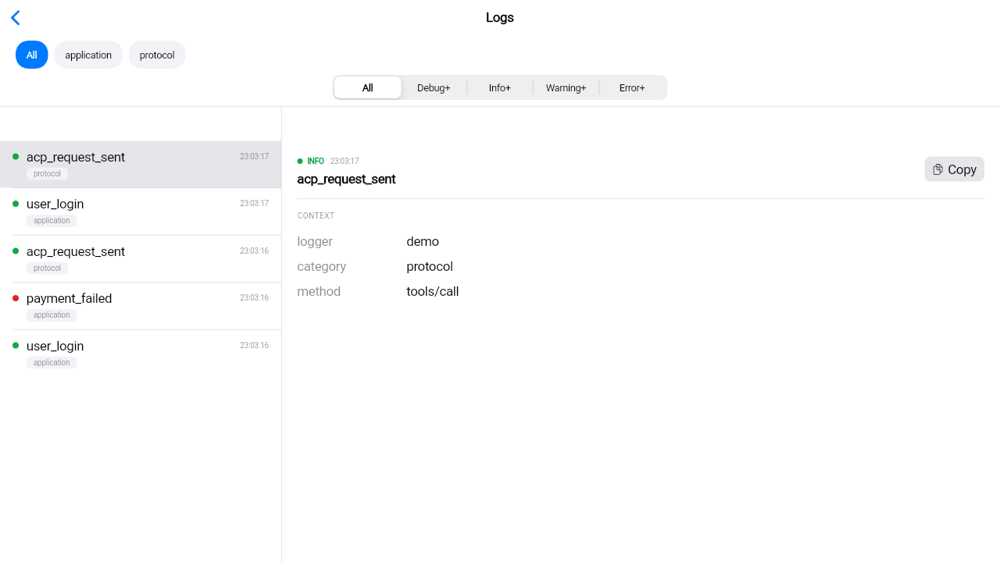
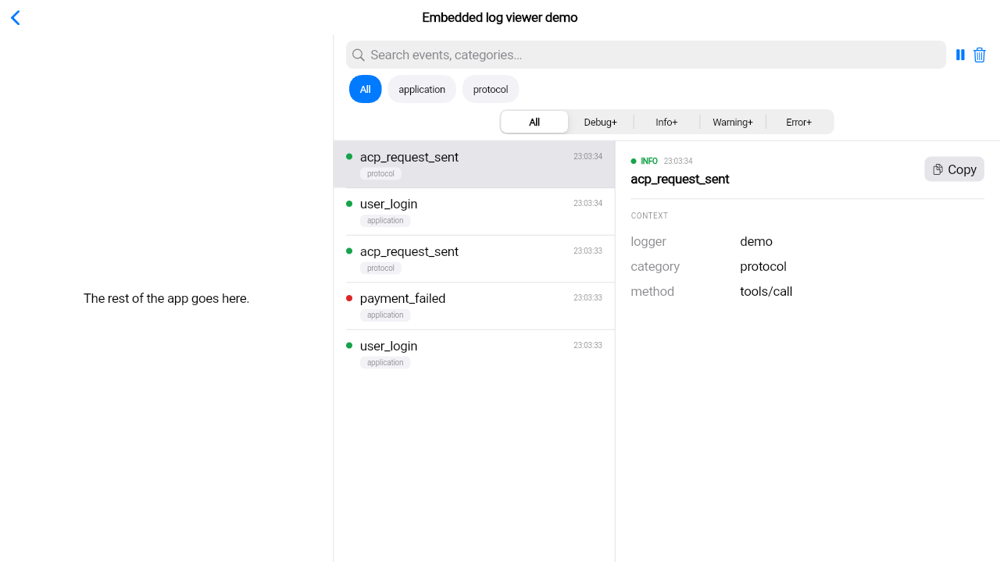
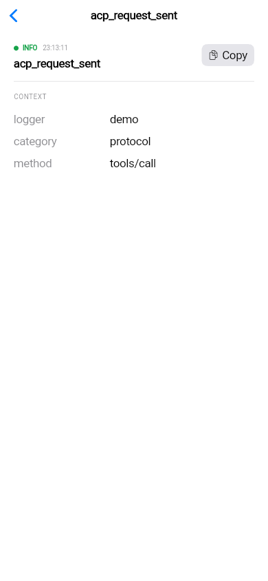

# structured_log_cupertino

[](https://github.com/pese-git/structured_log/actions/workflows/ci.yml)

*Читать на [русском](README.ru.md).*

**A ready-made Cupertino (iOS-style) log viewer for your Flutter app: open a
screen — or dock a panel — and see what the app just logged, with search,
filters and every entry's full context, the way iPhone and iPad apps
present it.**

## Why

Something goes wrong while you're testing on an iPhone, and the explanation
is in logs printed to an Xcode console you aren't attached to. This package
puts those logs on a screen inside the app: every
[`structured_log`](https://pub.dev/packages/structured_log) entry, newest
first, searchable and filterable by level and category, with a tap to drill
into an entry's full context and copy it into a bug report. Wiring it up is
one extra sink and one widget.

Pick it for apps with an iOS look (`CupertinoApp`, or Cupertino screens
inside a larger app). For a Material app take
[`structured_log_material`](https://pub.dev/packages/structured_log_material);
for a Windows-style desktop app built on `fluent_ui`,
[`structured_log_fluent`](https://pub.dev/packages/structured_log_fluent).
If none of the three matches your design system, build your own on
[`structured_log_flutter`](https://pub.dev/packages/structured_log_flutter) —
the skins share it, so filtering and pausing behave the same everywhere.

## Features

### Drop-in

- **A screen or a panel** — `CupertinoLogViewerPage` is a complete
  `CupertinoPageScaffold` with a "Logs" navigation bar (and the standard
  back button when pushed); `CupertinoLogViewer` is the same viewer with no
  page chrome, for a tab or a side panel.
- **iPhone and iPad patterns** — it measures its own width, not the
  window's: below 700 logical pixels a tap **pushes** the entry as its own
  screen via `CupertinoPageRoute`, as Mail and Settings do on iPhone; from
  700 up, the list and a detail panel sit side by side, as on iPad, with the
  newest entry selected.

### Finding the entry

- **A live list, newest first** — new entries appear as the app logs them.
- **Search** — a `CupertinoSearchTextField` over event names and every
  context value.
- **Level filter** — a `CupertinoSlidingSegmentedControl`: All, Debug+,
  Info+, Warning+, Error+.
- **Category filter** — a scrollable row of pill buttons built from the
  categories actually in the buffer, hidden while there are fewer than two;
  entries from adapters such as
  [`structured_log_dio`](https://pub.dev/packages/structured_log_dio) (`http`)
  or [`structured_log_bloc`](https://pub.dev/packages/structured_log_bloc)
  (`bloc`) become a filter on their own.
- **Pause and clear** — freeze the list while you read; clear it to start a
  fresh reproduction.
- **Familiar rows** — a colored level dot, the event, the time and a
  category tag; a disclosure chevron where a tap drills in, a highlight
  where it selects.

### Reading it

- **Full context** — level, time and event on top, then every other field
  as a key/value pair; when pushed, the event name is the screen's title.
- **Copy** — one tap puts the fields on the clipboard as `key: value`
  lines.
- **Clear empty states** — "No logs yet" when nothing was captured, "No
  logs match the current filter" with a "Clear filters" action when the
  filters hid everything.

### Looks like your app

- **Follows your theme** — colors and typography come from
  `CupertinoTheme` and `CupertinoColors`, light and dark; only the level
  colors are fixed, and they are the same in every skin.
- **No Material** — the package uses Cupertino widgets and
  `cupertino_icons` only.
- **Parts to compose your own layout** — `LogEntryTile`,
  `LogCategoryFilterBar`, `LogEntryDetailPanel` and `LogViewerEmptyState`
  are public.

## Where it fits

[`structured_log`](https://pub.dev/packages/structured_log) writes the
entries;
[`structured_log_flutter`](https://pub.dev/packages/structured_log_flutter)
keeps the recent ones in memory and handles filtering and pausing; this
package is the Cupertino face on top, a sibling of
[`structured_log_material`](https://pub.dev/packages/structured_log_material)
and [`structured_log_fluent`](https://pub.dev/packages/structured_log_fluent).
It works entirely inside your app, with no server; if you also ship logs to
a self-hosted server with
[`structured_log_remote_sync`](https://pub.dev/packages/structured_log_remote_sync),
the viewer keeps showing them locally. More in the documentation at
[structured-log.openidealab.com](https://structured-log.openidealab.com) and
in the [Embedding Guide](https://structured-log.openidealab.com/guides/embedding-guide/).
Design and decision history:
[openspec/changes/archive/2026-10-01-add-structured-log-cupertino/](https://github.com/pese-git/structured_log/tree/master/openspec/changes/archive/2026-10-01-add-structured-log-cupertino).

## Installation

```yaml
dependencies:
  structured_log: ^0.3.0
  structured_log_flutter: ^0.1.2
  structured_log_cupertino: ^0.1.1
```

Within this monorepo, `melos bootstrap` resolves both internal packages to
path dependencies instead:

```yaml
dependencies:
  structured_log_flutter:
    path: ../structured_log_flutter
  structured_log_cupertino:
    path: ../structured_log_cupertino
```

## Quick Start

```dart
import 'package:flutter/cupertino.dart';
import 'package:structured_log/structured_log.dart';
import 'package:structured_log_flutter/structured_log_flutter.dart';
import 'package:structured_log_cupertino/structured_log_cupertino.dart';

void main() {
  final buffer = LogBuffer();
  final controller = LogViewerController(buffer);

  StructlogConfiguration.configure(sinks: [
    LogSink(name: 'viewer', output: buffer.capture),
  ]);

  runApp(CupertinoApp(
    home: CupertinoLogViewerPage(controller: controller),
  ));
}
```

See [`example/`](https://github.com/pese-git/structured_log/tree/master/emb/structured_log_cupertino/example) for a full runnable app (including web) — run it
with `flutter run -d chrome` from that directory.

To embed the viewer inside existing page chrome instead of giving it the
whole screen, use `CupertinoLogViewer` directly:

```dart
Row(
  children: [
    Expanded(child: MyAppContent()),
    SizedBox(
      width: 420,
      child: CupertinoLogViewer(controller: controller),
    ),
  ],
)
```

## Screenshots

`CupertinoLogViewerPage` as the full screen, on a wide/iPad-size
viewport — list and the non-modal detail panel side by side:



`CupertinoLogViewer` embedded in a side panel next to other app content —
the same widget, no page chrome of its own:



On a phone-width screen — the mobile-style default — the list is on
its own, and tapping an entry **pushes** `LogEntryDetailPanel` as its
own screen via `CupertinoPageRoute`, the standard iOS "drill into
detail" pattern:



## API Reference

| Widget | Description |
|---|---|
| `CupertinoLogViewer({required LogViewerController controller})` | The log viewer as an embeddable widget (no page chrome) |
| `CupertinoLogViewerPage({required LogViewerController controller})` | The full screen |
| `LogCategoryFilterBar({required LogViewerController controller, String allLabel = 'All'})` | The category-filter pill row |
| `LogEntryTile({required entry, required onTap, bool selected = false, bool showsDisclosureIndicator = true})` | One list row |
| `LogEntryDetailPanel({required entry})` | The full-context detail content (pushed or side-by-side) |
| `LogViewerEmptyState({required hasLogs, required onClearFilters})` | The two-variant empty state |
| `logLevelColor(LogLevel level, Brightness brightness)` | The canonical level-indicator color — defined once in `structured_log_flutter`, shared by every skin |

`entry` throughout is the `Map<String, dynamic>` shape `structured_log`
produces directly — no separate typed model.

## Related packages

The rest of the `structured_log` family:

**Core**

- [`structured_log`](https://pub.dev/packages/structured_log) — structured JSON logging with context binding, processors and multi-sink routing

**In-app log viewer**

- [`structured_log_flutter`](https://pub.dev/packages/structured_log_flutter) — headless viewer core: `LogBuffer` and `LogViewerController`
- [`structured_log_material`](https://pub.dev/packages/structured_log_material) — Material 3 log viewer
- [`structured_log_fluent`](https://pub.dev/packages/structured_log_fluent) — Fluent UI (WinUI-style) log viewer

**Shipping logs to a server**

- [`structured_log_remote_sync`](https://pub.dev/packages/structured_log_remote_sync) — batching, retrying sink for a self-hosted `structured_log_server`

**Integrations**

- [`structured_log_bloc`](https://pub.dev/packages/structured_log_bloc) — `BlocObserver` for `bloc`/`flutter_bloc`
- [`structured_log_dio`](https://pub.dev/packages/structured_log_dio) — `dio` interceptor that logs HTTP calls
- [`structured_log_http_client`](https://pub.dev/packages/structured_log_http_client) — `package:http` client wrapper that logs HTTP calls
- [`structured_log_go_router`](https://pub.dev/packages/structured_log_go_router) — logs `go_router` navigation
- [`structured_log_cherrypick`](https://pub.dev/packages/structured_log_cherrypick) — observer for the `cherrypick` DI container
- [`structured_log_drift`](https://pub.dev/packages/structured_log_drift) — drift `QueryInterceptor` that logs queries, failures and transactions
- [`structured_log_logging`](https://pub.dev/packages/structured_log_logging) — bridge that routes `package:logging` records into `structured_log`

## License

MIT
