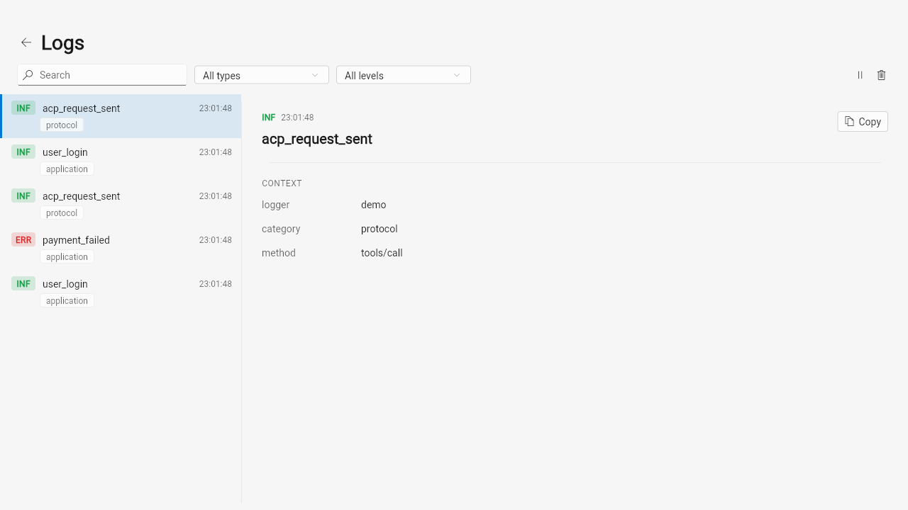
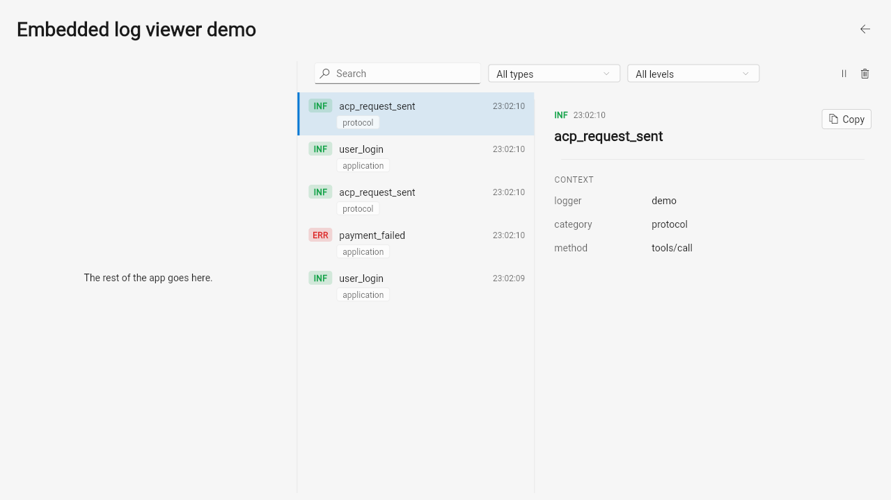
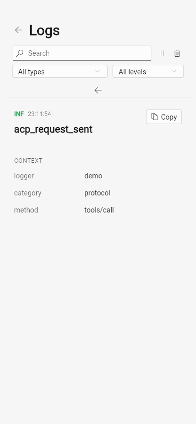

# structured_log_fluent

[](https://github.com/pese-git/structured_log/actions/workflows/ci.yml)

*Читать на [русском](README.ru.md).*

**A ready-made Fluent UI (WinUI-style) log viewer for your Flutter app: a
master-detail screen — or a docked panel — showing what the app just
logged, with search, filters and every entry's full context.**

## Why

A desktop app misbehaves on a tester's machine, and the logs that explain
it went to a console nobody opened. This package puts those logs inside the
app, in the layout Windows users know from Mail and Settings: a live list of
[`structured_log`](https://pub.dev/packages/structured_log) entries on the
left, the selected entry's full context on the right, a search box and
filter dropdowns above. Wiring it up is one extra sink and one widget.

Pick it for apps built on `fluent_ui` — typically Windows desktop, though it
runs wherever Flutter does, web included. For a Material app take
[`structured_log_material`](https://pub.dev/packages/structured_log_material);
for an app with an iOS look,
[`structured_log_cupertino`](https://pub.dev/packages/structured_log_cupertino).
If none of the three matches your design system, build your own on
[`structured_log_flutter`](https://pub.dev/packages/structured_log_flutter) —
the skins share it, so filtering and pausing behave the same everywhere.

## Features

### Drop-in

- **A screen or a panel** — `FluentLogViewerPage` is a complete
  `ScaffoldPage` with a "Logs" title (and a back button when pushed);
  `FluentLogViewer` is the same viewer with no page chrome, for a `Flyout`,
  a side panel or a tab.
- **Master-detail, the WinUI way** — list on the left, the selected entry
  (the newest by default) on the right, not a mobile-style bottom sheet.
- **Stays usable when narrow** — it measures its own width, not the
  window's: below 820 logical pixels the toolbar wraps onto a second row
  instead of overflowing, and below 640 the split collapses to the list,
  where a tap shows the entry in place with a back button.

### Finding the entry

- **A live list, newest first** — new entries appear as the app logs them.
- **Search** — across event names and every context value.
- **Level filter** — a dropdown from "All levels" to "Error and above".
- **Category filter** — a dropdown built from the categories actually in
  the buffer, hidden while there are fewer than two; entries from adapters
  such as [`structured_log_dio`](https://pub.dev/packages/structured_log_dio)
  (`http`) or [`structured_log_bloc`](https://pub.dev/packages/structured_log_bloc)
  (`bloc`) become a filter on their own.
- **Pause and clear** — freeze the list while you read; clear it to start a
  fresh reproduction.
- **Compact rows** — a colored level badge (`INF`, `WRN`, `ERR`, ...), the
  event, the time and a category tag, with hover and accent-colored
  selection.

### Reading it

- **Full context** — level, time and event on top, then every other field
  as a key/value pair.
- **Copy** — one click puts the fields on the clipboard as `key: value`
  lines.
- **Clear empty states** — "No logs yet" when nothing was captured, "No
  results found" with a "Clear filters" action when the filters hid
  everything.

### Looks like your app

- **Follows your theme** — colors and typography come from `FluentTheme`,
  light and dark; only the level colors are fixed, and they are the same in
  every skin.
- **Parts to compose your own layout** — `LogEntryTile`,
  `LogCategoryComboBox`, `LogEntryDetailPane`, `LogViewerEmptyState` and
  `logLevelAbbreviation` are public.

## Where it fits

[`structured_log`](https://pub.dev/packages/structured_log) writes the
entries;
[`structured_log_flutter`](https://pub.dev/packages/structured_log_flutter)
keeps the recent ones in memory and handles filtering and pausing; this
package is the Fluent face on top, a sibling of
[`structured_log_material`](https://pub.dev/packages/structured_log_material)
and [`structured_log_cupertino`](https://pub.dev/packages/structured_log_cupertino).
It works entirely inside your app, with no server; if you also ship logs to
a self-hosted server with
[`structured_log_remote_sync`](https://pub.dev/packages/structured_log_remote_sync),
the viewer keeps showing them locally. More in the documentation at
[structured-log.openidealab.com](https://structured-log.openidealab.com) and
in the [Embedding Guide](https://structured-log.openidealab.com/guides/embedding-guide/).
Design reference: the
[Log Viewer UI Concepts](https://claude.ai/code/artifact/400091b3-da51-4f73-a1fb-2ce779515de0)
canvas (Fluent section).

## Installation

```yaml
dependencies:
  fluent_ui: ^4.16.1
  structured_log: ^0.3.0
  structured_log_flutter: ^0.1.2
  structured_log_fluent: ^0.1.1
```

`fluent_ui` needs Flutter `3.44.0+`. This package's own
`environment.flutter` constraint (see
[pubspec.yaml](https://github.com/pese-git/structured_log/blob/master/emb/structured_log_fluent/pubspec.yaml))
enforces it, so an older Flutter SDK fails at `pub get` rather than deep
inside `fluent_ui` at build time.

Within this monorepo, `melos bootstrap` resolves the two internal packages
to path dependencies instead:

```yaml
dependencies:
  fluent_ui: ^4.16.1
  structured_log_flutter:
    path: ../structured_log_flutter
  structured_log_fluent:
    path: ../structured_log_fluent
```

## Quick Start

```dart
import 'package:fluent_ui/fluent_ui.dart';
import 'package:structured_log/structured_log.dart';
import 'package:structured_log_flutter/structured_log_flutter.dart';
import 'package:structured_log_fluent/structured_log_fluent.dart';

void main() {
  final buffer = LogBuffer();
  final controller = LogViewerController(buffer);

  StructlogConfiguration.configure(sinks: [
    LogSink(name: 'viewer', output: buffer.capture),
  ]);

  runApp(FluentApp(
    home: FluentLogViewerPage(controller: controller),
  ));
}
```

See [`example/`](https://github.com/pese-git/structured_log/tree/master/emb/structured_log_fluent/example) for a full runnable app (including web) — run it
with `flutter run -d chrome` from that directory.

To embed the viewer inside existing page chrome instead of giving it the
whole screen, use `FluentLogViewer` directly:

```dart
Row(
  children: [
    Expanded(child: MyAppContent()),
    SizedBox(
      width: 420,
      child: FluentLogViewer(controller: controller),
    ),
  ],
)
```

## Screenshots

`FluentLogViewerPage` as the full screen — master-detail split view,
list on the left with a category/level filter toolbar above it, the
selected entry's full context on the right:



`FluentLogViewer` embedded in a side panel next to other app content —
the same widget, no page chrome of its own:



On a phone-width screen, the toolbar wraps to a second row and the
master-detail split collapses to a list; tapping an entry replaces it
with `LogEntryDetailPane`, with its own back link:



## API Reference

| Widget | Description |
|---|---|
| `FluentLogViewer({required LogViewerController controller})` | The log viewer as an embeddable widget (no page chrome) |
| `FluentLogViewerPage({required LogViewerController controller})` | The full screen |
| `LogCategoryComboBox({required LogViewerController controller, String allLabel = 'All types'})` | The category-filter dropdown |
| `LogEntryTile({required entry, required selected, required onTap})` | One list row |
| `LogEntryDetailPane({required entry})` | The detail-pane content |
| `LogViewerEmptyState({required hasLogs, required onClearFilters})` | The two-variant empty state |
| `logLevelColor(LogLevel level, Brightness brightness)` | The canonical level-indicator color — defined once in `structured_log_flutter`, shared by every skin |
| `logLevelAbbreviation(LogLevel level)` | A short uppercase label (`INF`, `WRN`, ...) for the level badge |

`entry` throughout is the `Map<String, dynamic>` shape `structured_log`
produces directly — no separate typed model.

## Related packages

The rest of the `structured_log` family:

**Core**

- [`structured_log`](https://pub.dev/packages/structured_log) — structured JSON logging with context binding, processors and multi-sink routing

**In-app log viewer**

- [`structured_log_flutter`](https://pub.dev/packages/structured_log_flutter) — headless viewer core: `LogBuffer` and `LogViewerController`
- [`structured_log_material`](https://pub.dev/packages/structured_log_material) — Material 3 log viewer
- [`structured_log_cupertino`](https://pub.dev/packages/structured_log_cupertino) — Cupertino (iOS-style) log viewer

**Shipping logs to a server**

- [`structured_log_remote_sync`](https://pub.dev/packages/structured_log_remote_sync) — batching, retrying sink for a self-hosted `structured_log_server`

**Integrations**

- [`structured_log_bloc`](https://pub.dev/packages/structured_log_bloc) — `BlocObserver` for `bloc`/`flutter_bloc`
- [`structured_log_dio`](https://pub.dev/packages/structured_log_dio) — `dio` interceptor that logs HTTP calls
- [`structured_log_http_client`](https://pub.dev/packages/structured_log_http_client) — `package:http` client wrapper that logs HTTP calls
- [`structured_log_go_router`](https://pub.dev/packages/structured_log_go_router) — logs `go_router` navigation
- [`structured_log_cherrypick`](https://pub.dev/packages/structured_log_cherrypick) — observer for the `cherrypick` DI container
- [`structured_log_drift`](https://pub.dev/packages/structured_log_drift) — drift `QueryInterceptor` that logs queries, failures and transactions

## License

MIT
