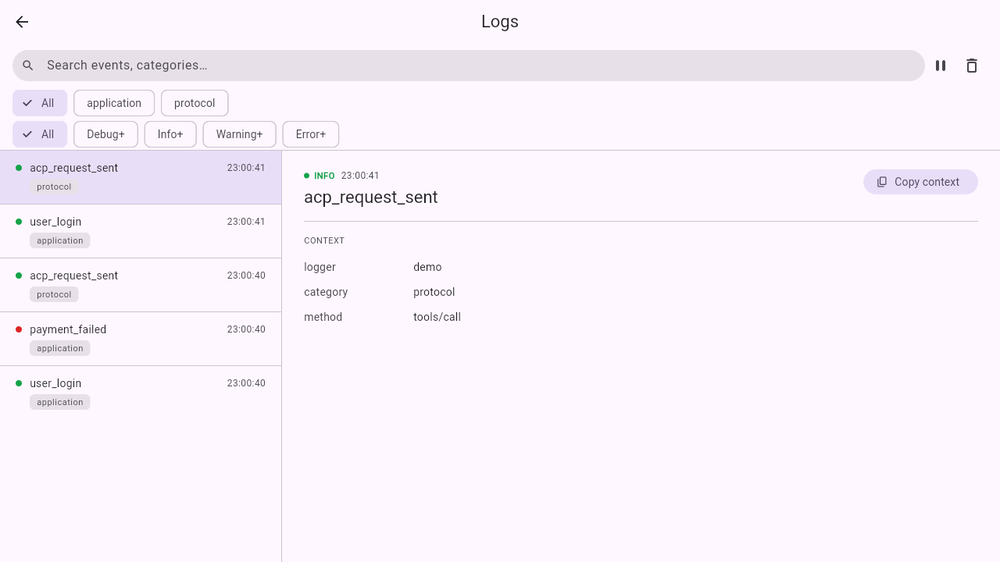
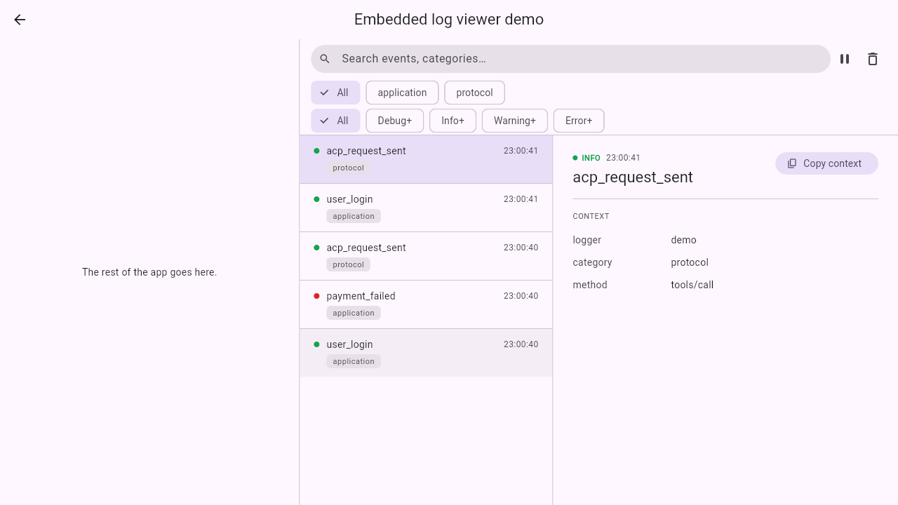
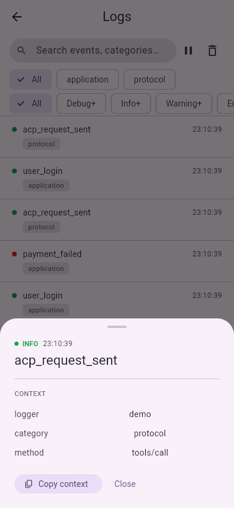

# structured_log_material

[](https://github.com/pese-git/structured_log/actions/workflows/ci.yml)

*Read in [English](README.md).*

**Готовый просмотрщик логов на Material 3 для Flutter-приложения: откройте
экран или боковую панель — и увидите, что приложение только что записало в
лог, с поиском, фильтрами и полным контекстом каждой записи.**

## Зачем

Во время проверки на телефоне что-то идёт не так, а объяснение лежит в
логах, которые печатаются в консоль, — а её оттуда не видно. Этот пакет
выводит логи на экран прямо в приложении: все записи
[`structured_log`](https://pub.dev/packages/structured_log), новые сверху, с
поиском и фильтрами по уровню и категории; тап по записи показывает её
полный контекст, который можно скопировать в отчёт об ошибке. Подключение —
один дополнительный синк и один виджет.

Этот скин — для приложений на Material (`MaterialApp`): под Android или
кроссплатформенных. Для десктопного приложения в стиле Windows на
`fluent_ui` берите
[`structured_log_fluent`](https://pub.dev/packages/structured_log_fluent), для
приложения в стиле iOS —
[`structured_log_cupertino`](https://pub.dev/packages/structured_log_cupertino).
Если ни один из трёх не подходит к вашей дизайн-системе, соберите свой на
[`structured_log_flutter`](https://pub.dev/packages/structured_log_flutter):
скины построены на нём, поэтому фильтры и пауза везде ведут себя одинаково.

## Возможности

### Готов к встраиванию

- **Экран или панель** — `MaterialLogViewerPage` — готовый экран с
  `AppBar` (и кнопкой «назад», если его открыли через `Navigator`);
  `MaterialLogViewer` — тот же просмотрщик без хромы страницы, для вкладки,
  боковой панели или диалога.
- **Подстраивается под отведённое место** — ориентируется на собственную
  ширину, а не на ширину окна: если она меньше 700 логических пикселей,
  тап открывает запись в модальном bottom sheet, а начиная с 700 список и
  панель деталей стоят рядом, и выбрана самая новая запись.

### Поиск нужной записи

- **Живой список, новые сверху** — записи появляются по мере того, как
  приложение их пишет.
- **Поиск** — по именам событий и всем значениям контекста.
- **Фильтр по уровню** — чипы All, Debug+, Info+, Warning+ и Error+.
- **Фильтр по категории** — чипы из категорий, которые реально есть в
  буфере; пока их меньше двух, ряд скрыт. Записи адаптеров вроде
  [`structured_log_dio`](https://pub.dev/packages/structured_log_dio) (`http`)
  или [`structured_log_bloc`](https://pub.dev/packages/structured_log_bloc)
  (`bloc`) сами собой становятся фильтром.
- **Пауза и очистка** — заморозьте список, пока читаете; очистите его
  перед новым воспроизведением.

### Чтение записи

- **Полный контекст** — сверху уровень, время и событие, ниже все
  остальные поля парами ключ-значение.
- **Копирование контекста** — один тап кладёт поля в буфер обмена строками
  `key: value`.
- **Понятные пустые состояния** — «No logs yet», если ничего не захвачено,
  и «No logs match the current filter» с действием «Clear filters», если
  всё скрыли фильтры.

### Выглядит как ваше приложение

- **Следует теме** — цвета и типографика берутся из `Theme.of(context)`,
  светлая и тёмная темы поддержаны; фиксированы только цвета уровней, и они
  одинаковы во всех скинах.
- **Детали для своей раскладки** — `LogEntryTile`, `LogCategoryChips`,
  `LogEntryDetailSheet`, `LogEntryDetailPanel` и `LogViewerEmptyState`
  публичны.

## Место в проекте

[`structured_log`](https://pub.dev/packages/structured_log) пишет записи;
[`structured_log_flutter`](https://pub.dev/packages/structured_log_flutter)
держит последние из них в памяти и отвечает за фильтры и паузу; этот пакет —
Material-оболочка поверх, рядом с
[`structured_log_fluent`](https://pub.dev/packages/structured_log_fluent) и
[`structured_log_cupertino`](https://pub.dev/packages/structured_log_cupertino).
Он работает целиком внутри приложения, без сервера; если вы вдобавок
отправляете логи на self-hosted сервер через
[`structured_log_remote_sync`](https://pub.dev/packages/structured_log_remote_sync),
просмотрщик по-прежнему показывает их на месте. Подробнее — в документации на
[structured-log.openidealab.com](https://structured-log.openidealab.com/ru/)
и в [руководстве по встраиванию](https://structured-log.openidealab.com/ru/guides/embedding-guide/).
Эталон дизайна — canvas
[Log Viewer UI Concepts](https://claude.ai/code/artifact/400091b3-da51-4f73-a1fb-2ce779515de0)
(раздел Material).

## Установка

```yaml
dependencies:
  structured_log: ^0.3.0
  structured_log_flutter: ^0.1.2
  structured_log_material: ^0.1.1
```

Внутри этого monorepo `melos bootstrap` подставляет вместо обоих
внутренних пакетов path-зависимости:

```yaml
dependencies:
  structured_log_flutter:
    path: ../structured_log_flutter
  structured_log_material:
    path: ../structured_log_material
```

## Быстрый старт

```dart
import 'package:flutter/material.dart';
import 'package:structured_log/structured_log.dart';
import 'package:structured_log_flutter/structured_log_flutter.dart';
import 'package:structured_log_material/structured_log_material.dart';

void main() {
  final buffer = LogBuffer();
  final controller = LogViewerController(buffer);

  StructlogConfiguration.configure(sinks: [
    LogSink(name: 'viewer', output: buffer.capture),
  ]);

  runApp(MaterialApp(
    home: Builder(
      builder: (context) => Scaffold(
        body: Center(
          child: OutlinedButton(
            onPressed: () => Navigator.of(context).push(
              MaterialPageRoute(
                builder: (_) => MaterialLogViewerPage(controller: controller),
              ),
            ),
            child: const Text('Open log viewer'),
          ),
        ),
      ),
    ),
  ));
}
```

Полноценное запускаемое приложение (включая web) — в [`example/`](https://github.com/pese-git/structured_log/tree/master/emb/structured_log_material/example),
запуск через `flutter run -d chrome` из этой директории.

Чтобы встроить просмотрщик в уже существующую хрому страницы, а не
отдавать ему весь экран, используйте `MaterialLogViewer` напрямую:

```dart
Row(
  children: [
    Expanded(child: MyAppContent()),
    SizedBox(
      width: 420,
      child: MaterialLogViewer(controller: controller),
    ),
  ],
)
```

## Скриншоты

`MaterialLogViewerPage` на весь экран — на этой ширине master-detail
split: список слева, полный контекст выбранной записи справа:



`MaterialLogViewer`, встроенный в боковую панель рядом с остальным
контентом приложения — тот же виджет, без собственной хромы страницы:



На экране шириной с телефон та же страница сворачивается в список, а
тап по записи открывает `LogEntryDetailSheet` как модальный bottom
sheet вместо боковой панели:



## Справочник API

| Виджет | Описание |
|---|---|
| `MaterialLogViewer({required LogViewerController controller})` | Просмотрщик логов как встраиваемый виджет (без хромы страницы) |
| `MaterialLogViewerPage({required LogViewerController controller})` | Полный экран |
| `LogCategoryChips({required LogViewerController controller, String allLabel = 'All'})` | Ряд чипов фильтра по категории |
| `LogEntryTile({required entry, required onTap, bool selected = false})` | Одна строка списка |
| `LogEntryDetailSheet({required entry})` | Содержимое bottom sheet развёрнутой записи (узкие экраны) |
| `LogEntryDetailPanel({required entry})` | Содержимое немодальной панели развёрнутой записи (широкие экраны) |
| `LogViewerEmptyState({required hasLogs, required onClearFilters})` | Empty-состояние с двумя вариантами |
| `logLevelColor(LogLevel level, Brightness brightness)` | Канонический цвет индикатора уровня — определён один раз в `structured_log_flutter`, общий для всех скинов |

`entry` везде — это `Map<String, dynamic>` в том же виде, в котором его
отдаёт `structured_log` напрямую, без отдельной типизированной модели.

## Связанные пакеты

Остальные пакеты семейства `structured_log`:

**Ядро**

- [`structured_log`](https://pub.dev/packages/structured_log) — структурированное JSON-логирование с привязкой контекста, процессорами и маршрутизацией по синкам

**Просмотрщик логов в приложении**

- [`structured_log_flutter`](https://pub.dev/packages/structured_log_flutter) — headless-ядро просмотрщика: `LogBuffer` и `LogViewerController`
- [`structured_log_fluent`](https://pub.dev/packages/structured_log_fluent) — просмотрщик на Fluent UI (в стиле WinUI)
- [`structured_log_cupertino`](https://pub.dev/packages/structured_log_cupertino) — просмотрщик на Cupertino (в стиле iOS)

**Доставка логов на сервер**

- [`structured_log_remote_sync`](https://pub.dev/packages/structured_log_remote_sync) — синк с батчингом и повторами для self-hosted `structured_log_server`

**Интеграции**

- [`structured_log_bloc`](https://pub.dev/packages/structured_log_bloc) — `BlocObserver` для `bloc`/`flutter_bloc`
- [`structured_log_dio`](https://pub.dev/packages/structured_log_dio) — перехватчик `dio`, логирующий HTTP-вызовы
- [`structured_log_http_client`](https://pub.dev/packages/structured_log_http_client) — обёртка клиента `package:http`, логирующая HTTP-вызовы
- [`structured_log_go_router`](https://pub.dev/packages/structured_log_go_router) — логирует навигацию `go_router`
- [`structured_log_cherrypick`](https://pub.dev/packages/structured_log_cherrypick) — наблюдатель DI-контейнера `cherrypick`

## Лицензия

MIT
